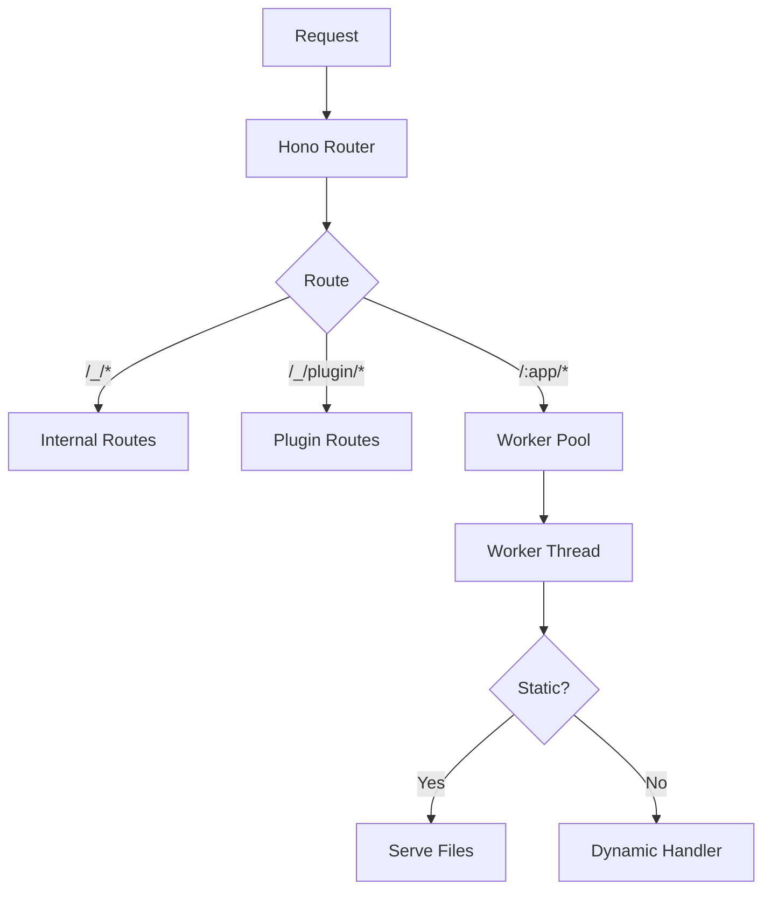
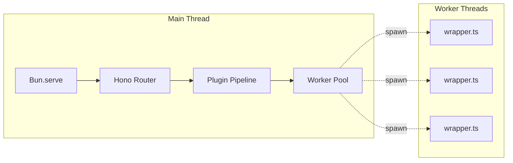
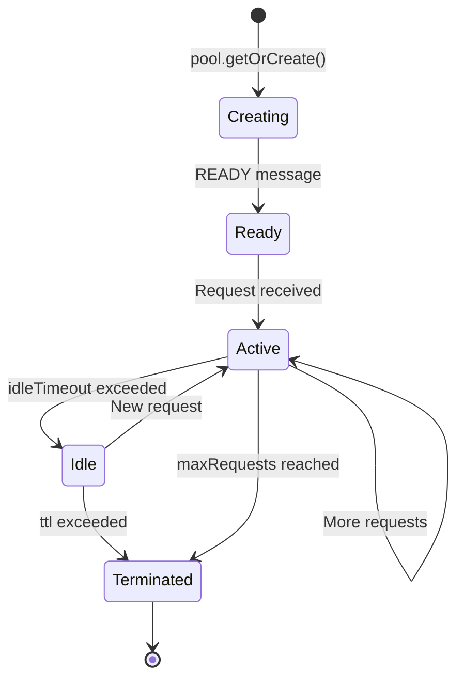

# Buntime Server

## Overview

Buntime is a worker pool runtime for Bun applications, designed as the engine for a serverless application platform. It provides:

**Worker Pool Management:**
- Dynamic worker spawning based on app requests
- Configurable max pool size
- Automatic worker lifecycle management

**Semantic Versioning:**
- Support for `app@1.0.0`, `app@1`, `app`
- Fallback to highest version if specific version not found
- Version sorting (highest version selected when no version specified)

**Plugin System:**
- JSONC configuration with comments support
- Plugin lifecycle hooks (onInit, onShutdown, onRequest, onResponse)
- Plugin routes mounted at `/_/{plugin-name}/*`
- Dependencies and priority ordering

**Authentication & Authorization:**
- AuthN via Keycloak/OIDC/JWT (@buntime/plugin-authn)
- AuthZ with XACML-like policies (@buntime/plugin-authz)
- PAP/PDP architecture for policy management

**Real-time Monitoring:**
- SSE endpoint for live metrics
- Prometheus format support
- Pool metrics (active workers, queue size, etc.)
- Per-worker statistics

**Type Safety:**
- Full TypeScript support
- Zod validation for runtime type safety

## Tech Stack

- Bun runtime
- Hono (web framework)
- Zod (validation)
- quick-lru (caching)
- semver (version resolution)

## Project Structure

```
apps/server/
├── src/
│   ├── index.ts          # Entry point (Bun.serve)
│   ├── app.ts            # Hono app (routes aggregator)
│   ├── constants.ts      # Environment variables
│   ├── libs/
│   │   ├── dir-info.ts   # Directory operations
│   │   └── pool/         # Worker pool management
│   │       ├── pool.ts       # WorkerPool class & singleton
│   │       ├── instance.ts   # WorkerInstance class
│   │       ├── wrapper.ts    # Worker thread code
│   │       ├── config.ts     # Worker configuration (worker.jsonc)
│   │       ├── metrics.ts    # Pool metrics
│   │       ├── types.ts      # Message types
│   │       └── preloads/
│   │           └── setup.ts  # Worker preload (auto-install)
│   ├── plugins/
│   │   ├── loader.ts     # Plugin loader (buntime.jsonc)
│   │   └── registry.ts   # Plugin registry
│   ├── routes/
│   │   ├── internal/         # /_/* routes
│   │   │   ├── index.ts      # Internal routes aggregator
│   │   │   └── deployments.ts
│   │   └── worker.ts         # /:app/* routes
│   └── utils/
│       ├── get-app-dir.ts    # App directory resolution
│       ├── get-entrypoint.ts # Entrypoint resolution
│       └── serve-static.ts   # Static file serving
```

## Configuration

**buntime.jsonc (global):**
```jsonc
{
  // Required plugins (cannot be disabled by apps)
  "required": ["@buntime/plugin-metrics"],

  // Plugins array (Babel-style) - order matters!
  "plugins": [
    // String = plugin without config
    "@buntime/plugin-metrics",

    // Tuple = [name, config]
    ["@buntime/plugin-authn", {
      "provider": "keycloak",
      "issuer": "${KEYCLOAK_URL}",
      "realm": "${KEYCLOAK_REALM}"
    }],

    // authz must come after authn (declares dependency internally)
    ["@buntime/plugin-authz", {
      "store": "file",
      "path": "./policies.json"
    }]
  ]
}
```

**Plugin dependencies:**
- Plugins declare their dependencies internally in code
- The loader validates that dependencies were loaded before
- If the order is incorrect, displays a clear error

## API Routes

### Internal Routes (prefix: `/_`)

- `GET /_/deployments` - Deployment management
- `GET /_/metrics` - Get worker pool metrics (JSON)
- `GET /_/sse` - Server-Sent Events stream (real-time metrics)
- `GET /_/stats` - Get pool + workers stats (JSON)

### Plugin Routes (prefix: `/_/{plugin-name}`)

- `/_/metrics/prometheus` - Prometheus format metrics
- `/_/authn/well-known` - OIDC discovery
- `/_/authz/policies` - Policy CRUD

### Worker Routes (prefix: `/`)

- `ALL /:app` - Route request to app worker or proxy
- `ALL /:app/*` - Route nested paths to app worker or proxy

**Version Resolution:**
- `/hello-api` → Highest version in `APPS_DIR/hello-api/`
- `/hello-api@1.0.0` → Exact version `APPS_DIR/hello-api/1.0.0/`
- `/hello-api@1` → Highest version compatible with 1.x.x

## Worker Configuration (worker.jsonc per app)

Apps can be configured via `worker.jsonc` in the app directory:

```jsonc
{
  // Worker settings
  "entrypoint": "public/index.html",
  "timeout": 30,
  "ttl": 60,
  "maxRequests": 1000,
  "idleTimeout": 60,
  "autoInstall": false,
  "lowMemory": false
}
```

| Option | Type | Default | Description |
|--------|------|---------|-------------|
| `autoInstall` | boolean | false | Run `bun install` before worker starts |
| `entrypoint` | string | auto | App entrypoint (searched: index.html, index.ts, index.js, index.mjs) |
| `idleTimeout` | number | 60 | Idle threshold before worker is marked stale (seconds) |
| `lowMemory` | boolean | false | Enable low-memory mode |
| `maxRequests` | number | 1000 | Max requests before worker recycle |
| `timeout` | number | 30 | Request timeout (seconds) |
| `ttl` | number | 0 | Worker time-to-live (seconds, 0 = no limit) |

## Scripts

**Development:**
```bash
bun dev              # Run in watch mode
bun lint             # Format and type check
bun test             # Run tests
```

**Build:**
```bash
bun run --cwd apps/server build      # Build server
bun run --cwd apps/server build:bin  # Compile to binary
```

## Path Aliases

```json
{
  "@buntime/server/*": ["./src/*"]
}
```

## Architecture

### Request Flow



### Thread Model



### Design Principles

1. **Main thread orchestrates** - Never executes app logic directly
2. **Workers for isolation** - Static and dynamic apps run in workers
3. **Total isolation** - Worker crash doesn't affect main thread
4. **Plugin pipeline** - Plugins intercept requests/responses in main thread

### Worker Lifecycle



## Key Components

### src/libs/pool/

| File | Thread | Responsibility |
|------|--------|----------------|
| `pool.ts` | Main | WorkerPool class, LRU cache, metrics |
| `instance.ts` | Main | WorkerInstance lifecycle, message passing |
| `wrapper.ts` | Worker | Request handling (static/dynamic) |
| `config.ts` | Both | Load and validate worker.jsonc |
| `metrics.ts` | Main | Pool statistics |
| `types.ts` | Both | Worker message types |
| `preloads/setup.ts` | Worker | Preload script (auto-install dependencies) |

### src/plugins/

| File | Description |
|------|-------------|
| `loader.ts` | Load plugins from buntime.jsonc |
| `registry.ts` | Plugin registry and lifecycle management |

### src/utils/

| File | Description |
|------|-------------|
| `get-app-dir.ts` | Resolve app directory with version support |
| `get-entrypoint.ts` | Find app entrypoint (index.html/ts/js/mjs) |
| `serve-static.ts` | Serve static files with SPA fallback |
