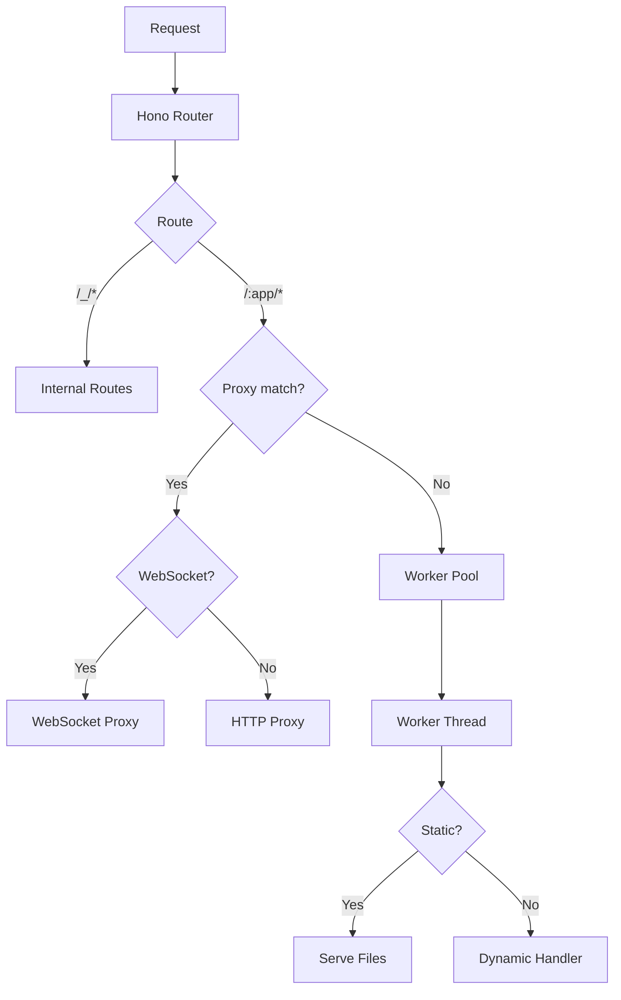
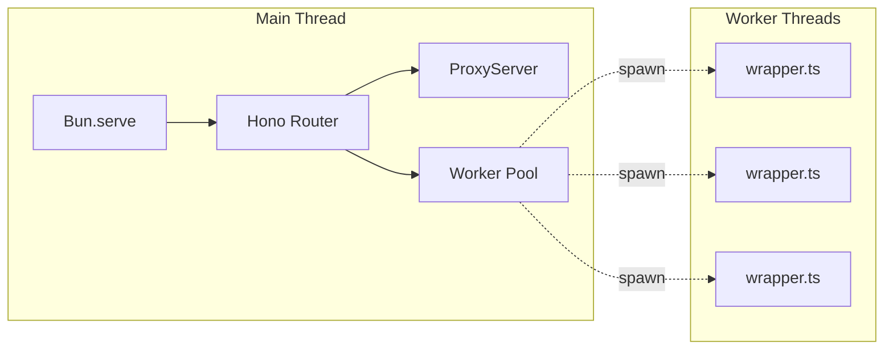
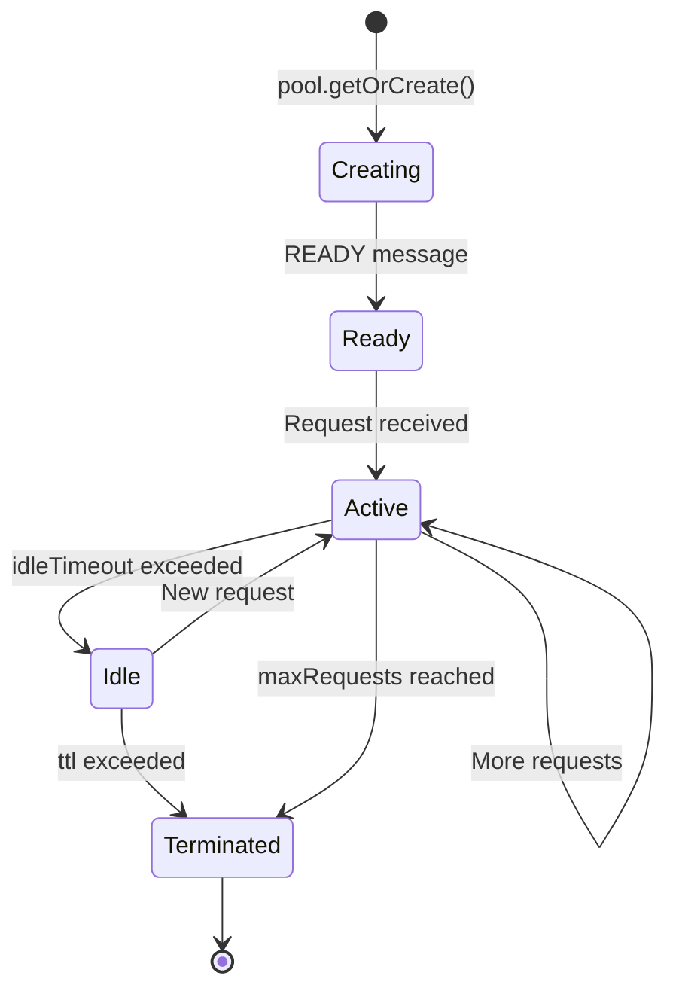
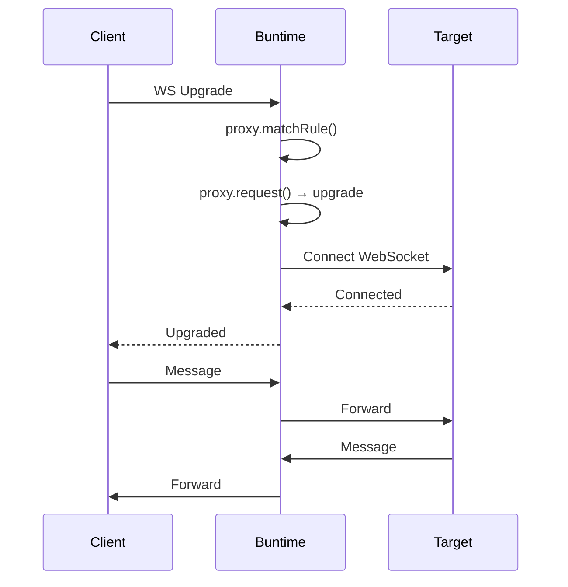

# Architecture

## Project Structure

```
buntime/
├── index.ts             # Entry point (Bun.serve)
├── src/
│   ├── app.ts            # Hono app (routes aggregator)
│   ├── constants.ts      # Environment variables
│   ├── libs/
│   │   ├── errors.ts     # Error handling utilities
│   │   ├── proxy.ts      # ProxyServer class (HTTP & WebSocket)
│   │   └── pool/         # Worker pool management
│   │       ├── index.ts      # WorkerPool class & singleton
│   │       ├── instance.ts   # WorkerInstance class
│   │       ├── wrapper.ts    # Worker thread code
│   │       ├── config.ts     # Worker configuration
│   │       ├── metrics.ts    # Pool metrics
│   │       └── types.ts      # Message types
│   ├── routes/
│   │   ├── internal/         # /_/* routes
│   │   │   ├── index.ts      # Internal routes aggregator
│   │   │   └── deployments.ts
│   │   └── worker.ts         # /:app/* routes
│   └── utils/
│       ├── get-app-dir.ts    # App directory resolution
│       ├── get-entrypoint.ts # Entrypoint resolution
│       ├── serve-static.ts   # Static file serving
│       └── zod-helpers.ts    # Zod validation utilities
```

## Request Flow



## Thread Model



## Design Principles

1. **Main thread orchestrates** - Never executes app logic directly
2. **Proxy outside workers** - HTTP/WS proxy runs in main thread for performance
3. **Workers for isolation** - Static and dynamic apps run in workers
4. **Total isolation** - Worker crash doesn't affect main thread
5. **Unified config** - TTL, timeout, proxy apply consistently

## Worker Lifecycle



## Key Components

### src/libs/pool/

| File | Thread | Responsibility |
|------|--------|----------------|
| `index.ts` | Main | WorkerPool class, LRU cache, metrics |
| `instance.ts` | Main | WorkerInstance lifecycle, message passing |
| `wrapper.ts` | Worker | Request handling (static/dynamic) |
| `config.ts` | Both | Load and validate worker.config.json |
| `metrics.ts` | Main | Pool statistics |
| `types.ts` | Both | Worker message types |

### src/libs/proxy.ts (ProxyServer class)

| Method | Description |
|--------|-------------|
| `setServer(server)` | Set Bun server instance for WebSocket upgrades |
| `websocketHandler` | Getter for Bun WebSocket handlers |
| `matchRule(pathname, rules)` | Match path against regex patterns |
| `rewritePath({ groups, pathname, rule })` | Apply path rewrite with capture groups |
| `request(req, rule, path)` | Execute HTTP or WebSocket proxy |

### src/utils/

| File | Description |
|------|-------------|
| `get-app-dir.ts` | Resolve app directory with version support |
| `get-entrypoint.ts` | Find app entrypoint (index.html/ts/js/mjs) |
| `serve-static.ts` | Serve static files with SPA fallback |
| `zod-helpers.ts` | Zod validation utilities |

## Proxy Architecture

### HTTP Proxy

1. Request arrives at `/:app/path`
2. Load `worker.config.json` for app
3. Match path against proxy rules via `proxy.matchRule()`
4. If match: `proxy.request()` forwards directly (no worker)
5. If no match: send to worker pool

### WebSocket Proxy

1. WS upgrade request arrives at `/:app/path`
2. Match proxy rules in worker route
3. If match: `proxy.request()` detects WS and calls `server.upgrade()`
4. `websocketHandler.open` connects to target
5. Bidirectional message bridging


