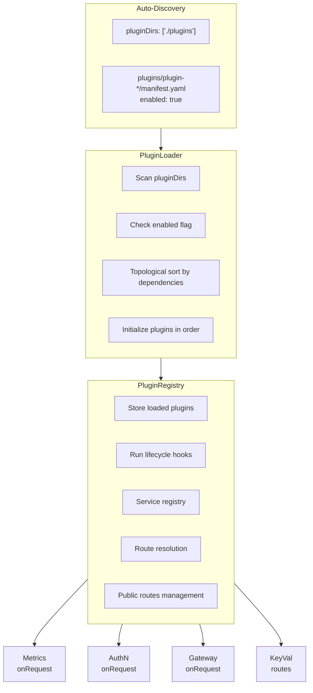
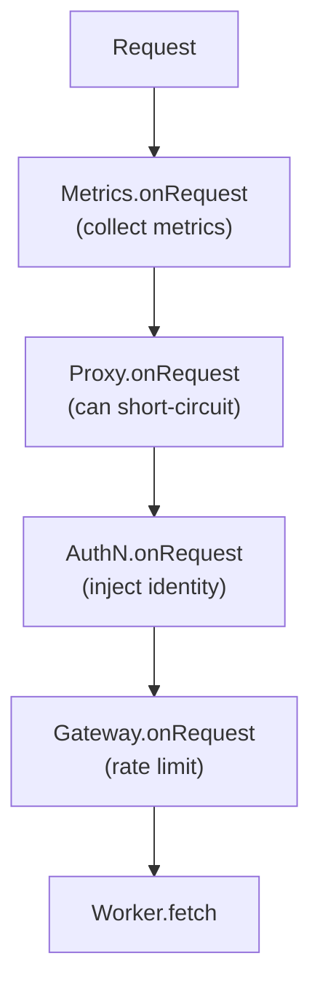

# Overview

Buntime's plugin system enables modular extensibility through reusable components. Plugins can intercept requests, modify responses, provide their own APIs, manage workers, and integrate with the server lifecycle.

**Key Features**:

- **Lifecycle Hooks**: Intercept at different stages of the request/response cycle
- **Dependency Management**: Automatic dependency resolution between plugins
- **Topological Ordering**: Execution order based on dependencies (via topological sort)
- **Service Registry**: Share services between plugins
- **Micro-Frontend Support**: Plugins can provide embeddable UI in the shell via iframes

# Architecture

## Components



## Plugin Structure

```
plugins/plugin-example/
├── manifest.yaml          # Metadata + configuration
├── plugin.ts              # Middleware (runs in runtime process)
├── index.ts               # Worker entrypoint (runs in worker pool)
├── server/                # API code (shared)
│   └── api.ts
├── client/                # SPA source (React/TanStack)
└── dist/
    ├── plugin.js          # Compiled middleware
    ├── index.js           # Compiled worker entrypoint
    └── client/
        └── index.html     # Compiled SPA
```

# API Modes

Plugins can serve APIs in two distinct modes. **Choose one mode per plugin** - don't duplicate API in both.

## Persistent API (via `plugin.ts`)

Runs in the **main runtime process** (persistent). Use when you need:

- **Persistent connections** (WebSocket, Kafka consumers, DB connection pools)
- **In-memory state** (caches, rate limiters, session stores)
- **Background jobs** (cron, queue consumers)
- **SSE/Streaming** (requires main thread)
- **Shared resources** across requests

```typescript
// plugin.ts - routes here for persistent mode
export default function databasePlugin(config): PluginImpl {
  return {
    routes: api,  // API runs in runtime process
    onInit(ctx) {
      // Initialize DB connection pool (persistent)
      db = new DatabasePool(config.url);
    },
  };
}

// index.ts - NO routes, only SPA
export default {
  fetch: createStaticHandler(clientDir),
};
```

## Serverless API (via `index.ts`)

Runs in the **worker pool** (serverless/ephemeral). Use when:

- Operations are **stateless** (CRUD, file operations)
- No persistent connections needed
- Want **isolation** (plugin crash doesn't affect runtime)
- Want **horizontal scaling**

```typescript
// plugin.ts - NO routes, only hooks if needed
export default function deploymentsPlugin(config): PluginImpl {
  return {
    // No routes - API is serverless
    onInit(ctx) {
      // Initialization if needed
    },
  };
}

// index.ts - API here for serverless mode
export default {
  routes: { "/api/*": api.fetch },
  fetch: createStaticHandler(clientDir),
};
```

## Mode Selection Matrix

| Need | Mode | `plugin.ts` has `routes:` | `index.ts` has `routes:` |
|------|------|---------------------------|--------------------------|
| DB connection pools | Persistent | Yes | No |
| WebSocket/SSE | Persistent | Yes | No |
| In-memory cache | Persistent | Yes | No |
| Background jobs | Persistent | Yes | No |
| Stateless CRUD | Serverless | No | Yes |
| File operations | Serverless | No | Yes |
| Process isolation | Serverless | No | Yes |

**Examples by mode:**
- **Persistent**: database, gateway, authn, keyval, logs, metrics, proxy
- **Serverless**: deployments

# Entrypoint Modes

The `wrapper.ts` in the worker pool determines behavior based on entrypoint extension.

## SPA Mode (`.html`)

```yaml
entrypoint: dist/client/index.html
```

- Serves **static files only** (HTML, CSS, JS, assets)
- Uses `serveStatic()` with SPA fallback routing
- **No code execution** - `index.ts` is ignored!
- Use when: Plugin has no serverless API, only static frontend

## Service Mode (`.js`/`.ts`)

```yaml
entrypoint: dist/index.js
```

- **Imports and executes** the module
- Expects `export default { fetch?, routes? }`
- Can serve both API and static files
- Use when: Plugin has serverless API via `index.ts`

## Decision Logic

```typescript
// In wrapper.ts
const spa = ENTRYPOINT.endsWith(".html");
const app = spa ? null : (await import(ENTRYPOINT)).default;

// If spa=true → serveStatic(ENTRYPOINT, pathname)
// If spa=false → app.fetch(req) or app.routes
```

> [!WARNING]
> **Common Mistake**: Plugin has API in `index.ts` but `entrypoint` is `.html`. Result: API is completely ignored, only serves static files!
> ```yaml
> # WRONG
> entrypoint: dist/client/index.html  # API in index.ts is ignored!
> 
> # CORRECT - for serverless API
> entrypoint: dist/index.js
> ```

## Worker Routes Object

Workers can export a `routes` object with multiple formats:

```typescript
export default {
  routes: {
    // Static Response
    "/api/health": new Response("OK"),
    
    // Handler function
    "/api/data": async (req) => new Response(JSON.stringify(data)),
    
    // Method-specific handlers
    "/api/items/:id": {
      GET: (req) => getItem(req.params.id),
      POST: (req) => createItem(req),
      DELETE: (req) => deleteItem(req.params.id),
    },
    
    // Hono app
    "/api/*": api.fetch,
    
    // BunFile
    "/file": Bun.file("./public/index.html"),
  },
  
  // Optional fallback for unmatched routes
  fetch: (req) => new Response("Not Found", { status: 404 }),
};
```

# Environment Variables

## Naming Conventions

| Scope | Prefix | Examples |
|-------|--------|----------|
| Runtime Core | `RUNTIME_` | `RUNTIME_LOG_LEVEL`, `RUNTIME_POOL_SIZE`, `RUNTIME_WORKER_DIRS` |
| Plugin Gateway | `GATEWAY_` | `GATEWAY_APP_SHELL`, `GATEWAY_CORS_ORIGIN` |
| Plugin Database | `DATABASE_` | `DATABASE_LIBSQL_URL`, `DATABASE_LIBSQL_REPLICAS` |
| Plugin Deployments | `DEPLOYMENTS_` | `DEPLOYMENTS_EXCLUDES` |
| Plugin Authn | `AUTHN_` | `AUTHN_LOGIN_PATH` |

## Multiple Values Format

Use **colon separator** (PATH style) for env vars with multiple values:

```bash
# Correct (PATH style)
RUNTIME_WORKER_DIRS=/data/.apps:/data/apps
DEPLOYMENTS_EXCLUDES=.git:node_modules:dist

# Wrong (don't use comma)
RUNTIME_WORKER_DIRS=/data/.apps,/data/apps  # ❌
```

## Runtime Env Vars

| Variable | Description | Default |
|----------|-------------|---------|
| `RUNTIME_WORKER_DIRS` | Colon-separated worker directories | **Required** |
| `RUNTIME_PLUGIN_DIRS` | Colon-separated plugin directories | `./plugins` |
| `RUNTIME_POOL_SIZE` | Max workers in pool | Environment-based |
| `RUNTIME_LOG_LEVEL` | Log level (debug/info/warn/error) | Based on `NODE_ENV` |
| `PORT` | Server port | `8000` |

## Env Vars Passed to Workers

Workers **do NOT inherit** the runtime's environment. Only these explicit vars are passed:

| Variable | Source | Description |
|----------|--------|-------------|
| `APP_DIR` | Runtime | Absolute path to app directory |
| `ENTRYPOINT` | Runtime | Full path to entrypoint file |
| `NODE_ENV` | Inherited | development/production/staging/test |
| `RUNTIME_API_URL` | Runtime | Internal API URL (e.g., `http://127.0.0.1:8000`) |
| `RUNTIME_LOG_LEVEL` | Inherited | Log level |
| `RUNTIME_PLUGIN_DIRS` | Inherited | Plugin directories |
| `RUNTIME_WORKER_DIRS` | Inherited | Worker directories |
| `WORKER_CONFIG` | Runtime | JSON-serialized WorkerConfig |
| `WORKER_ID` | Runtime | Unique UUID for this worker |
| `*` (from manifest.env) | manifest.yaml | Custom env vars (filtered for sensitive patterns) |

## Reading Configuration in Plugins

**Pattern**: Read from `Bun.env` with fallback to `pluginConfig` (from manifest).

```typescript
export default function myPlugin(pluginConfig: MyConfig): PluginImpl {
  return {
    onInit(ctx) {
      // Bun.env comes from ConfigMap (Kubernetes/Helm)
      // pluginConfig comes from manifest.yaml
      const apiKey = Bun.env.MY_API_KEY ?? pluginConfig.apiKey ?? "default";
      const endpoint = Bun.env.MY_ENDPOINT ?? pluginConfig.endpoint;
    },
  };
}
```

## Reading Env Vars in Workers (Serverless Mode)

Workers receive `RUNTIME_*` vars directly. Parse colon-separated values:

```typescript
// server/api.ts (runs in worker)
function parsePaths(value: string): string[] {
  return value.split(":").map(p => p.trim()).filter(Boolean);
}

const workerDirs = Bun.env.RUNTIME_WORKER_DIRS 
  ? parsePaths(Bun.env.RUNTIME_WORKER_DIRS) 
  : [];
```

## Important Rules

1. **NO polluting `Bun.env`** - Don't write to `Bun.env` to pass config
2. **Workers are isolated** - They only receive explicit env vars
3. **Use colon separator** - For multiple values (PATH style)
4. **Sensitive vars are blocked** - See [Security](#security) section

# Configuration Flow

## Built-in Plugins (compiled in image)

```
manifest.yaml (config:)
       │
       ▼
Helm generators (scripts/generate-helm-*.ts)
       │
       ▼
values.yaml + configmap.yaml + questions.yml
       │
       ▼
ConfigMap (Kubernetes)
       │
       ▼
Bun.env (runtime process)
       │
       └──► plugin.ts reads Bun.env with fallback to pluginConfig
```

## Runtime Plugins (upload + reload)

```
manifest.yaml
       │
       ▼
loader.rescan()
       │
       ▼
pluginConfig (from manifest)
       │
       └──► plugin.ts reads Bun.env (empty) → falls back to pluginConfig
```

## Workers (both modes)

```
manifest.yaml (env:)
       │
       ▼
loadWorkerConfig()
       │
       ▼
instance.ts injects env into Worker
       │
       ▼
Worker's Bun.env (already contextualized)
```

# Plugin Resolution

The `PluginLoader` resolves plugins in three stages:

## 1. Built-in Plugins (Auto-discovery)

Plugins are automatically discovered from the directories configured in `pluginDirs`. The loader scans these directories looking for `manifest.yaml` or `manifest.yml`:

**Supported structures:**
```
1. Direct:       {pluginDir}/plugin.ts + manifest.yaml
2. Subdirectory: {pluginDir}/{name}/plugin.ts + manifest.yaml
3. Scoped:       {pluginDir}/@scope/{name}/plugin.ts + manifest.yaml
```

**Entry file priority:**
1. `manifest.pluginEntry` (if specified)
2. `{dir}/plugin.{ts,js}`
3. `{dir}/index.{ts,js}`

## 2. External Plugins (./plugins/)

Local plugins in the `./plugins/` directory:

```
./plugins/
├── custom-auth.ts              # ./plugins/custom-auth.ts
└── company-metrics/
    └── index.ts                # ./plugins/company-metrics/index.ts
```

## 3. Node Modules (Dev/Bundle Mode)

Plugins installed via npm:

```bash
bun add @company/buntime-plugin-sso
```

# Manifest Schema

## Complete Schema

```yaml
name: "@buntime/plugin-example"
base: "/example"              # Base path for routes (optional for hook-only plugins)
enabled: true                 # Can be disabled

# Worker entrypoint - IMPORTANT: affects behavior!
entrypoint: dist/index.js     # Service mode (API + SPA)
# entrypoint: dist/client/index.html  # SPA-only mode (no API)
pluginEntry: dist/plugin.js   # Middleware entrypoint

# Dependencies
dependencies:
  - "@buntime/plugin-database"
optionalDependencies:
  - "@buntime/plugin-authn"

# Public routes (bypass onRequest hooks)
publicRoutes:
  ALL: ["/health"]
  GET: ["/api/public/**"]
  POST: ["/api/webhook"]

# Menu items for cpanel
menus:
  - icon: lucide:box
    path: /example
    title: Example
    items:              # Optional submenu
      - icon: lucide:list
        path: /example/list
        title: List

# Plugin-specific configuration (passed to factory function)
myOption: "value"
anotherOption: 123

# Environment variables for workers (from manifest)
env:
  MY_VAR: "value"

# Config schema for Rancher UI (generates Helm files)
config:
  apiKey:
    type: password
    label: API Key
    description: API key for external service
    env: EXAMPLE_API_KEY        # Maps to ConfigMap
  endpoint:
    type: string
    label: Endpoint URL
    default: "https://api.example.com"
    env: EXAMPLE_ENDPOINT
```

## Manifest Fields Reference

| Field | Type | Default | Description |
|-------|------|---------|-------------|
| `name` | string | **Required** | Unique plugin identifier. Format: `@scope/plugin-name` |
| `base` | string | - | Base path for plugin routes. Format: `/[a-zA-Z0-9_-]+`. Optional for hook-only plugins. |
| `enabled` | boolean | `true` | Enables or disables the plugin |
| `entrypoint` | string | - | Worker entrypoint (client HTML or server JS) |
| `pluginEntry` | string | - | Plugin middleware entrypoint (server-side) |
| `dependencies` | string[] | `[]` | Required plugins (throws if missing) |
| `optionalDependencies` | string[] | `[]` | Optional plugins (ignored if missing) |
| `publicRoutes` | array/object | - | Routes that bypass onRequest hooks |
| `menus` | MenuItem[] | - | Menu items for shell navigation |
| `env` | Record<string, string> | - | Environment variables for workers |
| `config` | object | - | Config schema for Helm/Rancher UI generation |

> [!NOTE]
> Additional fields like `version` can be included in the manifest and will be passed through, but are not type-checked. The `version` field is used informationally by the loader's `list()` method.

## Difference between `entrypoint` and `pluginEntry`

| Field | Purpose | Example |
|-------|---------|---------|
| `entrypoint` | **Application** entrypoint (client HTML or server JS served as app) | `dist/client/index.html` |
| `pluginEntry` | **Plugin** entrypoint (server-side code: middlewares, hooks, routes) | `dist/plugin.js` |

# Topological Sorting

Plugins are loaded in order based on dependencies using Kahn's algorithm:

```typescript
// Enabled plugins (each in their manifest.yaml)
// plugins/plugin-keyval/manifest.yaml -> enabled: true, dependencies: ["@buntime/plugin-database"]
// plugins/plugin-authn/manifest.yaml -> enabled: true, dependencies: []
// plugins/plugin-database/manifest.yaml -> enabled: true, dependencies: []

// Loading order (after topological sort)
1. @buntime/plugin-database   (no dependencies)
2. @buntime/plugin-keyval     (depends on database)
3. @buntime/plugin-authn      (no dependencies)
```

**Dependency Types**:

- **dependencies**: Required - throws if not loaded
- **optionalDependencies**: Loaded if available, ignored if not
- **Circular dependencies**: Detected and throw an error

# Request Flow

```
Request: GET /example/api/users
              │
              ▼
        Runtime (app.ts)
              │
              ▼
    ┌─────────────────────┐
    │ CSRF validation     │ (for /api/* routes)
    └─────────────────────┘
              │
              ▼
    ┌─────────────────────┐
    │ registry.runOnRequest() │ ◄── All plugin onRequest hooks
    └─────────────────────┘
              │
          Response? → Return early
              │
              ▼
    ┌─────────────────────┐
    │ handlePluginServerFetch() │ ◄── plugin.server.fetch
    └─────────────────────┘
              │
          Response? → Continue
              │
              ▼
    ┌─────────────────────┐
    │ handlePluginRoutes() │ ◄── plugin.routes (Hono)
    │ (sorted by base path) │     Longest path first
    └─────────────────────┘
              │
          Response? → Continue
              │
              ▼
    ┌─────────────────────┐
    │ handlePluginApp()   │ ◄── Worker pool (serverless)
    │ registry.resolvePluginApp()
    └─────────────────────┘
              │
          Response? → Continue
              │
              ▼
    ┌─────────────────────┐
    │ workers.fetch()     │ ◄── Regular worker apps
    └─────────────────────┘
              │
              ▼
    ┌─────────────────────┐
    │ registry.runOnResponse() │ ◄── All plugin onResponse hooks
    └─────────────────────┘
              │
              ▼
          Response
```

# Plugin Lifecycle

## Complete Sequence

```
1. DISCOVERY
   └── scanPluginDirs() scans all plugin directories
   └── loadManifest() reads manifest.yaml for each
   └── scannedPlugins Map populated (lazy - module not imported yet)

2. VALIDATION & SORTING
   └── Filter disabled plugins (manifest.enabled === false)
   └── Build dependency graph
   └── topologicalSort() orders plugins
   └── Validate required dependencies exist

3. LOADING (per plugin, in sorted order)
   └── Import module lazily: await import(path)
   └── resolvePluginImpl() - handle factory/default export
   └── Validate base path format and reserved paths
   └── Merge manifest + implementation → BuntimePlugin
   └── Create PluginContext
   └── Call plugin.onInit(context) with 30s timeout
   └── Register in PluginRegistry

4. ROUTE REGISTRATION (in createApp)
   └── Detect route collisions
   └── Log mounted paths
   └── Store in registry.setMountedPaths()

5. SERVER START
   └── Bun.serve() with plugin routes and websocket
   └── registry.runOnServerStart(server)

6. REQUEST HANDLING (per request)
   └── registry.runOnRequest() - all plugins in order
   └── handlePluginServerFetch() - server.fetch handlers
   └── handlePluginRoutes() - Hono routes
   └── handlePluginApp() - worker apps
   └── registry.runOnResponse() - all plugins in order

7. SHUTDOWN (on SIGINT)
   └── registry.runOnShutdown() - reverse order (LIFO)
   └── pool.shutdown() - terminate all workers
   └── logger.flush()
```

## Hot Reload

```
POST /api/plugins/upload   # Upload plugin tarball
POST /api/plugins/reload   # Rescan and reload all plugins
```

The `reload` endpoint:
1. Clears current registry
2. Rescans plugin directories
3. Reloads all plugins (topological sort by dependencies)

# Lifecycle Hooks

## onInit

Called when the plugin is initialized, before the server starts.

**Signature**:

```typescript
onInit?: (ctx: PluginContext) => Promise<void> | void;
```

**Context**:

```typescript
interface PluginContext {
  /** Plugin-specific config from manifest */
  config: Record<string, unknown>;

  /** Global runtime configuration */
  globalConfig: {
    workerDirs: string[];  // From RUNTIME_WORKER_DIRS
    poolSize: number;      // From RUNTIME_POOL_SIZE
  };

  /** Scoped logger */
  logger: PluginLogger;

  /** Worker pool instance */
  pool?: WorkerPool;

  /** Register a service for other plugins */
  registerService<T>(name: string, service: T): void;

  /** Get a service from another plugin */
  getService<T>(name: string): T | undefined;
}
```

**Initialization Timeout**:

The `onInit` hook has a **30-second timeout**. If initialization doesn't complete in this period, the plugin fails with a timeout error.

**Example**:

```typescript
export default function createPlugin(config: KeyValConfig): PluginImpl {
  let db: DatabaseAdapter;

  return {
    async onInit(ctx) {
      // Get service from another plugin
      db = ctx.getService<DatabaseAdapter>("database")!;

      // Initialize and register own service
      const kv = new Kv({ db, logger: ctx.logger });
      await kv.init();
      ctx.registerService("kv", kv);

      ctx.logger.info("KeyVal initialized");
    },
  };
}
```

## onRequest

Called for each request before reaching the worker.

**Signature**:

```typescript
onRequest?: (
  req: Request,
  app?: AppInfo
) => Promise<Request | Response | undefined> | Request | Response | undefined;
```

**Return Values**:

| Return | Behavior |
|--------|----------|
| `undefined` | Continue to next handler with original request |
| `Request` | Continue with modified request |
| `Response` | Short-circuit, return immediately |

**Execution Order**: Plugins execute in registration order (after topological sort).



## onResponse

Called after the worker generates the response, before sending to the client.

**Signature**:

```typescript
onResponse?: (res: Response, app: AppInfo) => Promise<Response> | Response;
```

## onServerStart

Called after `Bun.serve()` starts.

**Signature**:

```typescript
onServerStart?: (server: Server<unknown>) => void;
```

**Usage**: Access to server instance for WebSocket upgrades.

## onShutdown

Called when the runtime is shutting down.

**Signature**:

```typescript
onShutdown?: () => Promise<void> | void;
```

**Order**: Plugins execute shutdown in **reverse order** (LIFO).

## onWorkerSpawn / onWorkerTerminate

Called when workers are created or terminated.

**Signatures**:

```typescript
onWorkerSpawn?: (worker: WorkerInstance, app: AppInfo) => void;
onWorkerTerminate?: (worker: WorkerInstance, app: AppInfo) => void;
```

## Hooks Summary

| Hook | When Called | Return Value |
|------|-------------|--------------|
| `onInit(ctx)` | During plugin load (30s timeout) | `void` or `Promise<void>` |
| `onShutdown()` | During graceful shutdown | `void` or `Promise<void>` |
| `onServerStart(server)` | After `Bun.serve()` | `void` |
| `onRequest(req, app?)` | Before route handling | `Request`, `Response`, or `undefined` |
| `onResponse(res, app)` | After response generated | Modified `Response` |
| `onWorkerSpawn(worker, app)` | When worker is created | `void` |
| `onWorkerTerminate(worker, app)` | When worker is terminated | `void` |

# PluginImpl Reference

## Complete Interface

```typescript
interface PluginImpl {
  /** Hono middleware - alternative to onRequest */
  middleware?: MiddlewareHandler;

  /** Hono routes mounted at /{base}/* */
  routes?: Hono;

  /** Server module for static files and API in main process */
  server?: PluginServer;

  /** WebSocket handler for Bun.serve() */
  websocket?: {
    open?: (ws: ServerWebSocket<unknown>) => void;
    message?: (ws: ServerWebSocket<unknown>, message: string | Buffer) => void;
    close?: (ws: ServerWebSocket<unknown>, code: number, reason: string) => void;
  };

  // Lifecycle hooks
  onInit?: (ctx: PluginContext) => Promise<void> | void;
  onShutdown?: () => Promise<void> | void;
  onServerStart?: (server: Server<unknown>) => void;

  // Request/Response hooks
  onRequest?: (req: Request, app?: AppInfo) => Promise<Request | Response | undefined> | Request | Response | undefined;
  onResponse?: (res: Response, app: AppInfo) => Promise<Response> | Response;

  // Worker hooks
  onWorkerSpawn?: (worker: WorkerInstance, app: AppInfo) => void;
  onWorkerTerminate?: (worker: WorkerInstance, app: AppInfo) => void;
}
```

## PluginServer

For serving static files and API routes directly in the main process:

```typescript
interface PluginServer {
  /**
   * Routes for Bun.serve({ routes })
   * Wrapped with auth check based on publicRoutes
   */
  routes?: Record<string, RouteHandler>;

  /**
   * Fetch handler invoked in app.fetch
   * Called after routes don't match, before Hono routes
   */
  fetch?: (req: Request) => Response | Promise<Response>;
}
```

**Example**:

```typescript
export default function gatewayPlugin(config): PluginImpl {
  return {
    server: {
      routes: {
        "/login": Bun.file("dist/login.html"),
        "/api/health/*": () => new Response("OK"),
      },
      fetch: (req) => serveStatic(req),
    },
  };
}
```

## WebSocket Handler

Multiple plugins can register WebSocket handlers - they're automatically combined:

```typescript
export default function realtimePlugin(): PluginImpl {
  return {
    websocket: {
      open(ws) {
        console.log("Client connected");
      },
      message(ws, message) {
        ws.send(`Echo: ${message}`);
      },
      close(ws, code, reason) {
        console.log("Client disconnected", code, reason);
      },
    },
    onServerStart(server) {
      // Store server for upgrade handling
      this.server = server;
    },
  };
}
```

## AppInfo

Passed to hooks (`onRequest`, `onResponse`, `onWorkerSpawn`, `onWorkerTerminate`):

```typescript
interface AppInfo {
  /** App name (e.g., "my-app") */
  name: string;

  /** App version (e.g., "1.0.0") */
  version: string;

  /** Absolute path to app directory */
  dir: string;

  /** App-specific worker configuration */
  config: WorkerConfig;
}
```

# WorkerConfig Reference

## Complete Schema

```yaml
# Entrypoint file (default: index.ts)
entrypoint: "src/index.ts"

# Auto-run bun install before starting (default: false)
autoInstall: false

# Request timeout (default: 30s)
# Accepts: number (seconds) or string ("30s", "1m", "1h")
timeout: 30

# Worker lifetime - 0 = ephemeral (default: 0)
# If > 0, worker stays alive and handles multiple requests
ttl: 0

# Idle timeout before termination (default: 60s)
idleTimeout: 60

# Max requests before recycling (default: 1000)
maxRequests: 1000

# Enable low memory mode (default: false)
lowMemory: false

# Max request body size (default: "10mb")
maxBodySize: "10mb"

# Routes that bypass plugin onRequest hooks
publicRoutes:
  - "/api/health"
  - "/api/public/**"

# Custom environment variables
env:
  MY_VAR: "value"

# Visibility in deployments UI
visibility: "public"  # "public" | "protected" | "internal"
```

## PublicRoutes Formats

```yaml
# Array format - applies to ALL methods
publicRoutes:
  - "/health"
  - "/api/public/**"

# Object format - method-specific
publicRoutes:
  ALL: ["/health"]           # All methods
  GET: ["/api/users/**"]     # GET only
  POST: ["/api/webhook"]     # POST only
```

**Wildcard patterns:**
- `*` - matches single path segment (`/api/*/info` matches `/api/users/info`)
- `**` - matches multiple segments (`/api/**` matches `/api/users/123/posts`)

## Validation Rules

```typescript
// TTL > 0 (persistent worker) has additional constraints:
if (ttl > 0) {
  // ttl must be >= timeout
  if (ttl < timeout) throw Error("ttl must be >= timeout");

  // idleTimeout must be >= timeout
  if (idleTimeout < timeout) throw Error("idleTimeout must be >= timeout");

  // idleTimeout > ttl is auto-adjusted with warning
  if (idleTimeout > ttl) {
    logger.warn("idleTimeout exceeds ttl, adjusting to ttl");
    idleTimeout = ttl;
  }
}
```

# Service Registry

Plugins can register services for inter-plugin communication.

## Registering a Service

```typescript
export default function databasePlugin(): PluginImpl {
  return {
    onInit(ctx) {
      const service = new DatabaseService(config);
      ctx.registerService("database", service);
    },
  };
}
```

## Consuming a Service

```typescript
// Must declare dependency in manifest.yaml
export default function authnPlugin(): PluginImpl {
  return {
    onInit(ctx) {
      const database = ctx.getService<DatabaseService>("database");
      if (!database) {
        throw new Error("Requires @buntime/plugin-database");
      }
    },
  };
}
```

**Rules:**
- Service names should be unique
- Overwriting logs a warning
- Declare dependency in `dependencies` to ensure load order

# Registry Methods

The `PluginRegistry` class manages loaded plugins and orchestrates lifecycle hook execution.

## Lifecycle Methods

| Method | Description |
|--------|-------------|
| `runOnRequest(req, app?)` | Executes all `onRequest` hooks in order. Returns modified request or response for short-circuit. |
| `runOnResponse(res, app)` | Executes all `onResponse` hooks in order. |
| `runOnServerStart(server)` | Notifies all plugins when server starts. |
| `runOnShutdown()` | Executes shutdown hooks in reverse order (LIFO). |
| `runOnWorkerSpawn(worker, app)` | Called when a new worker is created. |
| `runOnWorkerTerminate(worker, app)` | Called when a worker is terminated. |

## Resolution Methods

| Method | Description |
|--------|-------------|
| `getPluginBasePaths()` | Returns `Set<string>` of all plugin base paths. |
| `resolvePluginApp(pathname)` | Resolves pathname to plugin's directory and base path. |
| `collectServerRoutes()` | Collects all `server.routes` from plugins with auth wrapper. |

## Service Methods

| Method | Description |
|--------|-------------|
| `registerService<T>(name, service)` | Registers a service for sharing between plugins. |
| `getService<T>(name)` | Retrieves a service registered by another plugin. |

## Access Methods

| Method | Description |
|--------|-------------|
| `get(name)` | Returns a plugin by name. |
| `getAll()` | Returns all plugins in registration order. |
| `has(name)` | Checks if a plugin is registered. |
| `size` | Number of registered plugins. |
| `getPluginDir(name)` | Returns a plugin's directory. |
| `getPluginsWithServerFetch()` | Returns plugins with `server.fetch` handlers. |
| `getWebSocketHandler()` | Returns combined WebSocket handler from all plugins. |

# Security

## Sensitive Env Vars Blocked from Workers

Workers **never** receive env vars matching these patterns:

```typescript
const SensitiveEnvPatterns = [
  /^(DATABASE|DB)_/i,           // Database credentials
  /^(API|AUTH|SECRET|PRIVATE)_?KEY/i,  // API keys
  /_TOKEN$/i,                   // Tokens
  /_SECRET$/i,                  // Secrets
  /_PASSWORD$/i,                // Passwords
  /^AWS_/i,                     // AWS credentials
  /^GITHUB_/i,                  // GitHub tokens
  /^OPENAI_/i,                  // OpenAI keys
  /^ANTHROPIC_/i,               // Anthropic keys
  /^STRIPE_/i,                  // Stripe keys
];
```

**If blocked**, a warning is logged:
```
WRN Blocked sensitive env vars from worker {"blocked":["DATABASE_PASSWORD","API_KEY"]}
```

## Other Security Measures

| Measure | Description |
|---------|-------------|
| **Path traversal protection** | Entrypoint must be within `APP_DIR` |
| **Reserved paths blocked** | `/api`, `/health`, `/.well-known` cannot be used by external plugins |
| **Base path validation** | Must match `/[a-zA-Z0-9_-]+` pattern |
| **CSRF protection** | State-changing requests to `/api/*` require `Origin` header |
| **Auto-install uses `--ignore-scripts`** | Prevents postinstall attacks |

# Public Routes

Plugins and workers can define public routes that skip `onRequest` hooks (e.g., authentication).

## Configuration Format

**Array (all methods)**:

```yaml
publicRoutes:
  - "/health"
  - "/api/public/**"
```

**Object (by HTTP method)**:

```yaml
publicRoutes:
  ALL: ["/health"]
  GET: ["/api/users/**"]
  POST: ["/api/webhook"]
```

## Plugin vs Worker Public Routes

**Plugin Public Routes**: Absolute paths in `manifest.yaml`

**Worker Public Routes**: Relative paths, transformed to absolute by runtime:

```
Worker: todos-kv, Base: /todos-kv
/api/health → /todos-kv/api/health
```

# Micro-Frontend Support

Plugins with UI are loaded in the shell (C-Panel) via `<z-frame>` from the `@zomme/frame` package.

## Configuration

```yaml
name: "@buntime/plugin-keyval"
base: "/keyval"
entrypoint: dist/client/index.html
pluginEntry: dist/plugin.js
menus:
  - title: KeyVal
    icon: lucide:database
    path: /keyval
```

## Initializing the SDK

```tsx
import { frameSDK } from "@zomme/frame/sdk";

await frameSDK.initialize();

console.log(frameSDK.props.base); // "/keyval"
frameSDK.emit("navigate", { path: "/keyval/details" });
frameSDK.register("refresh", () => loadData());
```

# Middleware

Alternative to `onRequest` using Hono's middleware pattern.

```typescript
import { createMiddleware } from "hono/factory";

export default function createPlugin(): PluginImpl {
  return {
    middleware: createMiddleware(async (c, next) => {
      const start = Date.now();
      await next();
      console.log(`${c.req.method} ${c.req.path} - ${Date.now() - start}ms`);
    }),
  };
}
```

**Difference between middleware and onRequest**:

| Aspect | middleware | onRequest |
|--------|------------|-----------|
| Context | Hono Context (c) | Request + AppInfo |
| Return | Calls next() to continue | Returns Request, Response or undefined |
| Position | Inside the Hono app | Before the Hono app |

# Best Practices

## Choose API Mode Intentionally

- **Persistent**: connections, state, SSE, background jobs
- **Serverless**: stateless CRUD, isolation, scaling

## Don't Duplicate API

Either `routes:` in plugin.ts OR in index.ts, not both.

## Read Env Vars Correctly

```typescript
// ✅ Correct
const value = Bun.env.MY_VAR ?? pluginConfig.myVar ?? "default";

// ❌ Wrong - don't pollute Bun.env
Bun.env.MY_VAR = pluginConfig.myVar;
```

## Use Colon Separator

```typescript
// ✅ Correct
const dirs = (Bun.env.RUNTIME_WORKER_DIRS ?? "").split(":").filter(Boolean);

// ❌ Wrong
const dirs = (Bun.env.RUNTIME_WORKER_DIRS ?? "").split(",");
```

## Declare Dependencies

- Required: `dependencies` (throws if missing)
- Optional: `optionalDependencies` (ignored if missing)

## Handle Timeouts

- `onInit` has 30s timeout
- Worker ready has 30s timeout
- Keep initialization fast

## Implement Graceful Shutdown

```typescript
async onShutdown() {
  await cache.flush();
  await db.close();
  clearInterval(cleanupTimer);
}
```

# Plugin Checklists

## By API Mode

| Aspect | Persistent Mode | Serverless Mode |
|--------|-----------------|-----------------|
| `plugin.ts` exports `routes:` | Yes | No |
| `index.ts` has `routes:` | No (SPA only) | Yes |
| `entrypoint` in manifest | `dist/client/index.html` | `dist/index.js` |
| Needs connections/state | Yes | No |
| Examples | database, gateway, authn, keyval, logs, metrics, proxy | deployments |

## By Entrypoint

| entrypoint | Mode | index.ts executed? | API available? |
|------------|------|-------------------|----------------|
| `dist/client/index.html` | SPA | No | No (static only) |
| `dist/index.js` | Service | Yes | Yes (routes/fetch) |

## Env Var Checklist

| Task | Check |
|------|-------|
| Using `RUNTIME_*` prefix for runtime vars | ✅ |
| Using `{PLUGIN}_*` prefix for plugin vars | ✅ |
| Using `:` separator for multiple values | ✅ |
| Reading with fallback: `Bun.env.X ?? config.x` | ✅ |
| Not writing to `Bun.env` | ✅ |
| Sensitive vars not in manifest.env | ✅ |

# Debugging

## Logs

```typescript
ctx.logger.debug("Cache hit", { key, ttl });
ctx.logger.info("Request processed", { duration });
ctx.logger.warn("Rate limit approaching", { count, limit });
ctx.logger.error("Database error", { error });
```

## Plugin Registry

```typescript
console.log("Loaded plugins:", registry.getAll().map((p) => p.name));
console.log("Plugin count:", registry.size);
```

## Dependency Graph

```bash
# PluginLoader logs show order
[PluginLoader] Loaded: @buntime/plugin-database
[PluginLoader] Loaded: @buntime/plugin-keyval
[PluginLoader] Loaded: @buntime/plugin-metrics
```

# Utilities

## getShortName

Extracts short name from plugin's full package name:

```typescript
import { getShortName } from "@/utils/plugins";

getShortName("@buntime/plugin-keyval");  // "keyval"
getShortName("@buntime/keyval");         // "keyval"
```

Validates against path traversal attacks - names must match `[a-z0-9-]+`.

# Limitations

## Circular Dependencies

Detected and cause error:

```
Plugin A depends on B
Plugin B depends on A
→ Error: Circular dependency detected
```

## Service Availability

Services only available after the registering plugin is initialized. Declare dependencies to ensure load order.

## Hook Performance

`onRequest`/`onResponse` hooks are called for every request. Avoid heavy operations.

## Public Routes Precedence

Plugin public routes take precedence over workers.
