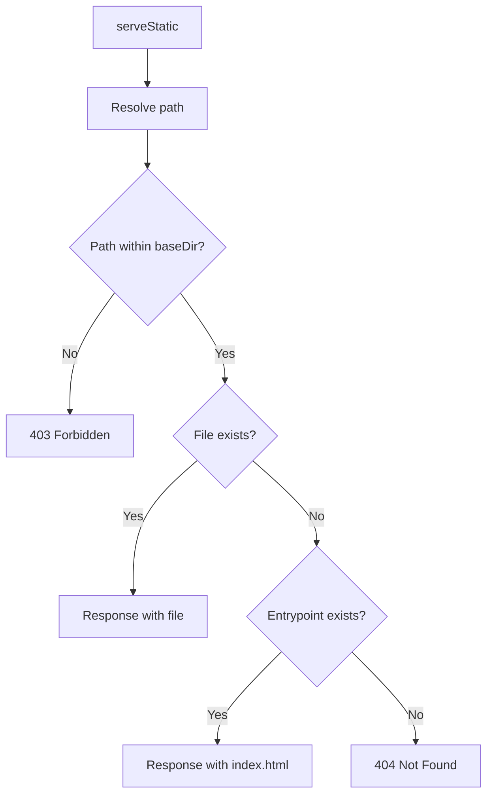
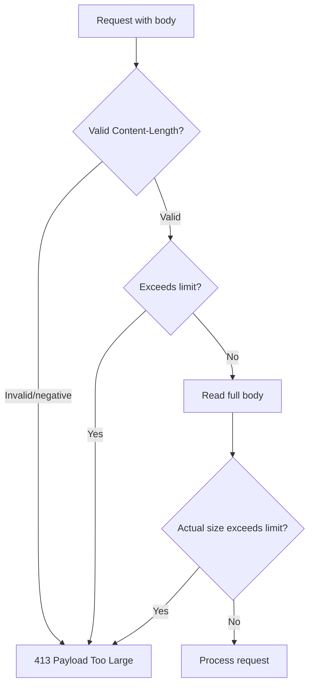

# Request Handling

The runtime provides utilities for request manipulation, static file serving, and entrypoint detection.

## Request Utilities

### cloneRequestBody

Clones a request body with size limiting for DoS attack prevention.

```typescript
import { cloneRequestBody, BodyTooLargeError } from "@/utils/request";

try {
  const body = await cloneRequestBody(req, maxSizeBytes);
  // body: ArrayBuffer | null
} catch (error) {
  if (error instanceof BodyTooLargeError) {
    return new Response("Payload Too Large", { status: 413 });
  }
}
```

Behavior:

| Scenario | Action |
|----------|--------|
| Request without body | Returns `null` |
| Invalid or negative `Content-Length` | Throws `BodyTooLargeError` |
| `Content-Length` exceeds limit | Throws `BodyTooLargeError` (fast path) |
| Body exceeds limit (chunked encoding) | Reads full body, checks size, throws if exceeds |

### rewriteUrl

Removes base path from URL while preserving query string.

```typescript
import { rewriteUrl } from "@/utils/request";

const url = new URL("http://localhost:8000/keyval/api/keys?prefix=user");
const rewritten = rewriteUrl(url, "/keyval/api");
// rewritten.pathname = "/keys"
// rewritten.search = "?prefix=user"
```

Special cases:

| Scenario | Input | Result |
|----------|-------|--------|
| Empty basePath | `rewriteUrl(url, "")` | Returns original pathname |
| pathname equals basePath | `rewriteUrl("/keyval/api", "/keyval/api")` | Returns `"/"` |
| pathname doesn't start with basePath | `rewriteUrl("/other/path", "/keyval/api")` | Undefined behavior (slice produces incorrect result) |

> [!WARNING]
> The function assumes the pathname starts with the provided basePath. If this condition is not met, slice will produce unexpected results. Validate the prefix before calling this function.

### createWorkerRequest

Creates a new request for a worker with appropriate headers.

```typescript
import { createWorkerRequest } from "@/utils/request";

const workerReq = createWorkerRequest({
  originalRequest: req,
  targetPath: "/api/users",
  base: "/my-app",
  notFound: false,              // optional
});

// Injected headers:
// x-base: /my-app
// x-not-found: true (if notFound = true)
```

## Static File Serving

The `serveStatic` utility serves static files with fallback for SPA routing.

```typescript
import { serveStatic } from "@/utils/serve-static";

const response = await serveStatic(
  "/apps/my-app/public/index.html",  // entrypoint
  "/assets/style.css"                 // relative pathname
);
```

Behavior:



Path traversal protection:

```typescript
// Attacker attempts: /../../etc/passwd
const resolved = resolve(baseDir, "../../etc/passwd");
// resolved = "/etc/passwd"

// Validation: resolved.startsWith(baseDir)?
// "/etc/passwd".startsWith("/apps/my-app") = false
// -> 403 Forbidden
```

## Entrypoint Detection

The `getEntrypoint` function detects the entry file for a worker application.

### Priority Order

1. Entrypoint configured in `manifest.yaml`
2. Auto-discovery: `index.html` -> `index.ts` -> `index.js` -> `index.mjs`

```typescript
import { getEntrypoint } from "@/utils/get-entrypoint";

const { path, static: isStatic } = await getEntrypoint(appDir, configEntry);
// path: "index.html" | "index.ts" | ...
// static: true (HTML) | false (JS/TS)
```

Parameters:

| Parameter | Type | Description |
|-----------|------|-------------|
| `appDir` | `string` | Application root directory (absolute path) |
| `entry` | `string` (optional) | Path relative to `appDir`. If provided, function uses `join(appDir, entry)` to resolve full path. If omitted, executes auto-discovery. |

### Entrypoint Types

| Type | static | Behavior |
|------|--------|----------|
| `index.html` | `true` | Served via `serveStatic`, SPA routing |
| `index.ts/js/mjs` | `false` | Loaded as worker, executes `fetch()` |

### Configuration Example

```yaml
# manifest.yaml
entrypoint: server/index.ts  # Override auto-discovery
```

If not configured, the runtime auto-detects:

```
my-app/
  index.html    <- Detected (priority 1)
  index.ts      <- Ignored if index.html exists

other-app/
  index.ts      <- Detected (priority 2)
  server.ts     <- Ignored
```

## Body Size Limits

The runtime applies body size limits on request bodies to prevent denial of service attacks.

### Global Configuration

Body size limits are configured via environment variables:

```bash
# .env
BODY_SIZE_DEFAULT=10mb   # Default limit applied to workers without config
BODY_SIZE_MAX=100mb      # Maximum ceiling allowed
```

Default values:

| Property | Default Value | Description |
|----------|---------------|-------------|
| `default` | 10MB (10485760 bytes) | Limit applied when worker doesn't specify |
| `max` | 100MB (104857600 bytes) | Maximum ceiling that cannot be exceeded |

### Per-Worker Configuration

Workers can define their own body limit via `maxBodySize` in the app's `manifest.yaml`:

```yaml
# apps/my-app/manifest.yaml
maxBodySize: 50mb  # Specific limit for this worker
```

The value is validated against the global `max`:

- If `maxBodySize` > `max`: warning and uses `max` value
- If `maxBodySize` not defined: uses global `default`
- Supports string format ("10mb", "1gb") or number (bytes)

### Validation Flow



### Error Response

```http
HTTP/1.1 413 Payload Too Large
x-request-id: 550e8400-e29b-41d4-a716-446655440000

Payload Too Large
```

The response includes the `x-request-id` header for log correlation.
