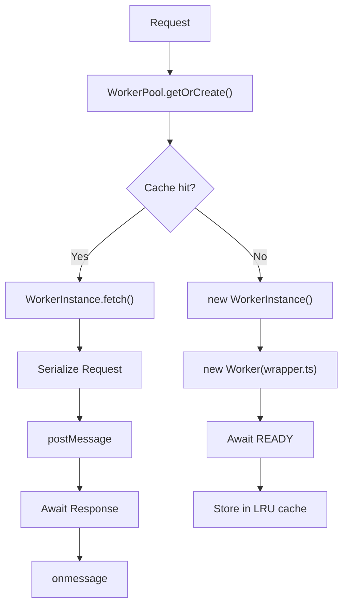
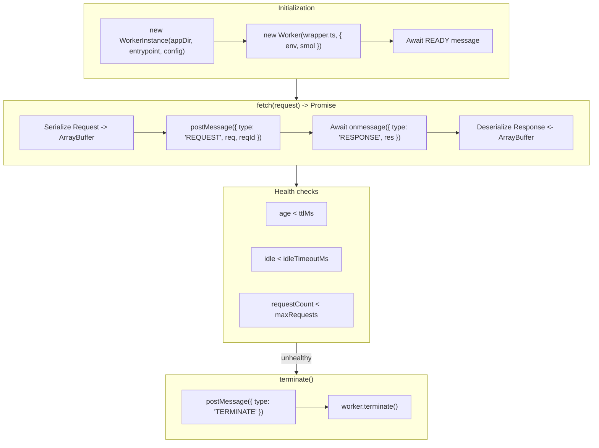
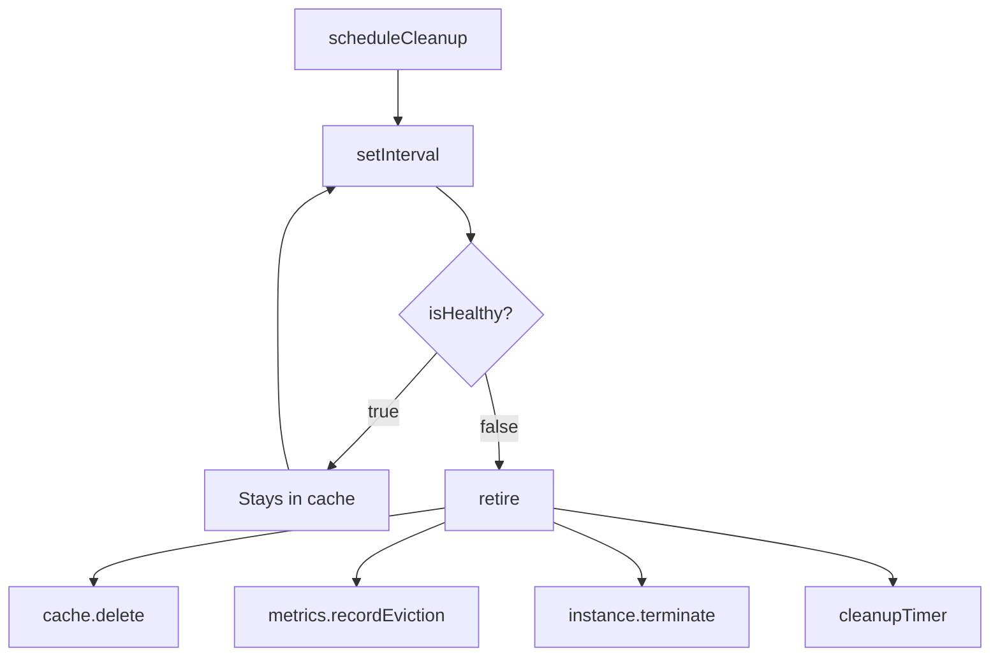

# Worker Pool

The Worker Pool is the core of the Buntime runtime, managing the lifecycle of Bun workers that execute isolated applications.

## Architecture

```
src/libs/pool/
├── pool.ts          # WorkerPool - LRU cache management
├── instance.ts      # WorkerInstance - lifecycle and IPC
├── wrapper.ts       # Code executed inside the worker thread
├── config.ts        # Configuration loading and validation
├── metrics.ts       # Pool metrics collection
├── stats.ts         # Utility functions for metrics calculations
└── types.ts         # IPC message types and apps
```

## Execution Flow



# WorkerPool

Main class that manages the worker cache.

## Responsibilities

- Manage LRU cache of `WorkerInstance`s
- Control lifecycle (creation, eviction, cleanup)
- Collect pool metrics (hit rate, latency, active workers)
- Apply TTL and max requests policies

## Configuration

```typescript
interface PoolConfig {
  maxSize: number;  // Maximum number of workers in cache
}
```

The pool uses `QuickLRU` for cache with automatic eviction:

```typescript
const pool = new WorkerPool({ maxSize: 50 });

// Usage via public fetch() method
const response = await pool.fetch(appDir, config, req);

// Internally, pool.fetch() calls getOrCreate() (private method)
// which manages the worker cache
```

## Worker Collision Detection

The pool prevents the same app key from being registered from different directories. This can happen when:

- The same app exists in multiple `workerDirs`
- Different apps have the same `name@version` combination

When a collision is detected, the pool throws an error:

```
Worker collision: "my-app@1.0.0" already registered from "/apps/my-app/v1", cannot register from "/other/my-app/v1"
```

**Resolution:**
- Ensure each app has a unique `name@version` combination
- Remove duplicate apps from `workerDirs`
- Use different versions for apps with the same name

## Cache Strategy

The pool implements LRU cache with time-based policies:

| Policy | Behavior |
|--------|----------|
| `ttl = 0` | Worker is discarded after each request (stateless) |
| `ttl > 0` | Worker remains in cache until TTL expires |
| Cache hit | Existing healthy worker is reused |
| Cache miss | New worker is created and stored in cache |
| Eviction | Oldest worker is terminated when cache is full |

## Lifecycle Management

```typescript
// Request processing (public method)
const response = await pool.fetch(appDir, config, req);

// Internally, getOrCreate() (private) manages the cache:
// - Cache hit: returns existing worker
// - Cache miss: creates new WorkerInstance

// Periodic health check (internal)
setInterval(() => {
  if (!instance.isHealthy()) pool.retire(key);
}, ttlMs / 2);

// Automatic eviction (internal)
cache.onEviction = (key, instance) => {
  metrics.recordEviction();
  instance.terminate();
  cleanupTimer(key);
};

// Graceful shutdown
pool.shutdown();  // Terminates all workers
```

# WorkerInstance

Represents an individual Bun worker running an application.

## Responsibilities

- Spawn worker thread via `new Worker(wrapper.ts)`
- Manage IPC communication (postMessage/onmessage)
- Implement timeout and health checks
- Serialize Request/Response between threads

## Lifecycle



## States

| State | Condition |
|-------|-----------|
| `active` | Last request was less than `idleTimeoutMs` ago |
| `idle` | Last request was more than `idleTimeoutMs` ago |
| `ephemeral` | Worker in TTL=0 mode (stateless, created and destroyed per request) |
| `offline` | Worker unavailable (terminated or with critical failure) |

## IPC Protocol

Communication between main thread and worker uses structured messages:

```typescript
// Main -> Worker
type WorkerMessage =
  | { type: "REQUEST"; reqId: string; req: SerializedRequest }
  | { type: "IDLE" }
  | { type: "TERMINATE" };

// Worker -> Main
type WorkerResponse =
  | { type: "READY" }
  | { type: "RESPONSE"; reqId: string; res: SerializedResponse }
  | { type: "ERROR"; reqId: string; error: string; stack?: string };
```

## Request Flow

```typescript
// 1. Serialization (main thread)
const body = await req.arrayBuffer();
const message = {
  type: "REQUEST",
  reqId: crypto.randomUUID(),
  req: {
    body,
    headers: Object.fromEntries(req.headers.entries()),
    method: req.method,
    url: req.url,
  },
};

// 2. Transfer (zero-copy via transferList)
worker.postMessage(message, [body]);

// 3. Processing (worker thread)
const request = new Request(req.url, req);
const response = await app.fetch(request);

// 4. Response (worker -> main)
const resBody = await response.arrayBuffer();
self.postMessage({ type: "RESPONSE", reqId, res: { body: resBody, ... } }, [resBody]);
```

## Timeout Handling

Each request has a configurable timeout:

```typescript
const timeout = setTimeout(() => {
  reject(new Error(`Worker timeout after ${timeoutMs}ms`));
  if (ttlMs === 0) this.terminate();  // Stateless workers are discarded
}, timeoutMs);

worker.addEventListener("message", (data) => {
  clearTimeout(timeout);
  resolve(data.res);
});
```

# Wrapper

Code executed inside the worker thread. Responsible for loading the application and processing requests.

## Responsibilities

- Load application entrypoint (`import(ENTRYPOINT)`)
- Validate exports (`fetch` or `routes`)
- Process IPC messages
- Execute auto-install if configured
- Inject `<base href>` in HTML for SPAs

## Initialization

```typescript
// 1. Parse env vars
const { APP_DIR, ENTRYPOINT, WORKER_CONFIG } = Bun.env;
const config: WorkerConfig = JSON.parse(WORKER_CONFIG);

// 2. Auto-install (optional)
if (config.autoInstall) {
  Bun.spawnSync(["bun", "install", "--frozen-lockfile", "--ignore-scripts"], { cwd: APP_DIR });
}

// 3. Import application
const app: WorkerApp = (await import(ENTRYPOINT)).default;

// 4. Validation
if (!app || (typeof app.fetch !== "function" && !app.routes)) {
  throw new Error("Module must export default with fetch method or routes");
}

// 5. Notify main thread
self.postMessage({ type: "READY" });
```

## Application Types

The wrapper supports three application formats:

### Fetch-based (Hono, Express, etc.)

```typescript
// app.ts
export default {
  fetch(req: Request) {
    return new Response("Hello");
  },
};
```

### Routes-based (Declarative)

```typescript
// app.ts
export default {
  routes: {
    "/": new Response("Home"),
    "/api/users": (req) => fetch("https://api.example.com/users"),
    "/api/posts/:id": {
      GET: (req) => new Response(`Post ${req.params.id}`),
      DELETE: (req) => new Response("Deleted", { status: 204 }),
    },
  },
};
```

The wrapper converts `routes` to Hono internally:

```typescript
const srv = new Hono();

for (const [path, value] of Object.entries(app.routes)) {
  if (value instanceof Response) {
    srv.all(path, () => value);
  } else if (typeof value === "function") {
    srv.all(path, (c) => value(c.req.raw));
  } else if (typeof value === "object") {
    for (const [method, fn] of Object.entries(value)) {
      srv.on(method, path, (c) => fn(c.req.raw));
    }
  }
}
```

### Blob/BunFile

Routes can also accept `Blob` values (including `BunFile`):

```typescript
// app.ts
export default {
  routes: {
    "/": new Response("Home"),
    "/file": Bun.file("./public/index.html"), // BunFile (extends Blob)
    "/image": new Blob([imageData], { type: "image/png" }),
    "/api/users": (req) => fetch("https://api.example.com/users"),
  },
};
```

### SPA (HTML entrypoint)

```yaml
# manifest.yaml
entrypoint: index.html
```

HTML files are served via `serveStatic` with `<base href>` injection.

## Base Path Injection

For SPAs under subpaths (e.g., `/cpanel`), the wrapper injects `<base href>`:

```typescript
// 1. Main thread adds header
req.headers.set("x-base", "/cpanel");

// 2. Worker detects HTML + header
const isHtml = headers["content-type"]?.includes("text/html");
const base = req.headers["x-base"];

if (isHtml && base) {
  const html = text.replace("<head>", `<head><base href="${base}/" />`);
  body = new TextEncoder().encode(html).buffer;
}
```

This allows the SPA router to work correctly:

```typescript
// client/index.tsx
const baseElement = document.querySelector("base");
const basepath = baseElement?.getAttribute("href")?.slice(0, -1) || "";

const router = createRouter({ basepath });
```

## Lifecycle Hooks

Applications can implement optional hooks:

```typescript
export default {
  fetch(req: Request) { ... },

  onIdle() {
    // Called when worker becomes idle (idleTimeoutMs)
    console.log("Worker idle, can do cleanup");
  },

  onTerminate() {
    // Called before worker.terminate()
    console.log("Worker terminating, closing connections");
  },
};
```

# Security

The runtime implements several security layers to protect against attacks and data leakage.

## Environment Variable Filtering

Sensitive variables are automatically blocked when passing `env` to workers via `manifest.yaml`. Filtered patterns:

| Pattern | Example |
|---------|---------|
| `^(DATABASE\|DB)_` | `DATABASE_URL`, `DB_HOST` |
| `^(API\|AUTH\|SECRET\|PRIVATE)_?KEY` | `API_KEY`, `AUTH_KEY`, `SECRET_KEY`, `PRIVATE_KEY` |
| `_TOKEN$` | `ACCESS_TOKEN`, `REFRESH_TOKEN` |
| `_SECRET$` | `JWT_SECRET`, `APP_SECRET` |
| `_PASSWORD$` | `DB_PASSWORD`, `ADMIN_PASSWORD` |
| `^AWS_` | `AWS_ACCESS_KEY_ID`, `AWS_SECRET_ACCESS_KEY` |
| `^GITHUB_` | `GITHUB_TOKEN`, `GITHUB_SECRET` |
| `^OPENAI_` | `OPENAI_API_KEY` |
| `^ANTHROPIC_` | `ANTHROPIC_API_KEY` |
| `^STRIPE_` | `STRIPE_SECRET_KEY` |

When sensitive variables are blocked, a warning is logged on the server with the list of filtered keys.

## Header Limits

To prevent memory exhaustion from malicious headers, the wrapper applies limits:

| Limit | Value | Description |
|-------|-------|-------------|
| `MAX_COUNT` | 100 | Maximum number of headers per response |
| `MAX_TOTAL_SIZE` | 64KB | Maximum total size of all headers |
| `MAX_VALUE_SIZE` | 8KB | Maximum size per header value |

Headers exceeding these limits are truncated or ignored.

## Entrypoint Path Validation

The wrapper validates that the entrypoint doesn't escape the application directory:

```typescript
const resolvedEntry = resolve(APP_DIR, ENTRYPOINT);
if (!resolvedEntry.startsWith(APP_DIR)) {
  throw new Error(`Security: Entrypoint "${ENTRYPOINT}" escapes app directory`);
}
```

This prevents path traversal attacks like `../../etc/passwd`.

## HTML Escape on Base Injection

The `<base href>` injection in HTML responses uses escaping to prevent XSS:

```typescript
function escapeHtml(value: string): string {
  return value
    .replace(/&/g, "&amp;")
    .replace(/"/g, "&quot;")
    .replace(/'/g, "&#39;")
    .replace(/</g, "&lt;")
    .replace(/>/g, "&gt;")
    .replace(/\\/g, "\\\\");
}

const baseHref = escapeHtml(base === "/" ? "/" : `${base}/`);
const injection = `<base href="${baseHref}" />`;
```

## Secure Auto-Install

When `autoInstall: true` is configured, the command uses security flags:

```typescript
Bun.spawnSync(["bun", "install", "--frozen-lockfile", "--ignore-scripts"], {
  cwd: APP_DIR,
});
```

| Flag | Purpose |
|------|---------|
| `--frozen-lockfile` | Prevents lockfile modification (ensures reproducibility) |
| `--ignore-scripts` | Doesn't execute postinstall scripts from packages (prevents malicious code execution) |

# Statistics Utilities

Helper functions in `stats.ts` for metrics calculations:

## roundTwoDecimals

Rounds a number to 2 decimal places. Used for metrics display.

```typescript
function roundTwoDecimals(value: number): number {
  return Math.round(value * 100) / 100;
}

roundTwoDecimals(3.14159);  // 3.14
roundTwoDecimals(10.005);   // 10.01
```

## computeAvgResponseTime

Calculates average response time with division-by-zero protection.

```typescript
function computeAvgResponseTime(totalMs: number, count: number): number {
  if (count <= 0) return 0;
  return roundTwoDecimals(totalMs / count);
}

computeAvgResponseTime(1500, 10);  // 150
computeAvgResponseTime(0, 0);      // 0 (no error)
```

# Configuration

Workers are configured via `manifest.yaml` in the application directory.

## Schema

```typescript
interface WorkerConfigFile {
  // Execute bun install before loading app
  autoInstall?: boolean;  // default: false

  // Entry file relative to appDir
  entrypoint?: string;  // default: auto-detect (index.ts, index.html)

  // Environment variables specific to the worker
  env?: Record<string, string>;

  // Timeout after idle period
  idleTimeout?: number | string;  // default: 60 (seconds)

  // Low-memory mode (Bun smol)
  lowMemory?: boolean;  // default: false

  // Body size limit (format: "10mb", "1gb" or bytes)
  maxBodySize?: number | string;  // default: 10MB (global default)

  // Maximum requests before recycling worker
  maxRequests?: number;  // default: 1000

  // Public routes (no authentication)
  publicRoutes?: string[] | Record<HTTPMethod, string[]>;

  // Timeout per request
  timeout?: number | string;  // default: 30 (seconds)

  // Worker time to live in cache
  ttl?: number | string;  // default: 0 (stateless)
}
```

## Duration Format

Time values accept number (seconds) or string:

```typescript
{
  "timeout": 30,       // 30 seconds
  "timeout": "30s",    // 30 seconds
  "timeout": "500ms",  // 500 milliseconds
  "timeout": "5m",     // 5 minutes
  "timeout": "1h",     // 1 hour
  "timeout": "2d",     // 2 days
  "timeout": "1w",     // 1 week
  "timeout": "1y",     // 1 year
  "ttl": "10m",
  "idleTimeout": "2m"
}
```

Supported formats: `ms`, `s`, `m`, `h`, `d`, `w`, `y`

## Complete Example

```yaml
# apps/todos-kv/v1/manifest.yaml
entrypoint: index.ts
timeout: 30s
ttl: 5m
idleTimeout: 2m
maxRequests: 500
autoInstall: true
lowMemory: false
publicRoutes:
  GET:
    - /health
    - /metrics
  POST:
    - /api/webhooks/:id
```

# Metrics

The pool collects real-time metrics:

## Pool Metrics

```typescript
interface PoolMetrics {
  activeWorkers: number;          // Active workers in cache
  avgResponseTimeMs: number;      // Average latency (last 100 requests)
  evictions: number;              // Total evictions
  hitRate: number;                // % cache hits
  hits: number;                   // Total cache hits
  memoryUsageMB: number;          // Heap memory used
  misses: number;                 // Total cache misses
  requestsPerSecond: number;      // Request rate
  totalRequests: number;          // Total requests processed
  totalWorkersFailed: number;     // Total workers that failed
  totalWorkersCreated: number;    // Total workers created
  totalWorkersRetired: number;    // Total workers retired (terminated)
  uptimeMs: number;               // Pool uptime
}
```

## Implementation

`WorkerMetrics` uses a circular buffer for latencies:

```typescript
// Circular buffer - O(1) instead of O(n) shift
private requestTimes = new Float64Array(100);
private requestTimesIndex = 0;

recordRequest(durationMs: number) {
  this.requestTimes[this.requestTimesIndex] = durationMs;
  this.requestTimesIndex = (this.requestTimesIndex + 1) % 100;
}
```

## Worker Stats

Each `WorkerInstance` exposes individual statistics:

```typescript
worker.getStats()
// {
//   ageMs: 120000,             // ms since creation
//   avgResponseTimeMs: 15.5,   // average response time in ms
//   errorCount: 2,             // total errors
//   idleMs: 5000,              // ms since last request
//   requestCount: 42,          // requests processed
//   status: "active",          // "active" | "idle" | "ephemeral" | "offline"
//   totalResponseTimeMs: 651,  // accumulated total response time
// }
```

# Dynamic Spawning

The pool creates workers on demand:

## Cache Hit (Worker Reused)

```typescript
// Request for app already in cache
const response = await pool.fetch("/apps/todos-kv/v1", config, req);
// Internally (private getOrCreate):
// - Cache hit - existing worker returned
// - metrics.recordHit()
// - worker.touch() - updates lastUsedAt
```

## Cache Miss (Worker Created)

```typescript
// Request for new or evicted app
const response = await pool.fetch("/apps/todos-kv/v2", config, req);
// Internally (private getOrCreate):
// - Cache miss
// - metrics.recordMiss()
// - metrics.recordWorkerCreated()
// - new WorkerInstance(appDir, entry, config)
// - cache.set(key, instance)
```

## Eviction (Worker Removed)

```typescript
// Cache full (maxSize reached)
cache.onEviction = (key, instance) => {
  metrics.recordEviction();
  instance.terminate();        // Sends TERMINATE + worker.terminate()
  cleanupTimer(key);           // Removes health check timer
};
```

## Health Checks

The pool performs periodic health checks on each worker. A worker is considered healthy when all conditions are met:

### Health Criteria

| Criterion | Condition | Description |
|-----------|-----------|-------------|
| Age | `ageMs < ttlMs` | Worker hasn't exceeded configured time to live |
| Inactivity | `idleMs < idleTimeoutMs` | Worker hasn't been idle too long |
| Requests | `requestCount < maxRequests` | Worker hasn't reached request limit |
| Critical Errors | `hasCriticalError === false` | Worker hasn't had critical initialization or execution failures |

A worker fails the health check (is considered unhealthy) if any of these conditions is false.

### Check Interval

The interval between checks is calculated as half the smallest configured timeout:

```typescript
interval = Math.min(config.idleTimeoutMs, config.ttlMs) / 2
```

This ensures unhealthy workers are detected before they completely expire. For example:

| `idleTimeoutMs` | `ttlMs` | Health Check Interval |
|-----------------|---------|----------------------|
| 120,000 (2m) | 300,000 (5m) | 60,000 (1m) |
| 60,000 (1m) | 600,000 (10m) | 30,000 (30s) |
| 30,000 (30s) | 30,000 (30s) | 15,000 (15s) |

### Implementation

```typescript
// 1. Scheduling (after worker creation)
scheduleCleanup(key, instance, config) {
  const interval = Math.min(config.idleTimeoutMs, config.ttlMs) / 2;

  const timer = setInterval(() => {
    if (!instance.isHealthy()) {
      this.retire(key);  // Remove from cache and terminate
    }
  }, interval);

  this.cleanupTimers.set(key, timer);
}

// 2. Health check (called at each interval)
isHealthy(): boolean {
  // Critical errors make worker permanently unhealthy
  if (this.hasCriticalError) return false;

  const { ageMs, idleMs } = this.getStats();

  return (
    ageMs < this.config.ttlMs &&
    idleMs < this.config.idleTimeoutMs &&
    this.requestCount < this.config.maxRequests
  );
}
```

### Health Check Flow



### Critical Errors

Critical errors mark the worker as permanently unhealthy, ensuring it's removed on the next health check:

- Timeout during initialization (READY not received in 30s)
- Entrypoint import error (syntax error, module not found)
- Unhandled error in worker thread during request

# Isolation

Each worker runs in an isolated thread with:

## Memory Isolation

- Separate heap per worker
- `smol` mode available (low-memory)
- Independent garbage collection

## Environment Isolation

```typescript
new Worker(WORKER_PATH, {
  env: {
    ...Bun.env,           // Runtime env vars
    ...config.env,        // App-specific env vars
    APP_DIR: appDir,
    ENTRYPOINT: entry,
    WORKER_CONFIG: JSON.stringify(config),
    WORKER_ID: this.id,
  },
  smol: config.lowMemory,
});
```

## Module Isolation

- Each worker imports modules independently
- Module cache per worker
- Different versions of the same app don't conflict

# Best Practices

## DO

- Use `ttl > 0` for apps with state (DB connections, caches)
- Configure `maxRequests` to avoid memory leaks
- Use `idleTimeout` to free resources
- Configure appropriate `timeout` for long operations
- Use `publicRoutes` for endpoints without authentication

```yaml
ttl: 10m           # Cache worker for 10 minutes
maxRequests: 1000  # Recycle after 1000 requests
idleTimeout: 2m    # Terminate if idle for 2 minutes
timeout: 30s       # 30s timeout per request
```

## DON'T

- Don't use `ttl = 0` for apps with expensive warm-up
- Don't configure `timeout` too low for slow operations
- Don't use `autoInstall` in production (pre-install dependencies)
- Don't store global state in worker (may be recycled)

```typescript
// WRONG - global state may be lost
let cache = new Map();

export default {
  fetch(req) {
    cache.set(key, value);  // Lost when worker is recycled
  }
};

// CORRECT - use external storage
import { kv } from "@buntime/keyval";

export default {
  async fetch(req) {
    await kv.set(key, value);  // Persisted externally
  }
};
```

## Monitoring

Use metrics for tuning:

```typescript
const metrics = pool.getMetrics();

// Low hit rate? Increase maxSize or ttl
if (metrics.hitRate < 0.5) {
  pool = new WorkerPool({ maxSize: 100 });
}

// High latency? Check individual workers
const workerStats = pool.getWorkerStats();
for (const [key, stats] of Object.entries(workerStats)) {
  if (stats.requestCount > config.maxRequests) {
    console.warn(`Worker ${key} near limit`);
  }
}
```
