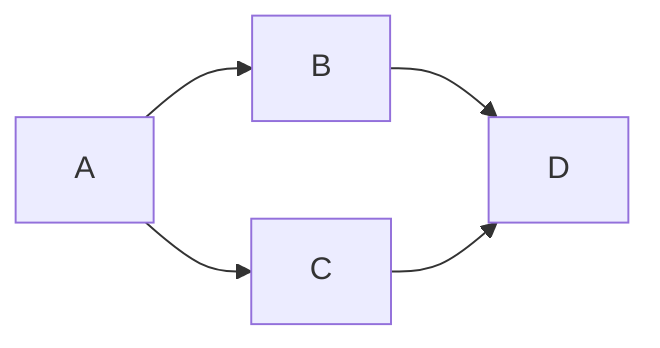
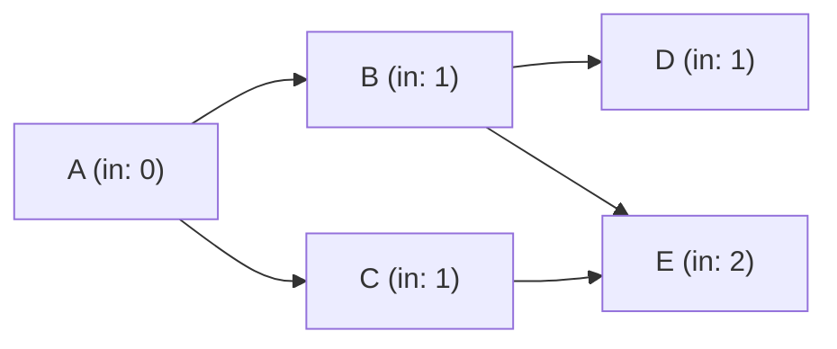
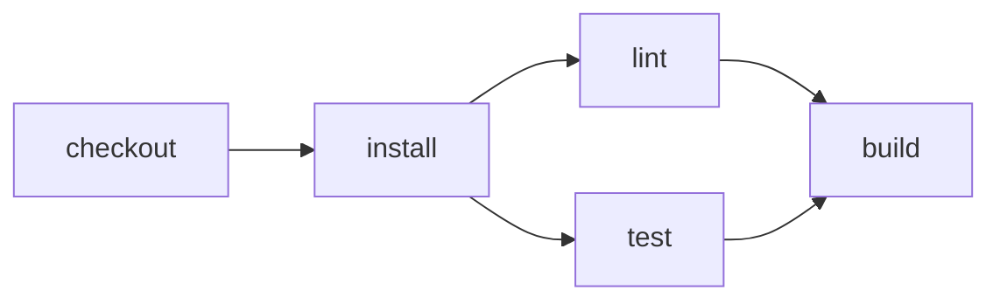

# Topological Sort

Imagine you need to get dressed in the morning. You can't put on shoes before socks, or a shirt before an undershirt. There's a natural order that must be respected.

This is exactly the problem that topological sorting solves: given a set of tasks with dependencies between them, find a valid execution order where each task only starts after its dependencies are complete.

Kahn's Algorithm is one of the most elegant and efficient solutions to this problem, and is used by Buntime to order plugins by dependencies.

## History and Origin

The algorithm was published in 1962 by Arthur B. Kahn in the paper *"Topological sorting of large networks"* in Communications of the ACM.

Kahn worked with scheduling problems in activity networks, common in project management (like PERT diagrams). He needed an efficient method to order thousands of activities while respecting their precedences.

Kahn's contribution was proposing an algorithm that:

- Operates in linear time O(V + E), where V = vertices and E = edges
- Automatically detects cycles
- Is intuitive and easy to implement
- Works well with both sparse and dense graphs

## Theoretical Foundations

### Directed Acyclic Graphs (DAG)

Topological sorting is only possible on DAGs (Directed Acyclic Graphs):

- **Directed**: edges have direction (A -> B means A precedes B)
- **Acyclic**: there are no cycles (if you leave A following edges, you never return to A)



### In-Degree

The central concept of the algorithm is the in-degree of each vertex: how many edges point to it.



Vertices with in-degree zero have no dependencies and can be processed immediately.

## The Algorithm

### Core Idea

The intuition is simple:

1. Find all vertices without dependencies (in-degree = 0)
2. Process them and "remove them" from the graph
3. This may free new vertices (whose in-degree is now 0)
4. Repeat until all vertices are processed
5. If unprocessed vertices remain, there's a cycle

### Implementation

```python
from collections import deque

def kahn(graph: dict[str, list[str]]) -> list[str]:
    # Calculate in-degree of each vertex
    in_degree = {v: 0 for v in graph}
    for neighbors in graph.values():
        for neighbor in neighbors:
            in_degree[neighbor] += 1

    # Initialize queue with vertices without dependencies
    queue = deque(v for v in graph if in_degree[v] == 0)

    # Process vertices
    result = []
    while queue:
        v = queue.popleft()
        result.append(v)
        for neighbor in graph[v]:
            in_degree[neighbor] -= 1
            if in_degree[neighbor] == 0:
                queue.append(neighbor)

    # Check for cycles
    if len(result) != len(graph):
        raise ValueError("Cycle detected!")

    return result
```

### Step-by-Step Execution

Consider a CI/CD pipeline:



**State 1: Initial**

checkout has in-degree 0, enters the queue.

**State 2: After processing checkout and install**

lint and test enter the queue (in-degree 0).

**State 3: Final**

All processed in order: checkout -> install -> lint -> test -> build

### Cycle Detection

If at the end of the algorithm `len(result) < len(graph)`, it means some vertices never had in-degree 0. This only happens when there's a cycle.

## Complexity

### Time: O(V + E)

The algorithm is linear - it visits each vertex and each edge exactly once:

- Calculate in-degrees: O(E) - traverses all edges
- Initialize queue: O(V) - checks all vertices
- Main loop: O(V + E) - each vertex and edge processed once

### Space: O(V)

- In-degree dictionary: O(V)
- Queue: O(V) in worst case
- Result list: O(V)

## Usage in Buntime

Buntime's plugin system uses topological sorting to ensure plugins are loaded in the correct order.

Dependencies are declared in `manifest.yaml`:

```yaml
# plugins/plugin-keyval/manifest.yaml
name: "@buntime/plugin-keyval"
base: "/keyval"
dependencies:
  - "@buntime/plugin-database"
```

```yaml
# plugins/plugin-authn/manifest.yaml
name: "@buntime/plugin-authn"
base: "/authn"
dependencies:
  - "@buntime/plugin-database"
```

```yaml
# plugins/plugin-database/manifest.yaml
name: "@buntime/plugin-database"
base: "/database"
# no dependencies
```

The discovery order in directories doesn't matter. The runtime automatically reorders:

```
Loading order (after sort):
1. @buntime/plugin-database
2. @buntime/plugin-keyval
3. @buntime/plugin-authn
```

## Use Cases

### Package Managers

npm, yarn, pip, cargo - all use topological sorting to install dependencies in the correct order.

### Build Systems

Make, Webpack, Gradle, Bazel - compile modules in the correct order based on dependencies.

### Task Scheduling

Workflow systems like Apache Airflow, Prefect, Dagster use DAGs to define data pipelines.

### Compilers

Compilers order optimization passes and semantic analysis respecting dependencies between phases.

### Spreadsheets

Excel and Google Sheets recalculate cells in the correct order when there are interdependent formulas.

### Database Migrations

Tools like Flyway, Liquibase, Prisma apply migrations in order.

## Alternative Algorithm: DFS

There's another approach using depth-first search (DFS):

```python
def topological_sort_dfs(graph: dict[str, list[str]]) -> list[str]:
    visited = set()
    recursion_stack = set()
    result = []

    def dfs(node):
        if node in recursion_stack:
            raise ValueError("Cycle detected!")
        if node in visited:
            return

        recursion_stack.add(node)
        for neighbor in graph.get(node, []):
            dfs(neighbor)

        recursion_stack.remove(node)
        visited.add(node)
        result.append(node)

    for node in graph:
        dfs(node)

    return result[::-1]  # reverse the result
```

### Kahn vs DFS

| Aspect | Kahn | DFS |
|--------|------|-----|
| Complexity | O(V + E) | O(V + E) |
| Structure | Iterative (queue) | Recursive (stack) |
| Cycle detection | At end (counting) | During (recursion_stack) |
| Result order | Natural (start -> end) | Reversed (needs reversal) |
| Parallelization | Easy (nodes in queue are independent) | Hard (recursion is sequential) |
| Memory | O(V) for queue | O(V) for call stack |

### When to use each?

**Use Kahn when:**

- Need to execute tasks in parallel (nodes in queue are independent)
- Want to process in "levels" or "waves" (e.g., build systems)
- Prefer iterative code (no stack overflow risk)
- Need to know which tasks can run simultaneously

**Use DFS when:**

- Want to detect cycles immediately (fail fast)
- Already have a DFS structure in code (e.g., exploring a graph)
- Graph is very deep and narrow (less queue overhead)
- Need conceptual simplicity (just one recursive function)

In practice, Kahn is preferred for build systems, CI/CD, and task runners because it allows natural parallelization. DFS is common in compilers and dependency analysis where graph traversal is already used.

## Extensions and Variations

### Lexicographic Topological Sort

When multiple orders are valid, choose the lexicographically smallest.

Solution: use priority queue (min-heap) instead of simple queue.

### All Topological Orderings

Find all possible valid orders (useful for tests).

Solution: backtracking with all in-degree 0 vertices at each step.

### Topological Sort in Dynamic Graphs

When edges are frequently added/removed, recalculating from scratch is inefficient.

Solutions:

- Incremental algorithms (update only the affected part)
- Specialized data structures (link-cut trees)

### Parallelization

Vertices in Kahn's queue are independent and can be processed in parallel:

```python
import asyncio

async def kahn_parallel(graph, process):
    in_degree = {v: 0 for v in graph}
    for neighbors in graph.values():
        for n in neighbors:
            in_degree[n] += 1

    queue = [v for v in graph if in_degree[v] == 0]
    result = []

    while queue:
        batch = queue[:]
        queue.clear()

        # Process batch in parallel
        await asyncio.gather(*[process(node) for node in batch])

        for node in batch:
            for dependent in graph[node]:
                in_degree[dependent] -= 1
                if in_degree[dependent] == 0:
                    queue.append(dependent)

        result.extend(batch)

    return result
```

## References

- Kahn, A. B. (1962). "Topological sorting of large networks". Communications of the ACM. 5 (11): 558-562.
- Cormen, T. H., et al. "Introduction to Algorithms" (CLRS), Chapter 22: Elementary Graph Algorithms.
- Sedgewick, R. & Wayne, K. "Algorithms, 4th Edition", Section 4.2: Directed Graphs.
