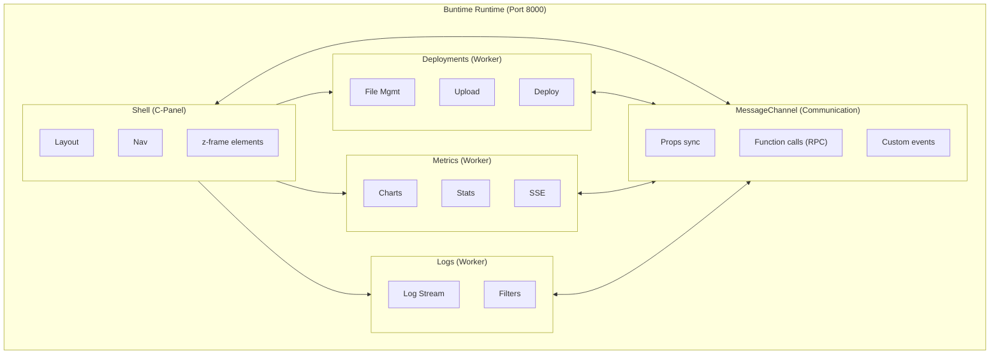
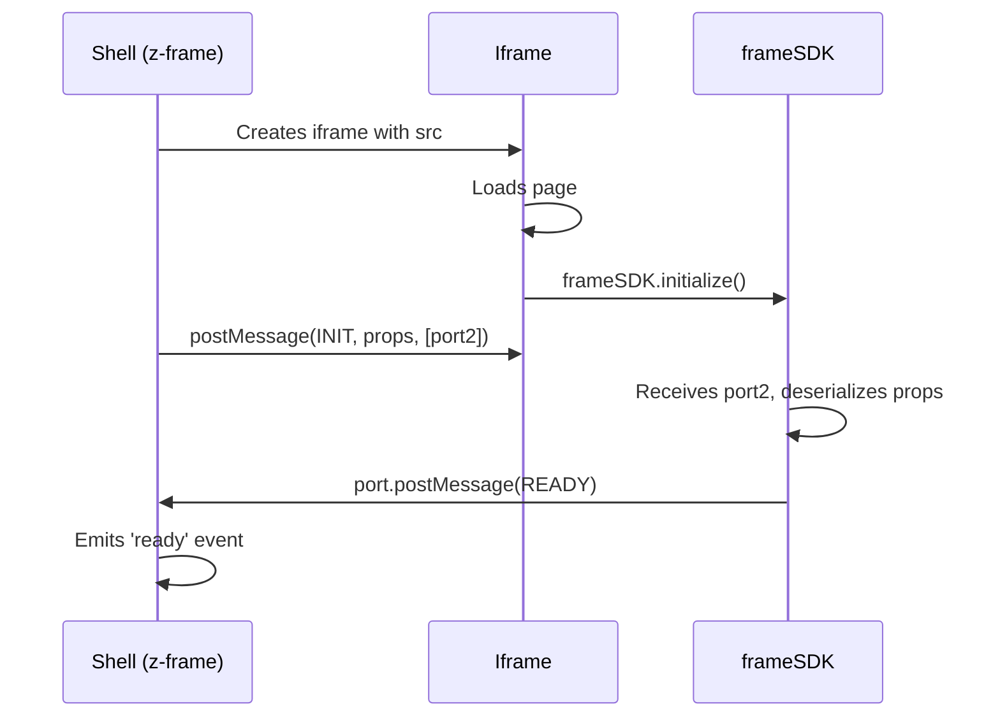

# Micro-Frontend Architecture

## Overview

This document describes the micro-frontend architecture for Buntime plugins, using the `@zomme/frame` package for shell-frame communication via iframes.

### Goals

- **Modularity**: Each plugin can provide its own UI as a separate worker
- **Independence**: Plugin UIs are developed, built, and deployed independently
- **Framework Agnostic**: Plugins can use React, Solid, Qwik, Vue, etc.
- **Security Isolation**: Sandboxed iframes ensure complete isolation
- **Bidirectional Communication**: MessageChannel for efficient shell<->frame communication

### Architecture Diagram



## @zomme/frame

The `@zomme/frame` package provides:

- **`<z-frame>`**: Web component for embedding iframes with bidirectional communication
- **`frameSDK`**: SDK for the app inside the iframe to communicate with the shell
- **Hook `useFrameSDK`**: React hook for SDK integration (implemented locally in each plugin)

### z-frame Web Component

Container that loads an iframe with MessageChannel communication.

```html
<z-frame
  name="deployments"
  base="/deployments"
  src="http://localhost:8000/deployments"
  pathname="/files"
  theme="dark"
></z-frame>
```

#### Attributes

| Attribute | Type | Description |
|-----------|------|-------------|
| `name` | string | Frame identifier name (required) |
| `src` | string | Iframe app URL (required) |
| `base` | string | Base path for routing (default: `/<name>`) |
| `pathname` | string | Initial path for the frame (default: `/`) |
| `sandbox` | string | Iframe sandbox permissions |

#### JavaScript API

```typescript
const frame = document.querySelector('z-frame');

// Dynamic properties - automatically synchronized
frame.theme = 'dark';
frame.user = currentUser;
frame.apiUrl = 'https://api.example.com';

// Emit events to the frame
frame.emit('route-change', { path: '/settings' });
frame.emit('data-refresh', { force: true });

// Call functions registered by the frame (RPC)
const stats = await frame.getStats();
await frame.refreshData();

// Listen to events from the frame
frame.addEventListener('ready', () => console.log('Frame ready'));
frame.addEventListener('navigate', (e) => router.push(e.detail.path));
```

### frameSDK

SDK for apps inside the iframe to communicate with the shell.

```typescript
import { frameSDK } from '@zomme/frame/sdk';

// Initialize SDK (required before use)
await frameSDK.initialize();

// Access shell props
console.log(frameSDK.props.name);      // 'deployments'
console.log(frameSDK.props.base);      // '/deployments'
console.log(frameSDK.props.theme);     // 'dark'

// Call functions passed by the shell
await frameSDK.props.onSuccess({ status: 'ok' });

// Emit events to the shell
frameSDK.emit('navigate', { path: '/settings' });
frameSDK.emit('task-created', { id: 123 });

// Listen to events from the shell
frameSDK.on('route-change', ({ path }) => {
  router.navigate(path);
});

// Register functions for the shell to call
frameSDK.register('refreshData', async () => {
  await loadData();
});

frameSDK.register({
  getStats: () => ({ count: 42 }),
  export: async (format) => generateExport(format)
});

// Watch for props changes
frameSDK.watch(['theme'], (changes) => {
  if ('theme' in changes) {
    const [newTheme, oldTheme] = changes.theme;
    applyTheme(newTheme);
  }
});
```

### @zomme/frame-react

React bindings to facilitate frameSDK usage.

```tsx
import { useFrameSDK, useRouteSync } from '@zomme/frame-react';
import { frameSDK } from '@zomme/frame/sdk';

function App() {
  // Hook that returns props and initialization state
  const { props, isReady } = useFrameSDK();

  // Synchronize route with shell
  useRouteSync({
    onRouteChange: (path) => router.navigate(path),
    getCurrentPath: () => router.currentPath
  });

  if (!isReady) {
    return <Loading />;
  }

  return (
    <div>
      <h1>Theme: {props.theme}</h1>
      <button onClick={() => frameSDK.emit('navigate', { path: '/' })}>
        Go Home
      </button>
    </div>
  );
}
```

## Plugin UI Registration

### Plugin Interface Extension

**Manifest (manifest.yaml)**:

```yaml
name: "@buntime/plugin-deployments"
base: "/deployments"
entrypoint: dist/client/index.html
menus:
  - title: Deployments
    icon: lucide:cloud-upload
    path: /deployments
```

> [!NOTE]
> The `fragment` field was removed. Plugins with `entrypoint` automatically have UI available.

### Plugin Structure with UI

```
plugins/plugin-deployments/
├── manifest.yaml              # Plugin manifest
├── index.ts                   # Plugin entry (server)
├── server/
│   ├── api.ts                # API routes
│   └── libs/                 # Business logic
├── client/
│   ├── index.tsx             # Client entry
│   ├── index.html            # HTML shell
│   ├── utils/
│   │   └── use-frame-sdk.ts  # Local hook for frameSDK
│   └── components/
└── dist/
    ├── plugin.js             # Built server
    └── client/
        └── index.html        # Built entrypoint
```

### Plugin Client Example

**client/index.tsx:**

```tsx
import { createRoot } from "react-dom/client";
import { frameSDK } from "@zomme/frame/sdk";
import { DeploymentsPage } from "./components/deployments-page";

// Initialize SDK
await frameSDK.initialize();

// Register functions for the shell
frameSDK.register({
  refresh: () => window.location.reload(),
});

// Render app
const root = createRoot(document.getElementById("root")!);
root.render(<DeploymentsPage />);
```

**client/components/deployments-page.tsx:**

```tsx
import { useFrameSDK } from "../utils/use-frame-sdk";

export function DeploymentsPage() {
  const { props, isReady } = useFrameSDK();

  if (!isReady) {
    return <div>Loading...</div>;
  }

  return (
    <div>
      <h1>Deployments</h1>
      <p>Base path: {props.base}</p>
    </div>
  );
}
```

> [!NOTE]
> The `useFrameSDK` hook is implemented locally in each plugin, not from the `@zomme/frame` package.

## Shell Integration (C-Panel)

The main shell (cpanel) uses `<z-frame>` to load plugins:

```tsx
// cpanel/client/components/plugin-frame.tsx
import { useEffect, useRef } from "react";
import "@zomme/frame"; // Registers <z-frame>

interface PluginFrameProps {
  base: string;
  name: string;
  pathname?: string;
}

export function PluginFrame({ name, base, pathname = "/" }: PluginFrameProps) {
  const frameRef = useRef<HTMLElement>(null);

  useEffect(() => {
    const frame = frameRef.current;
    if (!frame) return;

    // Listen to navigation events
    const handleNavigate = (e: CustomEvent) => {
      window.history.pushState({}, "", e.detail.path);
    };

    frame.addEventListener("navigate", handleNavigate);
    return () => frame.removeEventListener("navigate", handleNavigate);
  }, []);

  return (
    <z-frame
      ref={frameRef}
      name={name}
      base={base}
      src={`${window.location.origin}${base}`}
      pathname={pathname}
    />
  );
}
```

```tsx
// cpanel/client/routes/plugin.tsx
import { useParams } from "react-router";
import { PluginFrame } from "../components/plugin-frame";

export function PluginPage() {
  const { pluginName, "*": subpath } = useParams();

  return (
    <PluginFrame
      name={pluginName}
      base={`/${pluginName}`}
      pathname={subpath ? `/${subpath}` : "/"}
    />
  );
}
```

## Shell <-> Frame Communication

### Initialization Flow



### Message Types

| Message | Description |
|---------|-------------|
| `INIT` | Shell -> Frame: Initial props + MessagePort |
| `READY` | Frame -> Shell: Frame initialized |
| `PROPS_UPDATE` | Shell -> Frame: Props update |
| `EVENT` | Shell -> Frame: Custom event |
| `CUSTOM_EVENT` | Frame -> Shell: Custom event |
| `FUNCTION_CALL` | RPC function call |
| `FUNCTION_RESPONSE` | RPC function response |

### Passing Functions

Functions can be passed between shell and frame via automatic serialization:

```typescript
// Shell: pass function as prop
const frame = document.querySelector('z-frame');
frame.onSave = async (data) => {
  await api.save(data);
  return { success: true };
};

// Frame: call shell function
const result = await frameSDK.props.onSave({ id: 123 });
console.log(result.success); // true
```

```typescript
// Frame: register function
frameSDK.register('getStats', () => ({ users: 42, requests: 1000 }));

// Shell: call frame function
const stats = await frame.getStats();
console.log(stats.users); // 42
```

## Benefits

- **Security Isolation**: Sandboxed iframes prevent access to shell DOM
- **Independent Deployment**: Update plugin UIs without modifying the runtime
- **Technology Freedom**: Each plugin can use different frameworks
- **Typed Communication**: TypeScript for props and events
- **Lazy Loading**: Frames load on demand
- **Error Handling**: Errors in frame don't affect the shell

## Migration from @buntime/piercing

If you had plugins using the old fragments/piercing system:

1. Remove the `fragment` section from `manifest.yaml`
2. Replace imports from `@buntime/piercing` with `@zomme/frame` or `@zomme/frame-react`
3. Initialize the SDK with `await frameSDK.initialize()` in the client entry
4. Use `useFrameSDK()` instead of directly accessing Shadow DOM
5. Simplify `getApiBase()` to use only the `<base>` tag

### Before (piercing)

```tsx
// Old: access Shadow DOM
function getApiBase(): string {
  const rootNode = element.getRootNode();
  if (rootNode instanceof ShadowRoot) {
    const outlet = rootNode.host;
    const src = outlet?.getAttribute("src");
    // ... complex logic
  }
  return "/plugin";
}
```

### After (frame)

```tsx
// New: simple base tag
function getApiBase(): string {
  const base = document.querySelector("base");
  return base?.getAttribute("href")?.replace(/\/$/, "") || "/plugin";
}

// Or using frameSDK
function getApiBase(): string {
  return frameSDK.props.base;
}
```
