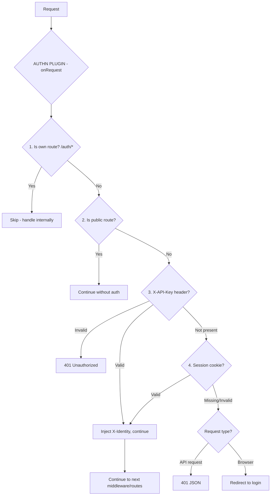

# Plugin AuthN

Authentication plugin for Buntime that provides session-based authentication with multiple provider support, API key authentication, SCIM 2.0 user provisioning, and identity injection.

## Table of Contents

- [Overview](#overview)
- [Architecture](#architecture)
- [Providers](#providers)
- [Configuration](#configuration)
- [API Endpoints](#api-endpoints)
- [Identity Injection](#identity-injection)
- [API Key Authentication](#api-key-authentication)
- [SCIM 2.0](#scim-20)
- [Public Routes](#public-routes)
- [Lifecycle Hooks](#lifecycle-hooks)
- [Integration with Other Plugins](#integration-with-other-plugins)
- [Exported Types](#exported-types)
- [File Structure](#file-structure)
- [Examples](#examples)

## Overview

The `@buntime/plugin-authn` provides session-based authentication using [better-auth](https://www.better-auth.com/) as the underlying engine. It intercepts all incoming requests via the `onRequest` hook, checks for valid sessions or API keys, and injects identity information into downstream handlers via the `X-Identity` header.

**Key Features:**

- **Multiple Providers**: Email/Password, Keycloak, Auth0, Okta, Generic OIDC
- **Session Management**: Cookie-based sessions via `better-auth.session_token`
- **API Key Auth**: Machine-to-machine authentication via `X-API-Key` header
- **Identity Injection**: Injects `X-Identity` header with user ID, roles, and groups
- **SCIM 2.0**: Enterprise user provisioning endpoints
- **OIDC Logout**: Full OIDC single-logout flow with `id_token_hint`
- **Public Routes**: Per-method public route configuration that bypasses authentication
- **Login UI**: Built-in SPA login page with dynamic provider selection

## Architecture



**API Mode**: Persistent (routes in `plugin.ts`, runs on main thread). Database connections and session state require persistence.

## Providers

### Email/Password

Local authentication with email and password.

```yaml
providers:
  - type: email-password
    displayName: Email
    allowSignUp: true
    requireEmailVerification: false
```

| Option | Type | Default | Description |
|--------|------|---------|-------------|
| `type` | `"email-password"` | **Required** | Provider type |
| `displayName` | `string` | `"Email"` | Display name on login UI |
| `allowSignUp` | `boolean` | `true` | Allow new user registration |
| `requireEmailVerification` | `boolean` | `false` | Require email verification |

### Keycloak

OpenID Connect authentication via Keycloak.

```yaml
providers:
  - type: keycloak
    issuer: ${KEYCLOAK_URL}
    realm: ${KEYCLOAK_REALM}
    clientId: ${KEYCLOAK_CLIENT_ID}
    clientSecret: ${KEYCLOAK_CLIENT_SECRET}
```

| Option | Type | Description |
|--------|------|-------------|
| `issuer` | `string` | Keycloak base URL |
| `realm` | `string` | Keycloak realm name |
| `clientId` | `string` | OAuth client ID |
| `clientSecret` | `string` | OAuth client secret |

### Auth0

```yaml
providers:
  - type: auth0
    domain: ${AUTH0_DOMAIN}
    clientId: ${AUTH0_CLIENT_ID}
    clientSecret: ${AUTH0_CLIENT_SECRET}
```

### Okta

```yaml
providers:
  - type: okta
    domain: ${OKTA_DOMAIN}
    clientId: ${OKTA_CLIENT_ID}
    clientSecret: ${OKTA_CLIENT_SECRET}
```

### Generic OIDC

For any OIDC-compliant identity provider.

```yaml
providers:
  - type: generic-oidc
    issuer: ${OIDC_ISSUER}
    clientId: ${OIDC_CLIENT_ID}
    clientSecret: ${OIDC_CLIENT_SECRET}
```

## Configuration

### manifest.yaml

```yaml
name: "@buntime/plugin-authn"
base: "/auth"
enabled: false
injectBase: true

dependencies:
  - "@buntime/plugin-database"
optionalDependencies:
  - "@buntime/plugin-proxy"

entrypoint: dist/client/index.html
pluginEntry: dist/plugin.js

loginPath: "/auth/login"
trustedOrigins:
  - "http://localhost:8000"
apiKeys: []
providers:
  - type: email-password
    displayName: Email
    allowSignUp: true
    requireEmailVerification: false
scim:
  enabled: false
  maxResults: 100
  bulkEnabled: true
  maxBulkOperations: 1000
```

### Configuration Options

| Option | Type | Default | Description |
|--------|------|---------|-------------|
| `loginPath` | `string` | `"/auth/login"` | Login page redirect path |
| `trustedOrigins` | `string[]` | `[]` | Trusted CORS origins |
| `providers` | `ProviderConfig[]` | `[]` | Authentication providers |
| `apiKeys` | `ApiKeyConfig[]` | `[]` | API keys for M2M auth |
| `database` | `AdapterType` | default | Database adapter type |
| `scim.enabled` | `boolean` | `false` | Enable SCIM 2.0 endpoints |
| `scim.maxResults` | `number` | `100` | Max SCIM results per page |
| `scim.bulkEnabled` | `boolean` | `true` | Enable SCIM bulk operations |
| `scim.maxBulkOperations` | `number` | `1000` | Max bulk operations per request |

## API Endpoints

All routes are mounted at `/{base}/api/*` (default: `/auth/api/*`).

| Method | Endpoint | Description |
|--------|----------|-------------|
| `GET` | `/` | Redirect based on auth status (to login or home) |
| `GET` | `/api/providers` | List configured providers for login UI |
| `ALL` | `/api/auth` | better-auth handler (root) |
| `ALL` | `/api/auth/*` | better-auth handler (all auth routes) |
| `GET` | `/api/session` | Get current session |
| `GET` | `/api/logout` | Logout with OIDC provider logout support (redirect) |
| `POST` | `/api/logout` | Logout (JSON response with optional `oidcLogoutUrl`) |

### better-auth Routes

The `/api/auth/*` endpoint delegates to better-auth which provides:

- `POST /api/auth/sign-up/email` - Register with email/password
- `POST /api/auth/sign-in/email` - Sign in with email/password
- `POST /api/auth/sign-out` - Sign out
- `GET /api/auth/session` - Get session
- `GET /api/auth/callback/:provider` - OAuth callback
- `GET /api/auth/sign-in/social` - Social sign-in redirect

### SCIM 2.0 Routes (when enabled)

Mounted at `/auth/api/scim/v2/*`:

| Method | Endpoint | Description |
|--------|----------|-------------|
| `GET` | `/scim/v2/Users` | List users |
| `GET` | `/scim/v2/Users/:id` | Get user |
| `POST` | `/scim/v2/Users` | Create user |
| `PUT` | `/scim/v2/Users/:id` | Replace user |
| `PATCH` | `/scim/v2/Users/:id` | Partial update user |
| `DELETE` | `/scim/v2/Users/:id` | Delete user |
| `POST` | `/scim/v2/Bulk` | Bulk operations |

## Identity Injection

When a request is authenticated, the plugin injects an `X-Identity` header containing a JSON-serialized identity object:

```typescript
interface Identity {
  sub: string;                       // User ID
  roles: string[];                   // User roles (from OIDC claims)
  groups: string[];                  // User groups
  claims: Record<string, unknown>;   // Additional claims
}
```

**Example header value:**

```json
{"sub":"user-123","roles":["admin"],"groups":["engineering"],"claims":{"email":"user@example.com"}}
```

Downstream plugins (like `plugin-authz`) and workers can read this header to make authorization decisions.

## API Key Authentication

For machine-to-machine communication (CI/CD, external services):

```yaml
apiKeys:
  - key: ${GITLAB_DEPLOY_KEY}
    name: "GitLab CI/CD"
    roles: ["deployer"]
  - key: ${MONITORING_KEY}
    name: "Monitoring Service"
    roles: ["reader"]
```

**Usage:**

```bash
curl -H "X-API-Key: your-key-here" https://buntime.home/api/apps
```

When a valid API key is found, the identity is injected as:

```json
{"id":"apikey:GitLab CI/CD","name":"GitLab CI/CD","roles":["deployer"]}
```

## Public Routes

The plugin defines internal public routes that bypass authentication:

```typescript
// All methods: /auth/api and /auth/api/**
// GET only: /auth/login and /auth/login/**
```

Workers can also define public routes in their `manifest.yaml`:

```yaml
publicRoutes:
  ALL: ["/api/health"]
  GET: ["/api/public/**"]
  POST: ["/api/webhook"]
```

Worker public routes are relative and automatically prefixed with the worker's base path.

## Lifecycle Hooks

| Hook | Description |
|------|-------------|
| `onInit` | Gets database service, initializes better-auth, creates providers, mounts SCIM routes |
| `onShutdown` | Cleans up auth state and database connections |
| `onRequest` | Intercepts all requests for authentication checks |

## Integration with Other Plugins

### plugin-database (required)

Uses the database service for session storage and user management:

```typescript
const database = ctx.getPlugin<DatabaseService>("@buntime/plugin-database");
const adapter = database.getRootAdapter(config.database);
```

### plugin-proxy (optional)

The proxy plugin can check if a proxied route is public:

```typescript
const proxy = ctx.getPlugin("@buntime/plugin-proxy");
if (proxy?.isPublic(pathname, method)) {
  // Skip authentication
}
```

### plugin-authz (consumer)

The authz plugin reads the `X-Identity` header injected by authn to make authorization decisions.

## Exported Types

```typescript
export interface AuthnConfig { ... }
export interface ApiKeyConfig { ... }
export type AuthnRoutesType = typeof api;

// Provider types
export type AuthProviderType = "email-password" | "keycloak" | "auth0" | "okta" | "generic-oidc";
export interface EmailPasswordProviderConfig { ... }
export interface KeycloakProviderConfig { ... }
export interface Auth0ProviderConfig { ... }
export interface OktaProviderConfig { ... }
export interface GenericOIDCProviderConfig { ... }
export type ProviderConfig = EmailPasswordProviderConfig | KeycloakProviderConfig | ...;
export interface ProviderInfo { ... }
```

## File Structure

```
plugins/plugin-authn/
├── manifest.yaml          # Configuration and metadata
├── plugin.ts              # Main plugin (onRequest hook, routes)
├── index.ts               # Worker entrypoint (serves login SPA)
├── server/
│   ├── api.ts            # Hono API routes
│   ├── auth.ts           # better-auth configuration
│   ├── services.ts       # Service layer (initialize, getIdentityFromSession)
│   ├── schema.ts         # Database schema initialization
│   ├── db/
│   │   └── schema.ts     # Drizzle ORM schema definitions
│   ├── providers/        # Provider implementations
│   │   ├── index.ts      # Provider factory
│   │   ├── email-password.ts
│   │   ├── keycloak.ts
│   │   ├── auth0.ts
│   │   ├── okta.ts
│   │   └── generic-oidc.ts
│   └── scim/             # SCIM 2.0 implementation
│       ├── routes.ts     # SCIM API routes
│       ├── service.ts    # SCIM service layer
│       ├── filter.ts     # SCIM filter parser
│       ├── mapper.ts     # User <-> SCIM resource mapper
│       └── types.ts      # SCIM type definitions
├── client/               # Login SPA (React + TanStack Router)
└── dist/                 # Compiled output
```

## Examples

### Development Setup (Email/Password)

```yaml
# plugins/plugin-database/manifest.yaml
name: "@buntime/plugin-database"
enabled: true
adapters:
  - type: sqlite
    baseDir: ./.cache/sqlite/
    default: true

# plugins/plugin-authn/manifest.yaml
name: "@buntime/plugin-authn"
enabled: true
providers:
  - type: email-password
    allowSignUp: true
trustedOrigins:
  - "http://localhost:8000"
```

### Production Setup (Keycloak + SCIM)

```yaml
name: "@buntime/plugin-authn"
enabled: true
providers:
  - type: keycloak
    issuer: ${KEYCLOAK_URL}
    realm: ${KEYCLOAK_REALM}
    clientId: ${KEYCLOAK_CLIENT_ID}
    clientSecret: ${KEYCLOAK_CLIENT_SECRET}
trustedOrigins:
  - "https://buntime.home"
scim:
  enabled: true
apiKeys:
  - key: ${CI_DEPLOY_KEY}
    name: "CI/CD Pipeline"
    roles: ["deployer"]
```

### API Key Only (Headless)

```yaml
name: "@buntime/plugin-authn"
enabled: true
providers:
  - type: email-password
apiKeys:
  - key: ${SERVICE_KEY}
    name: "Backend Service"
    roles: ["admin"]
```

## License

See [LICENSE](../../LICENSE) at the project root.
