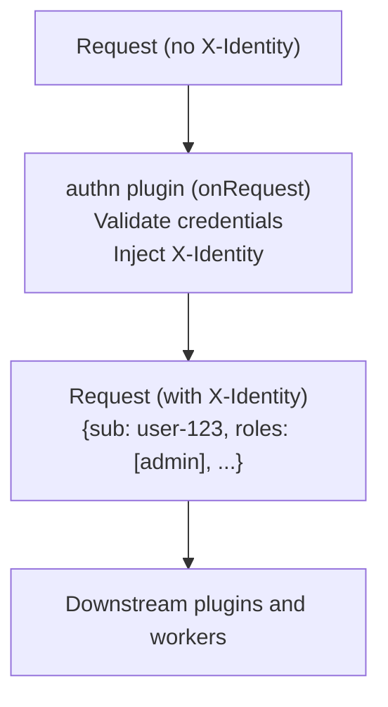

# Identity Injection

How the authn plugin extracts identity information and makes it available to downstream components.

## What Is Identity Injection?

When a request is authenticated (via session or API key), the authn plugin injects an `X-Identity` HTTP header containing a JSON-serialized identity object. This header is then readable by:

- **plugin-authz** - For policy-based authorization decisions
- **plugin-gateway** - For per-user rate limiting (`keyBy: user`)
- **Workers** - For application-level access control
- **Any downstream middleware** - For custom logic



## Identity Schema

### Session Identity

For users authenticated via session cookie:

```typescript
interface Identity {
  sub: string;                       // User ID (from database or OIDC "sub" claim)
  roles: string[];                   // User roles (from OIDC realm/client roles)
  groups: string[];                  // User groups (from OIDC groups claim)
  claims: Record<string, unknown>;   // Additional claims (email, name, etc.)
}
```

**Example:**

```json
{
  "sub": "user-abc-123",
  "roles": ["admin", "user"],
  "groups": ["engineering", "platform-team"],
  "claims": {
    "email": "john@example.com",
    "name": "John Doe",
    "preferred_username": "johndoe"
  }
}
```

### API Key Identity

For requests authenticated via `X-API-Key` header:

```json
{
  "id": "apikey:GitLab CI/CD",
  "name": "GitLab CI/CD",
  "roles": ["deployer"]
}
```

The `id` field is prefixed with `apikey:` to distinguish API key identities from user identities.

## How Identity Is Extracted

### From OIDC Session

1. Session cookie `better-auth.session_token` is validated
2. User is looked up in the database
3. OIDC token claims are extracted (roles, groups, custom claims)
4. Identity object is assembled and JSON-serialized into `X-Identity`

### From API Key

1. `X-API-Key` header is matched against configured keys
2. Identity is built from the key's configuration:
   - `id`: `apikey:{key.name}`
   - `name`: `key.name`
   - `roles`: `key.roles` (default: `["api-client"]`)

## Reading Identity in Workers

Workers can read the `X-Identity` header from incoming requests:

```typescript
// Hono route handler
app.get("/api/profile", (c) => {
  const identityHeader = c.req.header("X-Identity");
  if (!identityHeader) {
    return c.json({ error: "Not authenticated" }, 401);
  }

  const identity = JSON.parse(identityHeader);
  console.log("User ID:", identity.sub);
  console.log("Roles:", identity.roles);

  return c.json({ user: identity });
});
```

### Helper Example

```typescript
function getIdentity(req: Request): Identity | null {
  const header = req.headers.get("X-Identity");
  if (!header) return null;

  try {
    return JSON.parse(header);
  } catch {
    return null;
  }
}

function requireRole(identity: Identity | null, role: string): boolean {
  return identity?.roles?.includes(role) ?? false;
}

// Usage
app.delete("/api/users/:id", (c) => {
  const identity = getIdentity(c.req.raw);
  if (!requireRole(identity, "admin")) {
    return c.json({ error: "Forbidden" }, 403);
  }
  // ... delete user
});
```

## Reading Identity in Plugins

Other plugins can read the injected identity in their `onRequest` hook:

```typescript
// In plugin-authz
onRequest(req) {
  const identityHeader = req.headers.get("X-Identity");
  if (identityHeader) {
    const identity = JSON.parse(identityHeader);
    // Use identity for authorization decisions
    const decision = pdp.evaluate({
      subject: {
        id: identity.sub,
        roles: identity.roles,
        groups: identity.groups,
      },
      resource: { path: new URL(req.url).pathname },
      action: { method: req.method },
    });
  }
}
```

## Security Considerations

### Header Trust

The `X-Identity` header is set by the authn plugin on the main thread. Workers and downstream plugins should trust this header because:

1. External requests cannot forge it — the plugin processes all requests before they reach workers
2. The header is only set after successful authentication
3. Any existing `X-Identity` header from the client is overwritten

### Header Stripping

The plugin does **not** strip incoming `X-Identity` headers from external requests that bypass authentication (public routes). If your application relies on `X-Identity` for authorization on public routes, be aware that it may not be set.

### API Key Security

- API keys should be stored as Kubernetes Secrets or environment variables
- Use `${ENV_VAR}` substitution rather than hardcoding keys in manifest
- Rotate keys periodically
- Assign minimal roles to each key

## Next Steps

- [Providers](providers.md) - How providers extract identity
- [SCIM 2.0](scim.md) - User provisioning
- [Configuration](../guides/configuration.md) - API key configuration
