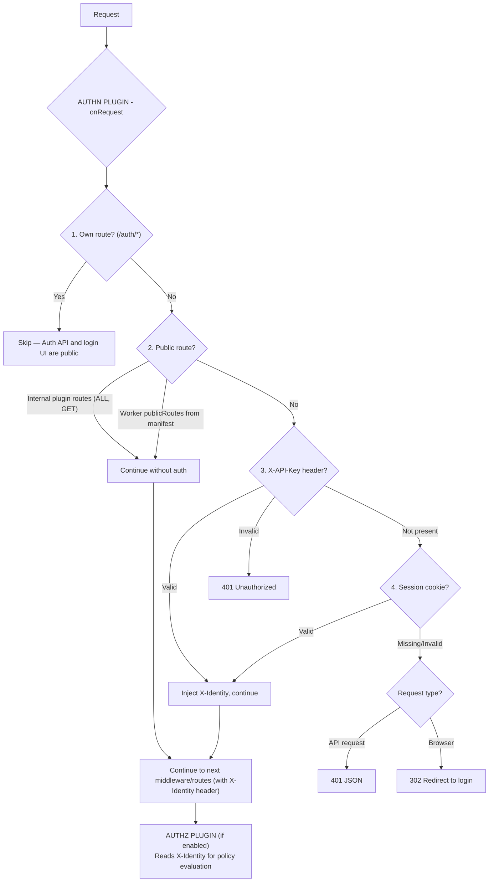

# Overview

Authentication plugin for Buntime providing session-based auth with multiple identity providers.

## Features

- **Multiple Providers** - Email/Password, Keycloak, Auth0, Okta, Generic OIDC
- **Session Management** - Cookie-based sessions via better-auth
- **API Key Authentication** - Machine-to-machine auth for CI/CD and services
- **Identity Injection** - Automatic `X-Identity` header injection
- **SCIM 2.0** - Enterprise user provisioning and management
- **OIDC Logout** - Full single-logout flow with `id_token_hint`
- **Login UI** - Built-in SPA with dynamic provider selection
- **Public Routes** - Per-method route configuration that bypasses auth

## Architecture

The plugin-authn functions as a gate in the Buntime request pipeline:



## Main Components

### 1. better-auth Engine

The plugin uses [better-auth](https://www.better-auth.com/) as the authentication engine:
- Handles user registration, sign-in, sign-out
- Manages session tokens (cookies)
- Processes OAuth/OIDC callbacks
- Stores users and sessions in the database

**Files:** `server/auth.ts`, `server/services.ts`

### 2. Provider System

Pluggable authentication providers:
- Each provider implements discovery, authorization, and token exchange
- Providers can coexist (e.g., email-password + Keycloak)
- OIDC providers support full logout with `id_token_hint`

**Files:** `server/providers/`

### 3. Identity Injection

Transforms authentication results into a standardized `X-Identity` header:
- Session users: extracts `sub`, `roles`, `groups`, `claims` from OIDC tokens
- API keys: creates synthetic identity with configured roles
- Downstream plugins and workers read this header

**File:** `server/services.ts` (`getIdentityFromSession`)

### 4. SCIM 2.0 Service

Enterprise user provisioning following the SCIM 2.0 standard:
- List, create, update, delete users
- SCIM filter parsing and evaluation
- Bulk operations
- User ↔ SCIM resource mapping

**Files:** `server/scim/`

### 5. Login UI

Built-in React SPA for the login page:
- Dynamic provider selection based on configuration
- Email/password form for local auth
- Social/OIDC sign-in buttons
- Redirect back to original page after login

**Files:** `client/`

## Tech Stack

- **Runtime**: Bun
- **Framework**: Hono
- **Auth Engine**: better-auth
- **Database**: Via plugin-database (any adapter)
- **UI**: React + TanStack Router
- **Types**: TypeScript

## File Structure

```
plugins/plugin-authn/
├── plugin.ts              # Main plugin (onRequest hook, routes)
├── manifest.yaml          # Configuration and metadata
├── index.ts               # Worker entrypoint (serves login SPA)
├── server/
│   ├── api.ts            # Hono API routes
│   ├── auth.ts           # better-auth configuration
│   ├── services.ts       # Service layer (initialize, getIdentityFromSession)
│   ├── schema.ts         # Database schema initialization
│   ├── db/
│   │   └── schema.ts     # Drizzle ORM schema definitions
│   ├── providers/        # Provider implementations
│   │   ├── index.ts      # Provider factory
│   │   ├── email-password.ts
│   │   ├── keycloak.ts
│   │   ├── auth0.ts
│   │   ├── okta.ts
│   │   └── generic-oidc.ts
│   └── scim/             # SCIM 2.0 implementation
│       ├── routes.ts     # SCIM API routes
│       ├── service.ts    # SCIM service layer
│       ├── filter.ts     # SCIM filter parser
│       ├── mapper.ts     # User ↔ SCIM resource mapper
│       └── types.ts      # SCIM type definitions
├── client/               # Login SPA (React + TanStack Router)
└── dist/                 # Compiled output
```

## Lifecycle Hooks

### onInit

Initializes the authentication system:
- Gets database service from plugin-database
- Configures better-auth with database adapter
- Creates and registers authentication providers
- Mounts SCIM routes (if enabled)
- Logs provider configuration

### onShutdown

Cleans up resources:
- Closes database connections
- Stops any pending operations

### onRequest

Request processing pipeline:
1. Skips own routes (`/auth/*`)
2. Checks public routes (internal + worker manifests)
3. Checks API key (`X-API-Key` header)
4. Checks session cookie (`better-auth.session_token`)
5. Returns 401 or redirects to login if unauthenticated

## Dependencies

### plugin-database (required)

Uses the database service for:
- User storage and management
- Session storage and validation
- OAuth account linking
- SCIM user provisioning

### plugin-proxy (optional)

If present, the auth plugin checks proxy rules for public routes:
- Proxied routes can define `publicRoutes` in their rule configuration
- The auth plugin asks the proxy plugin `isPublic(pathname, method)` before enforcing auth

### plugin-authz (consumer)

The authorization plugin reads the `X-Identity` header injected by authn to evaluate access policies.

## Next Steps

- [Providers](providers.md) - Provider details and configuration
- [Identity Injection](identity.md) - How X-Identity works
- [SCIM 2.0](scim.md) - Enterprise provisioning
- [Configuration](../guides/configuration.md) - Complete reference
- [Setup Guide](../guides/setup.md) - Step-by-step setup
