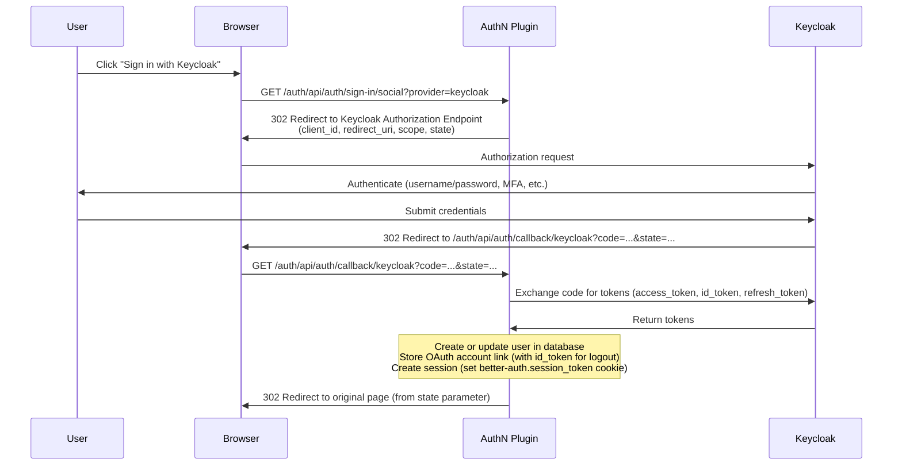
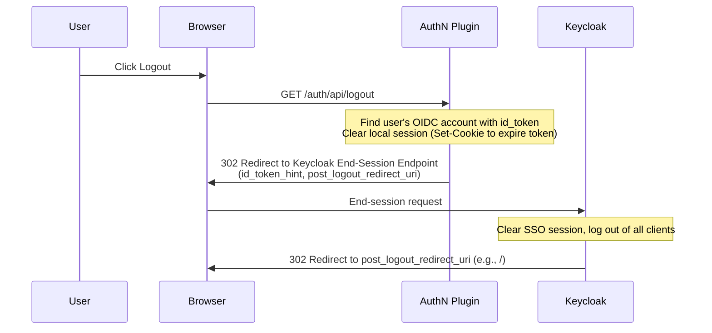

# Providers

Authentication provider system supporting multiple identity sources simultaneously.

## What Are Providers?

Providers are pluggable authentication backends that handle user sign-in. Multiple providers can be configured at the same time, and the login UI dynamically renders options based on the active providers.

```
Login Page
┌─────────────────────────────────────┐
│                                     │
│  ┌─────────────────────────────┐    │
│  │  📧 Email                   │    │ ← Email/Password provider
│  │  [email    ] [password   ]  │    │
│  │  [     Sign In     ]        │    │
│  └─────────────────────────────┘    │
│                                     │
│  ──── or ────                       │
│                                     │
│  [ 🔑 Sign in with Keycloak  ]     │ ← OIDC providers
│  [ 🔐 Sign in with Auth0     ]     │
│                                     │
└─────────────────────────────────────┘
```

## Provider Types

### Email/Password

Local authentication with email and password. Users are stored in the database managed by plugin-database.

```yaml
providers:
  - type: email-password
    displayName: Email
    allowSignUp: true
    requireEmailVerification: false
```

**Options:**

| Option | Type | Default | Description |
|--------|------|---------|-------------|
| `type` | `"email-password"` | **Required** | Provider type |
| `displayName` | `string` | `"Email"` | Name shown on login UI |
| `allowSignUp` | `boolean` | `true` | Allow new user registration |
| `requireEmailVerification` | `boolean` | `false` | Require email verification |

**Flow:**
1. User submits email + password
2. better-auth validates credentials against database
3. Session cookie is set
4. User is redirected to original page

**When to use:** Development, internal tools, standalone deployments without SSO.

### Keycloak

OpenID Connect authentication via Keycloak. Supports full OIDC flows including single logout.

```yaml
providers:
  - type: keycloak
    issuer: ${KEYCLOAK_URL}
    realm: ${KEYCLOAK_REALM}
    clientId: ${KEYCLOAK_CLIENT_ID}
    clientSecret: ${KEYCLOAK_CLIENT_SECRET}
```

**Options:**

| Option | Type | Description |
|--------|------|-------------|
| `type` | `"keycloak"` | Provider type |
| `issuer` | `string` | Keycloak base URL (e.g., `https://keycloak.example.com`) |
| `realm` | `string` | Keycloak realm name |
| `clientId` | `string` | OAuth 2.0 client ID |
| `clientSecret` | `string` | OAuth 2.0 client secret |
| `displayName` | `string` | Name shown on login UI (default: `"Keycloak"`) |

**OIDC Discovery URL:** `{issuer}/realms/{realm}/.well-known/openid-configuration`

**Logout:** Full OIDC RP-Initiated Logout with `id_token_hint` and `post_logout_redirect_uri`.

**When to use:** Enterprise deployments with centralized identity management.

### Auth0

```yaml
providers:
  - type: auth0
    domain: ${AUTH0_DOMAIN}
    clientId: ${AUTH0_CLIENT_ID}
    clientSecret: ${AUTH0_CLIENT_SECRET}
```

**Options:**

| Option | Type | Description |
|--------|------|-------------|
| `type` | `"auth0"` | Provider type |
| `domain` | `string` | Auth0 domain (e.g., `myapp.auth0.com`) |
| `clientId` | `string` | OAuth 2.0 client ID |
| `clientSecret` | `string` | OAuth 2.0 client secret |
| `displayName` | `string` | Name shown on login UI (default: `"Auth0"`) |

**When to use:** SaaS applications, consumer-facing apps.

### Okta

```yaml
providers:
  - type: okta
    domain: ${OKTA_DOMAIN}
    clientId: ${OKTA_CLIENT_ID}
    clientSecret: ${OKTA_CLIENT_SECRET}
```

**Options:**

| Option | Type | Description |
|--------|------|-------------|
| `type` | `"okta"` | Provider type |
| `domain` | `string` | Okta domain (e.g., `dev-12345.okta.com`) |
| `clientId` | `string` | OAuth 2.0 client ID |
| `clientSecret` | `string` | OAuth 2.0 client secret |
| `displayName` | `string` | Name shown on login UI (default: `"Okta"`) |

**When to use:** Enterprise with Okta as identity provider.

### Generic OIDC

For any OpenID Connect-compliant identity provider.

```yaml
providers:
  - type: generic-oidc
    issuer: ${OIDC_ISSUER}
    clientId: ${OIDC_CLIENT_ID}
    clientSecret: ${OIDC_CLIENT_SECRET}
    displayName: "Corporate SSO"
```

**Options:**

| Option | Type | Description |
|--------|------|-------------|
| `type` | `"generic-oidc"` | Provider type |
| `issuer` | `string` | OIDC Issuer URL (must serve `.well-known/openid-configuration`) |
| `clientId` | `string` | OAuth 2.0 client ID |
| `clientSecret` | `string` | OAuth 2.0 client secret |
| `displayName` | `string` | Name shown on login UI |

**When to use:** Any OIDC-compliant provider not listed above (Azure AD, Google Workspace, etc.).

## Multiple Providers

You can configure multiple providers simultaneously:

```yaml
providers:
  # Local auth for development/emergency access
  - type: email-password
    displayName: Email
    allowSignUp: false

  # Primary SSO
  - type: keycloak
    issuer: ${KEYCLOAK_URL}
    realm: ${KEYCLOAK_REALM}
    clientId: ${KEYCLOAK_CLIENT_ID}
    clientSecret: ${KEYCLOAK_CLIENT_SECRET}
```

The login UI renders all providers, allowing users to choose their preferred authentication method.

## OIDC Flow



## OIDC Logout Flow



## Environment Variable Substitution

All provider configuration values support `${ENV_VAR}` syntax. Values are resolved at load time from the environment or ConfigMap:

```yaml
providers:
  - type: keycloak
    issuer: ${KEYCLOAK_URL}         # From ConfigMap
    realm: ${KEYCLOAK_REALM}        # From ConfigMap
    clientId: ${KEYCLOAK_CLIENT_ID}     # From Secret
    clientSecret: ${KEYCLOAK_CLIENT_SECRET}  # From Secret
```

## Next Steps

- [Identity Injection](identity.md) - How identity is extracted from providers
- [SCIM 2.0](scim.md) - Enterprise user provisioning
- [Configuration](../guides/configuration.md) - Complete reference
