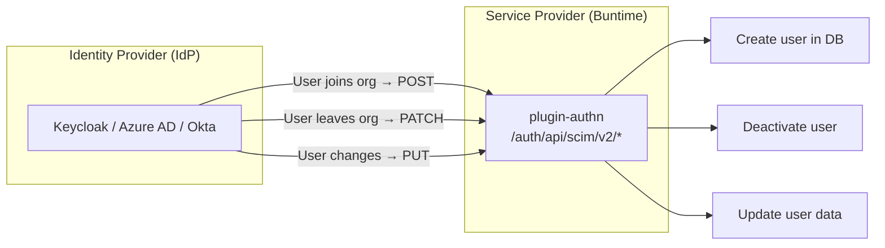

# SCIM 2.0

Enterprise user provisioning and management following the SCIM 2.0 standard.

## What Is SCIM?

SCIM (System for Cross-domain Identity Management) is a standard protocol for automating user provisioning between identity providers and service providers. It enables:

- **Automated User Lifecycle** - Create, update, deactivate users automatically
- **Directory Sync** - Keep user data in sync with corporate directory
- **Compliance** - Automated offboarding when users leave the organization



## Configuration

Enable SCIM in the authn manifest:

```yaml
name: "@buntime/plugin-authn"
enabled: true

scim:
  enabled: true
  maxResults: 100
  bulkEnabled: true
  maxBulkOperations: 1000

providers:
  - type: keycloak
    issuer: ${KEYCLOAK_URL}
    realm: ${KEYCLOAK_REALM}
    clientId: ${KEYCLOAK_CLIENT_ID}
    clientSecret: ${KEYCLOAK_CLIENT_SECRET}
```

### Options

| Option | Type | Default | Description |
|--------|------|---------|-------------|
| `enabled` | `boolean` | `false` | Enable SCIM 2.0 endpoints |
| `maxResults` | `number` | `100` | Maximum results per page |
| `bulkEnabled` | `boolean` | `true` | Enable bulk operations |
| `maxBulkOperations` | `number` | `1000` | Maximum operations per bulk request |

## Endpoints

All SCIM endpoints are mounted at `/auth/api/scim/v2/`.

| Method | Endpoint | Description |
|--------|----------|-------------|
| `GET` | `/Users` | List users with filtering and pagination |
| `GET` | `/Users/:id` | Get user by ID |
| `POST` | `/Users` | Create user |
| `PUT` | `/Users/:id` | Replace user entirely |
| `PATCH` | `/Users/:id` | Partial update (PatchOp) |
| `DELETE` | `/Users/:id` | Delete user |
| `POST` | `/Bulk` | Bulk operations |

## User Resource Schema

SCIM User resources follow the `urn:ietf:params:scim:schemas:core:2.0:User` schema:

```json
{
  "schemas": ["urn:ietf:params:scim:schemas:core:2.0:User"],
  "id": "user-abc-123",
  "userName": "user@example.com",
  "name": {
    "givenName": "John",
    "familyName": "Doe",
    "formatted": "John Doe"
  },
  "emails": [
    {
      "value": "user@example.com",
      "type": "work",
      "primary": true
    }
  ],
  "active": true,
  "meta": {
    "resourceType": "User",
    "created": "2024-01-23T10:00:00.000Z",
    "lastModified": "2024-01-23T10:30:00.000Z",
    "location": "https://buntime.home/auth/api/scim/v2/Users/user-abc-123"
  }
}
```

## Filtering

SCIM filter expressions are supported on the `/Users` endpoint:

```
GET /auth/api/scim/v2/Users?filter=userName eq "user@example.com"
GET /auth/api/scim/v2/Users?filter=name.familyName co "Doe"
GET /auth/api/scim/v2/Users?filter=active eq true
```

### Supported Operators

| Operator | Description | Example |
|----------|-------------|---------|
| `eq` | Equal | `userName eq "john@example.com"` |
| `ne` | Not equal | `active ne false` |
| `co` | Contains | `name.familyName co "Doe"` |
| `sw` | Starts with | `userName sw "admin"` |
| `ew` | Ends with | `userName ew "@example.com"` |
| `gt` | Greater than | `meta.created gt "2024-01-01"` |
| `ge` | Greater or equal | - |
| `lt` | Less than | - |
| `le` | Less or equal | - |

### Logical Operators

```
filter=userName eq "john" and active eq true
filter=name.givenName eq "John" or name.givenName eq "Jane"
```

## Pagination

```
GET /auth/api/scim/v2/Users?startIndex=1&count=25
```

Response includes pagination metadata:

```json
{
  "schemas": ["urn:ietf:params:scim:api:messages:2.0:ListResponse"],
  "totalResults": 150,
  "startIndex": 1,
  "itemsPerPage": 25,
  "Resources": [...]
}
```

## Bulk Operations

When `bulkEnabled: true`, multiple operations can be executed in a single request:

```json
{
  "schemas": ["urn:ietf:params:scim:api:messages:2.0:BulkRequest"],
  "Operations": [
    {
      "method": "POST",
      "path": "/Users",
      "bulkId": "user1",
      "data": {
        "schemas": ["urn:ietf:params:scim:schemas:core:2.0:User"],
        "userName": "user1@example.com",
        "name": { "givenName": "Alice", "familyName": "Smith" }
      }
    },
    {
      "method": "PATCH",
      "path": "/Users/user-existing-456",
      "data": {
        "schemas": ["urn:ietf:params:scim:api:messages:2.0:PatchOp"],
        "Operations": [
          { "op": "replace", "path": "active", "value": false }
        ]
      }
    },
    {
      "method": "DELETE",
      "path": "/Users/user-old-789"
    }
  ]
}
```

Response includes per-operation status:

```json
{
  "schemas": ["urn:ietf:params:scim:api:messages:2.0:BulkResponse"],
  "Operations": [
    { "method": "POST", "bulkId": "user1", "status": "201", "location": "/Users/user-new-123" },
    { "method": "PATCH", "status": "200" },
    { "method": "DELETE", "status": "204" }
  ]
}
```

## Integration with IdP

### Keycloak

1. In Keycloak admin console, go to **Realm Settings > User Federation**
2. Or configure SCIM via a Keycloak SCIM plugin/extension
3. Set the SCIM endpoint URL to `https://buntime.home/auth/api/scim/v2`

### Azure AD / Entra ID

1. In Azure Portal, go to **Enterprise Applications > Your App > Provisioning**
2. Set provisioning mode to **Automatic**
3. Enter tenant URL: `https://buntime.home/auth/api/scim/v2`
4. Enter secret token (use API key from plugin-authn)

### Okta

1. In Okta admin, go to **Applications > Your App > Provisioning**
2. Enable SCIM provisioning
3. Set SCIM connector base URL: `https://buntime.home/auth/api/scim/v2`

## User Mapping

The SCIM service maps between internal user records and SCIM User resources:

| Internal Field | SCIM Field | Notes |
|---------------|------------|-------|
| `id` | `id` | Unique identifier |
| `email` | `userName` | Primary identifier |
| `name` | `name.formatted` | Full name |
| - | `name.givenName` | Extracted from name |
| - | `name.familyName` | Extracted from name |
| `email` | `emails[0].value` | Primary email |
| - | `active` | Account status |
| `createdAt` | `meta.created` | Creation timestamp |
| `updatedAt` | `meta.lastModified` | Last update |

## Next Steps

- [Providers](providers.md) - Authentication providers
- [Identity Injection](identity.md) - How identity works
- [Configuration](../guides/configuration.md) - Complete reference
