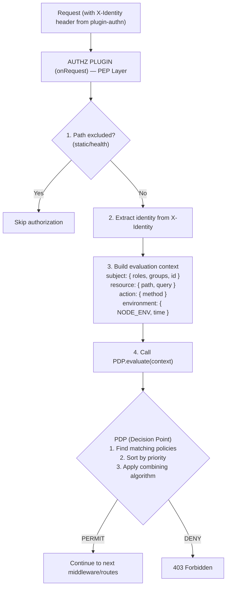

# Plugin AuthZ

XACML-like policy-based authorization plugin for Buntime with Policy Enforcement Point (PEP), Policy Decision Point (PDP), and Policy Administration Point (PAP).

## Table of Contents

- [Overview](#overview)
- [Architecture](#architecture)
- [Configuration](#configuration)
- [Policies](#policies)
  - [Policy Structure](#policy-structure)
  - [Subject Matching](#subject-matching)
  - [Resource Matching](#resource-matching)
  - [Action Matching](#action-matching)
  - [Conditions](#conditions)
  - [Combining Algorithms](#combining-algorithms)
- [Policy Seeding](#policy-seeding)
- [API Endpoints](#api-endpoints)
- [Service Registry](#service-registry)
- [Lifecycle Hooks](#lifecycle-hooks)
- [Exported Types](#exported-types)
- [File Structure](#file-structure)
- [Examples](#examples)

## Overview

The `@buntime/plugin-authz` provides attribute-based access control (ABAC) inspired by XACML. It intercepts requests after authentication (reading the `X-Identity` header injected by `plugin-authn`), evaluates policies, and enforces access decisions.

**Key Features:**

- **PEP** (Policy Enforcement Point): Intercepts requests, applies decisions
- **PDP** (Policy Decision Point): Evaluates policies, returns PERMIT/DENY
- **PAP** (Policy Administration Point): CRUD for policies via API
- **Combining Algorithms**: deny-overrides, permit-overrides, deny-unless-permit, permit-unless-deny
- **Policy Seeding**: Auto-seed default policies at startup
- **Path Exclusion**: Regex-based path exclusion for static assets
- **Storage**: Memory or file-based policy storage
- **Explain API**: Debug authorization decisions with detailed explanations
- **Built-in UI**: React SPA for policy management and evaluation testing

## Architecture



**API Mode**: Persistent (routes and `onRequest` in `plugin.ts`, runs on main thread).

## Configuration

### manifest.yaml

```yaml
name: "@buntime/plugin-authz"
base: "/authz"
enabled: false
injectBase: true

dependencies:
  - "@buntime/plugin-authn"

entrypoint: dist/client/index.html
pluginEntry: dist/plugin.js

menus:
  - icon: lucide:shield-check
    path: /authz
    title: Authorization
    items:
      - icon: lucide:file-text
        path: /authz/policies
        title: Policies
      - icon: lucide:scale
        path: /authz/evaluate
        title: Evaluate

combiningAlgorithm: deny-overrides
defaultEffect: deny
store: memory

excludePaths:
  - ".*\\.(js|css|woff2?|png|svg|ico|json)$"
  - "/health"
  - "/public/.*"

policySeed:
  enabled: true
  onlyIfEmpty: true
  environments: ["*"]
  policies:
    - id: admin-full-access
      name: Admin Full Access
      effect: permit
      priority: 100
      subjects:
        - role: admin
      resources:
        - path: "/**"
      actions:
        - method: "*"
    - id: users-read-only
      name: Users Read-Only
      effect: permit
      priority: 90
      subjects:
        - role: user
      resources:
        - path: "/api/**"
      actions:
        - method: GET
```

### Configuration Options

| Option | Type | Default | Description |
|--------|------|---------|-------------|
| `combiningAlgorithm` | `string` | `"deny-overrides"` | Policy combining algorithm |
| `defaultEffect` | `"permit" \| "deny"` | `"deny"` | Default when no policies match |
| `store` | `"memory" \| "file"` | `"memory"` | Policy storage backend |
| `path` | `string` | - | File path for file store |
| `excludePaths` | `string[]` | `[]` | Regex patterns for paths to skip |
| `policySeed` | `PolicySeedConfig` | - | Auto-seed policies at startup |

## Policies

### Policy Structure

```typescript
interface Policy {
  id: string;                    // Unique identifier
  name?: string;                 // Human-readable name
  description?: string;          // Policy description
  effect: "permit" | "deny";     // Decision effect
  priority?: number;             // Higher = evaluated first (default: 0)
  subjects: SubjectMatch[];      // Who (at least one must match)
  resources: ResourceMatch[];    // What (at least one must match)
  actions: ActionMatch[];        // How (at least one must match)
  conditions?: Condition[];      // When (all must be true)
}
```

### Subject Matching

Match against the identity from `X-Identity`:

```yaml
subjects:
  - role: admin              # Match single role
  - role: moderator          # OR match another role
  - group: engineering       # Match by group
  - id: "user-123"          # Match specific user
```

### Resource Matching

Match against the request path:

```yaml
resources:
  - path: "/api/**"          # All API paths (glob)
  - path: "/api/users/*"     # Single segment wildcard
  - path: "/admin/dashboard" # Exact path
```

### Action Matching

Match against the HTTP method:

```yaml
actions:
  - method: "*"              # All methods
  - method: GET              # GET only
  - method: POST             # POST only
```

### Conditions

Optional conditions for fine-grained control:

```yaml
conditions:
  - field: environment.NODE_ENV
    operator: eq
    value: production
  - field: subject.department
    operator: in
    value: ["engineering", "ops"]
```

### Combining Algorithms

| Algorithm | Description |
|-----------|-------------|
| `deny-overrides` | Any DENY wins over PERMIT (most restrictive, default) |
| `permit-overrides` | Any PERMIT wins over DENY (most permissive) |
| `deny-unless-permit` | DENY unless at least one PERMIT |
| `permit-unless-deny` | PERMIT unless at least one DENY |

## Policy Seeding

Auto-seed policies at startup:

```yaml
policySeed:
  enabled: true
  onlyIfEmpty: true          # Only seed if no policies exist
  environments: ["*"]        # Seed in all environments
  policies:
    - id: admin-full-access
      effect: permit
      priority: 100
      subjects: [{ role: admin }]
      resources: [{ path: "/**" }]
      actions: [{ method: "*" }]
```

Other plugins can also seed policies programmatically via the service registry.

## API Endpoints

All routes are mounted at `/{base}/api/authz/*` (default: `/authz/api/authz/*`).

| Method | Endpoint | Description |
|--------|----------|-------------|
| `GET` | `/api/authz/policies` | List all policies |
| `GET` | `/api/authz/policies/:id` | Get policy by ID |
| `POST` | `/api/authz/policies` | Create or update policy |
| `DELETE` | `/api/authz/policies/:id` | Delete policy |
| `POST` | `/api/authz/evaluate` | Evaluate authorization context |
| `POST` | `/api/authz/explain` | Debug decision with explanation |

### Evaluate

```bash
curl -X POST /authz/api/authz/evaluate \
  -H "Content-Type: application/json" \
  -d '{
    "subject": { "id": "user-123", "roles": ["admin"] },
    "resource": { "path": "/api/users" },
    "action": { "method": "DELETE" },
    "environment": { "NODE_ENV": "production" }
  }'
```

**Response:**

```json
{
  "decision": "PERMIT",
  "matchedPolicies": ["admin-full-access"]
}
```

### Explain

Returns a detailed breakdown of how the decision was reached:

```bash
curl -X POST /authz/api/authz/explain \
  -H "Content-Type: application/json" \
  -d '{
    "subject": { "id": "user-456", "roles": ["user"] },
    "resource": { "path": "/admin/settings" },
    "action": { "method": "POST" }
  }'
```

**Response:**

```json
{
  "decision": "DENY",
  "reason": "No matching PERMIT policy found",
  "evaluatedPolicies": [
    {
      "id": "admin-full-access",
      "matched": false,
      "reason": "Subject does not match: requires role 'admin'"
    },
    {
      "id": "users-read-only",
      "matched": false,
      "reason": "Action does not match: requires GET, got POST"
    }
  ]
}
```

## Service Registry

The plugin exposes an `AuthzService` via `provides()`:

```typescript
interface AuthzService {
  seedPolicies(policies: Policy[]): Promise<void>;
}
```

Other plugins can use this to register their own authorization policies at startup:

```typescript
// In another plugin's onInit:
const authz = ctx.getPlugin<AuthzService>("@buntime/plugin-authz");
if (authz) {
  await authz.seedPolicies([
    {
      id: "my-plugin-admin",
      effect: "permit",
      subjects: [{ role: "admin" }],
      resources: [{ path: "/my-plugin/**" }],
      actions: [{ method: "*" }],
    },
  ]);
}
```

## Lifecycle Hooks

| Hook | Description |
|------|-------------|
| `onInit` | Initializes PDP, PAP, seeds policies, exposes service |
| `onRequest` | Extracts identity, builds context, evaluates policies, enforces decision |

## Exported Types

```typescript
export interface AuthzConfig { ... }
export interface AuthzService { seedPolicies(policies: Policy[]): Promise<void> }
export interface PolicySeedConfig { enabled; onlyIfEmpty; environments; policies }

export type CombiningAlgorithm = "deny-overrides" | "permit-overrides" | "deny-unless-permit" | "permit-unless-deny";
export type Effect = "permit" | "deny";
export type Decision = "PERMIT" | "DENY";

export interface Policy { id; name?; effect; priority?; subjects; resources; actions; conditions? }
export interface SubjectMatch { role?; group?; id? }
export interface ResourceMatch { path: string }
export interface ActionMatch { method: string }
export interface Condition { field; operator; value }
export interface EvaluationContext { subject; resource; action; environment? }

export type AuthzRoutesType = typeof api;
export class PolicyAdministrationPoint { ... }
export class PolicyDecisionPoint { ... }
```

## File Structure

```
plugins/plugin-authz/
├── manifest.yaml          # Configuration
├── plugin.ts              # Main plugin (onRequest, routes, provides)
├── index.ts               # Worker entrypoint (serves UI SPA)
├── server/
│   ├── api.ts            # Hono API routes (policy CRUD, evaluate, explain)
│   ├── pap.ts            # Policy Administration Point
│   ├── pdp.ts            # Policy Decision Point
│   └── types.ts          # Type definitions
├── client/               # UI SPA (React + TanStack Router)
│   └── locales/          # i18n (en, pt)
└── dist/                 # Compiled output
```

## Examples

### Basic Setup (Admin + Users)

```yaml
name: "@buntime/plugin-authz"
enabled: true
combiningAlgorithm: deny-overrides
defaultEffect: deny
policySeed:
  enabled: true
  policies:
    - id: admin-all
      effect: permit
      subjects: [{ role: admin }]
      resources: [{ path: "/**" }]
      actions: [{ method: "*" }]
    - id: user-read
      effect: permit
      subjects: [{ role: user }]
      resources: [{ path: "/api/**" }]
      actions: [{ method: GET }]
```

### File-Based Storage

```yaml
name: "@buntime/plugin-authz"
enabled: true
store: file
path: ./policies.json
```

### Exclude Static Assets

```yaml
excludePaths:
  - ".*\\.(js|css|woff2?|png|svg|ico|json|map)$"
  - "/health"
  - "/public/.*"
  - "/auth/.*"
```

## License

See [LICENSE](../../LICENSE) at the project root.
