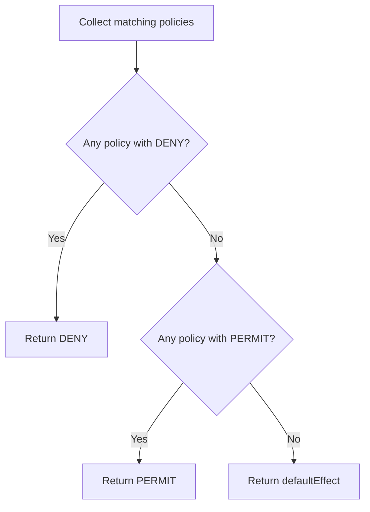
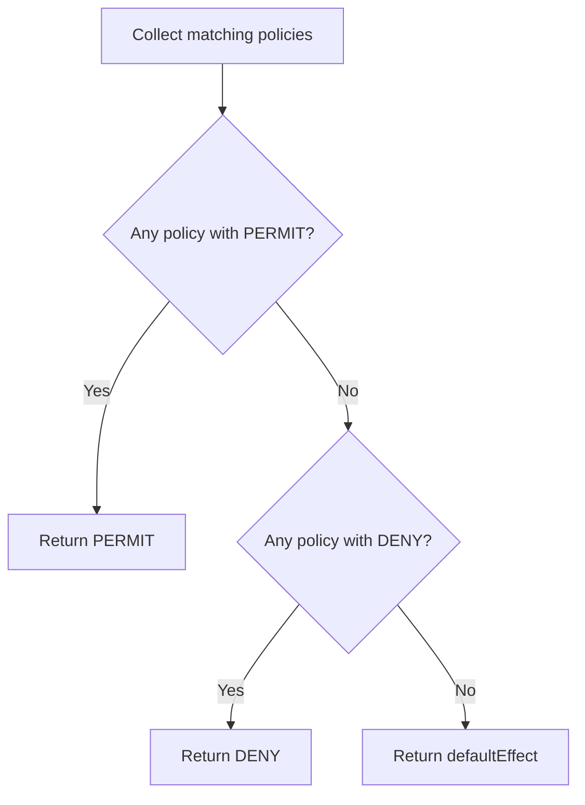
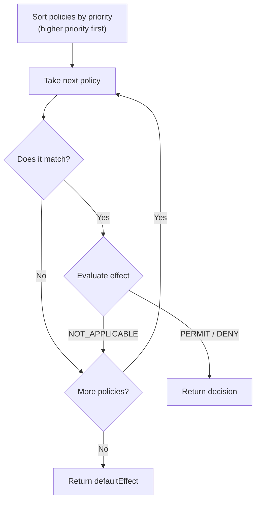

# Combining Algorithms

When multiple policies match a request, the combining algorithm determines the final decision.

## Overview

The PDP evaluates all matching policies and then applies the configured combining algorithm to produce a single decision. The algorithm is configured globally in the manifest:

```yaml
combiningAlgorithm: deny-overrides  # default
```

## Available Algorithms

| Algorithm | Description | Use Case |
|-----------|-------------|----------|
| `deny-overrides` | Any DENY wins (default) | Security-first, strictest |
| `permit-overrides` | Any PERMIT wins | Permissive environments |
| `first-applicable` | First matching policy decides | Priority-based, predictable |

## deny-overrides (Default)

If any matching policy has effect `deny`, the final decision is DENY. Otherwise, if any policy has effect `permit`, the final decision is PERMIT.

```
Matching policies: [PERMIT, PERMIT, DENY, PERMIT]
                                    ^^^^
Result: DENY (any deny wins)
```

This is the most restrictive algorithm and the recommended default.

### Evaluation Flow



### Example

Given these policies:

```yaml
# Policy 1: Permit admins everywhere
- id: admin-access
  effect: permit
  priority: 100
  subjects: [{ role: admin }]
  resources: [{ path: "/**" }]
  actions: [{ method: "*" }]

# Policy 2: Deny access to audit logs
- id: deny-audit-logs
  effect: deny
  priority: 200
  subjects: [{ role: admin }]
  resources: [{ path: "/api/audit/**" }]
  actions: [{ method: DELETE }]
```

**Request:** Admin DELETE /api/audit/123

Both policies match. With `deny-overrides`:
- Policy 1: PERMIT (admin-access)
- Policy 2: DENY (deny-audit-logs)
- **Result: DENY** (deny wins)

**Request:** Admin GET /api/users

Only Policy 1 matches:
- Policy 1: PERMIT (admin-access)
- **Result: PERMIT**

### When to Use

- Default for most applications
- When security is the priority
- When deny policies should always take precedence
- Compliance scenarios where explicit denials must be respected

---

## permit-overrides

If any matching policy has effect `permit`, the final decision is PERMIT. Otherwise, if any policy has effect `deny`, the final decision is DENY.

```
Matching policies: [DENY, DENY, PERMIT, DENY]
                                ^^^^^^
Result: PERMIT (any permit wins)
```

This is the most permissive algorithm.

### Evaluation Flow



### Example

Given these policies:

```yaml
# Policy 1: Deny all users from admin area
- id: deny-admin-area
  effect: deny
  priority: 100
  subjects: [{ role: user }]
  resources: [{ path: "/admin/**" }]
  actions: [{ method: "*" }]

# Policy 2: Permit super-users to admin area
- id: super-user-admin
  effect: permit
  priority: 200
  subjects:
    - claim:
        name: superUser
        value: true
  resources: [{ path: "/admin/**" }]
  actions: [{ method: "*" }]
```

**Request:** User with `superUser: true` claim accessing /admin/dashboard

Both policies match. With `permit-overrides`:
- Policy 1: DENY (deny-admin-area)
- Policy 2: PERMIT (super-user-admin)
- **Result: PERMIT** (permit wins)

### When to Use

- When you want any single permit to grant access
- Environments where access should be easy to grant
- Override scenarios where exceptions should take precedence over general denials

---

## first-applicable

The first matching policy (sorted by priority) determines the decision. Evaluation stops at the first match.

```
Matching policies (sorted by priority):
  [Priority 200: DENY]  ← first match, stops here
  [Priority 100: PERMIT]
  [Priority 50: PERMIT]

Result: DENY (first applicable policy)
```

### Evaluation Flow



### Example

Given these policies:

```yaml
# Policy 1: Emergency lockdown (highest priority)
- id: emergency-lockdown
  effect: deny
  priority: 1000
  subjects: []                   # All subjects
  resources: [{ path: "/**" }]
  actions: [{ method: "*" }]

# Policy 2: Admin access
- id: admin-access
  effect: permit
  priority: 100
  subjects: [{ role: admin }]
  resources: [{ path: "/**" }]
  actions: [{ method: "*" }]

# Policy 3: User read access
- id: user-read
  effect: permit
  priority: 90
  subjects: [{ role: user }]
  resources: [{ path: "/api/**" }]
  actions: [{ method: GET }]
```

**Request:** Admin GET /api/users

Sorted by priority: emergency-lockdown (1000), admin-access (100), user-read (90)

With `first-applicable`:
- Policy 1 (priority 1000): Matches (empty subjects = any) - DENY
- **Result: DENY** (first match stops evaluation)

If emergency-lockdown is removed:
- Policy 2 (priority 100): Matches (admin role) - PERMIT
- **Result: PERMIT** (first match stops evaluation)

### When to Use

- When policy order/priority is critical
- When you want predictable, ordered evaluation
- Emergency override scenarios (high-priority deny policies)
- Simple setups where the first match should be final

---

## Default Effect

When no policies match, the `defaultEffect` configuration determines the outcome:

```yaml
defaultEffect: deny    # Default: deny everything not explicitly permitted
```

| Value | Description |
|-------|-------------|
| `deny` | Deny if no policy matches (secure default) |
| `permit` | Permit if no policy matches (open default) |

**Recommendation:** Always use `deny` as the default effect. This ensures that any request not explicitly covered by a policy is denied (deny-by-default / closed-world assumption).

---

## Comparison

Consider a request that matches these policies:

| Policy | Effect | Priority |
|--------|--------|----------|
| A | permit | 100 |
| B | deny | 90 |
| C | permit | 80 |

**Results by algorithm:**

| Algorithm | Result | Reason |
|-----------|--------|--------|
| `deny-overrides` | DENY | Policy B (deny) overrides all permits |
| `permit-overrides` | PERMIT | Policy A (permit) overrides the deny |
| `first-applicable` | PERMIT | Policy A (priority 100) is first match |

---

## Configuration

### Via manifest.yaml

```yaml
combiningAlgorithm: deny-overrides
defaultEffect: deny
```

### Via plugin code

```typescript
export default authzPlugin({
  combiningAlgorithm: "first-applicable",
  defaultEffect: "deny",
});
```

## Choosing the Right Algorithm

```
Need maximum security?
  → deny-overrides (default)

Need flexible overrides where any permit grants access?
  → permit-overrides

Need predictable, priority-based evaluation?
  → first-applicable
```

**Rule of thumb:** Start with `deny-overrides` and only change if you have a specific reason to.

## Next Steps

- [Policies](policies.md) - Policy structure deep dive
- [Configuration](../guides/configuration.md) - Configuration reference
- [Policy Management](../guides/policy-management.md) - Managing policies via API and seed
- [API Reference](../api-reference.md) - Full API documentation
