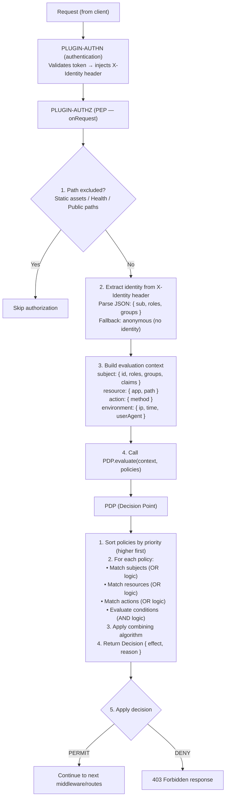

# Overview

XACML-like policy-based authorization plugin for Buntime with PEP, PDP, and PAP components.

## Features

- **PEP** (Policy Enforcement Point) - Intercepts requests and applies access decisions
- **PDP** (Policy Decision Point) - Evaluates policies and returns PERMIT/DENY
- **PAP** (Policy Administration Point) - CRUD operations for policy management via API
- **Combining Algorithms** - deny-overrides, permit-overrides, first-applicable
- **Policy Seeding** - Auto-seed default policies at startup from manifest or file
- **Path Exclusion** - Regex-based path exclusion for static assets and health checks
- **Storage** - Memory or file-based policy storage with persistence
- **Explain API** - Debug authorization decisions with detailed explanations
- **Built-in UI** - React SPA for policy management and evaluation testing
- **Conditions** - Time-based, IP-based, and custom conditions for fine-grained control

## Architecture

The plugin-authz functions as middleware in the Buntime request pipeline, running after `plugin-authn`:



**API Mode**: Persistent (routes and `onRequest` in `plugin.ts`, runs on main thread).

## Main Components

### 1. Policy Enforcement Point (PEP)

The PEP is the entry point for every request. It runs inside the `onRequest` lifecycle hook and acts as the gatekeeper.

**Responsibilities:**
- Check if the request path is excluded from authorization
- Extract identity from the `X-Identity` header (injected by plugin-authn)
- Build the `EvaluationContext` from the request, identity, and environment
- Call the PDP with the context and all stored policies
- Enforce the PDP decision: continue on PERMIT, return 403 on DENY

**File:** `plugin.ts` (onRequest handler)

### 2. Policy Decision Point (PDP)

The PDP evaluates policies against a given context and returns a decision. It is stateless and deterministic.

**Responsibilities:**
- Sort policies by priority (higher priority evaluated first)
- Match policies against subject, resource, and action
- Evaluate conditions (time, IP, custom)
- Apply combining algorithm to produce a final decision
- Return `Decision { effect, reason, matchedPolicy }`

**Matching logic:**
- **Subjects**: OR logic (at least one subject rule must match)
- **Resources**: OR logic (at least one resource rule must match)
- **Actions**: OR logic (at least one action rule must match)
- **Conditions**: AND logic (all conditions must be true)

**File:** `server/pdp.ts`

### 3. Policy Administration Point (PAP)

The PAP manages policy storage and retrieval. It supports both in-memory and file-based storage.

**Responsibilities:**
- Store policies in memory (Map by ID)
- Persist to file when using file-based storage
- Provide CRUD operations: getAll, get, set, delete
- Load policies from file on startup
- Support bulk loading via `loadFromArray()`

**File:** `server/pap.ts`

### 4. API Routes

Hono-based REST API for policy management and evaluation.

**Endpoints:**

| Route | Method | Description |
|-------|--------|-------------|
| `/api/policies` | GET | List all policies |
| `/api/policies/:id` | GET | Get policy by ID |
| `/api/policies` | POST | Create or update policy |
| `/api/policies/:id` | DELETE | Delete policy |
| `/api/evaluate` | POST | Evaluate authorization context |
| `/api/explain` | POST | Debug decision with explanation |

**File:** `server/api.ts`

### 5. Built-in UI

React SPA for managing policies and testing evaluations. Mounted at the plugin base path (`/authz`).

**Features:**
- View and manage policies
- Test policy evaluation with custom contexts
- i18n support (English, Portuguese)

**File:** `client/` directory

## Tech Stack

- **Runtime**: Bun
- **Framework**: Hono (API routes)
- **UI**: React + TanStack Router
- **Types**: TypeScript
- **i18n**: English and Portuguese locales

## File Structure

```
plugins/plugin-authz/
├── manifest.yaml          # Configuration and defaults
├── plugin.ts              # Main plugin (PEP, onRequest, provides)
├── index.ts               # Worker entrypoint (serves UI SPA)
├── server/
│   ├── api.ts            # Hono API routes (CRUD, evaluate, explain)
│   ├── pap.ts            # Policy Administration Point
│   ├── pdp.ts            # Policy Decision Point
│   └── types.ts          # TypeScript type definitions
├── client/               # UI SPA (React + TanStack Router)
│   └── locales/          # i18n (en, pt)
└── dist/                 # Compiled output
```

## Lifecycle Hooks

### onInit

Initializes all authorization components:

1. Create PAP instance with configured store type
2. Load existing policies from file (if file store)
3. Load inline policies (deprecated, use policySeed)
4. Run policy seeding from manifest configuration
5. Create PDP instance with combining algorithm and default effect
6. Initialize API with PAP and PDP instances
7. Compile exclude path regex patterns
8. Create AuthzService for other plugins
9. Log initialization status

```
[authz] Authorization initialized (2 policies, algorithm: deny-overrides)
```

### onRequest

Request processing pipeline:

1. **Path exclusion check**: Skip authorization for excluded paths (static assets, health)
2. **Identity extraction**: Parse `X-Identity` header from plugin-authn
3. **Early exit**: Skip if no identity and no policies
4. **Context building**: Build `EvaluationContext` from request, identity, and environment
5. **PDP evaluation**: Evaluate all policies against the context
6. **Decision enforcement**: PERMIT continues, DENY returns 403

```
[authz] Authorization: permit for user-123 on /api/users (admin-full-access)
[authz] Authorization: deny for user-456 on /admin/settings (no match)
```

## Service Registry

The plugin exposes an `AuthzService` via `provides()` for use by other plugins:

```typescript
interface AuthzService {
  seedPolicies(policies: Policy[], options?: { onlyIfEmpty?: boolean }): Promise<number>;
  getPap(): PolicyAdministrationPoint;
  getPdp(): PolicyDecisionPoint;
}
```

**Usage from another plugin:**

```typescript
// In another plugin's onInit:
const authz = ctx.getPlugin<AuthzService>("@buntime/plugin-authz");
if (authz) {
  await authz.seedPolicies([
    {
      id: "my-plugin-admin",
      effect: "permit",
      subjects: [{ role: "admin" }],
      resources: [{ path: "/my-plugin/**" }],
      actions: [{ method: "*" }],
    },
  ]);
}
```

## Integration with Other Plugins

### plugin-authn (required)

The authz plugin depends on `plugin-authn` for identity information. The authn plugin validates authentication tokens and injects the `X-Identity` header containing the user's identity:

```json
X-Identity: {"sub": "user-123", "roles": ["admin"], "groups": ["engineering"], "claims": {}}
```

If `X-Identity` is not present, the subject defaults to:
```json
{ "id": "anonymous", "roles": [], "groups": [], "claims": {} }
```

### Other plugins (optional)

Any plugin can seed authorization policies using the `AuthzService` from the service registry. This allows plugins to declare their own access control requirements.

## Decision Effects

The PDP can return four possible effects:

| Effect | Description |
|--------|-------------|
| `permit` | Access is allowed |
| `deny` | Access is denied |
| `not_applicable` | Policy matched but conditions were not met |
| `indeterminate` | Error during evaluation |

The PEP treats `permit`, `not_applicable`, and `indeterminate` as "continue" (only `deny` blocks the request).

## Next Steps

- [Policies](policies.md) - Policy structure deep dive
- [Combining Algorithms](combining-algorithms.md) - Algorithm details and examples
- [Configuration](../guides/configuration.md) - Complete configuration reference
- [API Reference](../api-reference.md) - Full API documentation
