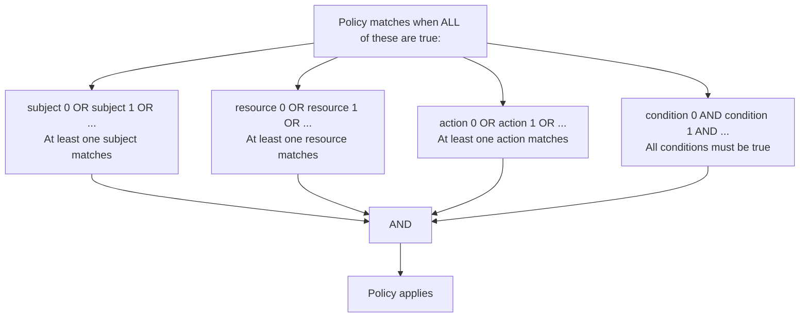
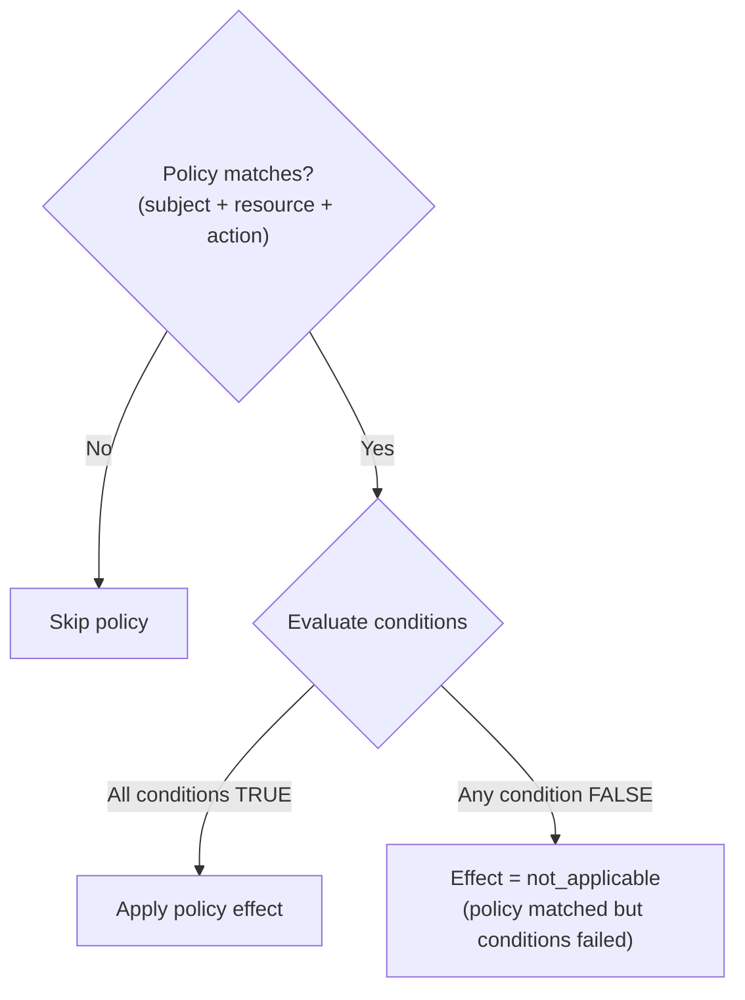

# Policies

Deep dive into policy structure, matching rules, conditions, and evaluation logic.

## Policy Structure

A policy defines who can do what on which resource, with optional conditions:

```typescript
interface Policy {
  id: string;              // Unique identifier
  name?: string;           // Human-readable name
  description?: string;    // Policy description
  effect: Effect;          // "permit" or "deny"
  priority?: number;       // Higher = evaluated first (default: 0)
  subjects: SubjectMatch[];   // Who (OR logic)
  resources: ResourceMatch[]; // What (OR logic)
  actions: ActionMatch[];     // How (OR logic)
  conditions?: Condition[];   // When (AND logic)
}
```

**Matching Logic:**



Empty arrays for subjects, resources, or actions match everything (no restriction).

## Subject Matching

Subjects define **who** the policy applies to. Each `SubjectMatch` is evaluated against the `EvaluationContext.subject` extracted from the `X-Identity` header.

```typescript
interface SubjectMatch {
  id?: string;       // Match specific user ID
  role?: string;     // Match role (supports wildcards)
  group?: string;    // Match group membership
  claim?: {          // Match custom claim
    name: string;
    value: string | number | boolean;
    operator?: "eq" | "neq" | "gt" | "lt" | "contains" | "regex";
  };
}
```

Within a single `SubjectMatch`, all specified fields must match (AND logic). Across multiple `SubjectMatch` entries, any one must match (OR logic).

### Match by Role

Roles support wildcards using `*`:

```yaml
subjects:
  - role: admin            # Exact match
  - role: "admin:*"        # Wildcard: admin:users, admin:settings, etc.
  - role: "*"              # Any role
```

The wildcard `*` is converted to `.*` for regex matching. The match is tested against each role in the subject's `roles` array.

```
Subject roles: ["admin:users", "viewer"]

role: "admin:*"  →  /^admin:.*$/  →  matches "admin:users"  →  TRUE
role: "editor"   →  /^editor$/    →  no match               →  FALSE
```

### Match by Group

Groups are matched by exact string comparison:

```yaml
subjects:
  - group: engineering     # Exact match
  - group: ops             # OR this group
```

Tested against the subject's `groups` array using `includes()`.

### Match by ID

Match a specific user by their unique identifier:

```yaml
subjects:
  - id: "user-123"         # Exact user
  - id: "service-account"  # OR this specific service account
```

### Match by Claim

Match custom claims from the identity token:

```yaml
subjects:
  - claim:
      name: department
      value: engineering
      operator: eq

  - claim:
      name: level
      value: 5
      operator: gt

  - claim:
      name: email
      value: "@company.com"
      operator: contains

  - claim:
      name: email
      value: "^admin@.*\\.com$"
      operator: regex
```

**Claim Operators:**

| Operator | Description | Example |
|----------|-------------|---------|
| `eq` | Equals (default) | `department == "engineering"` |
| `neq` | Not equals | `status != "suspended"` |
| `gt` | Greater than (numeric) | `level > 5` |
| `lt` | Less than (numeric) | `attempts < 3` |
| `contains` | String contains | `email contains "@company.com"` |
| `regex` | Regex test | `email matches /^admin@.*\.com$/` |

### Combined Subject Match

All fields within a single `SubjectMatch` must be true (AND):

```yaml
# User must have role "editor" AND be in group "content-team"
subjects:
  - role: editor
    group: content-team
```

Multiple entries use OR logic:

```yaml
# User must have role "admin" OR be in group "ops"
subjects:
  - role: admin
  - group: ops
```

## Resource Matching

Resources define **what** is being accessed. Each `ResourceMatch` is evaluated against `EvaluationContext.resource`.

```typescript
interface ResourceMatch {
  app?: string;      // Match application name (supports wildcards)
  path?: string;     // Match URL path (supports wildcards)
  type?: string;     // Match resource type
  owner?: "self";    // Match resource owned by subject
}
```

### Match by Path

Paths support wildcards using `*`:

```yaml
resources:
  - path: "/api/**"           # All paths under /api/
  - path: "/api/users/*"      # Single segment: /api/users/123 but not /api/users/123/posts
  - path: "/admin/dashboard"  # Exact path
  - path: "/**"               # All paths
```

Wildcards are converted to regex (`*` becomes `.*`):

```
path: "/api/**"      →  /^\/api\/.*.*$/  →  matches "/api/users/123"
path: "/api/users/*" →  /^\/api\/users\/.*$/  →  matches "/api/users/123"
path: "/**"          →  /^\/.*.*$/  →  matches everything
```

### Match by App

Match by application name (useful in multi-app setups):

```yaml
resources:
  - app: dashboard           # Exact app name
  - app: "admin-*"           # Wildcard: admin-panel, admin-api, etc.
```

### Match by Type

Match by resource type:

```yaml
resources:
  - type: api               # API resources
  - type: page              # Page resources
```

### Combined Resource Match

All fields within a single `ResourceMatch` must match (AND):

```yaml
# Must be the dashboard app AND under /api/ path
resources:
  - app: dashboard
    path: "/api/**"
```

## Action Matching

Actions define **how** the resource is being accessed. Each `ActionMatch` is evaluated against `EvaluationContext.action`.

```typescript
interface ActionMatch {
  method?: string;       // HTTP method (supports wildcards)
  operation?: string;    // Custom operation name
}
```

### Match by Method

HTTP methods are case-insensitive:

```yaml
actions:
  - method: "*"          # All methods
  - method: GET          # GET only
  - method: POST         # POST only
  - method: PUT          # PUT only
  - method: DELETE       # DELETE only
```

The special value `"*"` matches any method.

### Match by Operation

Custom operations for non-HTTP contexts:

```yaml
actions:
  - operation: "read"
  - operation: "write"
  - operation: "admin:delete"
```

### Common Action Patterns

```yaml
# Read-only access
actions:
  - method: GET
  - method: HEAD
  - method: OPTIONS

# Write access
actions:
  - method: POST
  - method: PUT
  - method: PATCH
  - method: DELETE

# Full access
actions:
  - method: "*"
```

## Conditions

Conditions provide fine-grained control beyond subject/resource/action matching. All conditions must be true for the policy to apply (AND logic).

```typescript
interface Condition {
  type: "time" | "ip" | "custom";

  // Time-based
  after?: string;          // "HH:mm" format
  before?: string;         // "HH:mm" format
  dayOfWeek?: number[];    // 0-6 (Sunday-Saturday)

  // IP-based
  cidr?: string;           // "192.168.1.0/24"
  allowlist?: string[];    // Allowed IP addresses
  blocklist?: string[];    // Blocked IP addresses

  // Custom
  expression?: string;     // Custom expression
}
```

### Time-Based Conditions

Restrict access to specific time windows:

```yaml
conditions:
  # Business hours (9 AM - 6 PM)
  - type: time
    after: "09:00"
    before: "18:00"

  # Weekdays only (Monday-Friday)
  - type: time
    dayOfWeek: [1, 2, 3, 4, 5]

  # Combined: business hours on weekdays
  - type: time
    after: "09:00"
    before: "18:00"
    dayOfWeek: [1, 2, 3, 4, 5]
```

**Time evaluation:**
- `after` and `before` use `HH:mm` format (24-hour)
- Time is compared using minutes since midnight
- `dayOfWeek` uses JavaScript convention: 0 = Sunday, 6 = Saturday

### IP-Based Conditions

Restrict access by client IP:

```yaml
conditions:
  # Allow only specific IPs
  - type: ip
    allowlist:
      - "10.0.0.1"
      - "10.0.0.2"
      - "192.168.1.100"

  # Block specific IPs
  - type: ip
    blocklist:
      - "192.168.1.200"
      - "10.0.0.99"
```

**IP evaluation:**
- `allowlist`: Request IP must be in the list (whitelist)
- `blocklist`: Request IP must NOT be in the list (blacklist)
- IP is extracted from `X-Forwarded-For` or `X-Real-IP` headers

### Condition Evaluation Flow

When a policy has conditions, the PDP follows this flow:



## Priority

Policies are sorted by priority before evaluation (higher priority first):

```yaml
# Evaluated in this order:
- id: emergency-lockdown    # priority: 1000 (first)
  priority: 1000

- id: admin-full-access     # priority: 100 (second)
  priority: 100

- id: users-read-only       # priority: 90 (third)
  priority: 90

- id: default-deny          # priority: 0 (last)
  priority: 0
```

**Default priority:** `0`

Priority matters especially with:
- `first-applicable` algorithm: first match wins
- `deny-overrides` / `permit-overrides`: determines which matched policy is used when multiple match

## Complete Examples

### Admin Full Access

```yaml
- id: admin-full-access
  name: Admin Full Access
  effect: permit
  priority: 100
  subjects:
    - role: admin
  resources:
    - path: "/**"
  actions:
    - method: "*"
```

### Time-Restricted API Access

```yaml
- id: business-hours-api
  name: Business Hours API Access
  effect: permit
  priority: 70
  subjects:
    - role: user
  resources:
    - path: "/api/reports/**"
  actions:
    - method: GET
  conditions:
    - type: time
      after: "09:00"
      before: "18:00"
      dayOfWeek: [1, 2, 3, 4, 5]
```

### IP-Restricted Admin Access

```yaml
- id: admin-from-office
  name: Admin Access from Office
  effect: permit
  priority: 95
  subjects:
    - role: admin
  resources:
    - path: "/admin/**"
  actions:
    - method: "*"
  conditions:
    - type: ip
      allowlist:
        - "10.0.0.0"
        - "10.0.0.1"
        - "192.168.1.100"
```

### Claim-Based Access

```yaml
- id: engineering-deploy
  name: Engineering Deploy Access
  effect: permit
  priority: 80
  subjects:
    - claim:
        name: department
        value: engineering
        operator: eq
      role: "admin:*"
  resources:
    - path: "/api/deploy/**"
  actions:
    - method: POST
```

### Deny Policy (Block Specific Action)

```yaml
- id: block-user-delete
  name: Block User Deletion
  effect: deny
  priority: 200
  subjects:
    - role: user
  resources:
    - path: "/api/users/**"
  actions:
    - method: DELETE
```

## Next Steps

- [Combining Algorithms](combining-algorithms.md) - How decisions are combined
- [Configuration](../guides/configuration.md) - Configuration reference
- [Policy Management](../guides/policy-management.md) - Managing policies via API and seed
- [API Reference](../api-reference.md) - Full API documentation
