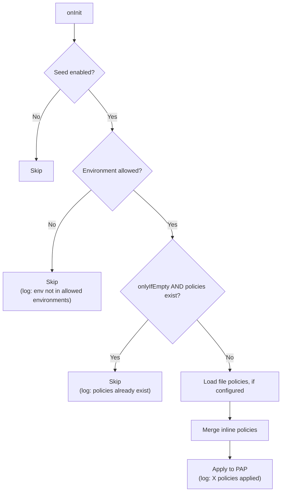

# Policy Management

Guide for managing authorization policies via API, seed configuration, and the service registry.

## Methods of Managing Policies

There are three ways to manage policies:

| Method | When | Persistence | Use Case |
|--------|------|-------------|----------|
| **Policy Seed** | At startup | Depends on store | Default policies, bootstrapping |
| **REST API** | At runtime | Depends on store | Dynamic management, UI |
| **Service Registry** | At startup | Depends on store | Cross-plugin policy registration |

## Policy Seeding

Policy seeding provisions default policies at startup. This is the recommended way to bootstrap your authorization rules.

### Manifest Seed (Inline)

Define policies directly in `manifest.yaml`:

```yaml
policySeed:
  enabled: true
  onlyIfEmpty: true
  environments: ["*"]
  policies:
    - id: admin-full-access
      name: Admin Full Access
      description: Allow admin role full access
      effect: permit
      priority: 100
      subjects:
        - role: admin
      resources:
        - path: "/**"
      actions:
        - method: "*"

    - id: users-read-only
      name: Users Read-Only
      description: Allow user role read-only access to API
      effect: permit
      priority: 90
      subjects:
        - role: user
      resources:
        - path: "/api/**"
      actions:
        - method: GET
```

### File Seed

Load policies from a JSON file:

```yaml
policySeed:
  enabled: true
  onlyIfEmpty: true
  file: ./seed-policies.json
```

**seed-policies.json:**

```json
{
  "policies": [
    {
      "id": "admin-full-access",
      "name": "Admin Full Access",
      "effect": "permit",
      "priority": 100,
      "subjects": [{ "role": "admin" }],
      "resources": [{ "path": "/**" }],
      "actions": [{ "method": "*" }]
    },
    {
      "id": "users-read-only",
      "name": "Users Read-Only",
      "effect": "permit",
      "priority": 90,
      "subjects": [{ "role": "user" }],
      "resources": [{ "path": "/api/**" }],
      "actions": [{ "method": "GET" }]
    }
  ]
}
```

File and inline policies can be combined. File policies are loaded first, then inline policies are merged.

### Seed Behavior

The seeding process follows this flow:



### Environment-Specific Seeding

Seed different policies based on `NODE_ENV`:

```yaml
# Development: permissive defaults
policySeed:
  enabled: true
  environments: ["development"]
  policies:
    - id: dev-allow-all
      effect: permit
      subjects: []
      resources: [{ path: "/**" }]
      actions: [{ method: "*" }]
```

```yaml
# Production: strict defaults
policySeed:
  enabled: true
  environments: ["production"]
  policies:
    - id: admin-only
      effect: permit
      priority: 100
      subjects: [{ role: admin }]
      resources: [{ path: "/**" }]
      actions: [{ method: "*" }]
```

---

## REST API Management

Use the PAP API to manage policies at runtime. All endpoints are at `/authz/api/*`.

### List Policies

```bash
curl http://localhost:8000/authz/api/policies
```

**Response:**

```json
[
  {
    "id": "admin-full-access",
    "name": "Admin Full Access",
    "effect": "permit",
    "priority": 100,
    "subjects": [{ "role": "admin" }],
    "resources": [{ "path": "/**" }],
    "actions": [{ "method": "*" }]
  }
]
```

### Get Single Policy

```bash
curl http://localhost:8000/authz/api/policies/admin-full-access
```

### Create a Policy

```bash
curl -X POST http://localhost:8000/authz/api/policies \
  -H "Content-Type: application/json" \
  -d '{
    "id": "editors-articles",
    "name": "Editors Article Access",
    "description": "Allow editors to manage articles",
    "effect": "permit",
    "priority": 80,
    "subjects": [
      { "role": "editor" },
      { "group": "content-team" }
    ],
    "resources": [
      { "path": "/api/articles/**" }
    ],
    "actions": [
      { "method": "GET" },
      { "method": "POST" },
      { "method": "PUT" }
    ]
  }'
```

**Response:** `201 Created`

```json
{
  "id": "editors-articles",
  "name": "Editors Article Access",
  "description": "Allow editors to manage articles",
  "effect": "permit",
  "priority": 80,
  "subjects": [{ "role": "editor" }, { "group": "content-team" }],
  "resources": [{ "path": "/api/articles/**" }],
  "actions": [{ "method": "GET" }, { "method": "POST" }, { "method": "PUT" }]
}
```

### Update a Policy

Use the same `POST /api/policies` endpoint with the same `id`. The entire policy is replaced.

```bash
# Update priority and add DELETE method
curl -X POST http://localhost:8000/authz/api/policies \
  -H "Content-Type: application/json" \
  -d '{
    "id": "editors-articles",
    "name": "Editors Article Access",
    "effect": "permit",
    "priority": 85,
    "subjects": [{ "role": "editor" }],
    "resources": [{ "path": "/api/articles/**" }],
    "actions": [
      { "method": "GET" },
      { "method": "POST" },
      { "method": "PUT" },
      { "method": "DELETE" }
    ]
  }'
```

### Delete a Policy

```bash
curl -X DELETE http://localhost:8000/authz/api/policies/editors-articles
```

**Response:** `200 OK`

```json
{
  "success": true
}
```

### Test a Policy Decision

Use the evaluate endpoint to test without making a real request:

```bash
curl -X POST http://localhost:8000/authz/api/evaluate \
  -H "Content-Type: application/json" \
  -d '{
    "subject": {
      "id": "user-1",
      "roles": ["editor"],
      "groups": ["content-team"],
      "claims": {}
    },
    "resource": {
      "app": "",
      "path": "/api/articles/123"
    },
    "action": {
      "method": "PUT"
    },
    "environment": {
      "ip": "127.0.0.1",
      "time": "2026-02-13T10:00:00Z"
    }
  }'
```

**Response:**

```json
{
  "effect": "permit",
  "reason": "Allow editors to manage articles",
  "matchedPolicy": "editors-articles"
}
```

### Debug a Decision

Use the explain endpoint for detailed decision debugging:

```bash
curl -X POST http://localhost:8000/authz/api/explain \
  -H "Content-Type: application/json" \
  -d '{
    "subject": {
      "id": "user-2",
      "roles": ["user"],
      "groups": [],
      "claims": {}
    },
    "resource": {
      "app": "",
      "path": "/admin/settings"
    },
    "action": {
      "method": "POST"
    },
    "environment": {
      "ip": "10.0.0.1",
      "time": "2026-02-13T10:00:00Z"
    }
  }'
```

**Response:**

```json
{
  "context": {
    "subject": { "id": "user-2", "roles": ["user"], "groups": [], "claims": {} },
    "resource": { "app": "", "path": "/admin/settings" },
    "action": { "method": "POST" },
    "environment": { "ip": "10.0.0.1", "time": "2026-02-13T10:00:00Z" }
  },
  "decision": {
    "effect": "deny",
    "reason": "No applicable policy"
  },
  "policies": [
    { "id": "admin-full-access", "name": "Admin Full Access", "effect": "permit", "priority": 100 },
    { "id": "users-read-only", "name": "Users Read-Only", "effect": "permit", "priority": 90 }
  ]
}
```

---

## Service Registry (Cross-Plugin)

Other Buntime plugins can register their own authorization policies using the `AuthzService` exposed via the service registry.

### Service Interface

```typescript
interface AuthzService {
  seedPolicies(policies: Policy[], options?: { onlyIfEmpty?: boolean }): Promise<number>;
  getPap(): PolicyAdministrationPoint;
  getPdp(): PolicyDecisionPoint;
}
```

### Seeding from Another Plugin

```typescript
// In another plugin's onInit handler:
async onInit(ctx: PluginContext) {
  const authz = ctx.getPlugin<AuthzService>("@buntime/plugin-authz");

  if (authz) {
    const count = await authz.seedPolicies([
      {
        id: "my-plugin-admin",
        name: "My Plugin Admin Access",
        effect: "permit",
        priority: 90,
        subjects: [{ role: "admin" }],
        resources: [{ path: "/my-plugin/**" }],
        actions: [{ method: "*" }],
      },
      {
        id: "my-plugin-users-read",
        name: "My Plugin Users Read",
        effect: "permit",
        priority: 80,
        subjects: [{ role: "user" }],
        resources: [{ path: "/my-plugin/api/**" }],
        actions: [{ method: "GET" }],
      },
    ]);

    ctx.logger.info(`Seeded ${count} authorization policies`);
  }
}
```

### Seed Options

```typescript
// Always seed (even if policies already exist)
await authz.seedPolicies(policies, { onlyIfEmpty: false });

// Only seed if PAP is empty (default behavior)
await authz.seedPolicies(policies, { onlyIfEmpty: true });

// Default (same as onlyIfEmpty: true)
await authz.seedPolicies(policies);
```

### Direct PAP/PDP Access

For advanced use cases, you can access the PAP and PDP directly:

```typescript
const authz = ctx.getPlugin<AuthzService>("@buntime/plugin-authz");

if (authz) {
  // Direct PAP access
  const pap = authz.getPap();
  const allPolicies = pap.getAll();
  const specific = pap.get("admin-full-access");

  // Direct PDP access
  const pdp = authz.getPdp();
  const decision = pdp.evaluate(context, allPolicies);
}
```

---

## Built-in UI

The plugin includes a React SPA for visual policy management, mounted at the plugin base path (`/authz`).

### Navigation

| Path | Page | Description |
|------|------|-------------|
| `/authz/policies` | Policies | View, create, edit, and delete policies |
| `/authz/evaluate` | Evaluate | Test policy evaluation with custom contexts |

### Accessing the UI

Navigate to `http://localhost:8000/authz` in your browser. The UI provides:

- **Policy list**: View all policies with their effect, priority, and matching rules
- **Policy editor**: Create and edit policies with a form interface
- **Evaluation tester**: Build evaluation contexts and test decisions
- **i18n support**: English and Portuguese translations

---

## Common Patterns

### Bootstrap with Seed, Manage with API

The most common pattern: seed default policies at startup, then use the API (or UI) for ongoing management.

```yaml
# manifest.yaml
store: file
path: ./policies.json
policySeed:
  enabled: true
  onlyIfEmpty: true
  policies:
    - id: admin-full-access
      effect: permit
      priority: 100
      subjects: [{ role: admin }]
      resources: [{ path: "/**" }]
      actions: [{ method: "*" }]
```

1. First startup: seed runs, creates `admin-full-access` in PAP (and persists to file)
2. Additional policies are created via API (persisted to file)
3. Subsequent restarts: seed skips (policies already exist), file is loaded

### Emergency Lockdown

Create a high-priority deny policy to block all access:

```bash
curl -X POST http://localhost:8000/authz/api/policies \
  -H "Content-Type: application/json" \
  -d '{
    "id": "emergency-lockdown",
    "name": "Emergency Lockdown",
    "effect": "deny",
    "priority": 9999,
    "subjects": [],
    "resources": [{ "path": "/**" }],
    "actions": [{ "method": "*" }]
  }'
```

Remove when resolved:

```bash
curl -X DELETE http://localhost:8000/authz/api/policies/emergency-lockdown
```

### Feature-Specific Policies

When adding a new feature, create policies that match its routes:

```bash
# Allow all authenticated users to read the new feature
curl -X POST http://localhost:8000/authz/api/policies \
  -H "Content-Type: application/json" \
  -d '{
    "id": "reports-read",
    "name": "Reports Read Access",
    "effect": "permit",
    "priority": 70,
    "subjects": [{ "role": "user" }, { "role": "admin" }],
    "resources": [{ "path": "/api/reports/**" }],
    "actions": [{ "method": "GET" }]
  }'

# Allow only admins to manage reports
curl -X POST http://localhost:8000/authz/api/policies \
  -H "Content-Type: application/json" \
  -d '{
    "id": "reports-manage",
    "name": "Reports Management",
    "effect": "permit",
    "priority": 75,
    "subjects": [{ "role": "admin" }],
    "resources": [{ "path": "/api/reports/**" }],
    "actions": [{ "method": "POST" }, { "method": "PUT" }, { "method": "DELETE" }]
  }'
```

### Time-Restricted Maintenance Window

Allow maintenance access only during specific hours:

```bash
curl -X POST http://localhost:8000/authz/api/policies \
  -H "Content-Type: application/json" \
  -d '{
    "id": "maintenance-window",
    "name": "Maintenance Window Access",
    "effect": "permit",
    "priority": 150,
    "subjects": [{ "group": "ops" }],
    "resources": [{ "path": "/api/maintenance/**" }],
    "actions": [{ "method": "*" }],
    "conditions": [
      {
        "type": "time",
        "after": "02:00",
        "before": "06:00"
      }
    ]
  }'
```

### IP-Restricted Admin Access

```bash
curl -X POST http://localhost:8000/authz/api/policies \
  -H "Content-Type: application/json" \
  -d '{
    "id": "admin-office-only",
    "name": "Admin Access from Office Only",
    "effect": "permit",
    "priority": 95,
    "subjects": [{ "role": "admin" }],
    "resources": [{ "path": "/admin/**" }],
    "actions": [{ "method": "*" }],
    "conditions": [
      {
        "type": "ip",
        "allowlist": ["10.0.0.1", "10.0.0.2", "192.168.1.0"]
      }
    ]
  }'
```

---

## Debugging Tips

### 1. Use the Explain Endpoint

Always start debugging with `/api/explain`. It shows:
- The full evaluation context
- The final decision with reason
- All policies in the store with their priorities

### 2. Check Exclude Paths

If a request is not being authorized, it might match an exclude pattern:

```yaml
excludePaths:
  - "/health"        # Exact match
  - "/public/.*"     # All public paths
```

Excluded paths bypass authorization entirely (no PEP evaluation).

### 3. Check Policy Priority

With `first-applicable`, the order matters. A high-priority deny policy blocks everything below it.

### 4. Verify Identity

The PEP reads the `X-Identity` header. If authentication is not working, the subject will be:

```json
{ "id": "anonymous", "roles": [], "groups": [], "claims": {} }
```

### 5. Enable Debug Logging

Set `RUNTIME_LOG_LEVEL=debug` to see PEP decisions:

```
[authz] Authorization: permit for user-123 on /api/users (admin-full-access)
[authz] Authorization: deny for user-456 on /admin/settings (no match)
[authz] Policy seed skipped - policies already exist
```

## Next Steps

- [API Reference](../api-reference.md) - Full API documentation
- [Overview](../concepts/overview.md) - Architecture and components
- [Policies](../concepts/policies.md) - Policy structure deep dive
- [Combining Algorithms](../concepts/combining-algorithms.md) - Algorithm details
- [Configuration](configuration.md) - Configuration reference
