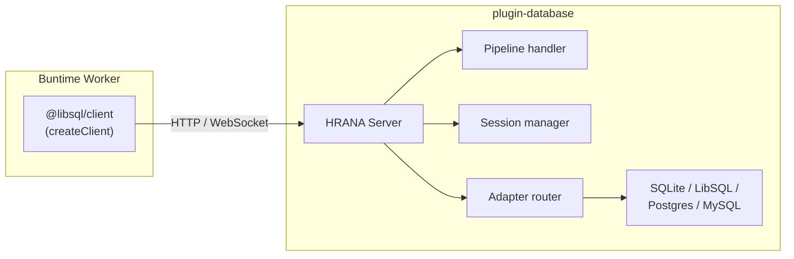
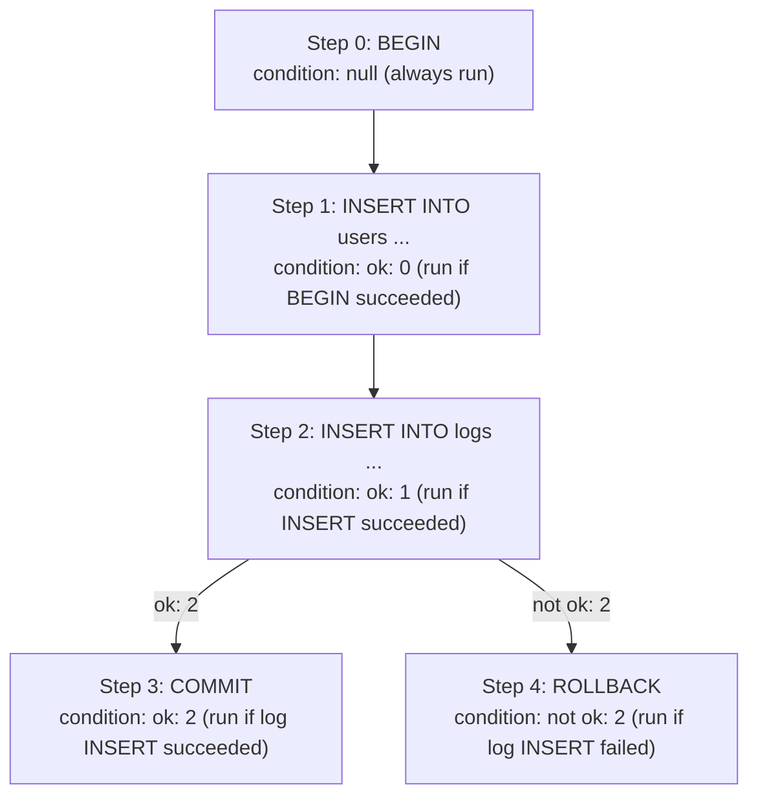
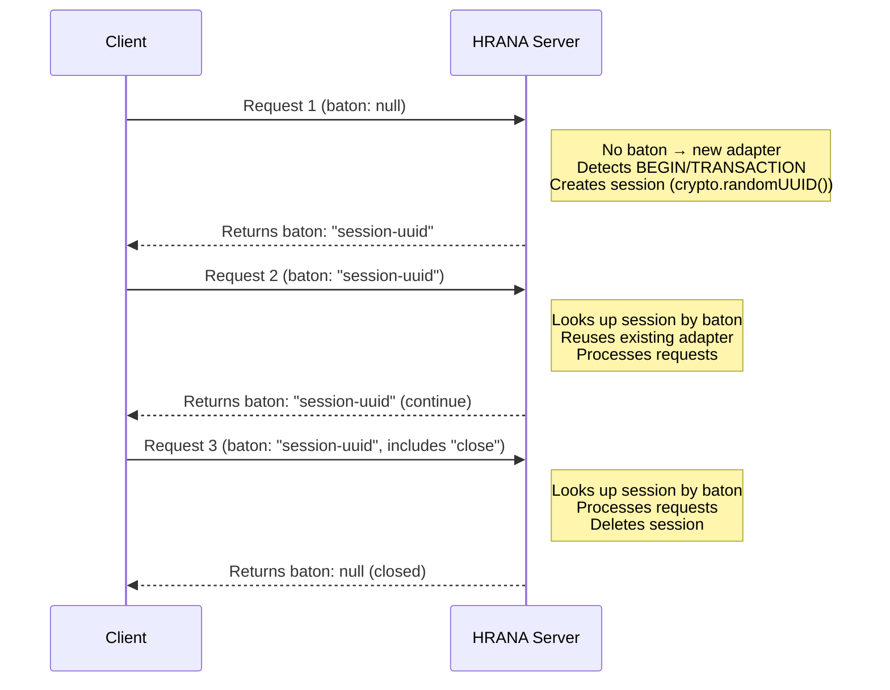

# HRANA Protocol

Implementation details of the HRANA 3 protocol in plugin-database. This protocol allows Buntime workers to execute SQL queries against the database through the runtime's plugin system using standard `@libsql/client`.

## Overview

HRANA (HTTP Remote Access to Named Arrays) is the wire protocol used by LibSQL/Turso clients. The plugin implements a HRANA-compatible server that translates protocol messages into database adapter operations, enabling workers to use `@libsql/client` to connect to any configured adapter (not just LibSQL).



## Transports

### HTTP Pipeline

`POST /database/api/pipeline`

Stateless batch execution. Each request contains a list of stream requests that are executed sequentially.

**Use case:** Simple queries, short-lived operations, fire-and-forget.

### WebSocket

`WS /database/api/ws`

Persistent connection with request-response messaging. Each WebSocket message contains a single request with a `request_id` for correlation.

**Use case:** Apps with many queries, persistent connections, interactive sessions.

## Headers

Both transports support routing headers:

| Header | Description | Example |
|--------|-------------|---------|
| `x-database-adapter` | Target adapter type | `sqlite`, `libsql`, `postgres`, `mysql` |
| `x-database-namespace` | Target tenant/namespace ID | `acme-corp` |

If `x-database-adapter` is omitted, the default adapter is used. If `x-database-namespace` is omitted, the root adapter (no tenant) is used.

---

## Pipeline Protocol

### Request Body

```typescript
interface HranaPipelineReqBody {
  baton: string | null;      // Session token (null for new session)
  requests: HranaStreamRequest[];  // Array of requests to execute
}
```

### Response Body

```typescript
interface HranaPipelineRespBody {
  baton: string | null;      // Session token for continuation
  base_url: string | null;   // Redirect URL (always null)
  results: HranaStreamResult[];  // Result for each request
}
```

### Example: Simple Query

**Request:**

```json
{
  "baton": null,
  "requests": [
    {
      "type": "execute",
      "stmt": {
        "sql": "SELECT id, email FROM users WHERE active = ?",
        "args": [{ "type": "integer", "value": "1" }],
        "want_rows": true
      }
    }
  ]
}
```

**Response:**

```json
{
  "baton": null,
  "base_url": null,
  "results": [
    {
      "type": "ok",
      "result": {
        "cols": [
          { "name": "id", "decltype": null },
          { "name": "email", "decltype": null }
        ],
        "rows": [
          [
            { "type": "text", "value": "user-001" },
            { "type": "text", "value": "alice@example.com" }
          ]
        ],
        "affected_row_count": 0,
        "last_insert_rowid": null,
        "rows_read": 1,
        "rows_written": 0
      }
    }
  ]
}
```

---

## Stream Request Types

### execute

Execute a single SQL statement.

```json
{
  "type": "execute",
  "stmt": {
    "sql": "INSERT INTO users (id, email) VALUES (?, ?)",
    "args": [
      { "type": "text", "value": "user-002" },
      { "type": "text", "value": "bob@example.com" }
    ]
  }
}
```

### batch

Execute multiple statements with conditional logic.

```json
{
  "type": "batch",
  "batch": {
    "steps": [
      {
        "stmt": { "sql": "BEGIN" },
        "condition": null
      },
      {
        "stmt": { "sql": "INSERT INTO users (id, email) VALUES (?, ?)", "args": [{ "type": "text", "value": "u1" }, { "type": "text", "value": "a@b.com" }] },
        "condition": { "ok": 0 }
      },
      {
        "stmt": { "sql": "INSERT INTO logs (msg) VALUES (?)", "args": [{ "type": "text", "value": "user created" }] },
        "condition": { "ok": 1 }
      },
      {
        "stmt": { "sql": "COMMIT" },
        "condition": { "ok": 2 }
      },
      {
        "stmt": { "sql": "ROLLBACK" },
        "condition": { "not": { "ok": 2 } }
      }
    ]
  }
}
```

### sequence

Execute a SQL script (multiple semicolon-separated statements).

```json
{
  "type": "sequence",
  "sql": "CREATE TABLE IF NOT EXISTS users (id TEXT PRIMARY KEY); CREATE INDEX idx_email ON users(email);"
}
```

### describe

Get metadata about a SQL statement.

```json
{
  "type": "describe",
  "sql": "SELECT * FROM users"
}
```

**Response:**

```json
{
  "type": "ok",
  "result": {
    "cols": [],
    "is_readonly": true,
    "is_ddl": false,
    "is_explain": false,
    "params": []
  }
}
```

### store_sql

Store a SQL string for reuse (prepared statement). Requires an active session (baton).

```json
{
  "type": "store_sql",
  "sql_id": 1,
  "sql": "SELECT * FROM users WHERE id = ?"
}
```

### close_sql

Release a stored SQL statement.

```json
{
  "type": "close_sql",
  "sql_id": 1
}
```

### close

Close the current stream/session.

```json
{
  "type": "close"
}
```

### get_autocommit

Check autocommit state (always returns `true`).

```json
{
  "type": "get_autocommit"
}
```

---

## Batch Conditions

Batch steps can be conditional based on previous step results:

| Condition | Description |
|-----------|-------------|
| `{ "ok": N }` | Run if step N succeeded |
| `{ "error": N }` | Run if step N failed |
| `{ "not": condition }` | Logical NOT |
| `{ "and": [conditions] }` | Logical AND |
| `{ "or": [conditions] }` | Logical OR |
| `{ "is_autocommit": true }` | Always true |
| `null` | Always run (no condition) |

### Evaluation Flow



---

## HRANA Values

SQL values are encoded as typed objects:

| Type | JSON | JavaScript |
|------|------|------------|
| null | `{ "type": "null" }` | `null` |
| text | `{ "type": "text", "value": "hello" }` | `"hello"` |
| integer | `{ "type": "integer", "value": "42" }` | `42` or `BigInt` |
| float | `{ "type": "float", "value": 3.14 }` | `3.14` |
| blob | `{ "type": "blob", "base64": "AQID" }` | `Uint8Array` |

### Value Conversion

**JavaScript to HRANA (`toHranaValue`):**

| JavaScript Type | HRANA Type |
|----------------|------------|
| `null` / `undefined` | `null` |
| `string` | `text` |
| `number` (integer) | `integer` |
| `number` (float) | `float` |
| `bigint` | `integer` |
| `boolean` | `integer` (`1` or `0`) |
| `Uint8Array` / `ArrayBuffer` | `blob` |
| other | `text` (via `String()`) |

**HRANA to JavaScript (`fromHranaValue`):**

| HRANA Type | JavaScript Type |
|------------|----------------|
| `null` | `null` |
| `text` | `string` |
| `integer` (safe) | `number` |
| `integer` (unsafe) | `BigInt` |
| `float` | `number` |
| `blob` | `Uint8Array` |

Integers are sent as strings to avoid precision loss. On decode, if the value is a safe integer (`Number.isSafeInteger`), it becomes a `number`; otherwise a `BigInt`.

---

## Session Management

Sessions provide baton-based transaction continuity across multiple pipeline requests.

### Session Lifecycle



### Session Expiration

Sessions expire after 30 seconds of inactivity:

```typescript
class SessionManager {
  private readonly maxAge: number = 30000; // 30 seconds
  // ...
  cleanup(): void {
    // Called every 60 seconds
    for (const [id, session] of this.sessions) {
      if (Date.now() - session.createdAt > this.maxAge) {
        this.sessions.delete(id);
      }
    }
  }
}
```

Expired sessions return an error:

```json
{
  "baton": null,
  "base_url": null,
  "results": [
    {
      "type": "error",
      "error": { "code": "INVALID_BATON", "message": "Session expired or invalid" }
    }
  ]
}
```

### Prepared Statements

Sessions support `store_sql` and `close_sql` for prepared statement reuse:

```json
[
  { "type": "store_sql", "sql_id": 1, "sql": "SELECT * FROM users WHERE id = ?" },
  { "type": "execute", "stmt": { "sql_id": 1, "args": [{ "type": "text", "value": "u1" }] } },
  { "type": "execute", "stmt": { "sql_id": 1, "args": [{ "type": "text", "value": "u2" }] } },
  { "type": "close_sql", "sql_id": 1 }
]
```

Stored SQL is associated with the session and cleaned up when the session closes.

---

## WebSocket Protocol

### Connection

```
GET /database/api/ws
Upgrade: websocket
x-database-adapter: sqlite
x-database-namespace: acme-corp
```

Connection data is set once at upgrade time:

```typescript
interface HranaWebSocketData {
  adapterType?: string;
  namespace?: string;
  baton: string | null;
}
```

### Message Format

**Request (client to server):**

```json
{
  "request_id": 1,
  "request": {
    "type": "execute",
    "stmt": { "sql": "SELECT 1" }
  }
}
```

**Response (server to client):**

```json
{
  "request_id": 1,
  "response": {
    "type": "ok",
    "result": { ... }
  }
}
```

The `request_id` is set by the client and echoed in the response for correlation.

### Session Continuity

WebSocket connections maintain their own baton state in `ws.data.baton`. Each message is processed through the pipeline handler, and the baton is updated after each response:

```typescript
const pipelineResult = await hranaServer.handlePipeline(
  { baton: ws.data.baton, requests: [request.request] },
  ws.data.adapterType,
  ws.data.namespace,
);
ws.data.baton = pipelineResult.baton;
```

---

## Error Handling

### HRANA Error Codes

The server maps database errors to HRANA/SQLite error codes:

| Code | Description |
|------|-------------|
| `SQLITE_ERROR` | Generic SQL error (syntax, missing table/column) |
| `SQLITE_CONSTRAINT` | Generic constraint violation |
| `SQLITE_CONSTRAINT_UNIQUE` | Unique constraint violation |
| `SQLITE_CONSTRAINT_PRIMARYKEY` | Primary key constraint violation |
| `SQLITE_CONSTRAINT_FOREIGNKEY` | Foreign key constraint violation |
| `SQLITE_CONSTRAINT_NOTNULL` | NOT NULL constraint violation |
| `SQLITE_CONSTRAINT_CHECK` | CHECK constraint violation |
| `SQLITE_BUSY` | Database locked |
| `SQLITE_READONLY` | Attempt to write to read-only database |
| `SQLITE_AUTH` | Authorization error |
| `INVALID_BATON` | Session expired or invalid |
| `UNKNOWN_REQUEST` | Unknown request type |
| `NO_SESSION` | `store_sql` requires a baton |
| `MISSING_SQL` | SQL required but not provided |
| `PARSE_ERROR` | WebSocket message parse error |
| `INTERNAL_ERROR` | Internal server error |

### Error Code Resolution

The server resolves error codes in this order:

1. **String codes**: If the error already has a string code (e.g., `SQLITE_*`, `LIBSQL_*`), use it
2. **Numeric codes**: Map SQLite numeric error codes to string equivalents
3. **Message inference**: Parse the error message to infer the code

### Error Response Format

```json
{
  "type": "error",
  "error": {
    "code": "SQLITE_CONSTRAINT_UNIQUE",
    "message": "UNIQUE constraint failed: users.email"
  }
}
```

---

## Worker Usage

### Using @libsql/client

Workers can connect to the database through the HRANA pipeline endpoint:

```typescript
import { createClient } from "@libsql/client/http";

const db = createClient({
  url: "http://localhost:8000/database/api/pipeline",
});

// Execute queries
const result = await db.execute("SELECT * FROM users");
console.log(result.rows);

// Parameterized queries
const user = await db.execute({
  sql: "SELECT * FROM users WHERE email = ?",
  args: ["alice@example.com"],
});

// Batch operations
await db.batch([
  { sql: "INSERT INTO users (id, email) VALUES (?, ?)", args: ["u1", "a@b.com"] },
  { sql: "INSERT INTO logs (msg) VALUES (?)", args: ["user created"] },
]);

// Transactions
const tx = await db.transaction();
await tx.execute("INSERT INTO users (id, email) VALUES (?, ?)", ["u2", "b@c.com"]);
await tx.commit();
```

### Targeting Specific Adapters

Use custom headers to target non-default adapters or tenants:

```typescript
// The @libsql/client doesn't natively support custom headers,
// so use the pipeline endpoint directly:
const response = await fetch("http://localhost:8000/database/api/pipeline", {
  method: "POST",
  headers: {
    "Content-Type": "application/json",
    "x-database-adapter": "sqlite",
    "x-database-namespace": "acme-corp",
  },
  body: JSON.stringify({
    baton: null,
    requests: [
      {
        type: "execute",
        stmt: { sql: "SELECT * FROM users", want_rows: true },
      },
    ],
  }),
});
```

---

## Next Steps

- [Adapters](adapters.md) - How adapters handle queries
- [Multi-Tenancy](multi-tenancy.md) - Tenant routing via HRANA headers
- [API Reference](../api-reference.md) - Pipeline endpoint reference
- [Configuration](../guides/configuration.md) - Configuration reference
