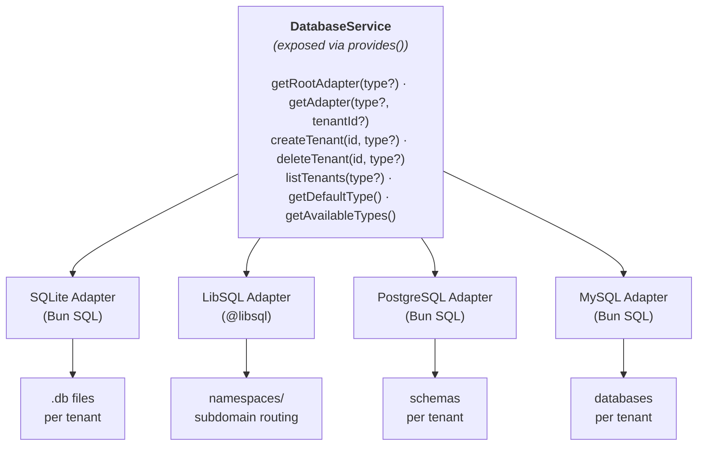

# Overview

Database abstraction layer plugin for Buntime that provides multi-adapter support, multi-tenancy, HRANA protocol compatibility, and a built-in database studio UI.

## Features

- **Multiple Adapters** - SQLite (Bun SQL), LibSQL/Turso, PostgreSQL, MySQL
- **Multi-Tenancy** - Per-tenant isolation via files, namespaces, schemas, or databases
- **HRANA Protocol** - WebSocket and HTTP pipeline support for LibSQL wire protocol
- **Database Studio** - Built-in UI for browsing tables, schemas, and executing SQL
- **Auto-Detection** - LibSQL URLs auto-detected from environment variables
- **Config Schema** - Helm/Rancher UI config generation for Kubernetes deployments
- **Read Replicas** - Round-robin load balancing across LibSQL replicas

## Architecture



**API Mode**: Persistent. Routes are defined in `plugin.ts` and run on the main thread. Database connections require persistence across requests.

## Main Components

### 1. DatabaseService

Central orchestrator that manages all adapters and tenant lifecycle. Exposed to other plugins via the `provides()` hook.

- Maintains a root adapter cache (`Map<AdapterType, DatabaseAdapter>`)
- Maintains an LRU tenant adapter cache per adapter type (`QuickLRU<string, DatabaseAdapter>`)
- Handles auto-creation of tenants on first access
- Validates that each adapter type appears only once
- Ensures exactly one default adapter exists

**File:** `server/service.ts`

### 2. BunSqlAdapter

Handles SQLite, PostgreSQL, and MySQL connections using Bun's native `SQL` API.

- SQLite: File-based databases with per-tenant `.db` files
- PostgreSQL: Schema-based multi-tenancy with `SET search_path`
- MySQL: Database-based multi-tenancy with separate databases
- Sanitizes tenant IDs to prevent SQL injection in schema/database names

**File:** `server/adapters/bun-sql.ts`

### 3. LibSqlAdapter

Handles LibSQL/Turso connections using `@libsql/client/http`.

- Read replica support with round-robin load balancing
- Write operations always route to primary
- Namespace-based multi-tenancy via subdomain routing
- Admin API integration for tenant lifecycle

**File:** `server/adapters/libsql.ts`

### 4. HRANA Server

Implements the HRANA 3 protocol for workers to execute SQL through the runtime.

- HTTP pipeline endpoint (`POST /api/pipeline`)
- WebSocket persistent connections (`/api/ws`)
- Session management with baton-based transaction continuity
- Prepared statement support via `store_sql`/`close_sql`
- Batch execution with conditional steps

**File:** `server/hrana/server.ts`

### 5. API Routes

Hono-based REST API for Studio UI and external consumers.

- Adapter management
- Tenant CRUD operations
- Table browsing and schema introspection
- Raw SQL execution
- Health checks

**File:** `server/api.ts`

### 6. Studio UI

React SPA for browsing database tables, viewing schemas, and executing SQL queries. Served as the plugin's client entrypoint.

**File:** `client/` directory

## Tech Stack

- **Runtime**: Bun
- **Framework**: Hono (API routes)
- **SQLite/PostgreSQL/MySQL**: Bun's native `SQL` API
- **LibSQL**: `@libsql/client/http`
- **Caching**: `quick-lru` for tenant adapter eviction
- **Studio UI**: React + TanStack Router
- **Types**: TypeScript

## File Structure

```
plugins/plugin-database/
├── manifest.yaml             # Configuration and schema
├── plugin.ts                 # Main plugin (routes, websocket, provides)
├── index.ts                  # Worker entrypoint (serves studio SPA)
├── server/
│   ├── api.ts               # Hono API routes + HRANA setup
│   ├── service.ts           # DatabaseServiceImpl
│   ├── types.ts             # Type definitions
│   ├── adapters/
│   │   ├── bun-sql.ts       # SQLite/PostgreSQL/MySQL adapter
│   │   └── libsql.ts        # LibSQL adapter
│   └── hrana/
│       ├── server.ts         # HRANA protocol server
│       ├── types.ts          # HRANA type definitions
│       └── websocket.ts      # WebSocket handler
├── client/                   # Studio SPA (React + TanStack Router)
│   └── routes/-components/cell-variants/
│       ├── mysql.tsx
│       ├── postgres.tsx
│       └── sqlite.tsx
└── dist/                     # Compiled output
```

## Lifecycle Hooks

The plugin uses the following Buntime hooks:

### onInit

Initializes the database service:
1. Processes config with environment variable substitution
2. Auto-detects LibSQL URLs from `DATABASE_LIBSQL_URL` and `DATABASE_LIBSQL_REPLICAS`
3. Creates `DatabaseServiceImpl` with all configured adapters
4. Initializes HRANA server for worker communication
5. Sets up API routes with service reference

### onServerStart

Configures the Bun server instance for WebSocket upgrades:
- Passes `Bun.serve()` server reference to the HRANA WebSocket handler
- Required for HRANA WebSocket protocol support

### onRequest

Intercepts incoming requests for WebSocket upgrades:
- Checks if the request is a WebSocket upgrade targeting `/database/api/ws`
- Routes matching requests to the HRANA WebSocket upgrade handler
- Returns `undefined` for non-matching requests (passes through)

### onShutdown

Graceful resource cleanup:
1. Closes all cached tenant adapters
2. Closes all root adapters
3. Clears all caches
4. Releases database connections

## Integration with Other Plugins

### Service Registry

The plugin exposes `DatabaseService` via `provides()`. Other plugins consume it:

```typescript
// In another plugin's onInit:
const database = ctx.getPlugin<DatabaseService>("@buntime/plugin-database");
const adapter = database.getRootAdapter("sqlite");
await adapter.execute("CREATE TABLE IF NOT EXISTS kv (key TEXT PRIMARY KEY, value TEXT)");
```

### Consumers

| Plugin | Usage | Typical Adapter |
|--------|-------|-----------------|
| `plugin-authn` | Session storage, user management | sqlite or libsql |
| `plugin-keyval` | Key-value store backend | libsql (default) |
| `plugin-authz` | Policy storage (optional) | sqlite |

Each consuming plugin specifies which adapter to use in its own `manifest.yaml`:

```yaml
# plugins/plugin-keyval/manifest.yaml
database: libsql

# plugins/plugin-authn/manifest.yaml
database: sqlite
```

### Workers

Workers access the database through the HRANA protocol:

```typescript
import { createClient } from "@libsql/client/http";

const client = createClient({
  url: "http://localhost:8000/database/api/pipeline",
});

const result = await client.execute("SELECT * FROM users");
```

## Environment Variables

| Variable | Description | Default |
|----------|-------------|---------|
| `DATABASE_LIBSQL_URL` | Primary LibSQL URL | - |
| `DATABASE_LIBSQL_REPLICAS` | Comma-separated replica URLs | - |
| `DATABASE_LIBSQL_AUTH_TOKEN` | LibSQL authentication token | - |

## Next Steps

- [Adapters](adapters.md) - Deep dive on each adapter
- [Multi-Tenancy](multi-tenancy.md) - Multi-tenancy patterns
- [HRANA Protocol](hrana.md) - HRANA protocol details
- [Configuration](../guides/configuration.md) - Configuration reference
- [API Reference](../api-reference.md) - Complete API reference
