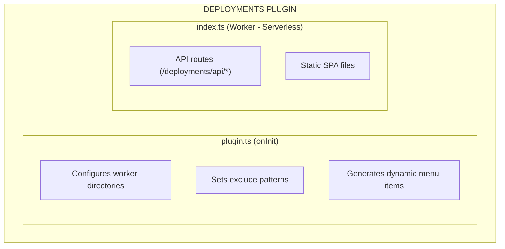
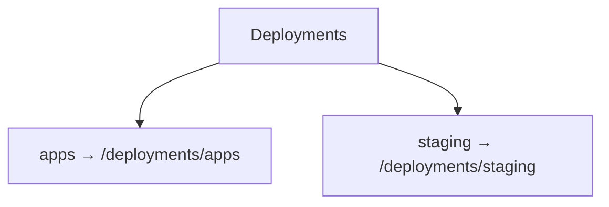

# Plugin Deployments

Application deployment management plugin for Buntime that provides a file manager UI and API for uploading, downloading, browsing, and managing worker applications.

## Table of Contents

- [Overview](#overview)
- [Architecture](#architecture)
- [Configuration](#configuration)
- [API Endpoints](#api-endpoints)
- [Lifecycle Hooks](#lifecycle-hooks)
- [File Structure](#file-structure)
- [Examples](#examples)

## Overview

The `@buntime/plugin-deployments` provides a complete deployment management interface for Buntime worker applications. It scans configured worker directories and exposes a file manager UI with API endpoints for CRUD operations on deployed apps.

**Key Features:**

- **File Manager UI**: Browse, upload, download, rename, move, and delete files and directories
- **Multi-Directory Support**: Manages multiple worker directories with dynamic menu generation
- **Zip Upload/Download**: Upload zip archives that are auto-extracted; download folders as zip
- **Batch Operations**: Batch delete, move, and download multiple items
- **Serverless Mode**: API runs in worker pool (not persistent) for process isolation
- **Exclude Patterns**: Configurable folder exclusion for hiding internal directories
- **Visibility Control**: Per-app visibility (`public`, `protected`, `internal`) via manifest

## Architecture



**API Mode**: Serverless (API in `index.ts` worker, no persistent routes in `plugin.ts`). File operations are stateless and benefit from process isolation.

> [!NOTE]
> The `entrypoint` in manifest is `dist/index.js` (not `.html`), which means the worker executes the module and serves both API routes and static files.

## Configuration

### manifest.yaml

```yaml
name: "@buntime/plugin-deployments"
base: "/deployments"
enabled: true
injectBase: true
entrypoint: dist/index.js
pluginEntry: dist/plugin.js

menus:
  - icon: lucide:rocket
    path: /deployments
    title: Deployments

excludes:
  - ".cache"
  - "lost+found"

config:
  excludes:
    type: string
    label: Exclude Patterns
    description: "Folder patterns to exclude, comma-separated"
    default: ".cache, lost+found"
    env: DEPLOYMENTS_EXCLUDES
```

### Configuration Options

| Option | Type | Default | Description |
|--------|------|---------|-------------|
| `excludes` | `string[]` | `[".git", "node_modules"]` | Folder patterns to hide (merged with defaults) |
| `workerDirs` | `string[]` | `globalConfig.workerDirs` | Directories to manage |

### Environment Variables

| Variable | Description | Default |
|----------|-------------|---------|
| `DEPLOYMENTS_EXCLUDES` | Comma-separated exclude patterns | `".cache, lost+found"` |
| `RUNTIME_WORKER_DIRS` | Worker directories (read by worker) | **Required** |

### Dynamic Menus

When multiple worker directories are configured, the plugin auto-generates submenu items:



## API Endpoints

All routes are mounted at `/{base}/api/*` (default: `/deployments/api/*`).

### File Operations

| Method | Endpoint | Description |
|--------|----------|-------------|
| `GET` | `/api/list?path=` | List directory contents |
| `POST` | `/api/mkdir` | Create directory (`{ path }`) |
| `DELETE` | `/api/delete` | Delete file or directory (`{ path }`) |
| `POST` | `/api/rename` | Rename file or directory (`{ path, newName }`) |
| `POST` | `/api/move` | Move file or directory (`{ path, destPath }`) |
| `POST` | `/api/upload` | Upload files (multipart form: `path`, `files[]`, `paths[]`) |
| `GET` | `/api/download?path=` | Download file or directory (folders zipped) |
| `GET/POST` | `/api/refresh?path=` | Refresh directory cache |

### Batch Operations

| Method | Endpoint | Description |
|--------|----------|-------------|
| `POST` | `/api/delete-batch` | Delete multiple paths (`{ paths }`) |
| `POST` | `/api/move-batch` | Move multiple paths (`{ paths, destPath }`) |
| `GET` | `/api/download-batch?paths=` | Download multiple items as single zip |

### Path Format

Paths follow the format `{rootName}/{relativePath}`:

- Root listing (`path=""`) returns all worker directories as folders
- `apps/my-app` resolves to the `my-app` directory inside the worker directory named `apps`
- Hidden directories (starting with `.`) are excluded from root listing but still served

### Upload

Supports both individual files and zip archives:

```bash
# Upload files with directory structure
curl -X POST /deployments/api/upload \
  -F "path=apps/my-app" \
  -F "files=@index.ts" \
  -F "paths=src/index.ts" \
  -F "files=@manifest.yaml" \
  -F "paths=manifest.yaml"

# Upload zip (auto-extracted)
curl -X POST /deployments/api/upload \
  -F "path=apps/my-app" \
  -F "files=@app.zip"
```

### Download

```bash
# Download single file
GET /deployments/api/download?path=apps/my-app/manifest.yaml

# Download directory (returned as zip, excluding .dirinfo cache files)
GET /deployments/api/download?path=apps/my-app

# Download multiple items as single zip
GET /deployments/api/download-batch?paths=apps/my-app,apps/other-app
```

## Lifecycle Hooks

| Hook | Description |
|------|-------------|
| `onInit` | Configures worker directories, sets excludes, generates dynamic menus |

> [!NOTE]
> The plugin has no `onRequest` or `onResponse` hooks. All API logic runs in the worker (serverless mode).

## File Structure

```
plugins/plugin-deployments/
├── manifest.yaml          # Configuration and schema
├── plugin.ts              # Main plugin (onInit for menu generation)
├── index.ts               # Worker entrypoint (API + static SPA)
├── server/
│   ├── api.ts            # Hono API routes (all file operations)
│   ├── libs/
│   │   └── dir-info.ts   # Directory analysis utilities
│   └── utils/
│       └── deployment-path.ts  # Path resolution utilities
├── client/               # File manager SPA (React + TanStack Router)
└── dist/                 # Compiled output
```

## Examples

### Basic Configuration

```yaml
name: "@buntime/plugin-deployments"
enabled: true
excludes:
  - ".cache"
  - "dist"
  - "coverage"
```

### Kubernetes with Persistent Volume

```yaml
name: "@buntime/plugin-deployments"
enabled: true
```

```bash
# ConfigMap
DEPLOYMENTS_EXCLUDES=".cache,lost+found,.git"
RUNTIME_WORKER_DIRS=/data/.apps:/data/apps
```

The hidden directory `/data/.apps` contains built-in apps (not shown in UI), while `/data/apps` is the user-managed directory.

## License

See [LICENSE](../../LICENSE) at the project root.
