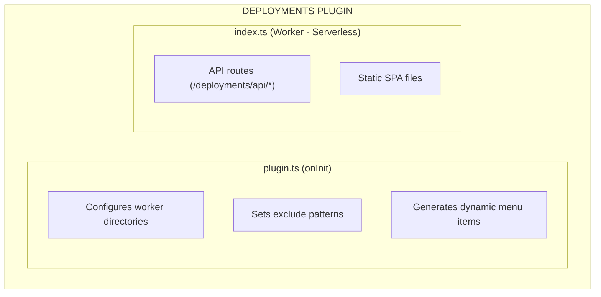
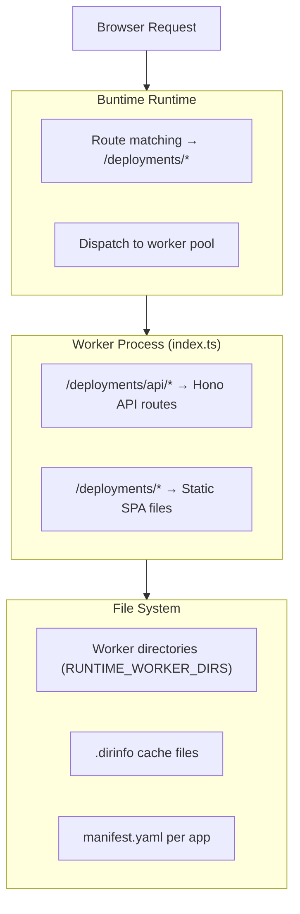
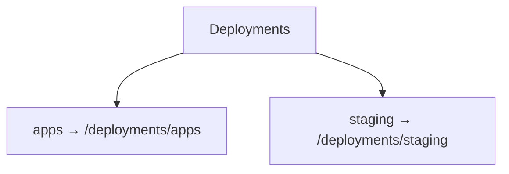

# Overview

Deployment management plugin for Buntime that provides a file manager UI and API for uploading, downloading, browsing, and managing worker applications.

## Features

- **File Manager UI** - Browse, upload, download, rename, move, and delete files and directories
- **Multi-Directory Support** - Manages multiple worker directories with dynamic menu generation
- **Zip Upload/Download** - Upload zip archives that are auto-extracted; download folders as zip
- **Batch Operations** - Batch delete, move, and download multiple items in a single request
- **Serverless Mode** - API runs in worker pool (not persistent) for process isolation
- **Exclude Patterns** - Configurable folder exclusion for hiding internal directories
- **Visibility Control** - Per-app visibility (`public`, `protected`, `internal`) via manifest
- **Directory Caching** - Automatic `.dirinfo` caching with smart invalidation

## Architecture

The plugin-deployments uses a **serverless architecture** where the API runs as a worker, not as persistent middleware:



### Request Flow



## Serverless Mode

Unlike plugins such as plugin-gateway that use `onRequest`/`onResponse` hooks to intercept traffic, plugin-deployments runs entirely in the **worker pool**:

- **`plugin.ts`** only implements `onInit` — configures directories, excludes, and menus at startup
- **`index.ts`** is the worker entrypoint — serves both API routes and the static SPA
- **No persistent hooks** — no `onRequest`, no `onResponse`

This design provides:

1. **Process isolation** — file operations run in a separate worker process
2. **Stateless requests** — each request gets a fresh context from the worker pool
3. **No overhead** — the plugin adds zero latency to non-deployment requests
4. **Crash resilience** — a failed file operation doesn't affect the main process

> **Note:** The `entrypoint` in manifest is `dist/index.js` (not `.html`), which means the worker executes the module and serves both API routes and static files.

## Main Components

### 1. Plugin Entry (`plugin.ts`)

The plugin configuration layer. Runs during Buntime startup:

- Reads `workerDirs` from plugin config or falls back to `globalConfig.workerDirs`
- Sets global exclude patterns (merged with defaults: `.git`, `node_modules`)
- Generates dynamic submenu items when multiple worker directories exist

**Lifecycle hooks used:** `onInit` only

### 2. Worker Entry (`index.ts`)

The serverless worker that handles all HTTP requests to `/deployments/*`:

- Hono API routes at `/deployments/api/*` for file operations
- Static file serving for the React SPA at `/deployments/*`
- Reads `RUNTIME_WORKER_DIRS` and `DEPLOYMENTS_EXCLUDES` from environment

### 3. API Routes (`server/api.ts`)

Hono router implementing all file operation endpoints:

| Endpoint | Description |
|----------|-------------|
| `GET /api/list` | List directory contents |
| `POST /api/mkdir` | Create directory |
| `DELETE /api/delete` | Delete file or directory |
| `POST /api/rename` | Rename file or directory |
| `POST /api/move` | Move file or directory |
| `POST /api/upload` | Upload files (multipart or zip) |
| `GET /api/download` | Download file or directory |
| `GET/POST /api/refresh` | Invalidate directory cache |
| `POST /api/delete-batch` | Batch delete |
| `POST /api/move-batch` | Batch move |
| `GET /api/download-batch` | Batch download as zip |

### 4. Directory Info (`server/libs/dir-info.ts`)

Core utility class for file system operations:

- **Listing** — scans directories with Bun.Glob, respects excludes and visibility
- **Caching** — stores file count and size in `.dirinfo` files per directory
- **Cache invalidation** — propagates up to parent directories
- **Zip operations** — extract uploaded zips, create download zips
- **Visibility** — reads `visibility` field from `manifest.yaml`
- **Config validation** — validates worker config for version folders

### 5. Deployment Path (`server/utils/deployment-path.ts`)

Path parsing utilities that understand two app directory structures:

- **Flat format**: `app-name@1.0.0/files...`
- **Nested format**: `app-name/1.0.0/files...`

Used to determine upload validity, move constraints, and depth calculations.

## Directory Structure

### Plugin Files

```
plugins/plugin-deployments/
├── manifest.yaml          # Configuration and schema
├── plugin.ts              # Main plugin (onInit for menu generation)
├── index.ts               # Worker entrypoint (API + static SPA)
├── server/
│   ├── api.ts            # Hono API routes (all file operations)
│   ├── api.test.ts       # API tests
│   ├── libs/
│   │   ├── dir-info.ts   # Directory analysis utilities
│   │   └── dir-info.test.ts
│   └── utils/
│       ├── deployment-path.ts      # Path resolution utilities
│       └── deployment-path.test.ts
├── client/               # File manager SPA (React + TanStack Router)
└── dist/                 # Compiled output
```

### App Directory Structure

Apps are organized in worker directories. Two versioning formats are supported:

**Nested format (recommended):**

```
/data/apps/
├── my-app/
│   ├── 1.0.0/
│   │   ├── manifest.yaml
│   │   ├── src/
│   │   └── dist/
│   └── 1.0.1/
│       ├── manifest.yaml
│       └── dist/
└── another-app/
    └── latest/
        ├── manifest.yaml
        └── dist/
```

**Flat format:**

```
/data/apps/
├── my-app@1.0.0/
│   ├── manifest.yaml
│   └── dist/
└── my-app@1.0.1/
    ├── manifest.yaml
    └── dist/
```

## Visibility System

Apps can declare visibility in their `manifest.yaml`:

```yaml
# manifest.yaml inside an app version
visibility: protected
```

| Visibility | Behavior |
|-----------|----------|
| `public` | Shown in listing, fully accessible |
| `protected` | Shown in listing, upload restricted in UI |
| `internal` | Hidden from listing (filtered out by API) |

Visibility is **inherited** — files inside a `protected` version inherit that visibility. For nested format, the most restrictive child version determines the parent app's displayed visibility.

## Exclude Patterns

Exclude patterns hide directories from listings at multiple levels:

### Global Excludes

Always applied (hardcoded defaults):
- `.git`
- `node_modules`

### Plugin Excludes

From `manifest.yaml` or `DEPLOYMENTS_EXCLUDES` env var:
- `.cache`
- `lost+found`

### Per-App Excludes

From the app's `manifest.yaml`:

```yaml
excludes:
  - ".turbo"
  - "coverage"
```

All exclude sources are merged into a single set for each directory listing.

## Dynamic Menus

When multiple worker directories are configured, the plugin generates submenu items under the main "Deployments" menu:



When only one worker directory exists, the menu shows a single "Deployments" entry without submenus.

Hidden directories (names starting with `.`) are excluded from menu generation but their contents remain accessible via direct path.

## Tech Stack

- **Runtime**: Bun
- **Framework**: Hono (API routes)
- **UI**: React + TanStack Router (SPA)
- **Build**: Bun bundler
- **Types**: TypeScript

## Lifecycle Hooks

| Hook | Used | Description |
|------|------|-------------|
| `onInit` | Yes | Configures directories, excludes, generates menus |
| `onRequest` | No | Not used (serverless mode) |
| `onResponse` | No | Not used (serverless mode) |
| `onShutdown` | No | Not used (no cleanup needed) |

## Environment Variables

| Variable | Description | Default |
|----------|-------------|---------|
| `RUNTIME_WORKER_DIRS` | Colon-separated worker directory paths | **Required** |
| `DEPLOYMENTS_EXCLUDES` | Comma-separated exclude patterns | `".cache, lost+found"` |

## Integration with Other Plugins

### plugin-gateway (optional)

If present, the gateway plugin may apply rate limiting and CORS to deployment API requests.

### plugin-authn (optional)

If present, deployment endpoints can be protected by authentication middleware.

### plugin-authz (optional)

If present, deployment operations can be restricted by authorization policies.

## Next Steps

- [API Reference](../api-reference.md) - Complete endpoint documentation
- [Configuration](../guides/configuration.md) - Configuration reference
