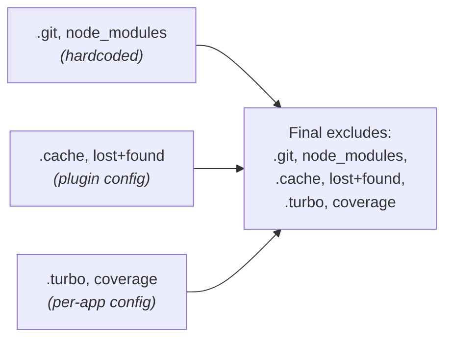
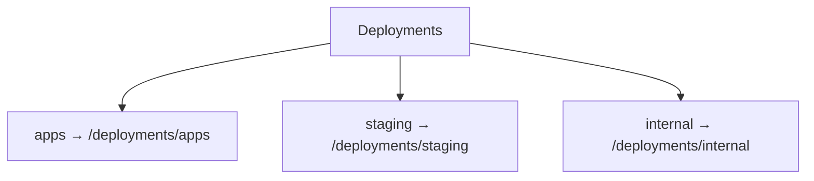

# Configuration

Complete reference for all plugin-deployments configuration options.

## Configuration Methods

### 1. manifest.yaml

Static plugin configuration:

```yaml
# plugins/plugin-deployments/manifest.yaml
name: "@buntime/plugin-deployments"
base: "/deployments"
enabled: true

injectBase: true
entrypoint: dist/index.js
pluginEntry: dist/plugin.js

menus:
  - icon: lucide:rocket
    path: /deployments
    title: Deployments

excludes:
  - ".cache"
  - "lost+found"

config:
  excludes:
    type: string
    label: Exclude Patterns
    description: "Folder patterns to exclude, comma-separated"
    default: ".cache, lost+found"
    env: DEPLOYMENTS_EXCLUDES
```

### 2. Environment Variables

Override manifest values at runtime:

```bash
# Worker directories (colon-separated absolute paths)
RUNTIME_WORKER_DIRS=/data/.apps:/data/apps

# Exclude patterns (comma-separated folder names)
DEPLOYMENTS_EXCLUDES=.cache,lost+found,.DS_Store
```

### 3. Plugin Config (Code)

When instantiating the plugin programmatically:

```typescript
import deploymentsPlugin from "@buntime/plugin-deployments";

deploymentsPlugin({
  workerDirs: ["/data/apps", "/data/staging"],
  excludes: [".cache", "lost+found", "coverage"],
});
```

## Configuration Options

### workerDirs

Directories containing deployable worker applications.

- **Type:** `string[]`
- **Default:** `globalConfig.workerDirs` (from Buntime runtime config)
- **Env:** `RUNTIME_WORKER_DIRS` (colon-separated)

**Example (manifest.yaml):**
```yaml
# Not directly configurable in manifest — uses runtime config
```

**Example (env):**
```bash
RUNTIME_WORKER_DIRS=/data/apps:/data/staging
```

**Example (code):**
```typescript
deploymentsPlugin({
  workerDirs: ["/data/apps", "/data/staging"],
});
```

**Notes:**
- Multiple directories are separated by `:` in the environment variable
- Each directory becomes a "root" in the file manager UI
- Directories starting with `.` are hidden from UI listing but still served
- Duplicate basenames get an index suffix (e.g., `apps`, `apps-2`)

### excludes

Folder patterns to hide from directory listings.

- **Type:** `string[]`
- **Default:** `[".git", "node_modules"]` (hardcoded defaults, always applied)
- **Env:** `DEPLOYMENTS_EXCLUDES` (comma-separated)

**Example (manifest.yaml):**
```yaml
excludes:
  - ".cache"
  - "lost+found"
  - "__pycache__"
  - ".next"
```

**Example (env):**
```bash
DEPLOYMENTS_EXCLUDES=.cache,lost+found,__pycache__,.next
```

**Example (code):**
```typescript
deploymentsPlugin({
  excludes: [".cache", "lost+found", "coverage"],
});
```

**Merge behavior:**
- Hardcoded defaults (`.git`, `node_modules`) are always included
- Manifest excludes are merged with defaults
- Environment variable excludes are merged with defaults
- Per-app excludes from `manifest.yaml` are merged at listing time

### menus

Menu items displayed in the Buntime admin UI.

- **Type:** `MenuItem[]`
- **Default:** Single "Deployments" menu item
- **Source:** `manifest.yaml` only (not configurable via env)

**Default:**
```yaml
menus:
  - icon: lucide:rocket
    path: /deployments
    title: Deployments
```

**Dynamic submenus:**

When multiple worker directories exist, submenus are auto-generated:

```yaml
# With RUNTIME_WORKER_DIRS=/data/apps:/data/staging
# Results in:
menus:
  - icon: lucide:rocket
    path: /deployments
    title: Deployments
    items:
      - icon: lucide:folder
        path: /deployments/apps
        title: apps
      - icon: lucide:folder
        path: /deployments/staging
        title: staging
```

When only one worker directory exists, no submenus are generated.

### base

The URL base path for the plugin.

- **Type:** `string`
- **Default:** `"/deployments"`
- **Source:** `manifest.yaml` only

```yaml
base: "/deployments"
```

All API routes are mounted at `{base}/api/*` and the SPA is served at `{base}/*`.

### injectBase

Whether to inject `<base href>` into the SPA HTML.

- **Type:** `boolean`
- **Default:** `true`
- **Source:** `manifest.yaml` only

```yaml
injectBase: true
```

### entrypoint

Worker entry module path.

- **Type:** `string`
- **Default:** `"dist/index.js"`
- **Source:** `manifest.yaml` only

```yaml
entrypoint: dist/index.js
```

> **Note:** This is a `.js` file (not `.html`), meaning the worker executes the module rather than serving a static HTML file.

### pluginEntry

Plugin lifecycle hook module path.

- **Type:** `string`
- **Default:** `"dist/plugin.js"`
- **Source:** `manifest.yaml` only

```yaml
pluginEntry: dist/plugin.js
```

## Environment Variables

| Variable | Type | Default | Description |
|----------|------|---------|-------------|
| `RUNTIME_WORKER_DIRS` | string | **Required** | Colon-separated paths to worker directories |
| `DEPLOYMENTS_EXCLUDES` | string | `".cache, lost+found"` | Comma-separated folder patterns to exclude |

### RUNTIME_WORKER_DIRS

Colon-separated list of absolute paths to directories containing worker applications.

```bash
# Single directory
RUNTIME_WORKER_DIRS=/data/apps

# Multiple directories
RUNTIME_WORKER_DIRS=/data/apps:/data/staging

# Hidden + visible directories
RUNTIME_WORKER_DIRS=/data/.apps:/data/apps
```

**Notes:**
- This is a **runtime-level** variable (read by the worker process, not just the plugin)
- Hidden directories (starting with `.`) are loaded but not shown in the UI
- The basename of each path becomes the root name in the file manager

### DEPLOYMENTS_EXCLUDES

Comma-separated list of folder names to exclude from directory listings.

```bash
# Default
DEPLOYMENTS_EXCLUDES=.cache,lost+found

# Extended
DEPLOYMENTS_EXCLUDES=.cache,lost+found,.DS_Store,__pycache__,.next,coverage
```

**Notes:**
- Spaces around commas are trimmed
- These are merged with the hardcoded defaults (`.git`, `node_modules`)
- Excludes apply to all directory levels across all worker directories

## Exclude Patterns

Excludes work at three levels, all merged together:

### Level 1: Hardcoded Defaults

Always excluded, cannot be overridden:

```
.git
node_modules
```

### Level 2: Plugin Configuration

From `manifest.yaml` or `DEPLOYMENTS_EXCLUDES`:

```yaml
excludes:
  - ".cache"
  - "lost+found"
```

### Level 3: Per-App Excludes

From an app's `manifest.yaml` inside a version folder:

```yaml
# /data/apps/my-app/1.0.0/manifest.yaml
excludes:
  - ".turbo"
  - "coverage"
  - ".env"
```

Per-app excludes only apply when listing that app's directory contents.

### Exclude Resolution



## Visibility Configuration

Per-app visibility is set in the app's `manifest.yaml`:

```yaml
# /data/apps/my-app/1.0.0/manifest.yaml
visibility: protected
```

| Value | Effect |
|-------|--------|
| `public` | Shown in listing, fully accessible (default) |
| `protected` | Shown in listing, upload restricted in UI |
| `internal` | Completely hidden from API listing |

### Visibility Inheritance

Visibility propagates from parent to child:

1. A version folder's visibility applies to all its contents
2. For nested format, the app folder shows the most restrictive child version's visibility
3. Files inside a `protected` version inherit `protected` visibility

```
apps/
├── public-app/
│   └── 1.0.0/          # visibility: public
│       └── src/         # inherits: public
├── admin-panel/
│   └── latest/          # visibility: protected
│       └── src/         # inherits: protected
└── .internal-tools/     # hidden directory (starts with ".")
    └── latest/          # visibility: internal
        └── src/         # inherits: internal (hidden from listing)
```

## Complete Examples

### Local Development

```yaml
# manifest.yaml
name: "@buntime/plugin-deployments"
base: "/deployments"
enabled: true
injectBase: true
entrypoint: dist/index.js
pluginEntry: dist/plugin.js

menus:
  - icon: lucide:rocket
    path: /deployments
    title: Deployments

excludes:
  - ".cache"
  - "coverage"
  - "dist"
```

```bash
# .env
RUNTIME_WORKER_DIRS=./apps
```

### Production — Single Directory

```yaml
# manifest.yaml
name: "@buntime/plugin-deployments"
enabled: true

excludes:
  - ".cache"
  - "lost+found"
```

```bash
# Environment
RUNTIME_WORKER_DIRS=/data/apps
DEPLOYMENTS_EXCLUDES=.cache,lost+found
```

### Production — Multiple Directories

```yaml
# manifest.yaml
name: "@buntime/plugin-deployments"
enabled: true

excludes:
  - ".cache"
  - "lost+found"
```

```bash
# Environment
RUNTIME_WORKER_DIRS=/data/apps:/data/staging:/data/internal
DEPLOYMENTS_EXCLUDES=.cache,lost+found,.git
```

This generates a menu with three submenus:



### Kubernetes with Persistent Volume

```yaml
# manifest.yaml
name: "@buntime/plugin-deployments"
enabled: true
```

```bash
# ConfigMap
DEPLOYMENTS_EXCLUDES=.cache,lost+found,.git
RUNTIME_WORKER_DIRS=/data/.apps:/data/apps
```

The hidden directory `/data/.apps` contains built-in apps (not shown in UI), while `/data/apps` is the user-managed directory. Both directories are served by the runtime, but only `apps` appears in the file manager.

### Helm Values

```yaml
# values.yaml
plugins:
  deployments:
    excludes: ".cache,lost+found"
```

```bash
# Override on deploy
helm upgrade buntime ./charts/buntime \
  --set plugins.deployments.excludes=".cache,lost+found,.DS_Store"
```

## Validation

### Verify Worker Directories

```bash
# Check that directories are recognized
curl http://localhost:8000/deployments/api/list | jq '.data.entries[].name'
# Expected: "apps", "staging", etc.
```

### Verify Excludes

```bash
# List a directory and confirm excluded folders are hidden
curl "http://localhost:8000/deployments/api/list?path=apps/my-app/1.0.0" | jq '.data.entries[].name'
# Should NOT show: .git, node_modules, .cache, lost+found
```

### Verify Upload

```bash
# Upload a test file
curl -X POST http://localhost:8000/deployments/api/upload \
  -F "path=apps/test-app/1.0.0" \
  -F "files=@test.txt" \
  -F "paths=test.txt"

# Verify it appears in listing
curl "http://localhost:8000/deployments/api/list?path=apps/test-app/1.0.0" | jq '.data.entries[].name'
```

### Verify Zip Upload

```bash
# Create a test zip
mkdir -p /tmp/test-app && echo "hello" > /tmp/test-app/index.ts
cd /tmp && zip -r test-app.zip test-app/

# Upload the zip
curl -X POST http://localhost:8000/deployments/api/upload \
  -F "path=apps/test-app/1.0.0" \
  -F "files=@/tmp/test-app.zip"

# Verify extraction
curl "http://localhost:8000/deployments/api/list?path=apps/test-app/1.0.0" | jq '.data.entries[].name'
```

### Verify Download

```bash
# Download a directory as zip
curl -o test.zip "http://localhost:8000/deployments/api/download?path=apps/test-app/1.0.0"
unzip -l test.zip
```

## DeploymentsConfig Type

```typescript
interface DeploymentsConfig extends BasePluginConfig {
  /**
   * Directories containing deployable apps
   * @default Uses globalConfig.workerDirs
   */
  workerDirs?: string[];

  /**
   * Global folder patterns to exclude from listing.
   * Merged with defaults: [".git", "node_modules"]
   * @default [".git", "node_modules"]
   */
  excludes?: string[];

  /**
   * Menu items from manifest (internal, passed by loader)
   * @internal
   */
  menus?: MenuItem[];
}
```

## Next Steps

- [API Reference](../api-reference.md) - Complete endpoint documentation
- [Overview](../concepts/overview.md) - Architecture and concepts
