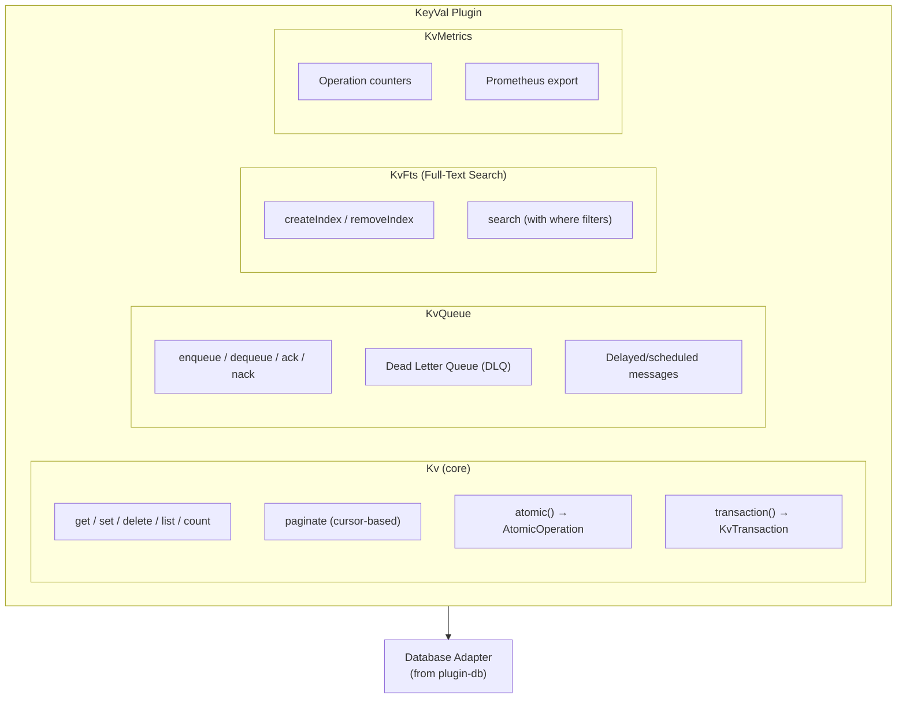

# Plugin KeyVal

Deno KV-inspired key-value store plugin for Buntime with composite keys, TTL support, atomic transactions, full-text search, message queues, and real-time watch via SSE.

## Table of Contents

- [Overview](#overview)
- [Architecture](#architecture)
- [Configuration](#configuration)
- [Core Concepts](#core-concepts)
  - [Keys](#keys)
  - [Entries](#entries)
  - [TTL](#ttl)
  - [Versionstamps](#versionstamps)
- [API Endpoints](#api-endpoints)
  - [Key-Value Operations](#key-value-operations)
  - [Atomic Operations](#atomic-operations)
  - [Queue Operations](#queue-operations)
  - [Watch (SSE)](#watch-sse)
  - [Full-Text Search](#full-text-search)
  - [Metrics](#metrics)
- [Where Filters](#where-filters)
- [Service Registry](#service-registry)
- [Lifecycle Hooks](#lifecycle-hooks)
- [Integration with Other Plugins](#integration-with-other-plugins)
- [Exported Types](#exported-types)
- [File Structure](#file-structure)
- [Examples](#examples)

## Overview

The `@buntime/plugin-keyval` provides a Deno KV-compatible key-value store built on top of `plugin-database`. It supports composite array-based keys, TTL expiration, atomic transactions with optimistic concurrency control, full-text search, FIFO message queues, and real-time change notifications.

**Key Features:**

- **Composite Keys**: Array-based keys (e.g., `["users", "123", "profile"]`)
- **TTL Support**: Automatic expiration via `expiresIn` (milliseconds)
- **Atomic Transactions**: Optimistic concurrency control with version checks
- **Where Filters**: SQL-like filtering (`$eq`, `$gt`, `$contains`, `$in`, etc.)
- **Prefix Listing**: Iterate entries by key prefix with pagination
- **Full-Text Search**: FTS5-based full-text search with configurable tokenizers
- **Message Queue**: FIFO queue with priorities, retries, dead letter queue
- **Watch (SSE)**: Real-time key change notifications via Server-Sent Events
- **Metrics**: Operation tracking with Prometheus export
- **UUIDv7 Placeholders**: Generate consistent UUIDv7s across atomic operations

## Architecture



**API Mode**: Persistent (routes in `plugin.ts`, runs on main thread). SSE streaming and watch endpoints require the main thread.

## Configuration

### manifest.yaml

```yaml
name: "@buntime/plugin-keyval"
base: "/keyval"
enabled: true
injectBase: true

dependencies:
  - "@buntime/plugin-database"

entrypoint: dist/client/index.html
pluginEntry: dist/plugin.js

menus:
  - icon: lucide:database
    path: /keyval
    title: KeyVal
    items:
      - icon: lucide:home
        path: /keyval
        title: Overview
      - icon: lucide:list
        path: /keyval/entries
        title: Entries
      - icon: lucide:layers
        path: /keyval/queue
        title: Queue
      - icon: lucide:search
        path: /keyval/search
        title: Search
      - icon: lucide:eye
        path: /keyval/watch
        title: Watch
      - icon: lucide:atom
        path: /keyval/atomic
        title: Atomic
      - icon: lucide:activity
        path: /keyval/metrics
        title: Metrics

database: sqlite

metrics:
  persistent: false
  flushInterval: 30000

queue:
  cleanupInterval: 60000
  lockDuration: 30000
```

### Configuration Options

| Option | Type | Default | Description |
|--------|------|---------|-------------|
| `database` | `AdapterType` | default | Database adapter type to use |
| `metrics.persistent` | `boolean` | `false` | Persist metrics to database |
| `metrics.flushInterval` | `number` | `30000` | Flush interval (ms) for persistent metrics |
| `queue.cleanupInterval` | `number` | `60000` | Queue cleanup interval (ms) |
| `queue.lockDuration` | `number` | `30000` | Lock duration (ms) for processing messages |

## Core Concepts

### Keys

Keys are arrays of parts. Parts can be `string`, `number`, `bigint`, `boolean`, or `Uint8Array`:

```typescript
["users", "123"]                    // Simple key
["users", 42, "profile"]           // Mixed types
["metrics", "2024-01-01", "cpu"]   // Date-based
```

In the REST API, key paths are URL-encoded: `/api/keys/users/123`.

### Entries

Each entry has a key, value, and versionstamp:

```typescript
interface KvEntry<T = unknown> {
  key: KvKey;            // Array of key parts
  value: T | null;       // JSON-serializable value
  versionstamp: string | null;  // Version for concurrency control
}
```

### TTL

Set expiration in milliseconds:

```bash
PUT /keyval/api/keys/sessions/abc?expiresIn=3600000
```

Expired entries are automatically cleaned up.

### Versionstamps

Every write operation generates a unique versionstamp. Used for optimistic concurrency control in atomic operations:

```typescript
// Check that entry hasn't changed since we read it
atomic.check({ key: ["users", "123"], versionstamp: "00000001" })
      .set(["users", "123"], updatedUser)
      .commit();
// Fails if versionstamp doesn't match (concurrent modification)
```

## API Endpoints

All routes are mounted at `/{base}/api/*` (default: `/keyval/api/*`).

### Key-Value Operations

| Method | Endpoint | Description |
|--------|----------|-------------|
| `GET` | `/api/keys?prefix=&limit=&reverse=` | List entries by prefix |
| `POST` | `/api/keys/list` | List with complex where filters |
| `GET` | `/api/keys/count?prefix=` | Count entries by prefix |
| `GET` | `/api/keys/paginate?prefix=&cursor=&limit=` | Cursor-based pagination |
| `GET` | `/api/keys/*` | Get entry by key path |
| `PUT` | `/api/keys/*?expiresIn=` | Set entry value |
| `DELETE` | `/api/keys/*` | Delete entry (optional where filter in body) |
| `POST` | `/api/keys/batch` | Batch get (`{ keys: [...] }`) |
| `POST` | `/api/keys/delete-batch` | Batch delete (`{ keys: [...], where?, exact? }`) |

### Atomic Operations

| Method | Endpoint | Description |
|--------|----------|-------------|
| `POST` | `/api/atomic` | Execute atomic operation |

**Request body:**

```json
{
  "checks": [
    { "key": ["users", "123"], "versionstamp": "00000001" }
  ],
  "mutations": [
    { "type": "set", "key": ["users", "123"], "value": { "name": "Alice" }, "expiresIn": 3600000 },
    { "type": "delete", "key": ["temp", "data"] },
    { "type": "sum", "key": ["counters", "visits"], "value": 1 },
    { "type": "max", "key": ["stats", "peak"], "value": 100 },
    { "type": "min", "key": ["stats", "low"], "value": 5 },
    { "type": "append", "key": ["lists", "tags"], "value": ["new-tag"] },
    { "type": "prepend", "key": ["lists", "recent"], "value": ["latest"] }
  ]
}
```

**Mutation types:**

| Type | Description |
|------|-------------|
| `set` | Set key to value (optional `expiresIn`) |
| `delete` | Delete key |
| `sum` | Add bigint to current value |
| `max` | Set to max of current and new value |
| `min` | Set to min of current and new value |
| `append` | Append array items to current value |
| `prepend` | Prepend array items to current value |

### Queue Operations

| Method | Endpoint | Description |
|--------|----------|-------------|
| `POST` | `/api/queue/enqueue` | Enqueue message (`{ value, options? }`) |
| `GET` | `/api/queue/listen` | SSE stream for messages (auto-dequeue) |
| `GET` | `/api/queue/poll` | Poll single message |
| `POST` | `/api/queue/ack` | Acknowledge message (`{ id }`) |
| `POST` | `/api/queue/nack` | Reject message for retry (`{ id }`) |
| `GET` | `/api/queue/stats` | Queue statistics |

**Enqueue options:**

```json
{
  "value": { "task": "send-email", "to": "user@example.com" },
  "options": {
    "delay": 5000,
    "backoffSchedule": [1000, 5000, 10000],
    "keysIfUndelivered": [["failed-tasks", "email-123"]]
  }
}
```

### Dead Letter Queue (DLQ)

| Method | Endpoint | Description |
|--------|----------|-------------|
| `GET` | `/api/queue/dlq?limit=&offset=` | List DLQ messages |
| `GET` | `/api/queue/dlq/:id` | Get DLQ message |
| `POST` | `/api/queue/dlq/:id/requeue` | Requeue DLQ message |
| `DELETE` | `/api/queue/dlq/:id` | Delete DLQ message |
| `DELETE` | `/api/queue/dlq` | Purge all DLQ messages |

### Watch (SSE)

| Method | Endpoint | Description |
|--------|----------|-------------|
| `GET` | `/api/watch?keys=&initial=` | Watch specific keys (SSE) |
| `GET` | `/api/watch/poll?keys=&versionstamps=` | Poll for key changes |
| `GET` | `/api/watch/prefix?prefix=&initial=&limit=` | Watch by prefix (SSE) |
| `GET` | `/api/watch/prefix/poll?prefix=&versionstamps=` | Poll prefix changes |

SSE events:

- `change` - Key(s) changed (data: JSON array of entries)
- `ping` - Heartbeat (data: empty)

### Full-Text Search

| Method | Endpoint | Description |
|--------|----------|-------------|
| `POST` | `/api/indexes` | Create FTS index (`{ prefix, options: { fields, tokenize? } }`) |
| `GET` | `/api/indexes` | List all FTS indexes |
| `DELETE` | `/api/indexes?prefix=` | Remove FTS index |
| `GET` | `/api/search?prefix=&query=&limit=` | Search entries |
| `POST` | `/api/search` | Search with where filters |

**Tokenizers:** `"unicode61"` (default), `"porter"` (stemming), `"ascii"`.

### Metrics

| Method | Endpoint | Description |
|--------|----------|-------------|
| `GET` | `/api/metrics` | JSON metrics (operations, queue, storage) |
| `GET` | `/api/metrics/prometheus` | Prometheus format metrics |

## Where Filters

Filter entries during list and delete operations:

```json
{
  "where": {
    "status": { "$eq": "active" },
    "age": { "$gte": 18, "$lt": 65 },
    "name": { "$contains": "john" },
    "role": { "$in": ["admin", "moderator"] },
    "$or": [
      { "priority": { "$eq": "high" } },
      { "urgent": { "$eq": true } }
    ]
  }
}
```

### Operators

| Category | Operators |
|----------|-----------|
| Comparison | `$eq`, `$ne`, `$gt`, `$gte`, `$lt`, `$lte`, `$between` |
| Array | `$in`, `$nin` |
| String (case-sensitive) | `$contains`, `$notContains`, `$startsWith`, `$endsWith` |
| String (case-insensitive) | `$containsi`, `$notContainsi`, `$startsWithi`, `$endsWithi` |
| Existence | `$null`, `$empty`, `$notEmpty` |
| Logical | `$and`, `$or`, `$not` |

### Server-side Timestamps

Use `$now` placeholder for server-side timestamp evaluation:

```json
{
  "where": {
    "expiresAt": { "$lt": { "$now": true } },
    "createdAt": { "$gt": { "$now": true, "$offset": -86400000 } }
  }
}
```

## Service Registry

The plugin exposes the `Kv` instance via `provides()`:

```typescript
// In another plugin's onInit:
const kv = ctx.getPlugin<Kv>("@buntime/plugin-keyval");
await kv.set(["config", "theme"], "dark");
const entry = await kv.get(["config", "theme"]);
```

The gateway plugin uses this for metrics persistence and shell excludes storage.

## Lifecycle Hooks

| Hook | Description |
|------|-------------|
| `onInit` | Gets database service, initializes KV store, schema, queue, FTS, metrics |
| `onShutdown` | Flushes metrics, stops queue cleanup, closes resources |

## Integration with Other Plugins

### plugin-database (required)

Uses the database adapter for storage:

```typescript
const database = ctx.getPlugin<DatabaseService>("@buntime/plugin-database");
const adapter = database.getRootAdapter(config.database);
```

### plugin-gateway (consumer)

The gateway uses KeyVal for:
- **Metrics history**: Snapshots every 1 second
- **Shell excludes**: Dynamic bypass list

### plugin-proxy (consumer)

Stores dynamic proxy rules in KeyVal.

## Exported Types

```typescript
// Core types
export type KvKeyPart = bigint | boolean | number | string | Uint8Array;
export type KvKey = KvKeyPart[];
export interface KvEntry<T> { key: KvKey; value: T | null; versionstamp: string | null }
export interface KvSetOptions { expiresIn?: number }
export interface KvListOptions { start?; end?; limit?; reverse?; where? }
export interface KvDeleteOptions { exact?; where? }
export interface KvPaginateOptions { cursor?; limit?; reverse? }
export interface KvPaginateResult<T> { entries; cursor; hasMore }

// Atomic types
export interface KvCheck { key: KvKey; versionstamp: string | null }
export type KvMutationType = "append" | "delete" | "max" | "min" | "prepend" | "set" | "sum";
export interface KvMutation { key; type; value?; expiresIn? }
export interface KvCommitResult { ok: true; versionstamp: string }
export interface KvCommitError { ok: false }

// Queue types
export interface KvEnqueueOptions { delay?; backoffSchedule?; keysIfUndelivered? }
export interface KvQueueMessage<T> { id; value; attempts }
export interface KvQueueEntry { id; value; readyAt; attempts; status; ... }

// Transaction types
export interface KvTransactionOptions { maxRetries?; retryDelay? }
export interface KvTransactionResult<T> { ok: true; value; versionstamp }
export interface KvTransactionError { ok: false; error: "conflict" | "error" }

// FTS types
export type KvFtsTokenizer = "ascii" | "porter" | "unicode61";
export interface KvCreateIndexOptions { fields; tokenize? }
export interface KvIndex { prefix; fields; tableName; tokenize }
export interface KvSearchOptions { limit?; where? }

// UUIDv7
export interface KvUuidv7 { [UUIDV7_SYMBOL]: true }
export function createUuidv7(): KvUuidv7;

// Classes
export class Kv { ... }
export class AtomicOperation { ... }
export class KvTransaction { ... }
export class KvQueue { ... }
export class KvFts { ... }
export class KvMetrics { ... }
```

## File Structure

```
plugins/plugin-keyval/
├── manifest.yaml          # Configuration
├── plugin.ts              # Main plugin (routes, provides)
├── index.ts               # Worker entrypoint (serves UI SPA)
├── server/
│   ├── index.ts          # Hono API routes (all endpoints)
│   ├── services.ts       # Service layer (initialize, shutdown, getKv)
│   └── lib/
│       ├── kv.ts         # Core Kv class
│       ├── atomic.ts     # AtomicOperation
│       ├── transaction.ts # KvTransaction
│       ├── queue.ts      # KvQueue (FIFO + DLQ)
│       ├── fts.ts        # KvFts (Full-Text Search)
│       ├── metrics.ts    # KvMetrics
│       ├── schema.ts     # Database schema initialization
│       ├── encoding.ts   # Key encoding/decoding
│       ├── validation.ts # Input validation
│       ├── where-to-sql.ts # Where filter to SQL conversion
│       └── types.ts      # Type definitions
├── client/               # UI SPA (React + TanStack Router)
└── dist/                 # Compiled output
```

## Examples

### Basic Usage

```yaml
name: "@buntime/plugin-keyval"
enabled: true
database: sqlite
```

### With Persistent Metrics

```yaml
name: "@buntime/plugin-keyval"
enabled: true
database: libsql
metrics:
  persistent: true
  flushInterval: 60000
queue:
  cleanupInterval: 30000
  lockDuration: 60000
```

### REST API Usage

```bash
# Set a value
curl -X PUT /keyval/api/keys/users/123 \
  -H "Content-Type: application/json" \
  -d '{"name":"Alice","age":30}'

# Get a value
curl /keyval/api/keys/users/123

# List by prefix
curl "/keyval/api/keys?prefix=users&limit=10"

# List with where filter
curl -X POST /keyval/api/keys/list \
  -H "Content-Type: application/json" \
  -d '{"prefix":["users"],"where":{"age":{"$gte":18}}}'

# Atomic operation
curl -X POST /keyval/api/atomic \
  -H "Content-Type: application/json" \
  -d '{
    "checks":[{"key":["users","123"],"versionstamp":"00000001"}],
    "mutations":[
      {"type":"set","key":["users","123"],"value":{"name":"Alice","age":31}},
      {"type":"sum","key":["counters","updates"],"value":1}
    ]
  }'

# Enqueue a job
curl -X POST /keyval/api/queue/enqueue \
  -H "Content-Type: application/json" \
  -d '{"value":{"task":"send-email","to":"alice@example.com"}}'

# Watch keys (SSE)
curl -N /keyval/api/watch?keys=users/123,config/theme

# Search
curl "/keyval/api/search?prefix=users&query=alice&limit=10"
```

## License

See [LICENSE](../../LICENSE) at the project root.
