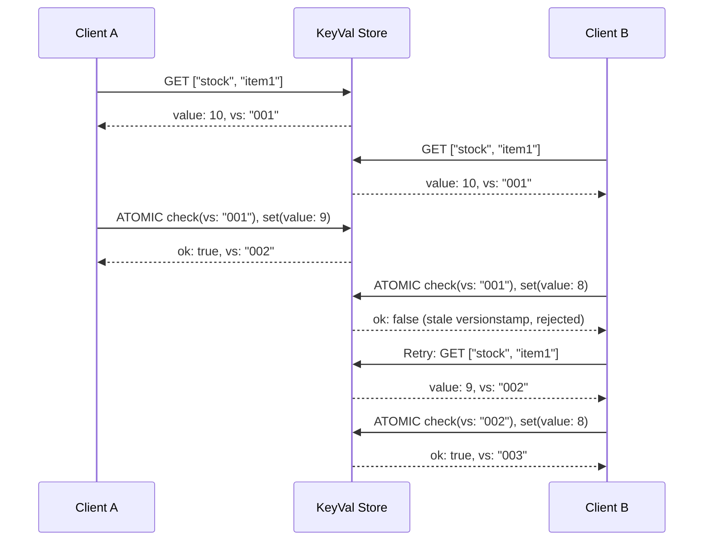

# Atomic Operations

Atomic operations in plugin-keyval provide all-or-nothing semantics with optimistic concurrency control, enabling safe concurrent data modifications.

## Overview

An atomic operation groups multiple checks and mutations into a single transaction:

1. **Checks** verify that entries haven't changed since they were read (using versionstamps)
2. **Mutations** describe the changes to apply
3. **Commit** executes everything atomically - all checks pass and all mutations apply, or nothing changes

```typescript
const result = await kv.atomic()
  .check({ key: ["users", "123"], versionstamp: "00000001" })
  .set(["users", "123"], updatedUser)
  .sum(["counters", "updates"], 1n)
  .commit();

if (result.ok) {
  console.log("All changes applied", result.versionstamp);
} else {
  console.log("Check failed - concurrent modification detected");
}
```

## Checks

Checks verify that an entry's versionstamp matches an expected value. If any check fails, the entire operation is aborted.

### Check for Specific Version

Ensures the entry hasn't been modified since you read it:

```typescript
// Read the current entry
const entry = await kv.get(["users", "123"]);

// Build atomic operation with version check
kv.atomic()
  .check({ key: ["users", "123"], versionstamp: entry.versionstamp })
  .set(["users", "123"], { ...entry.value, name: "Updated" })
  .commit();
```

### Check for Non-Existence

Ensures a key does NOT exist (useful for "create if not exists"):

```typescript
kv.atomic()
  .check({ key: ["users", "new-id"], versionstamp: null })
  .set(["users", "new-id"], { name: "New User" })
  .commit();
```

### Multiple Checks

You can check multiple keys in a single operation:

```typescript
kv.atomic()
  .check({ key: ["users", "123"], versionstamp: "00000001" })
  .check({ key: ["users", "456"], versionstamp: "00000002" })
  .check({ key: ["config", "version"], versionstamp: "00000003" })
  .set(["batch", "processed"], true)
  .commit();
```

All checks must pass for the operation to succeed.

### REST API Checks

```json
{
  "checks": [
    { "key": ["users", "123"], "versionstamp": "00000001" },
    { "key": ["new-entry"], "versionstamp": null }
  ],
  "mutations": [
    { "type": "set", "key": ["users", "123"], "value": { "name": "Updated" } }
  ]
}
```

## Mutation Types

### set

Set a key to a value with optional TTL:

```typescript
atomic.set(["users", "123"], { name: "Alice" });
atomic.set(["sessions", "abc"], sessionData, { expiresIn: 3600000 });
```

```json
{ "type": "set", "key": ["users", "123"], "value": { "name": "Alice" }, "expiresIn": 3600000 }
```

### delete

Remove a key:

```typescript
atomic.delete(["temp", "cache"]);
```

```json
{ "type": "delete", "key": ["temp", "cache"] }
```

### sum

Add a value to the current numeric value. If the key doesn't exist, it's treated as `0`:

```typescript
atomic.sum(["counters", "visits"], 1n);   // Increment by 1
atomic.sum(["counters", "balance"], -5n); // Decrement by 5
```

```json
{ "type": "sum", "key": ["counters", "visits"], "value": 1 }
```

> **Note:** Values are handled as BigInt internally but are converted to Number in the JSON API. Values must be within `Number.MIN_SAFE_INTEGER` to `Number.MAX_SAFE_INTEGER` range.

### max

Set the value to the maximum of the current value and the new value. If the key doesn't exist, the new value is used:

```typescript
atomic.max(["stats", "peak"], 100n);
```

```json
{ "type": "max", "key": ["stats", "peak"], "value": 100 }
```

### min

Set the value to the minimum of the current value and the new value. If the key doesn't exist, the new value is used:

```typescript
atomic.min(["stats", "low"], 5n);
```

```json
{ "type": "min", "key": ["stats", "low"], "value": 5 }
```

### append

Append items to an array value. If the key doesn't exist, creates a new array:

```typescript
atomic.append(["lists", "tags"], ["javascript", "tutorial"]);
```

```json
{ "type": "append", "key": ["lists", "tags"], "value": ["javascript", "tutorial"] }
```

> **Important:** The value must be an array. Returns `400 Bad Request` if not.

### prepend

Prepend items to an array value. If the key doesn't exist, creates a new array:

```typescript
atomic.prepend(["lists", "recent"], ["latest-item"]);
```

```json
{ "type": "prepend", "key": ["lists", "recent"], "value": ["latest-item"] }
```

## Commit Results

### Success

```typescript
interface KvCommitResult {
  ok: true;
  versionstamp: string;  // New versionstamp for all mutations
}
```

All mutations in the same commit share the same versionstamp.

### Failure (Check Failed)

```typescript
interface KvCommitError {
  ok: false;
}
```

No changes were applied. The caller should re-read the data and retry.

> **Note:** A check failure is NOT an HTTP error. The response status is still `200 OK`, with `{ "ok": false }` in the body.

### Empty Commit

Committing with no checks and no mutations returns success:

```json
{ "ok": true, "versionstamp": "<generated-uuid>" }
```

## Optimistic Concurrency Control

The check-and-mutate pattern enables safe concurrent access without locking:



## UUIDv7 Placeholders

UUIDv7 placeholders generate consistent IDs across mutations within the same atomic commit. All placeholders resolve to the **same UUIDv7** at commit time:

```typescript
const id = kv.uuidv7();

await kv.atomic()
  .set(["posts", postId], { title: "Hello", authorId })
  .set(["posts_by_time", id, postId], postId)
  .set(["posts_by_author", authorId, id], postId)
  .commit();
// All `id` references resolve to the same UUIDv7 value
```

This is useful for creating consistent cross-references and time-ordered indexes in a single atomic operation.

## Transactions

The `KvTransaction` class provides a higher-level abstraction over atomic operations with automatic conflict detection and retry:

```typescript
interface KvTransactionOptions {
  maxRetries?: number;   // Default: 0 (no retry)
  retryDelay?: number;   // Default: 10ms (exponential backoff)
}

interface KvTransactionResult<T> {
  ok: true;
  value: T;
  versionstamp: string;
}

interface KvTransactionError {
  ok: false;
  error: "conflict" | "error";
  message?: string;
}
```

Transactions automatically:
1. Read entries and track their versionstamps
2. Execute your callback with read/write helpers
3. Build an atomic operation with checks and mutations
4. Commit and retry on conflict (up to `maxRetries`)

## Common Patterns

### Read-Modify-Write

```bash
# 1. Read current value
curl http://localhost:8000/keyval/api/keys/users/123
# Response: { "key": [...], "value": {...}, "versionstamp": "00000001" }

# 2. Modify and write atomically
curl -X POST http://localhost:8000/keyval/api/atomic \
  -H "Content-Type: application/json" \
  -d '{
    "checks": [{"key": ["users", "123"], "versionstamp": "00000001"}],
    "mutations": [{"type": "set", "key": ["users", "123"], "value": {"name": "Updated"}}]
  }'
```

### Increment Counter

```bash
curl -X POST http://localhost:8000/keyval/api/atomic \
  -H "Content-Type: application/json" \
  -d '{
    "mutations": [{"type": "sum", "key": ["counters", "page-views"], "value": 1}]
  }'
```

### Create If Not Exists

```bash
curl -X POST http://localhost:8000/keyval/api/atomic \
  -H "Content-Type: application/json" \
  -d '{
    "checks": [{"key": ["users", "alice"], "versionstamp": null}],
    "mutations": [{"type": "set", "key": ["users", "alice"], "value": {"name": "Alice"}}]
  }'
```

### Multi-Key Update with Side Effects

```bash
curl -X POST http://localhost:8000/keyval/api/atomic \
  -H "Content-Type: application/json" \
  -d '{
    "checks": [
      {"key": ["orders", "ord-1"], "versionstamp": "00000001"}
    ],
    "mutations": [
      {"type": "set", "key": ["orders", "ord-1"], "value": {"status": "shipped"}},
      {"type": "append", "key": ["order-history", "user-1"], "value": ["ord-1"]},
      {"type": "sum", "key": ["stats", "shipped-orders"], "value": 1},
      {"type": "delete", "key": ["pending-orders", "ord-1"]}
    ]
  }'
```

### Track Peak Value

```bash
# Update peak concurrent users - only increases
curl -X POST http://localhost:8000/keyval/api/atomic \
  -H "Content-Type: application/json" \
  -d '{
    "mutations": [{"type": "max", "key": ["stats", "peak-users"], "value": 150}]
  }'
```

## Next Steps

- [Keys and Entries](keys-and-entries.md) - Key structure and versionstamps
- [Queues](queues.md) - Message queue system
- [API Reference](../api-reference.md) - Complete endpoint reference
