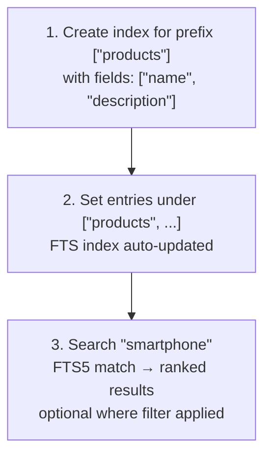
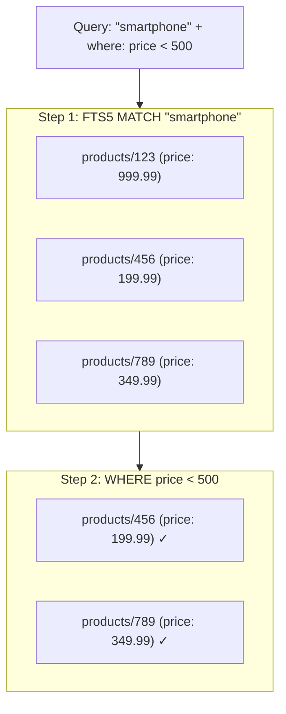

# Full-Text Search

Plugin-keyval includes FTS5-based full-text search that enables efficient text search across KV entries with configurable tokenizers and hybrid filtering.

## Overview

Full-text search works by creating **indexes** on specific fields of entries under a key prefix. When entries are created or updated, the FTS index is automatically synchronized.



## Creating Indexes

An FTS index must be created before you can search. Each prefix can have only one index.

### Basic Index

```bash
curl -X POST http://localhost:8000/keyval/api/indexes \
  -H "Content-Type: application/json" \
  -d '{
    "prefix": ["products"],
    "options": {
      "fields": ["name", "description", "category"]
    }
  }'
```

### Index with Custom Tokenizer

```bash
curl -X POST http://localhost:8000/keyval/api/indexes \
  -H "Content-Type: application/json" \
  -d '{
    "prefix": ["posts"],
    "options": {
      "fields": ["title", "content", "tags"],
      "tokenize": "porter"
    }
  }'
```

### Response

```json
{
  "ok": true
}
```

> **Note:** Creating a new index for an existing prefix replaces the previous index.

## Tokenizers

Tokenizers determine how text is split into searchable tokens.

### unicode61 (Default)

Standard Unicode tokenization. Supports international characters and most languages.

```json
{
  "options": {
    "fields": ["name", "description"],
    "tokenize": "unicode61"
  }
}
```

Best for: General-purpose multilingual content.

### porter

Applies the Porter Stemming algorithm, which normalizes words to their root form. This improves recall by matching different word forms.

```json
{
  "options": {
    "fields": ["title", "content"],
    "tokenize": "porter"
  }
}
```

Stemming examples:
- "running", "runs", "ran" → "run"
- "swimming", "swimmer" → "swim"
- "better" → "better" (irregular forms may not stem)

Best for: English-language content where you want flexible matching.

### ascii

Basic ASCII tokenization. Only handles ASCII characters.

```json
{
  "options": {
    "fields": ["code", "identifier"],
    "tokenize": "ascii"
  }
}
```

Best for: ASCII-only content, codes, or identifiers.

## Searching

### Simple Search (GET)

Search via query parameters:

```bash
curl "http://localhost:8000/keyval/api/search?prefix=products&query=smartphone&limit=10"
```

**Query Parameters:**

| Parameter | Type | Default | Description |
|-----------|------|---------|-------------|
| `prefix` | `string` | (required) | FTS index prefix |
| `query` | `string` | (required) | Search text |
| `limit` | `number` | `100` | Max results (max: 1000) |

### Advanced Search (POST)

Search with additional where filters:

```bash
curl -X POST http://localhost:8000/keyval/api/search \
  -H "Content-Type: application/json" \
  -d '{
    "prefix": ["products"],
    "query": "smartphone",
    "options": {
      "limit": 20,
      "where": {
        "price": { "$lt": 500 },
        "inStock": { "$eq": true }
      }
    }
  }'
```

### Search Response

```json
[
  {
    "key": ["products", "123"],
    "value": {
      "name": "Smartphone XYZ",
      "description": "High-end smartphone with advanced features",
      "price": 999.99,
      "inStock": true
    },
    "versionstamp": "00000000000000010000"
  },
  {
    "key": ["products", "456"],
    "value": {
      "name": "Budget Phone",
      "description": "Affordable smartphone for everyday use",
      "price": 199.99,
      "inStock": true
    },
    "versionstamp": "00000000000000020000"
  }
]
```

Results are ordered by FTS5 relevance ranking.

## How Search Works

The search process has two stages:

1. **FTS5 match**: The search query is run against the FTS index, returning entries that match the text. Results are ranked by relevance.
2. **Where filter** (optional): The matched entries are then filtered using the `where` clause against the full KV entry values.

This two-stage approach combines:
- **Fast text search** using FTS5 indexes
- **Structured filtering** on any field in the entry value



## Managing Indexes

### List All Indexes

```bash
curl http://localhost:8000/keyval/api/indexes
```

```json
[
  {
    "prefix": ["products"],
    "fields": ["name", "description", "category"],
    "tokenize": "unicode61"
  },
  {
    "prefix": ["posts"],
    "fields": ["title", "content"],
    "tokenize": "porter"
  }
]
```

### Remove an Index

```bash
curl -X DELETE "http://localhost:8000/keyval/api/indexes?prefix=products"
```

```json
{
  "ok": true
}
```

> **Note:** Removing an index also drops the associated FTS5 table. You will no longer be able to search entries with that prefix until a new index is created.

## Index Synchronization

FTS indexes are automatically synchronized when entries are modified:

- **Set**: When an entry under an indexed prefix is created or updated, its indexed fields are extracted and inserted/updated in the FTS table.
- **Delete**: When an entry is deleted, its FTS entry is also removed.
- **Atomic operations**: FTS synchronization happens as part of the atomic commit.

## Field Paths

Fields can reference nested properties using dot notation:

```bash
# Index nested fields
curl -X POST http://localhost:8000/keyval/api/indexes \
  -H "Content-Type: application/json" \
  -d '{
    "prefix": ["products"],
    "options": {
      "fields": ["name", "details.description", "details.manufacturer.name"]
    }
  }'
```

Given an entry:
```json
{
  "name": "Laptop Pro",
  "details": {
    "description": "High-performance laptop",
    "manufacturer": {
      "name": "TechCorp"
    }
  }
}
```

A search for "TechCorp" would match because `details.manufacturer.name` is indexed.

## Common Patterns

### Product Catalog Search

```bash
# Create index
curl -X POST http://localhost:8000/keyval/api/indexes \
  -H "Content-Type: application/json" \
  -d '{
    "prefix": ["products"],
    "options": {"fields": ["name", "description", "category"], "tokenize": "porter"}
  }'

# Add products
curl -X PUT http://localhost:8000/keyval/api/keys/products/laptop-1 \
  -H "Content-Type: application/json" \
  -d '{"name": "Gaming Laptop", "description": "Powerful gaming laptop with RTX", "category": "computers", "price": 1499, "inStock": true}'

# Search with filters
curl -X POST http://localhost:8000/keyval/api/search \
  -H "Content-Type: application/json" \
  -d '{
    "prefix": ["products"],
    "query": "gaming laptop",
    "options": {
      "where": {
        "inStock": {"$eq": true},
        "price": {"$between": [500, 2000]}
      }
    }
  }'
```

### Blog Post Search

```bash
# Create index with Porter stemming
curl -X POST http://localhost:8000/keyval/api/indexes \
  -H "Content-Type: application/json" \
  -d '{
    "prefix": ["posts"],
    "options": {"fields": ["title", "content", "tags"], "tokenize": "porter"}
  }'

# Search - "running" also matches "run", "runs", "runner"
curl "http://localhost:8000/keyval/api/search?prefix=posts&query=running&limit=20"
```

### Multi-Field Search with Complex Filters

```bash
curl -X POST http://localhost:8000/keyval/api/search \
  -H "Content-Type: application/json" \
  -d '{
    "prefix": ["articles"],
    "query": "machine learning tutorial",
    "options": {
      "limit": 10,
      "where": {
        "$and": [
          {"status": {"$eq": "published"}},
          {"publishedAt": {"$lt": {"$now": true}}},
          {"rating": {"$gte": 4}},
          {"$not": {"tags": {"$contains": "draft"}}}
        ]
      }
    }
  }'
```

## Performance Considerations

- **Index what you search**: Only include fields that need text search in the index. More fields = larger index.
- **Choose the right tokenizer**: Use `porter` for English prose, `unicode61` for multilingual, `ascii` for identifiers.
- **Combine FTS with where**: Let FTS narrow results first, then apply where filters. This is more efficient than scanning all entries.
- **Limit results**: Always use `limit` to avoid returning too many results.
- **One index per prefix**: Each prefix can have exactly one FTS index. Design your key structure accordingly.

## Next Steps

- [Queues](queues.md) - Message queue system
- [Where Filters](../guides/where-filters.md) - Filter operators for hybrid queries
- [Keys and Entries](keys-and-entries.md) - Key design for FTS
- [API Reference](../api-reference.md) - Complete endpoint reference
