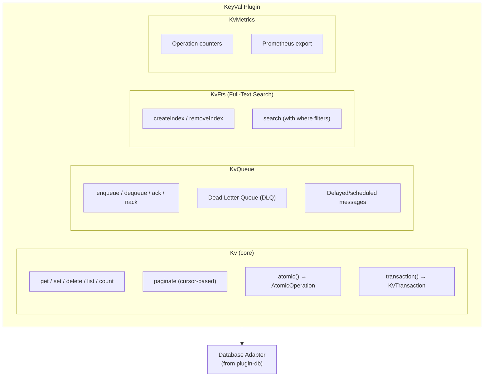

# Overview

Deno KV-inspired key-value store plugin for Buntime with composite keys, TTL support, atomic transactions, full-text search, message queues, and real-time watch via SSE.

## Features

- **Composite Keys** - Array-based keys (e.g., `["users", "123", "profile"]`)
- **TTL Support** - Automatic expiration via `expiresIn` (milliseconds)
- **Atomic Transactions** - Optimistic concurrency control with version checks
- **Where Filters** - SQL-like filtering (`$eq`, `$gt`, `$contains`, `$in`, etc.)
- **Prefix Listing** - Iterate entries by key prefix with pagination
- **Full-Text Search** - FTS5-based full-text search with configurable tokenizers
- **Message Queue** - FIFO queue with priorities, retries, dead letter queue
- **Watch (SSE)** - Real-time key change notifications via Server-Sent Events
- **Metrics** - Operation tracking with Prometheus export
- **UUIDv7 Placeholders** - Generate consistent UUIDv7s across atomic operations

## Architecture



**API Mode**: Persistent (routes in `plugin.ts`, runs on main thread). SSE streaming and watch endpoints require the main thread.

## Main Components

### 1. Kv (Core)

The central class that provides all key-value operations:
- `get()` / `set()` / `delete()` - CRUD operations
- `list()` - Prefix-based iteration with where filters
- `count()` - Count entries by prefix
- `paginate()` - Cursor-based pagination
- `atomic()` - Create atomic operation builder
- `transaction()` - High-level transaction with auto-retry

**File:** `server/lib/kv.ts`

### 2. AtomicOperation

Builder pattern for atomic operations:
- Version checks for optimistic concurrency control
- Multiple mutation types: `set`, `delete`, `sum`, `max`, `min`, `append`, `prepend`
- UUIDv7 placeholder support for consistent cross-references
- All-or-nothing commit semantics

**File:** `server/lib/atomic.ts`

### 3. KvTransaction

High-level transaction abstraction:
- Reads and writes within a transaction scope
- Automatic conflict detection via versionstamps
- Configurable retry with exponential backoff
- Returns `{ ok: true, value, versionstamp }` or `{ ok: false, error }`

**File:** `server/lib/transaction.ts`

### 4. KvQueue

FIFO message queue:
- Enqueue with optional delay and retry configuration
- Dequeue with automatic locking
- Acknowledge (ack) or reject (nack) messages
- Dead Letter Queue (DLQ) for failed messages
- `keysIfUndelivered` for storing failures in KV
- Automatic cleanup of stale locks

**File:** `server/lib/queue.ts`

### 5. KvFts (Full-Text Search)

FTS5-based full-text search:
- Create indexes on specific fields with configurable tokenizers
- Search with relevance ranking
- Combine FTS with where filters for hybrid queries
- Automatic index synchronization on set/delete

**File:** `server/lib/fts.ts`

### 6. KvMetrics

Operation tracking and monitoring:
- Counters for each operation type (get, set, delete, list, atomic)
- Error tracking per operation
- Queue statistics (pending, processing, DLQ)
- Storage statistics (entry count, size in bytes)
- Prometheus text format export
- Optional persistence to database

**File:** `server/lib/metrics.ts`

### 7. Key Encoding

Binary key encoding for correct lexicographic ordering:
- Type-prefixed encoding (ordering: Uint8Array < string < number < bigint < boolean)
- Supports all key part types: `string`, `number`, `bigint`, `boolean`, `Uint8Array`
- URL path to key array conversion and vice versa

**File:** `server/lib/encoding.ts`

### 8. Where-to-SQL

Where filter to SQL conversion:
- Translates where filter objects to SQL WHERE clauses
- Uses SQLite `json_extract()` for value field access
- Supports nested field paths via dot notation
- Resolves `$now` placeholders to server timestamps

**File:** `server/lib/where-to-sql.ts`

## Tech Stack

- **Runtime**: Bun
- **Framework**: Hono
- **Database**: SQLite/LibSQL (via plugin-database)
- **FTS**: SQLite FTS5
- **Logging**: `@buntime/shared/logger`
- **Types**: TypeScript

## Lifecycle Hooks

The plugin uses the following Buntime hooks:

### onInit

Initializes all KeyVal components:
1. Gets database service from `plugin-database`
2. Gets root adapter for the configured database type
3. Initializes database schema (KV entries table, queue table, DLQ table)
4. Creates the `Kv` instance with all sub-components
5. Sets API state for route handlers
6. Logs the initialized database type

### onShutdown

Resource cleanup:
1. Flushes pending metrics (if persistent)
2. Stops queue cleanup interval
3. Closes all resources

## Service Registry

The plugin exposes the `Kv` instance via `provides()`:

```typescript
// In another plugin's onInit:
const kv = ctx.getPlugin<Kv>("@buntime/plugin-keyval");
await kv.set(["config", "theme"], "dark");
const entry = await kv.get(["config", "theme"]);
```

The queue is accessible via `kv.queue`, FTS via `kv.fts`, and metrics via `kv.metrics`.

## Integration with Other Plugins

### plugin-database (required)

Uses the database adapter for all storage operations:

```typescript
const database = ctx.getPlugin<DatabaseService>("@buntime/plugin-database");
const adapter = database.getRootAdapter(config.database);
```

### plugin-gateway (consumer)

The gateway uses KeyVal for:
- **Metrics history** - Snapshots every 1 second, up to 3600 entries (1 hour)
- **Shell excludes** - Dynamic bypass list for micro-frontend shell

### plugin-proxy (consumer)

Stores dynamic proxy rules in KeyVal.

## File Structure

```
plugins/plugin-keyval/
├── manifest.yaml          # Configuration
├── plugin.ts              # Main plugin (routes, provides)
├── index.ts               # Worker entrypoint (serves UI SPA)
├── server/
│   ├── index.ts          # Hono API routes (all endpoints)
│   ├── services.ts       # Service layer (initialize, shutdown, getKv)
│   └── lib/
│       ├── kv.ts         # Core Kv class
│       ├── atomic.ts     # AtomicOperation
│       ├── transaction.ts # KvTransaction
│       ├── queue.ts      # KvQueue (FIFO + DLQ)
│       ├── fts.ts        # KvFts (Full-Text Search)
│       ├── metrics.ts    # KvMetrics
│       ├── schema.ts     # Database schema initialization
│       ├── encoding.ts   # Key encoding/decoding
│       ├── validation.ts # Input validation
│       ├── where-to-sql.ts # Where filter to SQL conversion
│       └── types.ts      # Type definitions
├── client/               # UI SPA (React + TanStack Router)
└── dist/                 # Compiled output
```

## API Routes Summary

All routes are mounted at `/keyval/api/*`:

| Route | Method | Description |
|-------|--------|-------------|
| `/api/keys` | GET | List entries by prefix |
| `/api/keys/list` | POST | List with where filters |
| `/api/keys/count` | GET | Count entries by prefix |
| `/api/keys/paginate` | GET | Cursor-based pagination |
| `/api/keys/*` | GET | Get entry by key path |
| `/api/keys/*` | PUT | Set entry value |
| `/api/keys/*` | DELETE | Delete entry |
| `/api/keys/batch` | POST | Batch get |
| `/api/keys/delete-batch` | POST | Batch delete |
| `/api/atomic` | POST | Execute atomic operation |
| `/api/queue/enqueue` | POST | Enqueue message |
| `/api/queue/listen` | GET | SSE stream for messages |
| `/api/queue/poll` | GET | Poll single message |
| `/api/queue/ack` | POST | Acknowledge message |
| `/api/queue/nack` | POST | Reject message |
| `/api/queue/stats` | GET | Queue statistics |
| `/api/queue/dlq` | GET | List DLQ messages |
| `/api/queue/dlq/:id` | GET | Get DLQ message |
| `/api/queue/dlq/:id/requeue` | POST | Requeue DLQ message |
| `/api/queue/dlq/:id` | DELETE | Delete DLQ message |
| `/api/queue/dlq` | DELETE | Purge all DLQ messages |
| `/api/watch` | GET | Watch keys (SSE) |
| `/api/watch/poll` | GET | Poll for key changes |
| `/api/watch/prefix` | GET | Watch by prefix (SSE) |
| `/api/watch/prefix/poll` | GET | Poll prefix changes |
| `/api/indexes` | POST | Create FTS index |
| `/api/indexes` | GET | List FTS indexes |
| `/api/indexes` | DELETE | Remove FTS index |
| `/api/search` | GET | Simple search |
| `/api/search` | POST | Search with where filters |
| `/api/metrics` | GET | JSON metrics |
| `/api/metrics/prometheus` | GET | Prometheus metrics |

## Next Steps

- [Keys and Entries](keys-and-entries.md) - Key structure and TTL
- [Atomic Operations](atomic-operations.md) - Concurrency control
- [Queues](queues.md) - Message queue and DLQ
- [Full-Text Search](full-text-search.md) - FTS indexes and search
- [Configuration](../guides/configuration.md) - Configuration reference
- [Where Filters](../guides/where-filters.md) - Filter operators
- [API Reference](../api-reference.md) - Complete endpoint reference
