# Queues

Plugin-keyval includes a FIFO message queue with priorities, configurable retries, delayed delivery, and a dead letter queue (DLQ) for handling failures.

## Overview

The queue system provides reliable message processing:

```mermaid
sequenceDiagram
    participant P as Producer
    participant Q as Queue
    participant C as Consumer

    P->>Q: enqueue(msg)
    Note over Q: pending

    Q->>C: dequeue (locked)
    Note over C: process

    alt Success
        C->>Q: ack
        Note over Q: removed
    else Failure
        C->>Q: nack
        Note over Q: retry with backoff
        Note over Q: max retries exceeded? → DLQ
    end
```



## Enqueuing Messages

### Simple Enqueue

```bash
curl -X POST http://localhost:8000/keyval/api/queue/enqueue \
  -H "Content-Type: application/json" \
  -d '{"value": {"task": "send-email", "to": "user@example.com"}}'
```

```json
{
  "ok": true,
  "id": "01J9X3K2M5N7P8Q9R0S1T2V3W4"
}
```

### Delayed Delivery

Schedule a message to become available after a delay:

```bash
curl -X POST http://localhost:8000/keyval/api/queue/enqueue \
  -H "Content-Type: application/json" \
  -d '{
    "value": {"task": "send-reminder"},
    "options": {"delay": 60000}
  }'
```

The message won't be dequeued until 60 seconds after enqueue.

### Custom Retry Schedule

Configure retry backoff intervals in milliseconds:

```bash
curl -X POST http://localhost:8000/keyval/api/queue/enqueue \
  -H "Content-Type: application/json" \
  -d '{
    "value": {"task": "webhook", "url": "https://api.example.com/hook"},
    "options": {
      "backoffSchedule": [1000, 5000, 30000]
    }
  }'
```

This message will be retried up to 3 times with increasing delays:
1. First retry: after 1 second
2. Second retry: after 5 seconds
3. Third retry: after 30 seconds
4. If still failing: moved to DLQ

Default backoff schedule: `[1000, 5000, 10000]` (3 retries)

### Keys If Undelivered

Store the message value at specified KV keys if all retries are exhausted:

```bash
curl -X POST http://localhost:8000/keyval/api/queue/enqueue \
  -H "Content-Type: application/json" \
  -d '{
    "value": {"task": "process-payment", "orderId": "ord-123", "amount": 99.99},
    "options": {
      "backoffSchedule": [1000, 5000, 30000],
      "keysIfUndelivered": [
        ["failed-payments", "ord-123"],
        ["alerts", "payment-failure", "ord-123"]
      ]
    }
  }'
```

If the message fails after all retries:
1. It's moved to the DLQ
2. The message value is also stored at the specified KV keys

This enables reactive patterns - other systems can watch those keys or query them.

## Consuming Messages

### SSE Streaming (Recommended)

The `/queue/listen` endpoint provides a persistent SSE connection that auto-dequeues messages:

```bash
curl -N http://localhost:8000/keyval/api/queue/listen
```

```
event: message
id: 01J9X3K2M5N7P8Q9R0S1T2V3W4
data: {"id":"01J9X3K2M5N7P8Q9R0S1T2V3W4","value":{"task":"send-email"},"attempts":1}

event: ping
data:

event: message
id: 01J9X3K2M5N7P8Q9R0S1T2V3W5
data: {"id":"01J9X3K2M5N7P8Q9R0S1T2V3W5","value":{"task":"another"},"attempts":1}
```

**Event types:**
- `message` - A new message is available for processing
- `ping` - Heartbeat (sent when no messages are available)

**JavaScript consumer:**

```javascript
const eventSource = new EventSource("/keyval/api/queue/listen");

eventSource.addEventListener("message", async (event) => {
  const msg = JSON.parse(event.data);
  console.log(`Processing: ${msg.id}, attempt: ${msg.attempts}`);

  try {
    await processMessage(msg.value);

    // Acknowledge success
    await fetch("/keyval/api/queue/ack", {
      method: "POST",
      headers: { "Content-Type": "application/json" },
      body: JSON.stringify({ id: msg.id }),
    });
  } catch (error) {
    // Reject for retry
    await fetch("/keyval/api/queue/nack", {
      method: "POST",
      headers: { "Content-Type": "application/json" },
      body: JSON.stringify({ id: msg.id }),
    });
  }
});
```

### Polling

For simpler consumers, poll for one message at a time:

```bash
# Get next message (or null if queue is empty)
curl http://localhost:8000/keyval/api/queue/poll
```

```json
{
  "message": {
    "id": "01J9X3K2M5N7P8Q9R0S1T2V3W4",
    "value": { "task": "send-email" },
    "attempts": 1
  }
}
```

```json
{
  "message": null
}
```

## Acknowledgment and Rejection

### Acknowledge (ack)

Confirm successful processing. The message is permanently removed from the queue:

```bash
curl -X POST http://localhost:8000/keyval/api/queue/ack \
  -H "Content-Type: application/json" \
  -d '{"id": "01J9X3K2M5N7P8Q9R0S1T2V3W4"}'
```

### Reject (nack)

Reject a message for retry. The queue will:
1. Check if retries remain (based on `backoffSchedule`)
2. If retries remain: re-queue with the next backoff delay
3. If retries exhausted: move to DLQ (and optionally store at `keysIfUndelivered`)

```bash
curl -X POST http://localhost:8000/keyval/api/queue/nack \
  -H "Content-Type: application/json" \
  -d '{"id": "01J9X3K2M5N7P8Q9R0S1T2V3W4"}'
```

## Message Locking

When a message is dequeued, it's locked for a configurable duration (`lockDuration`, default: 30 seconds). This prevents other consumers from processing the same message.

If a consumer fails to ack/nack before the lock expires:
- The message is automatically unlocked
- It becomes available for dequeue again

Lock duration is configurable in `manifest.yaml`:

```yaml
queue:
  lockDuration: 30000  # 30 seconds (default)
```

## Queue Statistics

```bash
curl http://localhost:8000/keyval/api/queue/stats
```

```json
{
  "pending": 10,
  "processing": 3,
  "dlq": 2,
  "total": 15
}
```

| Field | Description |
|-------|-------------|
| `pending` | Messages waiting to be processed |
| `processing` | Messages currently locked/being processed |
| `dlq` | Messages in the dead letter queue |
| `total` | Total messages across all states |

## Dead Letter Queue (DLQ)

Messages that fail after all retry attempts are moved to the DLQ. The DLQ allows inspection, reprocessing, or cleanup of failed messages.

### List DLQ Messages

```bash
curl "http://localhost:8000/keyval/api/queue/dlq?limit=50&offset=0"
```

```json
[
  {
    "id": "dlq-001",
    "originalId": "msg-001",
    "value": { "task": "webhook", "url": "https://api.example.com/hook" },
    "attempts": 3,
    "errorMessage": "Connection timeout",
    "originalCreatedAt": 1234567890000,
    "failedAt": 1234567900000
  }
]
```

### Get Specific DLQ Message

```bash
curl http://localhost:8000/keyval/api/queue/dlq/dlq-001
```

### Requeue DLQ Message

Move a failed message back to the main queue for reprocessing:

```bash
curl -X POST http://localhost:8000/keyval/api/queue/dlq/dlq-001/requeue
```

```json
{
  "ok": true,
  "newId": "01J9X3K2M5N7P8Q9R0S1T2V3W5"
}
```

### Delete DLQ Message

```bash
curl -X DELETE http://localhost:8000/keyval/api/queue/dlq/dlq-001
```

### Purge All DLQ Messages

```bash
curl -X DELETE http://localhost:8000/keyval/api/queue/dlq
```

```json
{
  "deletedCount": 42
}
```

## Queue Cleanup

The queue automatically cleans up stale entries:
- **Stale locks**: Messages locked longer than `lockDuration` are reset to pending
- **Cleanup interval**: Configurable via `queue.cleanupInterval` (default: 60 seconds)

```yaml
queue:
  cleanupInterval: 60000  # 60 seconds (default)
  lockDuration: 30000     # 30 seconds (default)
```

Set `cleanupInterval: 0` to disable automatic cleanup.

## Message Lifecycle


## Common Patterns

### Worker Queue

```bash
# Producer: enqueue jobs
curl -X POST http://localhost:8000/keyval/api/queue/enqueue \
  -H "Content-Type: application/json" \
  -d '{
    "value": {"type": "resize-image", "imageId": "img-123", "width": 800},
    "options": {"backoffSchedule": [2000, 10000, 60000]}
  }'

# Consumer: process with SSE
curl -N http://localhost:8000/keyval/api/queue/listen
```

### Scheduled Tasks

```bash
# Schedule task for 5 minutes from now
curl -X POST http://localhost:8000/keyval/api/queue/enqueue \
  -H "Content-Type: application/json" \
  -d '{
    "value": {"type": "cleanup-expired-sessions"},
    "options": {"delay": 300000}
  }'
```

### Failure Tracking

```bash
# Enqueue with failure tracking
curl -X POST http://localhost:8000/keyval/api/queue/enqueue \
  -H "Content-Type: application/json" \
  -d '{
    "value": {"type": "charge-card", "userId": "u-123", "amount": 49.99},
    "options": {
      "backoffSchedule": [5000, 30000, 120000],
      "keysIfUndelivered": [
        ["failed-charges", "u-123"],
        ["notifications", "admin", "charge-failed"]
      ]
    }
  }'

# Later: check for failures
curl http://localhost:8000/keyval/api/keys?prefix=failed-charges
```

## Next Steps

- [Atomic Operations](atomic-operations.md) - Transactions and concurrency
- [Full-Text Search](full-text-search.md) - FTS indexes and search
- [Configuration](../guides/configuration.md) - Queue configuration
- [API Reference](../api-reference.md) - Complete endpoint reference
