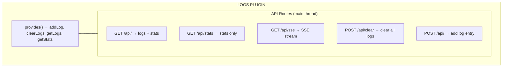

# Plugin Logs

In-memory log collection and viewing plugin for Buntime with real-time SSE streaming, filtering, and a built-in UI.

## Table of Contents

- [Overview](#overview)
- [Architecture](#architecture)
- [Configuration](#configuration)
- [API Endpoints](#api-endpoints)
- [Service Registry](#service-registry)
- [Lifecycle Hooks](#lifecycle-hooks)
- [Exported Types](#exported-types)
- [File Structure](#file-structure)
- [Examples](#examples)

## Overview

The `@buntime/plugin-logs` provides a lightweight, in-memory log collection system. Other plugins can push logs programmatically, and the UI displays them in real-time via SSE.

**Key Features:**

- **In-Memory Ring Buffer**: Fixed-size log storage (configurable max entries)
- **SSE Streaming**: Real-time log delivery via Server-Sent Events
- **Filtering**: Filter by log level and search text
- **Statistics**: Total counts per log level
- **Service Exposure**: Other plugins can add logs via the service registry
- **Built-in UI**: React SPA for browsing and filtering logs

## Architecture



**API Mode**: Persistent (routes in `plugin.ts`, runs on main thread). SSE streaming requires the main thread.

## Configuration

### manifest.yaml

```yaml
name: "@buntime/plugin-logs"
base: "/logs"
enabled: false
injectBase: true

entrypoint: dist/client/index.html
pluginEntry: dist/plugin.js

menus:
  - icon: lucide:scroll-text
    path: /logs
    title: Logs

maxEntries: 1000
sseInterval: 1000
```

### Configuration Options

| Option | Type | Default | Description |
|--------|------|---------|-------------|
| `maxEntries` | `number` | `1000` | Maximum log entries in memory (ring buffer) |
| `sseInterval` | `number` | `1000` | SSE update interval in milliseconds |

## API Endpoints

All routes are mounted at `/{base}/api/*` (default: `/logs/api/*`).

| Method | Endpoint | Description |
|--------|----------|-------------|
| `GET` | `/api/` | Get logs with optional filters + stats |
| `GET` | `/api/stats` | Get statistics only |
| `GET` | `/api/sse` | SSE stream (real-time logs + stats) |
| `POST` | `/api/clear` | Clear all logs |
| `POST` | `/api/` | Add a log entry |

### Query Parameters (GET `/api/`)

| Parameter | Type | Default | Description |
|-----------|------|---------|-------------|
| `level` | `string` | - | Filter by level (`debug`, `info`, `warn`, `error`) |
| `search` | `string` | - | Search text in message |
| `limit` | `number` | `100` | Maximum entries to return |

### SSE Stream

The SSE endpoint streams JSON data at the configured interval:

```json
{
  "logs": [
    {
      "timestamp": "2024-01-23T10:30:00.000Z",
      "level": "info",
      "message": "Request processed",
      "meta": { "duration": 42 }
    }
  ],
  "stats": {
    "total": 150,
    "debug": 50,
    "info": 80,
    "warn": 15,
    "error": 5
  }
}
```

### Add Log Entry (POST `/api/`)

```json
{
  "level": "info",
  "message": "User logged in",
  "source": "authn",
  "meta": { "userId": "123" }
}
```

## Service Registry

The plugin exposes log functions via `provides()`:

```typescript
const logs = ctx.getPlugin("@buntime/plugin-logs");

// Add a log entry
logs.addLog({
  level: "info",
  message: "Custom event occurred",
  source: "my-plugin",
  meta: { key: "value" }
});

// Get logs with filters
const entries = logs.getLogs({ level: "error", limit: 50 });

// Get statistics
const stats = logs.getStats();
// { total: 150, debug: 50, info: 80, warn: 15, error: 5 }

// Clear all logs
logs.clearLogs();
```

## Lifecycle Hooks

| Hook | Description |
|------|-------------|
| `onInit` | Sets logger instance |

## Exported Types

```typescript
export interface LogsConfig {
  maxEntries?: number;
  sseInterval?: number;
}

export type LogLevel = "debug" | "info" | "warn" | "error";

export interface LogEntry {
  timestamp: string;
  level: LogLevel;
  message: string;
  source?: string;
  meta?: Record<string, unknown>;
}

export function addLog(entry: Omit<LogEntry, "timestamp">): void;
```

## File Structure

```
plugins/plugin-logs/
├── manifest.yaml          # Configuration
├── plugin.ts              # Main plugin (routes, provides)
├── index.ts               # Worker entrypoint (serves UI SPA)
├── server/
│   ├── api.ts            # Hono API routes (SSE, CRUD)
│   └── services.ts       # Log service (addLog, getLogs, getStats, configure)
├── client/               # UI SPA (React + TanStack Router)
└── dist/                 # Compiled output
```

## Examples

### Basic Configuration

```yaml
name: "@buntime/plugin-logs"
enabled: true
maxEntries: 5000
sseInterval: 500
```

### Using from Another Plugin

```typescript
export default function myPlugin(): PluginImpl {
  return {
    onInit(ctx) {
      const logs = ctx.getPlugin("@buntime/plugin-logs");
      if (logs) {
        logs.addLog({
          level: "info",
          message: "My plugin initialized",
          source: "my-plugin"
        });
      }
    }
  };
}
```

### Consuming SSE Stream

```bash
curl -N /logs/api/sse
```

```javascript
const source = new EventSource("/logs/api/sse");
source.onmessage = (event) => {
  const { logs, stats } = JSON.parse(event.data);
  console.log("New logs:", logs.length, "Total:", stats.total);
};
```

## License

See [LICENSE](../../LICENSE) at the project root.
