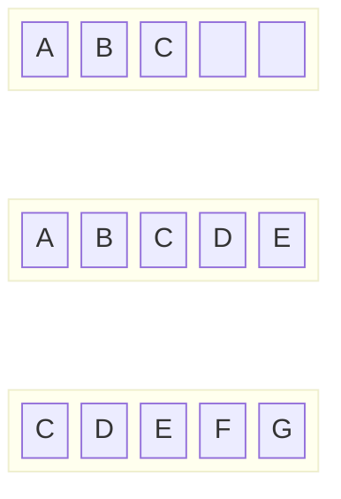
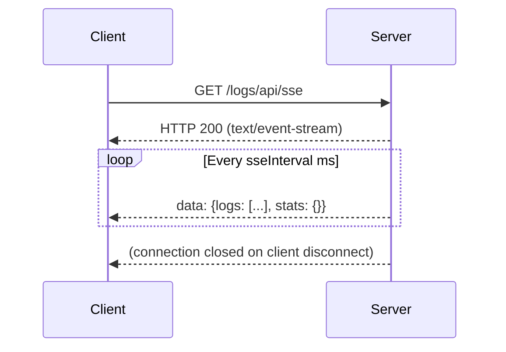

# Overview

In-memory log collection and viewing plugin for Buntime with real-time SSE streaming, filtering, and a built-in UI.

## Features

- **In-Memory Ring Buffer** - Fixed-size log storage with automatic eviction
- **SSE Streaming** - Real-time log delivery via Server-Sent Events
- **Level Filtering** - Filter by `debug`, `info`, `warn`, `error`
- **Text Search** - Search within log messages
- **Statistics** - Aggregate counts per log level
- **Service Registry** - Other plugins push logs programmatically
- **Built-in UI** - React SPA for browsing and filtering logs

## Architecture

The plugin-logs runs on the main thread as a persistent plugin, handling both API routes and SSE streaming:

```mermaid
graph TD
    subgraph LOGS_PLUGIN["LOGS PLUGIN"]
        PROVIDES["provides() → addLog, clearLogs, getLogs, getStats"]
        subgraph API["API Routes (main thread)"]
            R1["GET /api/ → logs + stats (filtered)"]
            R2["GET /api/stats → stats only"]
            R3["GET /api/sse → SSE stream (real-time)"]
            R4["POST /api/clear → clear all logs"]
            R5["POST /api/ → add log entry"]
        end
        subgraph RING["Ring Buffer (in-memory)"]
            direction LR
            N6["n-6"] --> N5["n-5"] --> N4["n-4"] --> N3["n-3"] --> N2["n-2"] --> N1["n-1"] --> N0["n ← new"]
        end
        NOTE["oldest → newest (auto-evicted when maxEntries reached)"]
        PROVIDES --- API
        API --- RING
        RING --- NOTE
    end
```



**API Mode**: Persistent (routes in `plugin.ts`, runs on main thread). SSE streaming requires the main thread for long-lived connections.

## Ring Buffer Architecture

The log store uses a fixed-size ring buffer to prevent unbounded memory growth:



> **maxEntries = 5 (example)**
> - State after 3 entries: `[A, B, C, _, _]` — size: 3
> - State after 5 entries (full): `[A, B, C, D, E]` — size: 5
> - State after 7 entries (A, B evicted): `[C, D, E, F, G]` — size: 5

**Key properties:**
- **Fixed memory**: Maximum `maxEntries` entries stored (default: 1000)
- **O(1) insertion**: Adding a log entry is constant time
- **Automatic eviction**: Oldest entries are dropped when capacity is reached
- **No persistence**: All logs are lost on restart (by design)

## SSE Streaming

The SSE endpoint maintains long-lived connections and pushes the full log + stats payload at a configurable interval:



**SSE behavior:**
- Interval defaults to 1000ms (configurable via `sseInterval`)
- Each event contains the full log array and current stats
- Connection is automatically cleaned up when the client disconnects
- Multiple SSE clients can connect simultaneously

## Service Registry

The plugin exposes log functions via `provides()` so other plugins can add logs programmatically without making HTTP requests:

```typescript
// In another plugin
const logs = ctx.getPlugin("@buntime/plugin-logs");

// Add a log entry
logs.addLog({
  level: "info",
  message: "Custom event occurred",
  source: "my-plugin",
  meta: { key: "value" },
});

// Get logs with filters
const entries = logs.getLogs({ level: "error", limit: 50 });

// Get statistics
const stats = logs.getStats();
// { total: 150, debug: 50, info: 80, warn: 15, error: 5 }

// Clear all logs
logs.clearLogs();
```

**Exposed service methods:**

| Method | Signature | Description |
|--------|-----------|-------------|
| `addLog` | `(entry: Omit<LogEntry, "timestamp">) => void` | Add a log entry (timestamp is auto-generated) |
| `getLogs` | `(filters?: { level?, search?, limit? }) => LogEntry[]` | Get filtered log entries |
| `getStats` | `() => LogStats` | Get aggregate statistics |
| `clearLogs` | `() => void` | Clear all log entries and reset stats |

## Log Levels

Four severity levels are supported, ordered from least to most severe:

| Level | Usage | Example |
|-------|-------|---------|
| `debug` | Verbose diagnostics, development only | Cache hit/miss, query details |
| `info` | Normal operational events | Request processed, user logged in |
| `warn` | Potential issues, degraded behavior | Slow query, deprecated API call |
| `error` | Failures requiring attention | Connection timeout, unhandled exception |

## Log Entry Structure

Each log entry contains:

```typescript
interface LogEntry {
  timestamp: string;    // ISO 8601, auto-generated
  level: LogLevel;      // "debug" | "info" | "warn" | "error"
  message: string;      // Human-readable description
  source?: string;      // Origin identifier (plugin name, service)
  meta?: Record<string, unknown>; // Arbitrary metadata
}
```

The `source` field is useful for filtering logs from specific plugins or services. The `meta` field can contain any structured data relevant to the log event.

## Lifecycle Hooks

| Hook | Description |
|------|-------------|
| `onInit` | Stores logger instance, initializes ring buffer with `maxEntries` config |

## File Structure

```
plugins/plugin-logs/
├── manifest.yaml          # Configuration
├── plugin.ts              # Main plugin (routes, provides)
├── index.ts               # Worker entrypoint (serves UI SPA)
├── server/
│   ├── api.ts            # Hono API routes (SSE, CRUD)
│   └── services.ts       # Log service (addLog, getLogs, getStats, configure)
├── client/               # UI SPA (React + TanStack Router)
└── dist/                 # Compiled output
```

## Built-in UI

The plugin includes a React SPA accessible at `/logs` that provides:

- Real-time log streaming (via SSE)
- Level filtering (debug, info, warn, error)
- Text search across messages
- Statistics dashboard with per-level counts
- Clear logs action

## Integration with Other Plugins

### Any Plugin (as log producer)

Any Buntime plugin can push logs via the service registry:

```typescript
export default function myPlugin(): PluginImpl {
  return {
    onInit(ctx) {
      const logs = ctx.getPlugin("@buntime/plugin-logs");
      if (logs) {
        logs.addLog({
          level: "info",
          message: "My plugin initialized",
          source: "my-plugin",
        });
      }
    },
  };
}
```

### plugin-gateway

The gateway plugin can forward its request logs to the log plugin for centralized viewing.

## Design Decisions

1. **In-memory only**: No persistence by design. Logs are transient diagnostic data. For persistent logging, use an external log aggregator.
2. **Ring buffer**: Prevents memory leaks. Once `maxEntries` is reached, oldest entries are silently evicted.
3. **Main thread**: SSE requires long-lived connections which are only supported on the main thread in Buntime's architecture.
4. **Full payload on SSE**: Each SSE event sends the complete log array rather than incremental updates, simplifying client implementation at the cost of bandwidth.

## Next Steps

- [API Reference](../api-reference.md) - Complete endpoint documentation
- [Configuration](../guides/configuration.md) - maxEntries, sseInterval settings
