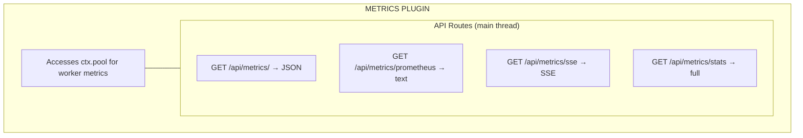

# Plugin Metrics

Runtime pool and worker metrics collection plugin for Buntime with JSON, Prometheus, and SSE export formats.

## Table of Contents

- [Overview](#overview)
- [Architecture](#architecture)
- [Configuration](#configuration)
- [API Endpoints](#api-endpoints)
- [Metrics Format](#metrics-format)
- [Lifecycle Hooks](#lifecycle-hooks)
- [Exported Types](#exported-types)
- [File Structure](#file-structure)
- [Examples](#examples)

## Overview

The `@buntime/plugin-metrics` collects runtime metrics from the worker pool and exposes them via JSON, Prometheus, and SSE endpoints. It provides real-time visibility into pool utilization, worker health, and request processing.

**Key Features:**

- **JSON Metrics**: Standard JSON endpoint for programmatic consumption
- **Prometheus Format**: Compatible with Prometheus scraping
- **SSE Streaming**: Real-time metrics via Server-Sent Events
- **Full Statistics**: Complete pool + individual worker statistics
- **Built-in UI**: React SPA dashboard with overview and per-worker views

## Architecture



**API Mode**: Persistent (routes in `plugin.ts`, runs on main thread). Needs access to `ctx.pool` for worker pool metrics and SSE streaming.

## Configuration

### manifest.yaml

```yaml
name: "@buntime/plugin-metrics"
base: "/metrics"
enabled: false
injectBase: true

entrypoint: dist/client/index.html
pluginEntry: dist/plugin.js

menus:
  - icon: lucide:activity
    path: /metrics
    title: Metrics
    items:
      - icon: lucide:layout-dashboard
        path: /metrics
        title: Overview
      - icon: lucide:cpu
        path: /metrics/workers
        title: Workers

prometheus: true
sseInterval: 1000
```

### Configuration Options

| Option | Type | Default | Description |
|--------|------|---------|-------------|
| `prometheus` | `boolean` | `true` | Enable Prometheus-format endpoint |
| `sseInterval` | `number` | `1000` | SSE update interval in milliseconds |

## API Endpoints

All routes are mounted at `/{base}/api/metrics/*` (default: `/metrics/api/metrics/*`).

| Method | Endpoint | Description |
|--------|----------|-------------|
| `GET` | `/api/metrics/` | JSON metrics (pool summary) |
| `GET` | `/api/metrics/prometheus` | Prometheus text format |
| `GET` | `/api/metrics/sse` | SSE stream (real-time updates) |
| `GET` | `/api/metrics/stats` | Full statistics (pool + all workers) |

### JSON Metrics (GET `/api/metrics/`)

Returns current pool metrics as JSON:

```json
{
  "pool": {
    "size": 500,
    "active": 12,
    "idle": 3,
    "creating": 0,
    "total": 15,
    "utilization": 0.03
  },
  "uptime": 86400,
  "timestamp": "2024-01-23T10:30:00.000Z"
}
```

### Prometheus Format (GET `/api/metrics/prometheus`)

Returns metrics in Prometheus text exposition format:

```
# HELP buntime_pool_size Maximum pool size
# TYPE buntime_pool_size gauge
buntime_pool_size 500

# HELP buntime_pool_active Active workers
# TYPE buntime_pool_active gauge
buntime_pool_active 12

# HELP buntime_pool_idle Idle workers
# TYPE buntime_pool_idle gauge
buntime_pool_idle 3

# HELP buntime_pool_total Total workers
# TYPE buntime_pool_total gauge
buntime_pool_total 15
```

### Full Statistics (GET `/api/metrics/stats`)

Returns detailed statistics including per-worker information:

```json
{
  "pool": { "size": 500, "active": 12, "idle": 3 },
  "workers": [
    {
      "id": "worker-abc-123",
      "app": "my-app",
      "state": "active",
      "requests": 150,
      "uptime": 3600,
      "memory": { "rss": 52428800, "heapUsed": 31457280 }
    }
  ]
}
```

### SSE Stream (GET `/api/metrics/sse`)

Streams metrics updates at the configured interval:

```javascript
const source = new EventSource("/metrics/api/metrics/sse");
source.onmessage = (event) => {
  const metrics = JSON.parse(event.data);
  console.log("Pool utilization:", metrics.pool.utilization);
};
```

## Metrics Format

### Pool Metrics

| Metric | Description |
|--------|-------------|
| `size` | Maximum configured pool size |
| `active` | Workers currently handling requests |
| `idle` | Workers alive but not handling requests |
| `creating` | Workers being spawned |
| `total` | Total workers (active + idle + creating) |
| `utilization` | Ratio of active to pool size |

### Worker Metrics

| Metric | Description |
|--------|-------------|
| `id` | Worker unique identifier |
| `app` | Application name |
| `state` | Worker state (creating, ready, active, idle, terminated) |
| `requests` | Total requests handled |
| `uptime` | Time since creation (seconds) |
| `memory` | Memory usage (RSS, heap) |

## Lifecycle Hooks

| Hook | Description |
|------|-------------|
| `onInit` | Stores pool reference and config |

## Exported Types

```typescript
export interface MetricsConfig {
  prometheus?: boolean;
  sseInterval?: number;
}

export type MetricsRoutesType = typeof api;
```

## File Structure

```
plugins/plugin-metrics/
├── manifest.yaml          # Configuration
├── plugin.ts              # Main plugin (routes)
├── index.ts               # Worker entrypoint (serves UI SPA)
├── server/
│   ├── api.ts            # Hono API routes (metrics, prometheus, SSE, stats)
│   └── services.ts       # Service layer (setPool, setConfig)
├── client/               # UI SPA (React + TanStack Router)
└── dist/                 # Compiled output
```

## Examples

### Basic Configuration

```yaml
name: "@buntime/plugin-metrics"
enabled: true
sseInterval: 2000
```

### Prometheus Scraping

```yaml
# prometheus.yml
scrape_configs:
  - job_name: buntime
    metrics_path: /metrics/api/metrics/prometheus
    static_configs:
      - targets: ['buntime:8000']
```

### Grafana Dashboard

Query Prometheus metrics:

```promql
# Pool utilization
buntime_pool_active / buntime_pool_size

# Total workers over time
buntime_pool_total
```

## License

See [LICENSE](../../LICENSE) at the project root.
