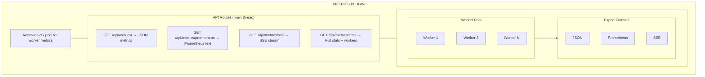
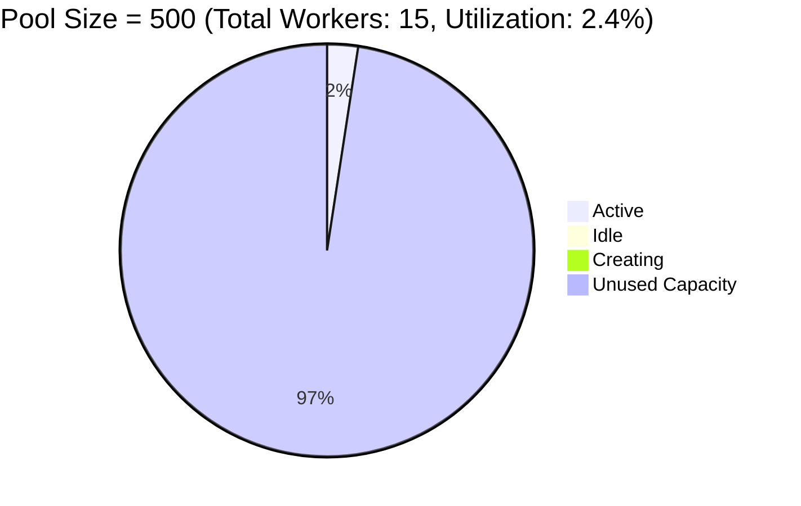
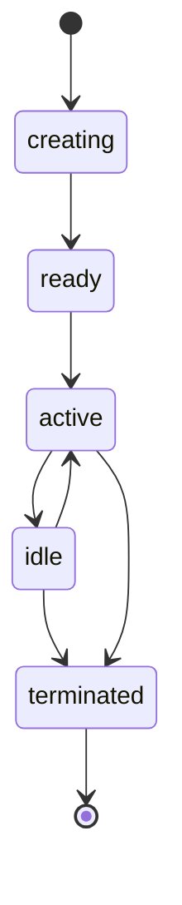

# Overview

Runtime pool and worker metrics collection plugin for Buntime with JSON, Prometheus, and SSE export formats.

## Features

- **JSON Metrics** - Standard JSON endpoint for programmatic consumption
- **Prometheus Format** - Compatible with Prometheus scraping infrastructure
- **SSE Streaming** - Real-time metrics via Server-Sent Events
- **Full Statistics** - Complete pool + individual worker statistics
- **Built-in UI** - React SPA dashboard with overview and per-worker views

## Architecture

The plugin-metrics runs on the main thread as a persistent plugin. It accesses `ctx.pool` directly to collect worker pool statistics:



**API Mode**: Persistent (routes in `plugin.ts`, runs on main thread). Needs access to `ctx.pool` for worker pool metrics and SSE streaming.

## Pool Metrics

Pool metrics provide a high-level overview of the worker pool state:



| Metric | Type | Description |
|--------|------|-------------|
| `size` | gauge | Maximum configured pool size |
| `active` | gauge | Workers currently handling requests |
| `idle` | gauge | Workers alive but not handling requests |
| `creating` | gauge | Workers being spawned |
| `total` | gauge | Total workers (`active + idle + creating`) |
| `utilization` | gauge | Ratio of active to pool size (`active / size`) |

**Utilization formula:**
```
utilization = active / size
```

A utilization approaching 1.0 indicates the pool is near capacity. If `active` equals `size`, new requests may need to wait for an available worker.

## Worker Metrics

Individual worker metrics provide per-worker visibility:

| ID | App | State | Reqs | Uptime | RSS |
|---|---|---|---|---|---|
| worker-abc-123 | my-app@latest | active | 1542 | 3600s | 50M |
| worker-def-456 | my-app@latest | idle | 890 | 3500s | 46M |
| worker-ghi-789 | admin-panel | active | 234 | 1800s | 38M |
| worker-jkl-012 | my-app@latest | creating | 0 | 2s | 0M |

| Metric | Type | Description |
|--------|------|-------------|
| `id` | string | Unique worker identifier |
| `app` | string | Application name (e.g., `"my-app@latest"`) |
| `state` | enum | Worker lifecycle state |
| `requests` | counter | Total requests handled since creation |
| `uptime` | counter | Seconds since worker was created |
| `memory.rss` | gauge | Resident Set Size in bytes |
| `memory.heapUsed` | gauge | V8 heap used in bytes |

### Worker States

Workers transition through these states during their lifecycle:



| State | Description |
|-------|-------------|
| `creating` | Worker process is starting up |
| `ready` | Worker is initialized and awaiting first request |
| `active` | Worker is currently processing a request |
| `idle` | Worker is alive but waiting for work |
| `terminated` | Worker has been shut down (cleanup, scaling, crash) |

## Export Formats

### JSON

Standard JSON format for programmatic consumption. Ideal for custom dashboards, health checks, and integration scripts.

```json
{
  "pool": { "size": 500, "active": 12, "idle": 3, "creating": 0, "total": 15, "utilization": 0.03 },
  "uptime": 86400,
  "timestamp": "2024-01-23T10:30:00.000Z"
}
```

### Prometheus Text

Prometheus text exposition format for scraping by Prometheus server. Each metric includes `# HELP` and `# TYPE` annotations:

```
# HELP buntime_pool_size Maximum pool size
# TYPE buntime_pool_size gauge
buntime_pool_size 500

# HELP buntime_pool_active Active workers
# TYPE buntime_pool_active gauge
buntime_pool_active 12
```

### SSE (Server-Sent Events)

Real-time streaming format. Pushes JSON metrics at a configurable interval. Ideal for live dashboards and monitoring UIs.

```
data: {"pool":{"size":500,"active":12,...},"uptime":86400,"timestamp":"..."}
```

### Full Stats

Extended format that includes per-worker details. Heavier endpoint, use for detailed inspection rather than frequent polling.

```json
{
  "pool": { "size": 500, "active": 12, ... },
  "workers": [
    { "id": "worker-abc-123", "app": "my-app", "state": "active", "requests": 1542, ... }
  ]
}
```

## Lifecycle Hooks

| Hook | Description |
|------|-------------|
| `onInit` | Stores pool reference from `ctx.pool` and reads config (`prometheus`, `sseInterval`) |

## File Structure

```
plugins/plugin-metrics/
├── manifest.yaml          # Configuration
├── plugin.ts              # Main plugin (routes)
├── index.ts               # Worker entrypoint (serves UI SPA)
├── server/
│   ├── api.ts            # Hono API routes (metrics, prometheus, SSE, stats)
│   └── services.ts       # Service layer (setPool, setConfig)
├── client/               # UI SPA (React + TanStack Router)
└── dist/                 # Compiled output
```

## Built-in UI

The plugin includes a React SPA accessible at `/metrics` with two views:

- **Overview**: Pool utilization gauge, active/idle/total counters, uptime
- **Workers**: Per-worker table with state, requests, uptime, and memory

## Design Decisions

1. **Main thread only**: Pool metrics are only accessible from the main thread via `ctx.pool`. Worker processes cannot see pool state.
2. **Read-only**: The metrics plugin only reads data; it does not modify pool behavior.
3. **No persistence**: Metrics are point-in-time snapshots. For historical metrics, scrape the Prometheus endpoint and store in Prometheus/VictoriaMetrics.
4. **Prometheus opt-in**: The Prometheus endpoint can be disabled via configuration if not needed.

## Integration with Other Plugins

The metrics plugin is standalone and does not depend on other plugins. However, it integrates well with:

- **plugin-gateway**: Gateway metrics (rate limiting, request logs) complement pool metrics for full observability
- **plugin-logs**: Log entries can reference worker IDs from metrics for correlation

## Next Steps

- [API Reference](../api-reference.md) - Complete endpoint documentation
- [Configuration](../guides/configuration.md) - Prometheus and SSE settings
- [Prometheus Guide](../guides/prometheus.md) - Scraping and Grafana setup
