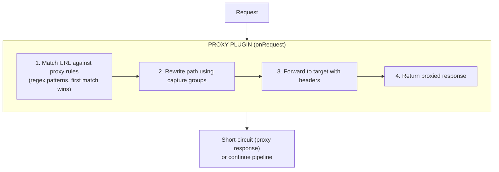

# Plugin Proxy

HTTP and WebSocket reverse proxy plugin for Buntime with regex path matching, path rewriting, dynamic rule management, and public route configuration.

## Table of Contents

- [Overview](#overview)
- [Architecture](#architecture)
- [Configuration](#configuration)
- [Proxy Rules](#proxy-rules)
- [API Endpoints](#api-endpoints)
- [WebSocket Proxying](#websocket-proxying)
- [Public Routes](#public-routes)
- [Service Registry](#service-registry)
- [Lifecycle Hooks](#lifecycle-hooks)
- [Exported Types](#exported-types)
- [File Structure](#file-structure)
- [Examples](#examples)

## Overview

The `@buntime/plugin-proxy` provides a full reverse proxy with dynamic rule management. Rules can be defined statically in the manifest or managed at runtime through the API. All dynamic rules are persisted in KeyVal.

**Key Features:**

- **Regex Path Matching**: Pattern matching with capture groups
- **Path Rewriting**: Rewrite rules using `$1`, `$2` capture groups
- **WebSocket Proxying**: Full WebSocket upgrade and relay support
- **Dynamic Rules**: CRUD API for runtime rule management (persisted in KeyVal)
- **Static Rules**: Rules from manifest.yaml (read-only)
- **Custom Headers**: Add/modify headers on proxied requests
- **Public Routes**: Per-rule public route configuration bypassing authentication
- **Change Origin**: Rewrite Host/Origin headers to match target
- **SSL Control**: Toggle SSL certificate verification
- **Environment Variables**: `${ENV_VAR}` substitution in target URLs

## Architecture



**API Mode**: Persistent (routes and `onRequest` in `plugin.ts`, runs on main thread). WebSocket proxying requires the main thread with `onServerStart` for server access.

## Configuration

### manifest.yaml

```yaml
name: "@buntime/plugin-proxy"
base: "/redirects"
enabled: true
injectBase: true

dependencies:
  - "@buntime/plugin-keyval"

entrypoint: dist/client/index.html
pluginEntry: dist/plugin.js

menus:
  - icon: lucide:network
    path: /redirects
    title: Redirects

rules: []
```

### Configuration Options

| Option | Type | Default | Description |
|--------|------|---------|-------------|
| `rules` | `ProxyRule[]` | `[]` | Static proxy rules (read-only at runtime) |

## Proxy Rules

### ProxyRule Schema

| Field | Type | Required | Default | Description |
|-------|------|----------|---------|-------------|
| `id` | `string` | Auto | Generated | Unique rule identifier |
| `name` | `string` | Yes | - | Human-readable name |
| `pattern` | `string` | Yes | - | Regex pattern to match request paths |
| `target` | `string` | Yes | - | Target URL (supports `${ENV_VAR}`) |
| `rewrite` | `string` | No | - | Path rewrite with capture groups (`$1`, `$2`) |
| `changeOrigin` | `boolean` | No | `false` | Change Host/Origin headers to target host |
| `secure` | `boolean` | No | `true` | Verify SSL certificates |
| `ws` | `boolean` | No | `true` | Enable WebSocket proxying |
| `headers` | `object` | No | - | Additional headers to send with proxied request |
| `publicRoutes` | `object` | No | - | Routes that bypass authentication per method |

### Pattern Matching

Rules use JavaScript regex patterns with capture groups:

```javascript
// Match /api and all subpaths
"^/api(/.*)?$"       // Matches: /api, /api/users, /api/users/123

// Match specific prefix
"^/legacy-api(/.*)?$"  // Matches: /legacy-api/endpoint

// Match with version
"^/v(\\d+)/api(/.*)?" // Captures: version ($1), path ($2)
```

### Path Rewriting

Use `$1`, `$2`, etc. for captured groups:

```yaml
# Keep path as-is
pattern: "^/api(/.*)?$"
rewrite: "/api$1"              # /api/users → /api/users

# Strip prefix
pattern: "^/backend(/.*)?$"
rewrite: "$1"                  # /backend/users → /users

# Add prefix
pattern: "^/api(/.*)?$"
rewrite: "/v2/api$1"           # /api/users → /v2/api/users

# Version routing
pattern: "^/v(\\d+)/api(/.*)?$"
rewrite: "/version/$1/$2"      # /v1/api/data → /version/1/data
```

### Environment Variable Substitution

Target URLs support `${ENV_VAR}` syntax:

```yaml
rules:
  - name: "Backend API"
    pattern: "^/api(/.*)?$"
    target: "${BACKEND_URL}"
    rewrite: "/api$1"
```

## API Endpoints

All routes are mounted at `/{base}/api/*` (default: `/redirects/api/*`).

| Method | Endpoint | Description |
|--------|----------|-------------|
| `GET` | `/api/rules` | List all rules (static + dynamic) |
| `POST` | `/api/rules` | Create dynamic rule |
| `PUT` | `/api/rules/:id` | Update dynamic rule |
| `DELETE` | `/api/rules/:id` | Delete dynamic rule |

### Create Rule

```bash
curl -X POST /redirects/api/rules \
  -H "Content-Type: application/json" \
  -d '{
    "name": "Backend API",
    "pattern": "^/api(/.*)?$",
    "target": "https://api.example.com",
    "rewrite": "/api$1",
    "changeOrigin": true,
    "publicRoutes": {
      "GET": ["/api/health"],
      "POST": ["/api/webhook"]
    }
  }'
```

### List Rules

```bash
curl /redirects/api/rules
```

Static rules (from manifest) are returned with a `readonly: true` flag.

## WebSocket Proxying

WebSocket connections are automatically proxied when `ws: true` (default):

1. Client sends upgrade request matching a proxy rule pattern
2. Plugin intercepts via `onServerStart` + `websocket` handler
3. Establishes WebSocket connection to target
4. Relays messages bidirectionally

```yaml
rules:
  - name: "Realtime"
    pattern: "^/ws(/.*)?$"
    target: "ws://realtime:8080"
    rewrite: "/$1"
    ws: true
```

## Public Routes

Per-rule public routes bypass the authentication plugin:

```json
{
  "publicRoutes": {
    "ALL": ["/api/health"],
    "GET": ["/api/config/**"],
    "POST": ["/api/webhook"]
  }
}
```

The proxy plugin exposes `isPublic(pathname, method)` via service registry so the auth plugin can check proxy public routes.

## Service Registry

The plugin exposes a service via `provides()`:

```typescript
{
  isPublic: (pathname: string, method: string) => boolean
}
```

The `plugin-authn` uses this to check if a proxied route is public before enforcing authentication.

## Lifecycle Hooks

| Hook | Description |
|------|-------------|
| `onInit` | Gets KeyVal service, loads dynamic rules from KeyVal, merges with static rules |
| `onServerStart` | Stores server reference for WebSocket upgrade handling |
| `onRequest` | Matches request against proxy rules, proxies if matched |
| `onShutdown` | Cleans up proxy connections |
| `websocket` | WebSocket message relay between client and target |

## Exported Types

```typescript
export interface ProxyConfig {
  rules?: ProxyRule[];
}

export interface ProxyRule {
  id?: string;
  name: string;
  pattern: string;
  target: string;
  rewrite?: string;
  changeOrigin?: boolean;
  secure?: boolean;
  ws?: boolean;
  headers?: Record<string, string>;
  publicRoutes?: Record<string, string[]>;
}

export type ProxyRoutesType = typeof api;
```

## File Structure

```
plugins/plugin-proxy/
├── manifest.yaml          # Configuration
├── plugin.ts              # Main plugin (onRequest, websocket, provides)
├── index.ts               # Worker entrypoint (serves UI SPA)
├── server/
│   ├── api.ts            # Hono API routes (rule CRUD)
│   └── services.ts       # Proxy service (request handling, rule management)
├── client/               # UI SPA (React + TanStack Router)
│   └── hooks/
│       └── use-proxy-rules.ts  # Client-side rule management hook
└── dist/                 # Compiled output
```

## Examples

### Static Rules in Manifest

```yaml
name: "@buntime/plugin-proxy"
enabled: true
rules:
  - name: "API Gateway"
    pattern: "^/api(/.*)?$"
    target: "https://api.internal:3000"
    rewrite: "/api$1"
    changeOrigin: true
  - name: "WebSocket"
    pattern: "^/ws(/.*)?$"
    target: "ws://realtime:8080"
    rewrite: "/$1"
```

### Dynamic Rule via API

```bash
# Create proxy to external service
curl -X POST /redirects/api/rules \
  -H "Content-Type: application/json" \
  -H "Origin: https://buntime.home" \
  -d '{
    "name": "External API",
    "pattern": "^/external(/.*)?$",
    "target": "https://external-service.com",
    "rewrite": "$1",
    "changeOrigin": true,
    "publicRoutes": {
      "GET": ["/external/health"]
    }
  }'
```

### Multi-Service Setup

See the [Proxy Rules Guide](../../apps/runtime/docs/guides/proxy-rules.md) for a complete multi-service configuration example.

## Persistence

Dynamic proxy rules are stored in the KeyVal plugin's database. Rules persist across restarts when using a persistent database backend.

Static rules from `manifest.yaml` are always available regardless of KeyVal state.

## License

See [LICENSE](../../LICENSE) at the project root.
