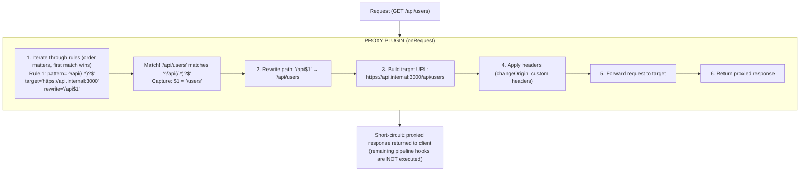
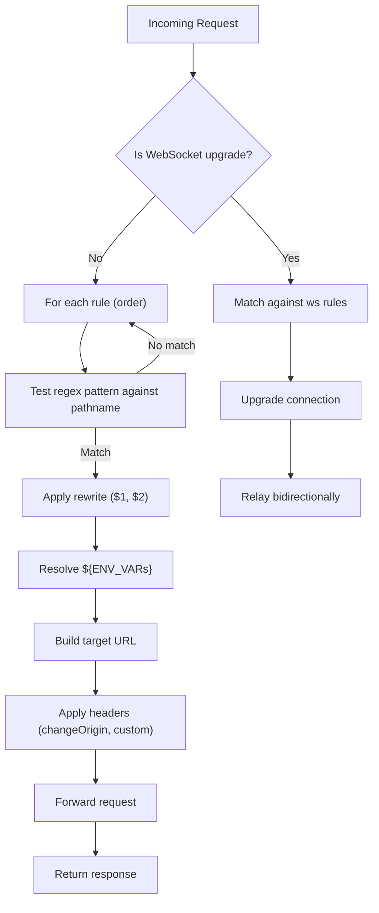
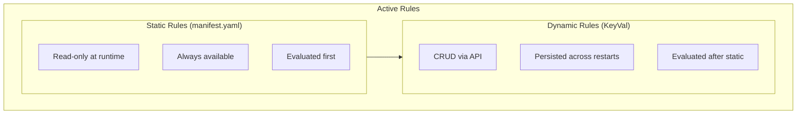

# Overview

HTTP and WebSocket reverse proxy plugin for Buntime with regex path matching, path rewriting, dynamic rule management, and public route configuration.

## Features

- **Regex Path Matching** - Pattern matching with capture groups
- **Path Rewriting** - Rewrite rules using `$1`, `$2` capture groups
- **WebSocket Proxying** - Full WebSocket upgrade and relay support
- **Dynamic Rules** - CRUD API for runtime rule management (persisted in KeyVal)
- **Static Rules** - Rules from manifest.yaml (read-only at runtime)
- **Custom Headers** - Add/modify headers on proxied requests
- **Public Routes** - Per-rule public route configuration bypassing authentication
- **Change Origin** - Rewrite Host/Origin headers to match target
- **SSL Control** - Toggle SSL certificate verification
- **Environment Variables** - `${ENV_VAR}` substitution in target URLs

## Architecture

The plugin-proxy intercepts requests via the `onRequest` hook and matches them against configured proxy rules. If a match is found, the request is forwarded to the target and the proxied response is returned, short-circuiting the rest of the pipeline:



**API Mode**: Persistent (routes and `onRequest` in `plugin.ts`, runs on main thread). WebSocket proxying requires the main thread with `onServerStart` for server access.

## Request Matching Flow

The matching flow follows these steps for every incoming request:



**Key behaviors:**
1. **First match wins**: Rules are tested in order; the first matching pattern handles the request
2. **Short-circuit**: Matched requests skip the rest of the plugin pipeline
3. **No match = pass-through**: If no rule matches, the request continues to the next middleware/plugin
4. **Static rules first**: Static rules (from manifest) are evaluated before dynamic rules (from KeyVal)

## Rule Sources

Rules come from two sources:



| Source | Managed Via | Persistence | Modifiable | Evaluated |
|--------|-------------|-------------|------------|-----------|
| Static | `manifest.yaml` | Always available | No (read-only) | First |
| Dynamic | REST API | KeyVal (persistent DB) | Yes (CRUD) | After static |

## Service Registry

The proxy plugin exposes a single service via `provides()`:

```typescript
{
  isPublic: (pathname: string, method: string) => boolean
}
```

This is used by `plugin-authn` to check if a proxied route is public before enforcing authentication:

```typescript
// Inside plugin-authn
const proxy = ctx.getPlugin("@buntime/plugin-proxy");
if (proxy?.isPublic(request.pathname, request.method)) {
  // Skip authentication for this request
  return next();
}
```

## Dependencies

| Plugin | Required | Purpose |
|--------|----------|---------|
| `@buntime/plugin-keyval` | Yes | Stores dynamic proxy rules |

If KeyVal is not available, only static rules from the manifest will work. Dynamic rule CRUD operations will fail.

## Lifecycle Hooks

| Hook | Description |
|------|-------------|
| `onInit` | Gets KeyVal service, loads dynamic rules, merges with static rules |
| `onServerStart` | Stores server reference for WebSocket upgrade handling |
| `onRequest` | Matches request against proxy rules, proxies if matched |
| `onShutdown` | Cleans up proxy connections |
| `websocket` | WebSocket message relay between client and target |

## File Structure

```
plugins/plugin-proxy/
├── manifest.yaml          # Configuration (static rules)
├── plugin.ts              # Main plugin (onRequest, websocket, provides)
├── index.ts               # Worker entrypoint (serves UI SPA)
├── server/
│   ├── api.ts            # Hono API routes (rule CRUD)
│   └── services.ts       # Proxy service (request handling, rule management)
├── client/               # UI SPA (React + TanStack Router)
│   └── hooks/
│       └── use-proxy-rules.ts  # Client-side rule management hook
└── dist/                 # Compiled output
```

## Next Steps

- [API Reference](../api-reference.md) - Complete endpoint documentation
- [Proxy Rules](proxy-rules.md) - Pattern matching, path rewriting, env var substitution
- [WebSocket Proxying](websocket-proxying.md) - WebSocket upgrade and relay
- [Configuration](../guides/configuration.md) - Static and dynamic rules setup
