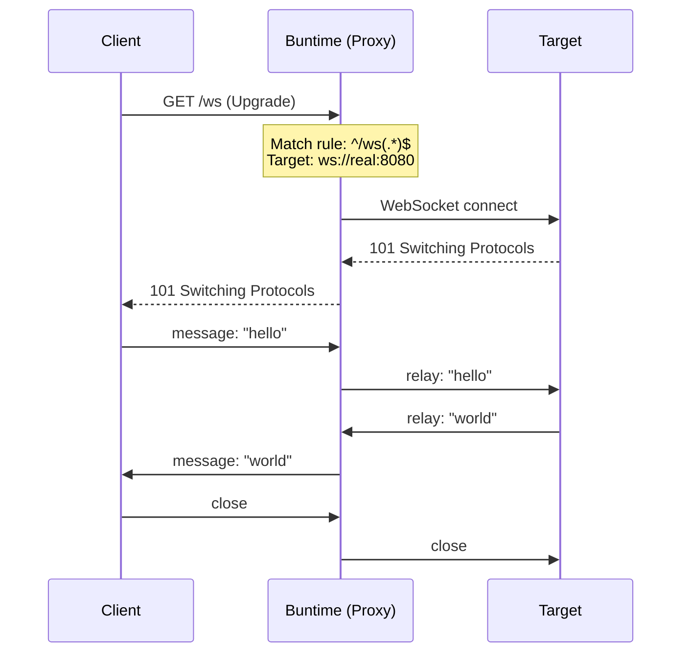
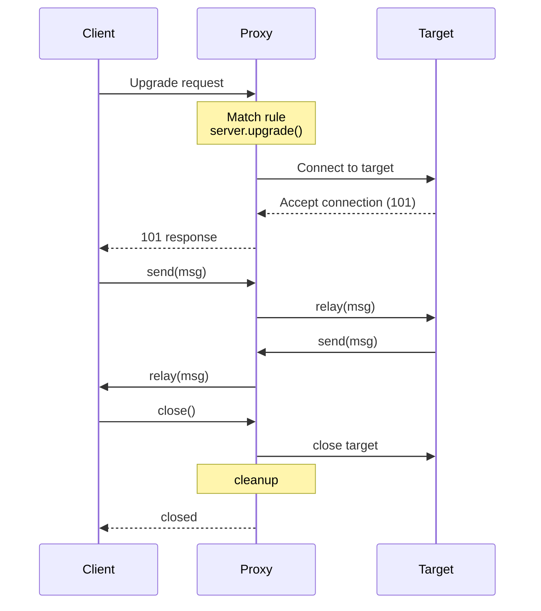

# WebSocket Proxying

How the proxy plugin handles WebSocket upgrade requests and bidirectional message relay.

## Overview

The proxy plugin supports transparent WebSocket proxying. When a WebSocket upgrade request matches a proxy rule with `ws: true` (default), the plugin:

1. Intercepts the upgrade request
2. Establishes a WebSocket connection to the target
3. Relays messages bidirectionally between client and target

## Architecture



## How It Works

### 1. Upgrade Interception

The proxy plugin uses `onServerStart` to obtain the Bun server reference. When a WebSocket upgrade request arrives, Bun's `server.upgrade()` is called to upgrade the connection:

```typescript
// Simplified flow (inside plugin.ts)
onServerStart(server) {
  this.server = server;
}

onRequest(req, ctx) {
  // Check if this is a WebSocket upgrade
  if (req.headers.get("upgrade") === "websocket") {
    const rule = matchRule(req.url);
    if (rule && rule.ws) {
      // Upgrade the client connection
      this.server.upgrade(req, {
        data: { rule, url: buildTargetUrl(rule, req.url) }
      });
      return; // Short-circuit
    }
  }
}
```

### 2. Target Connection

Once the client is upgraded, the plugin establishes a WebSocket connection to the target:

```typescript
// Simplified flow (inside websocket handler)
websocket: {
  open(ws) {
    const { rule, url } = ws.data;
    const target = new WebSocket(url);

    target.onopen = () => {
      // Target connected, relay is ready
    };

    target.onmessage = (event) => {
      // Relay target → client
      ws.send(event.data);
    };

    ws.data.target = target;
  }
}
```

### 3. Bidirectional Relay

Messages are relayed in both directions:

```typescript
websocket: {
  message(ws, message) {
    // Relay client → target
    ws.data.target.send(message);
  },

  close(ws) {
    // Clean up target connection
    ws.data.target.close();
  }
}
```

## Configuration

### Enabling WebSocket Proxying

WebSocket proxying is enabled by default (`ws: true`). To disable it for a specific rule:

```yaml
rules:
  - name: "HTTP Only"
    pattern: "^/api(/.*)?$"
    target: "https://api.internal:3000"
    ws: false  # Disable WebSocket proxying for this rule
```

### WebSocket-Specific Rules

Create rules specifically for WebSocket endpoints:

```yaml
rules:
  - name: "Realtime Chat"
    pattern: "^/ws/chat(/.*)?$"
    target: "ws://chat-service:8080"
    rewrite: "$1"
    ws: true

  - name: "Live Updates"
    pattern: "^/ws/updates$"
    target: "ws://updates-service:8081"
    ws: true
```

### Mixed HTTP + WebSocket

A single rule can handle both HTTP and WebSocket traffic:

```yaml
rules:
  - name: "Full Service"
    pattern: "^/service(/.*)?$"
    target: "https://service.internal:3000"
    rewrite: "$1"
    ws: true  # WebSocket upgrades also proxied
```

HTTP requests to `/service/api/data` are proxied normally. WebSocket upgrade requests to `/service/ws` are upgraded and relayed.

## Path Rewriting for WebSocket

Path rewriting works the same way for WebSocket connections as for HTTP requests:

```yaml
# Rule
pattern: "^/ws/chat(/.*)?$"
target: "ws://chat-service:8080"
rewrite: "/chat$1"

# Client connects to: ws://buntime:8000/ws/chat/room-1
# Proxy connects to:  ws://chat-service:8080/chat/room-1
```

## Headers

### changeOrigin with WebSocket

When `changeOrigin: true`, the `Host` and `Origin` headers on the upgrade request are rewritten:

```yaml
rules:
  - name: "WS with changeOrigin"
    pattern: "^/ws(/.*)?$"
    target: "ws://backend:8080"
    changeOrigin: true
```

```
Client upgrade request:
  Host: buntime.home
  Origin: https://buntime.home

Proxied upgrade request:
  Host: backend:8080
  Origin: ws://backend:8080
```

### Custom Headers

Custom headers are forwarded on the initial upgrade request (not on individual messages):

```yaml
rules:
  - name: "WS with auth"
    pattern: "^/ws(/.*)?$"
    target: "ws://backend:8080"
    headers:
      X-Proxy-Auth: "secret-token"
```

## Client Examples

### Browser JavaScript

```javascript
// Connect through the proxy
const ws = new WebSocket("ws://buntime.home/ws/chat/room-1");

ws.onopen = () => {
  console.log("Connected (via proxy)");
  ws.send(JSON.stringify({ type: "join", room: "room-1" }));
};

ws.onmessage = (event) => {
  const data = JSON.parse(event.data);
  console.log("Received:", data);
};

ws.onclose = (event) => {
  console.log(`Disconnected: ${event.code} ${event.reason}`);
};

ws.onerror = (error) => {
  console.error("WebSocket error:", error);
};
```

### Secure WebSocket (WSS)

For HTTPS deployments, use `wss://`:

```javascript
const ws = new WebSocket("wss://buntime.home/ws/chat/room-1");
```

The proxy rule target can still use `ws://` for internal connections:

```yaml
rules:
  - name: "Secure WS"
    pattern: "^/ws(/.*)?$"
    target: "ws://chat-service:8080"  # Internal: plain WS
    ws: true
```

The TLS termination happens at the Buntime server level, not at the proxy.

## Connection Lifecycle



### Cleanup

When either side closes the connection:

- **Client closes**: Proxy closes the target connection
- **Target closes**: Proxy closes the client connection
- **Proxy restarts**: All WebSocket connections are terminated

## Limitations

1. **No message transformation**: Messages are relayed as-is without modification
2. **No compression negotiation**: Compression is handled by the underlying WebSocket implementation
3. **Single target per rule**: A WebSocket rule connects to exactly one target (no load balancing)
4. **Main thread only**: WebSocket proxying requires the main thread for `server.upgrade()`

## Next Steps

- [Overview](overview.md) - Architecture and request matching flow
- [Proxy Rules](proxy-rules.md) - Pattern matching and path rewriting
- [Configuration](../guides/configuration.md) - Rule configuration
- [API Reference](../api-reference.md) - Rule CRUD endpoints
