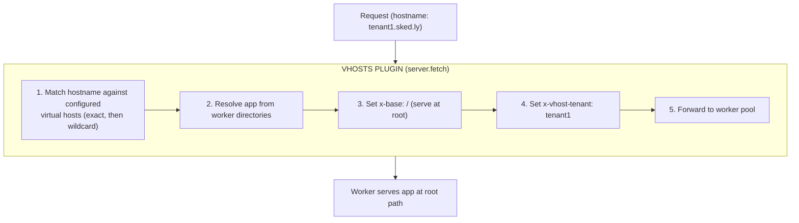

# Plugin VHosts

Virtual host routing plugin for Buntime that enables serving worker applications via custom domains at root path, with wildcard subdomain support for multi-tenancy.

## Table of Contents

- [Overview](#overview)
- [Architecture](#architecture)
- [Configuration](#configuration)
- [Hostname Matching](#hostname-matching)
- [Lifecycle Hooks](#lifecycle-hooks)
- [Headers](#headers)
- [Exported Types](#exported-types)
- [File Structure](#file-structure)
- [Examples](#examples)

## Overview

The `@buntime/plugin-vhosts` routes requests based on the hostname to specific worker applications, serving them at the root path (`/`) instead of their usual subpath. This enables custom domain support for multi-tenant and white-label deployments.

**Key Features:**

- **Domain-Based Routing**: Route requests by hostname to specific apps
- **Wildcard Subdomains**: `*.example.com` captures subdomain as tenant
- **Root Path Serving**: Apps served at `/` instead of `/{app-name}/`
- **Path Prefix Filtering**: Optionally limit routing to specific path prefixes
- **Tenant Header Injection**: Subdomain captured as `x-vhost-tenant` header
- **No UI**: Purely server-side routing (no admin interface)

## Architecture



**API Mode**: Persistent (uses `server.fetch` hook). Runs before the plugin pipeline (low-level request interception). Accesses `ctx.pool` directly for worker management.

> [!IMPORTANT]
> The vhosts plugin uses `server.fetch` instead of `onRequest`. This means it intercepts requests at the server level, before any plugin hooks run. If a hostname matches, the response is returned directly from the worker pool.

## Configuration

### manifest.yaml

```yaml
name: "@buntime/plugin-vhosts"
base: ""
enabled: false

pluginEntry: dist/plugin.js

hosts:
  "sked.ly":
    app: "skedly@latest"
  "*.sked.ly":
    app: "skedly@latest"
  "dashboard.example.com":
    app: "admin-panel"
    pathPrefix: "/admin"
```

### VHostConfig Options

| Field | Type | Required | Description |
|-------|------|----------|-------------|
| `app` | `string` | Yes | Worker app to serve (e.g., `"skedly@latest"`, `"my-app"`) |
| `pathPrefix` | `string` | No | Only serve paths starting with this prefix |

### Host Patterns

| Pattern | Description | Example Match |
|---------|-------------|---------------|
| `sked.ly` | Exact hostname match | `sked.ly` |
| `*.sked.ly` | Wildcard subdomain | `tenant1.sked.ly`, `acme.sked.ly` |
| `dashboard.example.com` | Exact FQDN | `dashboard.example.com` |

## Hostname Matching

Matching follows a priority order:

1. **Exact match** (highest priority): `sked.ly` matches only `sked.ly`
2. **Wildcard match**: `*.sked.ly` matches `tenant1.sked.ly`, captures `tenant1` as tenant

```typescript
// Exact match
hosts["sked.ly"] = { app: "skedly@latest" };
// Request to sked.ly → serves skedly at root

// Wildcard match
hosts["*.sked.ly"] = { app: "skedly@latest" };
// Request to tenant1.sked.ly → serves skedly at root with x-vhost-tenant: tenant1
// Request to acme.sked.ly → serves skedly at root with x-vhost-tenant: acme

// Both configured: exact takes precedence
// sked.ly → exact match (no tenant)
// anything.sked.ly → wildcard match (tenant = "anything")
```

### Path Prefix Filtering

Limit virtual host to specific paths:

```yaml
hosts:
  "dashboard.example.com":
    app: "admin-panel"
    pathPrefix: "/admin"
```

Only requests to `dashboard.example.com/admin/*` will be routed. Other paths return 404 and fall through to the normal pipeline.

## Lifecycle Hooks

| Hook | Description |
|------|-------------|
| `onInit` | Gets pool reference, imports runtime internals (worker resolver, config loader) |
| `server.fetch` | Matches hostname, resolves worker, forwards request to pool |

> [!NOTE]
> The plugin dynamically imports runtime internal modules (`get-worker-dir`, `pool/config`) since it's a built-in plugin with access to runtime internals.

## Headers

### Injected Headers

| Header | Description | Example |
|--------|-------------|---------|
| `x-base` | Set to `/` for root serving | `x-base: /` |
| `x-vhost-tenant` | Tenant from wildcard subdomain | `x-vhost-tenant: tenant1` |

The `x-base` header tells the runtime's `wrapper.ts` to serve the app at root (`/`) instead of its default subpath. The worker's `<base href>` injection will use `/` instead of `/{app-name}/`.

### Reading Tenant in Workers

Workers can read the tenant header:

```typescript
app.get("/api/data", (c) => {
  const tenant = c.req.header("x-vhost-tenant");
  // Use tenant for data isolation
  const data = await db.query("SELECT * FROM data WHERE tenant = ?", [tenant]);
  return c.json(data);
});
```

## Exported Types

```typescript
export interface VHostsPluginConfig {
  hosts: Record<string, VHostConfig>;
}

export interface VHostConfig {
  app: string;
  pathPrefix?: string;
}

export interface VHostMatch {
  app: string;
  pathPrefix?: string;
  tenant?: string;
}
```

## File Structure

```
plugins/plugin-vhosts/
├── manifest.yaml          # Configuration
├── plugin.ts              # Main plugin (server.fetch, onInit)
├── server/
│   └── matcher.ts        # matchVirtualHost() hostname matching logic
└── dist/                 # Compiled output
```

> [!NOTE]
> This plugin has no `index.ts`, no `entrypoint`, no `client/` directory, and no UI. It's purely server-side.

## Examples

### Simple Custom Domain

```yaml
name: "@buntime/plugin-vhosts"
enabled: true
hosts:
  "myapp.com":
    app: "my-app@latest"
```

Requests to `myapp.com` serve `my-app` at root instead of `/my-app/`.

### Multi-Tenant SaaS

```yaml
name: "@buntime/plugin-vhosts"
enabled: true
hosts:
  "sked.ly":
    app: "skedly@latest"
  "*.sked.ly":
    app: "skedly@latest"
```

- `sked.ly` → Serves skedly at root (marketing/landing page)
- `acme.sked.ly` → Serves skedly at root with `x-vhost-tenant: acme`
- `bigcorp.sked.ly` → Serves skedly at root with `x-vhost-tenant: bigcorp`

### Multiple Apps on Different Domains

```yaml
name: "@buntime/plugin-vhosts"
enabled: true
hosts:
  "sked.ly":
    app: "skedly-client@latest"
  "admin.sked.ly":
    app: "skedly-admin@latest"
  "api.sked.ly":
    app: "skedly-server@latest"
  "kashes.io":
    app: "kashes-client@latest"
```

### With Path Prefix

```yaml
name: "@buntime/plugin-vhosts"
enabled: true
hosts:
  "example.com":
    app: "marketing-site"
  "example.com":
    app: "app-dashboard"
    pathPrefix: "/app"
```

> [!WARNING]
> Duplicate hostname keys are not supported in YAML. Use a reverse proxy (nginx/Traefik) for path-based routing on the same hostname, or handle it with the proxy plugin instead.

## DNS Configuration

For wildcard subdomains, configure DNS:

```
# A record for bare domain
sked.ly.           A     <server-ip>

# Wildcard A record for subdomains
*.sked.ly.         A     <server-ip>

# Or with CNAME
*.sked.ly.         CNAME buntime.home.
```

For Kubernetes with cert-manager, use a wildcard certificate:

```yaml
apiVersion: cert-manager.io/v1
kind: Certificate
spec:
  dnsNames:
    - sked.ly
    - "*.sked.ly"
```

## License

See [LICENSE](../../LICENSE) at the project root.
