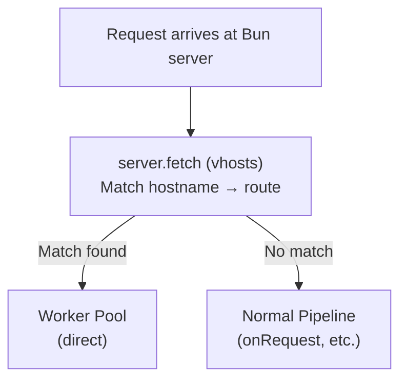

# API Reference

The plugin-vhosts has **no REST API endpoints**. It operates entirely at the server level via the `server.fetch` hook.

## How It Works

Unlike other Buntime plugins that expose API routes, the vhosts plugin intercepts requests at the lowest level using `server.fetch`. This hook runs before the plugin pipeline, meaning no `onRequest` hooks from other plugins are involved.



## Request Flow

### Matched Request

When a hostname matches a configured virtual host:

```http
GET /dashboard HTTP/1.1
Host: tenant1.sked.ly
```

The plugin:
1. Matches `tenant1.sked.ly` against `*.sked.ly`
2. Resolves the `app` to a worker directory
3. Sets `x-base: /` header (root serving)
4. Sets `x-vhost-tenant: tenant1` header
5. Forwards to the worker pool directly
6. Returns the worker's response

**No further plugins are involved** in this request path.

### Unmatched Request

When no hostname matches, the request falls through to the normal Buntime pipeline:

```http
GET /api/data HTTP/1.1
Host: buntime.home
```

Normal `onRequest` → `onResponse` plugin hooks execute as usual.

## Injected Headers

The vhosts plugin injects two headers on matched requests:

| Header | Value | Description |
|--------|-------|-------------|
| `x-base` | `/` | Tells the runtime wrapper to serve the app at root |
| `x-vhost-tenant` | `<subdomain>` | Tenant identifier extracted from wildcard subdomain |

### x-base

Always set to `/` for vhost-matched requests. This overrides the default app base path (e.g., `/my-app/`) so the app is served at the root path.

The runtime's `wrapper.ts` reads this header to inject the correct `<base href="/">` in HTML responses.

### x-vhost-tenant

Only set for wildcard subdomain matches. Contains the subdomain portion that matched the `*` in the pattern:

```
Host: tenant1.sked.ly
Pattern: *.sked.ly
Result: x-vhost-tenant: tenant1

Host: acme.sked.ly
Pattern: *.sked.ly
Result: x-vhost-tenant: acme

Host: sked.ly
Pattern: sked.ly (exact match)
Result: x-vhost-tenant header NOT set
```

## Reading Headers in Workers

Workers receive the injected headers and can use them for tenant-aware logic:

```typescript
// Hono handler
app.get("/api/data", (c) => {
  const tenant = c.req.header("x-vhost-tenant");
  const base = c.req.header("x-base");

  if (tenant) {
    // Multi-tenant data isolation
    const data = await db.query(
      "SELECT * FROM data WHERE tenant = ?",
      [tenant],
    );
    return c.json(data);
  }

  return c.json({ error: "No tenant" }, 400);
});
```

```typescript
// Express-style handler
app.get("/api/data", (req, res) => {
  const tenant = req.headers["x-vhost-tenant"];
  // Use tenant for data scoping
});
```

## No Admin UI

The vhosts plugin has no UI, no client-side code, and no admin interface. Configuration is done entirely via `manifest.yaml`.

To view or modify virtual host configuration, edit the manifest directly and restart (or rely on hot-reload if available).

## Next Steps

- [Overview](concepts/overview.md) - Architecture and server.fetch vs onRequest
- [Hostname Matching](concepts/hostname-matching.md) - Exact vs wildcard matching
- [Configuration](guides/configuration.md) - Hosts configuration
- [Multi-Tenant Setup](guides/multi-tenant-setup.md) - DNS and certificate setup
