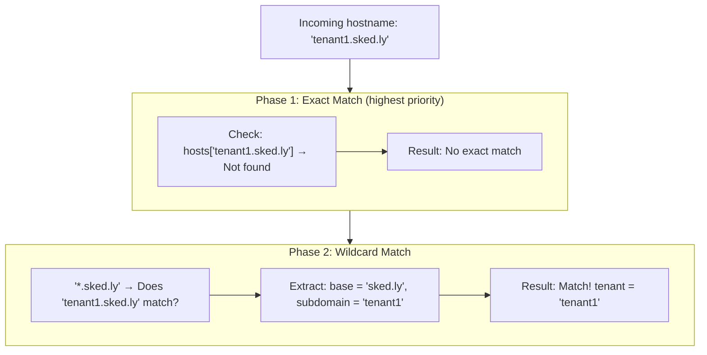
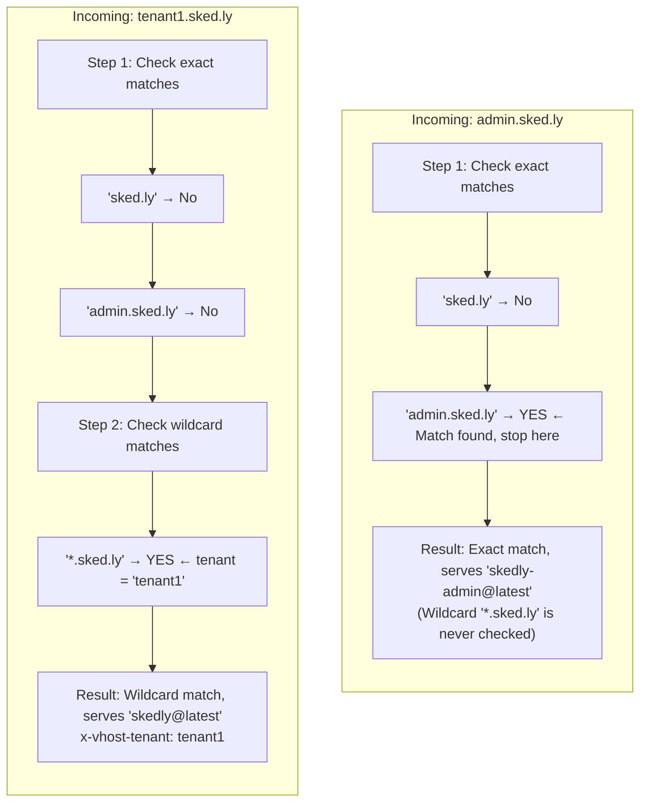

# Hostname Matching

How the vhosts plugin matches incoming hostnames against configured virtual hosts, including exact matching, wildcard subdomains, priority order, and tenant extraction.

## Matching Algorithm

The plugin uses a two-phase matching approach:



## Exact Matching

Exact matches have the highest priority. The hostname must match the configured host key exactly (case-insensitive):

```yaml
hosts:
  "sked.ly":
    app: "skedly@latest"
  "dashboard.example.com":
    app: "admin-panel"
```

| Request Host | Match | Result |
|-------------|-------|--------|
| `sked.ly` | `sked.ly` | Serves `skedly@latest` |
| `dashboard.example.com` | `dashboard.example.com` | Serves `admin-panel` |
| `www.sked.ly` | No exact match | Falls to wildcard phase |
| `sked.ly:8000` | Port stripped, matches `sked.ly` | Serves `skedly@latest` |

### Port Handling

The port (if present) is stripped from the Host header before matching:

```
Host: sked.ly:8000  →  hostname: "sked.ly"
Host: sked.ly       →  hostname: "sked.ly"
```

## Wildcard Matching

Wildcard patterns use `*.domain.com` syntax to match any single subdomain level:

```yaml
hosts:
  "*.sked.ly":
    app: "skedly@latest"
```

| Request Host | Match | Tenant Extracted |
|-------------|-------|-----------------|
| `tenant1.sked.ly` | Yes | `tenant1` |
| `acme.sked.ly` | Yes | `acme` |
| `bigcorp.sked.ly` | Yes | `bigcorp` |
| `sked.ly` | No (no subdomain) | - |
| `sub.tenant1.sked.ly` | No (multi-level) | - |

### Wildcard Rules

1. **Single level only**: `*.sked.ly` matches `X.sked.ly` but NOT `X.Y.sked.ly`
2. **Asterisk at start**: The `*` must be the first component (`*.domain.com`)
3. **Captures subdomain**: The part matching `*` becomes the tenant

### Tenant Extraction

For wildcard matches, the subdomain is extracted and injected as the `x-vhost-tenant` header:

```
Host: tenant1.sked.ly
Pattern: *.sked.ly

Extraction:
  full hostname = "tenant1.sked.ly"
  base domain   = "sked.ly"
  subdomain     = "tenant1"

Result:
  x-vhost-tenant: tenant1
```

## Priority Order

When both exact and wildcard hosts are configured, exact matches always take priority:

```yaml
hosts:
  "sked.ly":           # Priority 1: Exact match
    app: "skedly@latest"
  "*.sked.ly":          # Priority 2: Wildcard match
    app: "skedly@latest"
  "admin.sked.ly":      # Priority 1: Exact match (overrides wildcard)
    app: "skedly-admin@latest"
```

**Resolution for each hostname:**

| Request Host | Matched Rule | Tenant Header |
|---|---|---|
| `sked.ly` | `"sked.ly"` (exact) | (none) |
| `admin.sked.ly` | `"admin.sked.ly"` (exact) | (none) |
| `tenant1.sked.ly` | `"*.sked.ly"` (wildcard) | `x-vhost-tenant: tenant1` |
| `acme.sked.ly` | `"*.sked.ly"` (wildcard) | `x-vhost-tenant: acme` |
| `unknown.example.com` | (no match) | Falls through |

### Priority Diagram



## Path Prefix Filtering

Each virtual host can optionally restrict matching to specific path prefixes:

```yaml
hosts:
  "dashboard.example.com":
    app: "admin-panel"
    pathPrefix: "/admin"
```

With `pathPrefix`, only requests whose path starts with the prefix are matched:

| Request | Path | Match? | Reason |
|---------|------|--------|--------|
| `dashboard.example.com/admin` | `/admin` | Yes | Starts with `/admin` |
| `dashboard.example.com/admin/users` | `/admin/users` | Yes | Starts with `/admin` |
| `dashboard.example.com/` | `/` | No | Does not start with `/admin` |
| `dashboard.example.com/other` | `/other` | No | Does not start with `/admin` |

When the path does not match the prefix, the request falls through to the normal pipeline (as if no vhost matched).

## Multiple Domains, Same App

A single app can be served from multiple domains:

```yaml
hosts:
  "sked.ly":
    app: "skedly@latest"
  "*.sked.ly":
    app: "skedly@latest"
  "scheduling.io":
    app: "skedly@latest"
  "*.scheduling.io":
    app: "skedly@latest"
```

All four patterns serve the same `skedly@latest` app, but tenant extraction only happens on wildcard matches.

## Multiple Apps, Different Domains

Different apps can be served from different domains:

```yaml
hosts:
  "sked.ly":
    app: "skedly-client@latest"
  "admin.sked.ly":
    app: "skedly-admin@latest"
  "api.sked.ly":
    app: "skedly-server@latest"
  "kashes.io":
    app: "kashes-client@latest"
```

Each domain resolves to a different worker application.

## Edge Cases

### Localhost

Virtual hosts work with localhost by matching the hostname portion:

```yaml
hosts:
  "myapp.localhost":
    app: "my-app@latest"
```

Add to `/etc/hosts`:
```
127.0.0.1 myapp.localhost
```

### IP Addresses

IP addresses can be used as hostname keys, but this is uncommon:

```yaml
hosts:
  "192.168.1.100":
    app: "my-app@latest"
```

### Subdomain Validation

Tenant names extracted from subdomains are passed as-is to the worker via the `x-vhost-tenant` header. The worker is responsible for validating that the tenant exists and is authorized.

```typescript
app.get("/api/data", (c) => {
  const tenant = c.req.header("x-vhost-tenant");

  if (!tenant) {
    return c.json({ error: "No tenant" }, 400);
  }

  // Validate tenant exists
  const tenantConfig = await db.query(
    "SELECT * FROM tenants WHERE slug = ?",
    [tenant],
  );

  if (!tenantConfig) {
    return c.json({ error: "Unknown tenant" }, 404);
  }

  // Proceed with tenant-scoped logic
});
```

## Next Steps

- [Overview](overview.md) - Architecture and server.fetch details
- [Configuration](../guides/configuration.md) - Hosts configuration reference
- [Multi-Tenant Setup](../guides/multi-tenant-setup.md) - DNS and certificate guide
