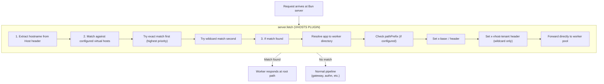
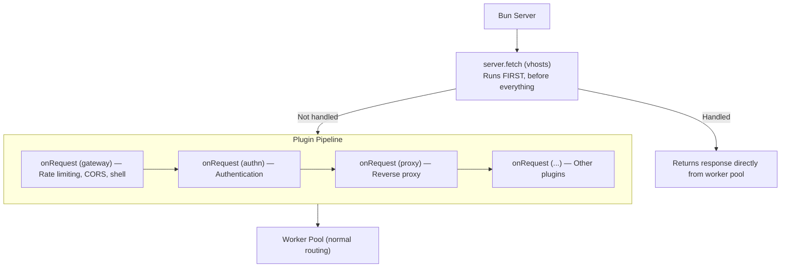
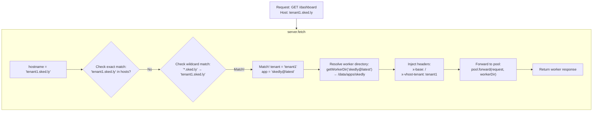
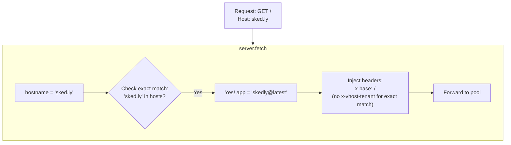
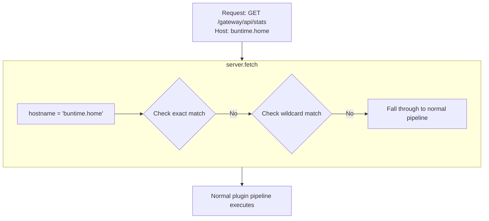

# Overview

Virtual host routing plugin for Buntime that enables serving worker applications via custom domains at root path, with wildcard subdomain support for multi-tenancy.

## Features

- **Domain-Based Routing** - Route requests by hostname to specific worker apps
- **Wildcard Subdomains** - `*.example.com` captures subdomain as tenant
- **Root Path Serving** - Apps served at `/` instead of `/{app-name}/`
- **Path Prefix Filtering** - Optionally limit routing to specific path prefixes
- **Tenant Header Injection** - Subdomain captured as `x-vhost-tenant` header
- **No UI** - Purely server-side routing (no admin interface)

## Architecture

The plugin-vhosts operates at a lower level than most Buntime plugins. Instead of using the `onRequest` hook (which is part of the plugin pipeline), it uses `server.fetch` to intercept requests at the server level:



## server.fetch vs onRequest

Understanding the difference between `server.fetch` and `onRequest` is critical for understanding how vhosts works:



**Key implications:**

| Aspect | server.fetch (vhosts) | onRequest (plugins) |
|--------|----------------------|---------------------|
| **Execution order** | Before all plugins | After server.fetch |
| **Can short-circuit** | Yes (returns response) | Yes (returns response) |
| **Plugin hooks run** | No | Yes (earlier hooks run) |
| **Authentication** | Bypassed | Applied if authn is enabled |
| **Rate limiting** | Bypassed | Applied if gateway is enabled |
| **CORS** | Bypassed | Applied if gateway is enabled |
| **Access to ctx** | Limited (pool only) | Full plugin context |

> **Important:** Because vhosts bypasses the plugin pipeline, requests matched by vhosts will NOT go through authentication, rate limiting, CORS, or any other plugin hooks. The worker application itself must handle these concerns.

## Request Flow Detail

### Matched Request (Wildcard)



### Matched Request (Exact)



### Unmatched Request



## How Root Serving Works

Without vhosts, apps are served at their base path:

```
Normal:     GET /skedly/dashboard → Worker serves /dashboard
            HTML: <base href="/skedly/">
```

With vhosts, the `x-base: /` header tells the runtime to serve at root:

```
With vhosts: GET /dashboard → Worker serves /dashboard
             HTML: <base href="/">
```

The runtime's `wrapper.ts` reads the `x-base` header and uses it for:
- `<base href>` injection in HTML responses
- Asset path resolution
- Client-side routing base path

## Lifecycle Hooks

| Hook | Description |
|------|-------------|
| `onInit` | Gets pool reference, imports runtime internals (`get-worker-dir`, `pool/config`) |
| `server.fetch` | Matches hostname, resolves worker, forwards request to pool |

> The plugin dynamically imports runtime internal modules since it's a built-in plugin with access to runtime internals.

## File Structure

```
plugins/plugin-vhosts/
├── manifest.yaml          # Configuration (hosts map)
├── plugin.ts              # Main plugin (server.fetch, onInit)
├── server/
│   └── matcher.ts        # matchVirtualHost() hostname matching logic
└── dist/                 # Compiled output
```

> No `index.ts`, no `entrypoint`, no `client/` directory. This is a purely server-side plugin.

## Design Decisions

1. **server.fetch over onRequest**: Using `server.fetch` ensures vhost-matched requests get the fastest possible path to the worker, without any middleware overhead.
2. **No authentication bypass concern**: The intent is that vhost-served apps handle their own authentication. This is by design for white-label/custom domain scenarios where the auth flow is app-specific.
3. **No dynamic configuration**: Virtual hosts are defined in `manifest.yaml` only. There's no API to add/remove hosts at runtime. This keeps the configuration simple and predictable.
4. **Header-based tenant passing**: Using headers (`x-vhost-tenant`) is the simplest and most framework-agnostic way to pass tenant info to workers.

## Next Steps

- [API Reference](../api-reference.md) - server.fetch hook behavior
- [Hostname Matching](hostname-matching.md) - Exact vs wildcard, priority, tenant extraction
- [Configuration](../guides/configuration.md) - Hosts and pathPrefix settings
- [Multi-Tenant Setup](../guides/multi-tenant-setup.md) - DNS, certs, and tenant routing
