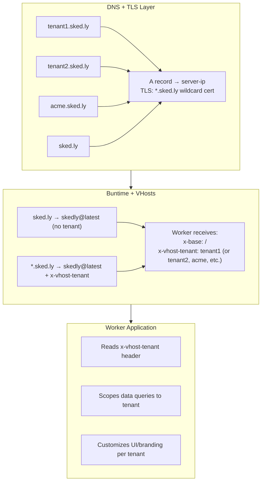
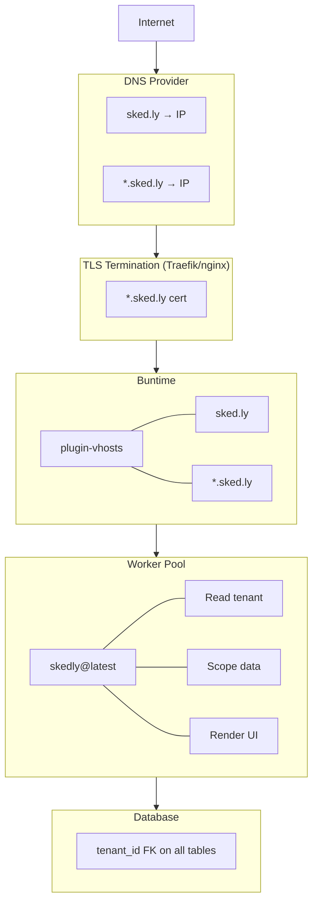

# Multi-Tenant Setup

Complete guide for setting up multi-tenant routing with custom domains, wildcard DNS, SSL certificates, and tenant-aware application logic.

## Overview

A multi-tenant setup allows a single Buntime instance to serve multiple tenants (customers, organizations) on separate subdomains, each getting a personalized experience while running the same application code.



## Step 1: DNS Configuration

### Wildcard A Record

Configure DNS to point the bare domain and all subdomains to your server:

```
# A record for bare domain
sked.ly.           A     203.0.113.10

# Wildcard A record for all subdomains
*.sked.ly.         A     203.0.113.10
```

### CNAME Alternative

If using a load balancer or cloud provider:

```
# CNAME for bare domain (if provider supports CNAME at apex)
sked.ly.           CNAME  buntime.example.com.

# Wildcard CNAME for subdomains
*.sked.ly.         CNAME  buntime.example.com.
```

### Local Development

For local development, add entries to `/etc/hosts`:

```
# /etc/hosts
127.0.0.1 sked.ly
127.0.0.1 tenant1.sked.ly
127.0.0.1 tenant2.sked.ly
127.0.0.1 acme.sked.ly
```

Or use a wildcard DNS tool like `dnsmasq`:

```
# /etc/dnsmasq.conf
address=/sked.ly/127.0.0.1
```

## Step 2: SSL/TLS Certificates

### Wildcard Certificate

A wildcard certificate covers the bare domain and all single-level subdomains:

```
Certificate Subject Alternative Names:
  - sked.ly
  - *.sked.ly
```

### Let's Encrypt with Certbot

```bash
# DNS-01 challenge (required for wildcard certs)
certbot certonly \
  --dns-cloudflare \
  --dns-cloudflare-credentials /etc/letsencrypt/cloudflare.ini \
  -d sked.ly \
  -d "*.sked.ly"
```

### Kubernetes cert-manager

```yaml
apiVersion: cert-manager.io/v1
kind: Certificate
metadata:
  name: sked-ly-tls
  namespace: default
spec:
  secretName: sked-ly-tls-secret
  issuerRef:
    name: letsencrypt-prod
    kind: ClusterIssuer
  dnsNames:
    - sked.ly
    - "*.sked.ly"
```

### Kubernetes Ingress

```yaml
apiVersion: networking.k8s.io/v1
kind: Ingress
metadata:
  name: buntime-ingress
  annotations:
    cert-manager.io/cluster-issuer: letsencrypt-prod
spec:
  tls:
    - hosts:
        - sked.ly
        - "*.sked.ly"
      secretName: sked-ly-tls-secret
  rules:
    - host: sked.ly
      http:
        paths:
          - path: /
            pathType: Prefix
            backend:
              service:
                name: buntime
                port:
                  number: 8000
    - host: "*.sked.ly"
      http:
        paths:
          - path: /
            pathType: Prefix
            backend:
              service:
                name: buntime
                port:
                  number: 8000
```

### Traefik

```yaml
# traefik dynamic config
http:
  routers:
    buntime-wildcard:
      rule: "HostRegexp(`{subdomain:[a-z0-9-]+}.sked.ly`)"
      service: buntime
      tls:
        certResolver: letsencrypt
        domains:
          - main: "sked.ly"
            sans:
              - "*.sked.ly"

    buntime-bare:
      rule: "Host(`sked.ly`)"
      service: buntime
      tls:
        certResolver: letsencrypt

  services:
    buntime:
      loadBalancer:
        servers:
          - url: "http://buntime:8000"
```

## Step 3: Buntime Configuration

### manifest.yaml

```yaml
name: "@buntime/plugin-vhosts"
enabled: true
hosts:
  # Bare domain (landing page, marketing)
  "sked.ly":
    app: "skedly@latest"

  # Wildcard (tenant subdomains)
  "*.sked.ly":
    app: "skedly@latest"
```

## Step 4: Tenant-Aware Application

### Reading the Tenant Header

The worker application reads `x-vhost-tenant` to determine the current tenant:

```typescript
// Hono middleware for tenant extraction
const tenantMiddleware = async (c, next) => {
  const tenant = c.req.header("x-vhost-tenant");

  if (tenant) {
    // Validate tenant exists
    const tenantConfig = await db.query(
      "SELECT * FROM tenants WHERE slug = ? AND active = true",
      [tenant],
    );

    if (!tenantConfig) {
      return c.json({ error: "Unknown tenant" }, 404);
    }

    // Store tenant in context for downstream handlers
    c.set("tenant", tenantConfig);
    c.set("tenantSlug", tenant);
  }

  await next();
};

app.use("*", tenantMiddleware);
```

### Data Isolation

Scope all database queries to the current tenant:

```typescript
// Tenant-scoped data access
app.get("/api/users", async (c) => {
  const tenant = c.get("tenantSlug");

  if (!tenant) {
    return c.json({ error: "Tenant required" }, 400);
  }

  const users = await db.query(
    "SELECT * FROM users WHERE tenant_id = ?",
    [tenant],
  );

  return c.json(users);
});
```

### Tenant-Specific Branding

Customize the UI based on tenant:

```typescript
app.get("/api/branding", async (c) => {
  const tenant = c.get("tenant");

  return c.json({
    name: tenant?.displayName || "Default App",
    logo: tenant?.logoUrl || "/default-logo.svg",
    primaryColor: tenant?.primaryColor || "#3b82f6",
    favicon: tenant?.faviconUrl || "/favicon.ico",
  });
});
```

### Bare Domain vs Tenant Subdomain

Handle the difference between the bare domain (no tenant) and tenant subdomains:

```typescript
app.get("/", async (c) => {
  const tenant = c.req.header("x-vhost-tenant");

  if (tenant) {
    // Tenant-specific dashboard
    return c.html(renderDashboard(tenant));
  } else {
    // Marketing/landing page
    return c.html(renderLandingPage());
  }
});
```

## Step 5: Tenant Provisioning

### Creating a New Tenant

When a new tenant signs up, you need to:

1. **Create tenant record** in the database
2. **No DNS changes needed** (wildcard DNS handles all subdomains)
3. **No certificate changes needed** (wildcard cert covers all subdomains)
4. **No Buntime restart needed** (vhost config is wildcard-based)

```typescript
// Tenant provisioning API (in your admin service)
app.post("/api/admin/tenants", async (c) => {
  const { slug, displayName, email } = await c.req.json();

  // Validate slug format
  if (!/^[a-z0-9-]+$/.test(slug)) {
    return c.json({ error: "Invalid slug format" }, 400);
  }

  // Check uniqueness
  const existing = await db.query(
    "SELECT id FROM tenants WHERE slug = ?",
    [slug],
  );
  if (existing) {
    return c.json({ error: "Slug already taken" }, 409);
  }

  // Create tenant
  await db.query(
    "INSERT INTO tenants (slug, display_name, email, active) VALUES (?, ?, ?, true)",
    [slug, displayName, email],
  );

  return c.json({
    slug,
    url: `https://${slug}.sked.ly`,
    status: "active",
  });
});
```

## Custom Domains per Tenant

For tenants who want their own domain (e.g., `scheduling.acme.com`), add it as an exact match:

```yaml
hosts:
  # Standard wildcard
  "*.sked.ly":
    app: "skedly@latest"

  # Custom domain for specific tenant
  "scheduling.acme.com":
    app: "skedly@latest"
```

The worker needs to map the custom domain back to a tenant:

```typescript
const tenantMiddleware = async (c, next) => {
  let tenant = c.req.header("x-vhost-tenant");

  // If no tenant header (exact match), look up by hostname
  if (!tenant) {
    const host = c.req.header("host")?.split(":")[0];
    const customDomain = await db.query(
      "SELECT tenant_slug FROM custom_domains WHERE domain = ?",
      [host],
    );
    tenant = customDomain?.tenant_slug;
  }

  if (tenant) {
    c.set("tenantSlug", tenant);
  }

  await next();
};
```

> Custom domains require additional DNS configuration and SSL certificates for each domain. This is outside the scope of the vhosts plugin.

## Architecture Diagram



## Security Considerations

1. **Tenant validation**: Always validate that the tenant from `x-vhost-tenant` exists and is active. Never trust the header blindly.
2. **Data isolation**: Ensure all database queries are scoped to the tenant. Consider row-level security in PostgreSQL.
3. **Authentication**: The vhosts plugin bypasses Buntime's auth plugin. Implement authentication within the worker application.
4. **Rate limiting**: The vhosts plugin bypasses Buntime's gateway rate limiting. Implement rate limiting within the worker or use an external solution.
5. **Subdomain enumeration**: Wildcard DNS makes it easy to discover tenants by trying subdomains. Consider if this is acceptable for your use case.

## Next Steps

- [Overview](../concepts/overview.md) - Architecture and server.fetch behavior
- [Hostname Matching](../concepts/hostname-matching.md) - Matching rules deep dive
- [Configuration](configuration.md) - Complete configuration reference
