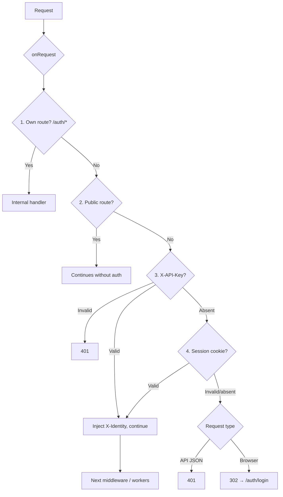

# @buntime/plugin-authn

> Centralized authentication for Buntime: providers (Email/Password, Keycloak, Auth0, Okta, generic OIDC), session management via better-auth, API key authentication, identity injection via the `X-Identity` header, and SCIM 2.0 provisioning. Default mount base: `/auth`.

## Overview

`@buntime/plugin-authn` is the authentication gate in the runtime pipeline. It intercepts all requests in the `onRequest` hook, verifies a session (cookie `better-auth.session_token`) or API key (`X-API-Key`), and injects an `X-Identity` header that other plugins and workers consume to make authorization decisions. The session engine is [better-auth](https://www.better-auth.com/), persisted via [plugin-database](./plugin-database.md).

**Capabilities:**

| Capability | Description |
|---|---|
| Multiple providers | Email/Password, Keycloak, Auth0, Okta, generic-OIDC, and Google (social provider) coexisting |
| Session | Cookie `better-auth.session_token` (HttpOnly, SameSite=Lax) managed by better-auth |
| API key | M2M auth via `X-API-Key`, with configurable roles per key |
| Identity | `X-Identity` header (JSON) injected for downstream — see [plugin-authz](./plugin-authz.md) |
| SCIM 2.0 | `/Users` and `/Bulk` endpoints for enterprise provisioning |
| OIDC logout | RP-Initiated Logout with `id_token_hint` and `post_logout_redirect_uri` |
| Login UI | React SPA + TanStack Router serving `/auth/login` with dynamic providers |
| Public routes | Internal routes (`/auth/api/**`, `/auth/login/**`) and per-worker `publicRoutes` that skip auth |

**API mode:** persistent. Routes and session state live in `plugin.ts` on the main thread (see [plugin-system](./plugin-system.md) for the hook contract).



## Status (enabled: false by default)

The plugin ships disabled in the manifest (`enabled: false`). To enable it in dev/prod environments, just set `enabled: true` — but note: it requires [plugin-database](./plugin-database.md) to be active (hard dependency).

| Field | Default | Notes |
|---|---|---|
| `name` | `"@buntime/plugin-authn"` | stable identifier used by `getPlugin()` |
| `base` | `/auth` | mount path for routes and the SPA |
| `enabled` | `false` | enable explicitly |
| `injectBase` | `true` | internal routes and SPA inherit the `base` |
| `entrypoint` | `dist/client/index.html` | login SPA |
| `pluginEntry` | `dist/plugin.js` | plugin implementation |
| `dependencies` | `["@buntime/plugin-database"]` | hard dep — session/user require a DB |
| `optionalDependencies` | `["@buntime/plugin-proxy"]` | used for `isPublic(path, method)` on proxy routes |

## Configuration (manifest + env, trustedOrigins)

### manifest.yaml — reference

```yaml
name: "@buntime/plugin-authn"
base: "/auth"
enabled: true
injectBase: true

dependencies:
  - "@buntime/plugin-database"
optionalDependencies:
  - "@buntime/plugin-proxy"

loginPath: "/auth/login"
trustedOrigins:
  - "http://localhost:8000"
  - "https://buntime.home"

providers:
  - type: email-password
    displayName: Email
    allowSignUp: true
    requireEmailVerification: false

apiKeys: []

scim:
  enabled: false
  maxResults: 100
  bulkEnabled: true
  maxBulkOperations: 1000
```

### Options

| Field | Type | Default | Description |
|---|---|---|---|
| `loginPath` | `string` | `/auth/login` | Where unauthenticated browser requests are redirected |
| `trustedOrigins` | `string[]` | `[]` | Origins accepted by better-auth (CORS/CSRF). Include every external host |
| `database` | Current: `"sqlite" \| "libsql" \| "postgres" \| "mysql"`; target: Turso only | `default` adapter | Current [plugin-database](./plugin-database.md) adapter used to persist sessions and users; target storage should converge on Turso |
| `providers` | `ProviderConfig[]` | `[]` | List of active providers (see table in the next section) |
| `apiKeys` | `ApiKeyConfig[]` | `[]` | M2M keys with `key`, `name`, `roles` |
| `scim.enabled` | `boolean` | `false` | Mounts `/auth/api/scim/v2/*` |
| `scim.maxResults` | `number` | `100` | Maximum results per page on `GET /Users` |
| `scim.bulkEnabled` | `boolean` | `true` | Enables `POST /Bulk` |
| `scim.maxBulkOperations` | `number` | `1000` | Operation limit per bulk request |

### Environment variable substitution

All string fields accept `${ENV_VAR}`, resolved at load-time from the process environment (or from a ConfigMap in a Helm deploy). Use this to inject `clientSecret`, API keys, and URLs:

```yaml
providers:
  - type: keycloak
    issuer: ${KEYCLOAK_URL}
    realm: ${KEYCLOAK_REALM}
    clientId: ${KEYCLOAK_CLIENT_ID}
    clientSecret: ${KEYCLOAK_CLIENT_SECRET}
apiKeys:
  - key: ${CI_DEPLOY_KEY}
    name: "CI/CD Pipeline"
    roles: ["deployer"]
```

### trustedOrigins

This list feeds into better-auth for CORS and CSRF. **Symptoms of a missing configuration:** cookie does not persist, sign-in via OIDC fails after callback, cross-origin requests return 403. Include every host that serves the login SPA and every frontend host that will call `/auth/api/*`.

## Providers

| Type | Identifier | Minimum configuration |
|---|---|---|
| Email/Password | `email-password` | `{ allowSignUp, requireEmailVerification, displayName }` |
| Keycloak | `keycloak` | `{ issuer, realm, clientId, clientSecret }` |
| Auth0 | `auth0` | `{ domain, clientId, clientSecret }` |
| Okta | `okta` | `{ domain, clientId, clientSecret }` |
| Generic OIDC | `generic-oidc` | `{ issuer, clientId, clientSecret }` (issuer must serve `.well-known/openid-configuration`) |
| Google (social) | `google` | `{ clientId, clientSecret, prompt? }` (present in the default manifest) |

> Multiple providers can coexist. The login SPA reads `GET /auth/api/providers` and renders one button per entry — useful for combining corporate SSO with an email/password fallback.

### Per-provider options

| Provider | Specific fields | Defaults / notes |
|---|---|---|
| `email-password` | `allowSignUp` (`true`), `requireEmailVerification` (`false`), `displayName` (`"Email"`) | Local login, validated by better-auth against the DB |
| `keycloak` | `issuer`, `realm`, `clientId`, `clientSecret` | Discovery: `${issuer}/realms/${realm}/.well-known/openid-configuration` |
| `auth0` | `domain` (`myapp.auth0.com`), `clientId`, `clientSecret` | — |
| `okta` | `domain` (`dev-12345.okta.com`), `clientId`, `clientSecret` | — |
| `generic-oidc` | `issuer`, `clientId`, `clientSecret` | issuer must serve `.well-known/openid-configuration` |

Common to all: `displayName` (default per type), `clientSecret` via `${ENV_VAR}`.

**Callback URL in the IdP:** `https://<host>/auth/api/auth/callback/<provider-id>`. Also configure Post Logout Redirect URIs so that RP-Initiated Logout works with `id_token_hint` + `post_logout_redirect_uri`.

### OIDC flow

1. User clicks "Sign in with Keycloak" → `GET /auth/api/auth/sign-in/social?provider=keycloak`.
2. Plugin responds `302` to the IdP's authorize endpoint (`client_id`, `redirect_uri`, `state`).
3. IdP authenticates and redirects to `GET /auth/api/auth/callback/keycloak?code&state`.
4. Plugin exchanges `code` for `access_token + id_token + refresh_token`, creates/updates the user, persists the `id_token` (required for logout), sets `Set-Cookie: better-auth.session_token`, and redirects to the original URL (resolved from `state`).

Logout reverses step 4: clears the cookie and (if an `id_token` exists) redirects to the IdP's end-session endpoint with `id_token_hint` + `post_logout_redirect_uri`.

## Identity model

When authenticated, the plugin injects an `X-Identity` header with a JSON payload. There are two shapes:

### Session identity (cookie)

```typescript
interface Identity {
  sub: string;                     // user id (DB or OIDC "sub" claim)
  roles: string[];                 // OIDC realm/client roles
  groups: string[];                // "groups" claim
  claims: Record<string, unknown>; // remaining claims (email, name, preferred_username...)
}
```

```json
{"sub":"user-abc-123","roles":["admin","user"],"groups":["engineering"],"claims":{"email":"john@example.com","name":"John Doe"}}
```

### API key identity

```json
{"id":"apikey:GitLab CI/CD","name":"GitLab CI/CD","roles":["deployer"]}
```

The `apikey:` prefix in `id` distinguishes machine identities from human ones.

### Reading identity in workers

```typescript
app.get("/api/profile", (c) => {
  const header = c.req.header("X-Identity");
  if (!header) return c.json({ error: "Not authenticated" }, 401);
  const identity = JSON.parse(header);
  return c.json({ user: identity });
});
```

### Trust and security

| Topic | Behavior |
|---|---|
| External forgery | Impossible on authenticated routes — the plugin overwrites any incoming `X-Identity` before delegating |
| Public routes | On public routes the header may not be present — do not blindly trust it |
| Stripping | The plugin does **not** remove `X-Identity` from external requests on public routes (documented limitation) |
| API key rotation | Use a Secret/ConfigMap, avoid hardcoding, rotate periodically |

The injection also feeds the `keyBy: user` rate limiter in [plugin-gateway](./plugin-gateway.md) and the PDPs in [plugin-authz](./plugin-authz.md).

## SCIM

User provisioning following the SCIM 2.0 standard. Enable with `scim.enabled: true` to mount `/auth/api/scim/v2/*`.

### Endpoints

| Method | Endpoint | Description |
|---|---|---|
| `GET` | `/Users` | List with `startIndex`, `count`, `filter` |
| `GET` | `/Users/:id` | Read a single user |
| `POST` | `/Users` | Create user (`201`) |
| `PUT` | `/Users/:id` | Replace entire user |
| `PATCH` | `/Users/:id` | Partial `PatchOp` (operations: `add`, `replace`, `remove`) |
| `DELETE` | `/Users/:id` | `204` |
| `POST` | `/Bulk` | Multiple operations per request (up to `maxBulkOperations`) |

### Filters

| Operator | Meaning |
|---|---|
| `eq`, `ne` | equal / not equal |
| `co`, `sw`, `ew` | contains / starts with / ends with |
| `gt`, `ge`, `lt`, `le` | comparisons |
| `and`, `or` | logical composition |

Examples:

```
filter=userName eq "user@example.com"
filter=name.familyName co "Doe"
filter=userName eq "john" and active eq true
```

### User → SCIM mapping

| Internal field | SCIM field | Notes |
|---|---|---|
| `id` | `id` | unique identifier |
| `email` | `userName`, `emails[0].value` | userName is the primary identifier |
| `name` | `name.formatted` | full name |
| derived | `name.givenName`, `name.familyName` | extracted from `name` |
| status | `active` | boolean |
| `createdAt` | `meta.created` | ISO-8601 |
| `updatedAt` | `meta.lastModified` | ISO-8601 |

### IdP integration

| IdP | How to point |
|---|---|
| Keycloak | Realm Settings > User Federation, or the SCIM plugin pointing to `https://<host>/auth/api/scim/v2` |
| Azure AD / Entra ID | Enterprise Apps > Provisioning, Automatic mode, tenant URL above, secret token = plugin-authn API key |
| Okta | Applications > Provisioning > SCIM, base URL above |

## API Reference

All routes are mounted under `/auth/*` (with `injectBase: true`).

### Plugin routes

| Method | Endpoint | Description |
|---|---|---|
| `GET` | `/auth/` | Auth-based redirect (home if logged in, login otherwise) |
| `GET` | `/auth/api/providers` | Lists providers for the SPA — fields: `id`, `type`, `displayName`, `allowSignUp` |
| `ALL` | `/auth/api/auth` | better-auth root handler |
| `ALL` | `/auth/api/auth/*` | better-auth sub-routes (see table below) |
| `GET` | `/auth/api/session` | Current session (`{ user, session }` or `null`) |
| `GET` | `/auth/api/logout?redirect=/` | Logout via redirect (302). If an `id_token` exists, redirects to the OIDC end-session endpoint |
| `POST` | `/auth/api/logout` | Logout via JSON: `{ success, oidcLogoutUrl }`. Client decides whether to redirect to `oidcLogoutUrl` |

### better-auth sub-routes (`/auth/api/auth/*`)

| Method | Path | Description |
|---|---|---|
| `POST` | `/sign-up/email` | Register with email/password (creates `Set-Cookie: better-auth.session_token`) |
| `POST` | `/sign-in/email` | Email/password login |
| `POST` | `/sign-out` | End session |
| `GET` | `/session` | Current session (equivalent to `/auth/api/session`) |
| `GET` | `/sign-in/social?provider=<id>` | Redirect to provider authorization |
| `GET` | `/callback/:provider` | OAuth/OIDC callback — exchange `code → tokens`, create session, redirect |

### Authentication pipeline (`onRequest`)

| Order | Check | Result |
|---|---|---|
| 1 | `pathname` starts with `/auth/*` | Skip — plugin's own routes |
| 2 | Public route (internal + worker `publicRoutes` + `proxy.isPublic`) | Continues without auth |
| 3 | `X-API-Key` present | Match → inject `X-Identity`; mismatch → `401 {"error":"Invalid API key"}` |
| 4 | Cookie `better-auth.session_token` present | Valid → inject `X-Identity`; invalid → continues without identity |
| 5 | No credentials | API (`Accept: application/json`) → `401 {"error":"Unauthorized"}`; browser → `302 /auth/login?redirect=<original>` |

### Errors

| Status | Body | Cause |
|---|---|---|
| `401` | `{"error":"Unauthorized"}` | No cookie or API key, API request |
| `401` | `{"error":"Invalid API key"}` | `X-API-Key` does not match any configured key |
| `500` | `{"error":"Auth not configured"}` | Init failed (DB missing, invalid provider) |

### Public routes

| Source | Behavior |
|---|---|
| Internal (plugin) | `/auth/api/**` (all methods), `/auth/login/**` (GET only) |
| Worker manifest | `publicRoutes: { ALL: [...], GET: [...], POST: [...] }` — relative paths, prefixed with the worker's `base` |
| [plugin-proxy](./plugin-proxy.md) | Plugin calls `proxy.isPublic(pathname, method)` before requiring auth |

Example in a worker manifest:

```yaml
publicRoutes:
  ALL: ["/api/health"]
  GET: ["/api/public/**"]
  POST: ["/api/webhook"]
```

### Exported types

```typescript
export interface AuthnConfig { /* options above */ }
export interface ApiKeyConfig { key: string; name: string; roles?: string[] }
export type AuthnRoutesType = typeof api;

export type AuthProviderType =
  | "email-password" | "keycloak" | "auth0" | "okta" | "generic-oidc";

export interface EmailPasswordProviderConfig { /* ... */ }
export interface KeycloakProviderConfig { /* ... */ }
export interface Auth0ProviderConfig { /* ... */ }
export interface OktaProviderConfig { /* ... */ }
export interface GenericOIDCProviderConfig { /* ... */ }
export type ProviderConfig =
  | EmailPasswordProviderConfig | KeycloakProviderConfig
  | Auth0ProviderConfig | OktaProviderConfig | GenericOIDCProviderConfig;

export interface ProviderInfo {
  id: string; type: AuthProviderType;
  displayName: string; allowSignUp?: boolean;
}
```

### Lifecycle hooks

| Hook | Responsibility |
|---|---|
| `onInit` | Resolves `DatabaseService` via `ctx.getPlugin("@buntime/plugin-database")`, configures better-auth with the adapter, registers providers, mounts SCIM (if enabled) |
| `onShutdown` | Closes connections and auth state |
| `onRequest` | Authentication pipeline described above |

## Integration with plugin-gateway and plugin-authz (cross-ref)

| Plugin | Relationship | Mechanism |
|---|---|---|
| [plugin-database](./plugin-database.md) | **Hard dependency** | `ctx.getPlugin<DatabaseService>("@buntime/plugin-database")` in `onInit`. Session, user, and OAuth accounts are persisted in the resolved adapter |
| [plugin-proxy](./plugin-proxy.md) | **Optional dependency** | When present, authn calls `proxy.isPublic(pathname, method)` to let through proxy routes declared as public by the rules |
| [plugin-authz](./plugin-authz.md) | **Consumer** | The authz PDP reads `X-Identity` from the request to evaluate policies (`subject.id`, `subject.roles`, `subject.groups`). Authn provides, authz decides |
| [plugin-gateway](./plugin-gateway.md) | **Consumer** | The rate limiter uses `keyBy: user` by reading `X-Identity` to limit by user instead of IP |
| [plugin-system](./plugin-system.md) | **Runtime contract** | Hooks (`onInit`, `onShutdown`, `onRequest`), `provides()`/`getPlugin()`, ordering by dependencies — all inherited from the plugin system |

## Guides (setup, configuration)

### Prerequisites

1. Buntime runtime running.
2. [plugin-database](./plugin-database.md) enabled with at least one adapter with `default: true`.
3. (Optional) OIDC IdP for SSO (Keycloak, Auth0, Okta, Azure AD, …).

### Scenario A — local development with email/password

```yaml
# plugins/plugin-database/manifest.yaml
name: "@buntime/plugin-database"
enabled: true
adapters:
  - type: sqlite
    baseDir: ./.cache/sqlite/
    default: true

# plugins/plugin-authn/manifest.yaml
name: "@buntime/plugin-authn"
enabled: true
providers:
  - type: email-password
    allowSignUp: true
trustedOrigins:
  - "http://localhost:8000"
```

Access `http://localhost:8000/auth/login` and create the first user through the SPA itself.

### Scenario B — production with Keycloak + SCIM

1. **Keycloak:** create a `buntime` client (`openid-connect`, `confidential`) with Valid Redirect URI `https://buntime.home/auth/api/auth/callback/keycloak` and Post Logout Redirect URI `https://buntime.home/*`. Note the client secret.
2. **Plugin:**

```yaml
name: "@buntime/plugin-authn"
enabled: true
providers:
  - type: keycloak
    issuer: ${KEYCLOAK_URL}
    realm: ${KEYCLOAK_REALM}
    clientId: ${KEYCLOAK_CLIENT_ID}
    clientSecret: ${KEYCLOAK_CLIENT_SECRET}
trustedOrigins:
  - "https://buntime.home"
scim:
  enabled: true
apiKeys:
  - key: ${CI_DEPLOY_KEY}
    name: "CI/CD Pipeline"
    roles: ["deployer"]
```

3. **Env / ConfigMap / Secret:**

```bash
KEYCLOAK_URL=https://keycloak.example.com
KEYCLOAK_REALM=myrealm
KEYCLOAK_CLIENT_ID=buntime
KEYCLOAK_CLIENT_SECRET=...
CI_DEPLOY_KEY=...
```

4. **IdP → SCIM:** point the IdP connector to `https://buntime.home/auth/api/scim/v2`.

### Scenario C — multi-provider and headless

Multi-provider: combine `email-password` (with `allowSignUp: false` for emergency access) with OIDC SSO. The SPA renders one button per provider.

Headless (API keys only): keep any provider in the array (the default includes email-password) and use `apiKeys` with `roles` per key. Call with `curl -H "X-API-Key: $KEY" https://buntime.home/api/apps`.

### Helm

```yaml
plugins:
  authn:
    providers:
      - type: keycloak
    trustedOrigins:
      - "https://buntime.home"
    scim:
      enabled: true
```

```bash
helm upgrade buntime ./charts/buntime \
  --set-json 'plugins.authn.providers=[{"type":"keycloak","issuer":"https://kc.example.com","realm":"myrealm","clientId":"buntime","clientSecret":"secret"}]'
```

### Verification

Useful commands: `curl .../auth/api/session -b cookies.txt` (session), `POST /auth/api/auth/sign-in/email` with `-c cookies.txt` (email login), `curl -H "X-API-Key: $KEY"` (M2M). To validate injection, have a worker echo its headers and inspect `X-Identity`.

## Troubleshooting

| Symptom | Likely cause | Fix |
|---|---|---|
| Login shows zero providers | `providers: []` in the manifest | Add at least one provider |
| OIDC redirect fails after callback | Callback URL mismatch in the IdP / missing `trustedOrigins` | Check `https://<host>/auth/api/auth/callback/<provider>` in the IdP and add the host to `trustedOrigins` |
| Session does not persist | Cookie blocked / missing `trustedOrigins` / CORS | Add host to `trustedOrigins`, check `Set-Cookie` in DevTools, verify CORS in [plugin-gateway](./plugin-gateway.md) |
| API key returns 401 | Whitespace, env not exported, key missing from manifest | `echo $KEY`, compare character by character, validate `apiKeys` was loaded |
| `500 Auth not configured` | `onInit` failed — DB missing or invalid provider | Enable [plugin-database](./plugin-database.md), review plugin logs at boot |
| `X-Identity` absent on a public route | Expected behavior — public routes bypass auth | Do not rely on `X-Identity` on public routes; apply conditional authorization in the worker |
| OIDC logout does not log out of the IdP | No `id_token` saved in the account or Post Logout Redirect URI missing from the IdP | Redo login (new id_token cycle), configure Post Logout in the IdP |
| 401 on SCIM with enterprise IdP | Missing API key or insufficient roles | Configure `apiKeys` with the provisioner role and send `X-API-Key` from the IdP |

**Canonical sources in this repo:** `plugins/plugin-authn/README.md`, `plugins/plugin-authn/manifest.yaml`, `plugins/plugin-authn/docs/**`. This page is the canonical reference for usage and configuration.
