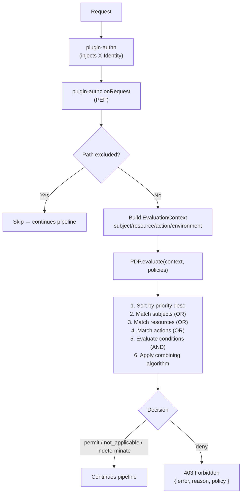

# @buntime/plugin-authz

> XACML-based authorization for Buntime: a Policy Enforcement Point (PEP)
> traverses every request, a Policy Decision Point (PDP) evaluates policies
> (subjects/resources/actions/conditions), and a Policy Administration Point
> (PAP) exposes CRUD via API and UI. Decisions are combined with configurable
> algorithms (`deny-overrides`, `permit-overrides`, `first-applicable`).

## Overview

The plugin implements attribute-based access control (ABAC) inspired by XACML.
It fits into the request pipeline **after** [plugin-authn](./plugin-authn.md),
reading the `X-Identity` header injected by the authentication layer and
deciding whether the request proceeds or receives a `403`.

Core capabilities:

- **PEP** (Policy Enforcement Point): intercepts requests in `onRequest` and
  applies decisions.
- **PDP** (Policy Decision Point): evaluates policies and returns
  `permit`/`deny`/`not_applicable`/`indeterminate`.
- **PAP** (Policy Administration Point): policy CRUD via REST and UI.
- **Combining algorithms**: `deny-overrides` (default), `permit-overrides`,
  `first-applicable`.
- **Policy seeding**: provisions default policies at startup (inline or via a
  JSON file), with environment filtering.
- **Storage**: in-memory or file (JSON).
- **Path exclusion**: regex to skip authorization (assets, health, public routes).
- **Explain API**: debugs decisions by showing context, decision, and matched
  policies.
- **Built-in UI**: React SPA at `/authz` for managing policies and testing
  evaluations; i18n en/pt.

**API mode**: persistent. Routes and `onRequest` live in `plugin.ts` and run on
the main thread — policies need to survive between requests and the PDP is
invoked for every request. See [Plugin System](./plugin-system.md) for the
persistent/serverless distinction and the `provides()`/`getPlugin()` contract.



Only `deny` blocks: `permit`, `not_applicable`, and `indeterminate` let the
pipeline continue.

## Status (enabled: false by default)

The plugin is **opt-in**. In the distributed `manifest.yaml`, `enabled: false`.
To enable it:

```yaml
# plugins/plugin-authz/manifest.yaml (or host override)
enabled: true
```

Required dependencies:

- `@buntime/plugin-authn` — provides the `X-Identity` header. Without it, all
  requests fall back to an anonymous subject
  (`{ id: "anonymous", roles: [], groups: [], claims: {} }`) and `defaultEffect`
  decides the outcome. See [plugin-authn](./plugin-authn.md).

## Configuration

There are two equivalent approaches: `manifest.yaml` (static) or a factory
function in host code (programmatic override).

### manifest.yaml

```yaml
name: "@buntime/plugin-authz"
base: "/authz"
enabled: false
injectBase: true

dependencies:
  - "@buntime/plugin-authn"

entrypoint: dist/client/index.html
pluginEntry: dist/plugin.js

combiningAlgorithm: deny-overrides   # | permit-overrides | first-applicable
defaultEffect: deny                  # | permit
store: memory                        # | file
# path: ./policies.json              # required when store=file

excludePaths:
  - ".*\\.(js|css|woff2?|png|svg|ico|json)$"
  - "/health"
  - "/public/.*"

policySeed:
  enabled: true
  onlyIfEmpty: true
  environments: ["*"]
  policies: [...]
```

### Factory function

```typescript
import authzPlugin from "@buntime/plugin-authz";

export default authzPlugin({
  combiningAlgorithm: "first-applicable",
  defaultEffect: "deny",
  store: "file",
  path: "./policies.json",
  excludePaths: ["/health", "/public/.*"],
  policySeed: {
    enabled: true,
    onlyIfEmpty: true,
    policies: [/* ... */],
  },
});
```

### Options

| Option | Type | Default | Description |
|-------|------|---------|-----------|
| `combiningAlgorithm` | `"deny-overrides" \| "permit-overrides" \| "first-applicable"` | `"deny-overrides"` | How to combine multiple matching policies |
| `defaultEffect` | `"permit" \| "deny"` | `"deny"` | Decision when no policy applies |
| `store` | `"memory" \| "file"` | `"memory"` | PAP persistence backend |
| `path` | `string` | — | JSON file path when `store=file` |
| `excludePaths` | `string[]` | `[]` | Regex patterns for paths that skip the PEP |
| `policySeed` | `PolicySeedConfig` | — | Automatic seed at startup |

`PolicySeedConfig`:

| Field | Type | Default | Description |
|-------|------|---------|-----------|
| `enabled` | `boolean` | `true` | Enables/disables seeding |
| `onlyIfEmpty` | `boolean` | `true` | Only seed if PAP is empty (does not overwrite) |
| `environments` | `string[]` | `["*"]` | Compared against `NODE_ENV` |
| `file` | `string` | — | External JSON with `{ "policies": [...] }` or a bare array |
| `policies` | `Policy[]` | `[]` | Inline policies (merged after `file`) |

> **Recommendation**: keep `defaultEffect: deny` (closed-world). Permitting by
> default exposes routes not covered by any policy.

## Concepts: PEP, PDP, PAP

### Policy Enforcement Point (PEP)

Runs in `onRequest` (`plugin.ts`). For each request:

1. Checks `excludePaths` — if a regex matches, authorization is skipped.
2. Reads `X-Identity` (JSON with `sub`, `roles`, `groups`, `claims`); if absent,
   the subject becomes anonymous.
3. Builds an `EvaluationContext` with `subject`, `resource` (`app`, `path`),
   `action` (`method`), `environment` (`ip`, `time`, `userAgent`).
4. Calls `PDP.evaluate(context, policies)`.
5. Applies decision: `permit`/`not_applicable`/`indeterminate` → continue;
   `deny` → `403 Forbidden`.

### Policy Decision Point (PDP)

Stateless and deterministic (`server/pdp.ts`). For each call:

1. Sorts policies by `priority` desc (default `0`).
2. Tests match: subjects (OR), resources (OR), actions (OR), conditions (AND).
3. Applies the combining algorithm to reduce to a single `Decision`.
4. Returns `{ effect, reason, matchedPolicy? }`.

### Policy Administration Point (PAP)

Storage and CRUD (`server/pap.ts`). In-memory uses a `Map<id, Policy>`; file
persists as JSON and reloads at startup. Operations: `getAll`, `get`, `set`,
`delete`, `loadFromArray`.

## Policies

Canonical structure:

```typescript
interface Policy {
  id: string;                  // unique
  name?: string;
  description?: string;
  effect: "permit" | "deny";
  priority?: number;           // default 0; higher values are evaluated first
  subjects: SubjectMatch[];    // OR — empty array = any subject
  resources: ResourceMatch[];  // OR — empty array = any resource
  actions: ActionMatch[];      // OR — empty array = any action
  conditions?: Condition[];    // AND
}
```

### Matchers

| Matcher | Fields | Notes |
|---------|--------|-------|
| `SubjectMatch` | `id`, `role`, `group`, `claim` | Fields on the same object = AND. `role` and `claim.value` accept wildcard `*` (converted to `.*` in regex) |
| `ResourceMatch` | `app`, `path`, `type`, `owner: "self"` | `path` accepts globs `**` and `*` (converted to regex). `owner: "self"` matches when the resource belongs to the subject |
| `ActionMatch` | `method`, `operation` | `method: "*"` matches any HTTP method (case-insensitive); `operation` for non-HTTP contexts |

`SubjectMatch.claim`:

```typescript
{ name: string; value: string|number|boolean; operator?: "eq"|"neq"|"gt"|"lt"|"contains"|"regex" }
```

### Conditions

Evaluated in AND after structural matching; if one fails, the policy becomes
`not_applicable` (does not block, but also does not authorize).

| Type | Fields | Behavior |
|------|--------|---------------|
| `time` | `after` (`HH:mm`), `before` (`HH:mm`), `dayOfWeek` (`0-6`, Sun=0) | Time windows; minutes since midnight. Can be combined with `dayOfWeek` |
| `ip` | `cidr`, `allowlist`, `blocklist` | IP comes from `X-Forwarded-For` or `X-Real-IP`; `allowlist` is an exact whitelist, `blocklist` is a blacklist |
| `custom` | `expression` | Hook for a custom expression (evaluated by the PDP) |

### Example

```yaml
- id: business-hours-api
  name: Business Hours API Access
  effect: permit
  priority: 70
  subjects:
    - role: user
  resources:
    - path: "/api/reports/**"
  actions:
    - method: GET
  conditions:
    - type: time
      after: "09:00"
      before: "18:00"
      dayOfWeek: [1, 2, 3, 4, 5]
    - type: ip
      allowlist: ["10.0.0.1", "10.0.0.2"]
```

For more patterns (admin full access, specific deny, claim-based, owner)
see `plugins/plugin-authz/docs/concepts/policies.md`.

## Combining algorithms

The PDP collects all matching policies and reduces them to a single decision
using the configured algorithm:

| Algorithm | Rule | When to use |
|-----------|-------|-------------|
| `deny-overrides` (default) | Any `deny` wins; without a `deny`, any `permit` wins; otherwise `defaultEffect` | "Security-first" posture; most restrictive |
| `permit-overrides` | Any `permit` wins; without a `permit`, any `deny` wins; otherwise `defaultEffect` | When permit exceptions should override general denies |
| `first-applicable` | Evaluates by priority desc; the **first** match with `permit`/`deny` decides and stops | When order/priority is deterministic; supports "emergency lockdown" at the top |

Comparison for 3 matched policies (A=permit/100, B=deny/90, C=permit/80):

| Algorithm | Decision | Reason |
|-----------|---------|-------|
| `deny-overrides` | `deny` | B overrides |
| `permit-overrides` | `permit` | A overrides |
| `first-applicable` | `permit` | A is first (priority 100) |

> **Background**: the default configuration was the subject of a technical plan
> (`apps/runtime/plans/authz-combining-algorithm.md`) about the conflict between
> a catch-all `deny` (subject `[]`) and `deny-overrides` — the catch-all would
> override even a specific `permit`. The documented solution is to use
> `first-applicable` with `defaultEffect: deny` when a priority-ordered catch-all
> deny is desired.

## API Reference

All routes live under `{base}/api/*` (default `/authz/api/*`). Identity is
inherited from [plugin-authn](./plugin-authn.md) via `X-Identity`.

| Method | Route | Description |
|--------|------|-----------|
| `GET` | `/api/policies` | List all policies |
| `GET` | `/api/policies/:id` | Fetch a policy by id; `404` if not found |
| `POST` | `/api/policies` | Create or replace a policy (same `id` = update); `201` on success, `400` if invalid |
| `DELETE` | `/api/policies/:id` | Remove a policy; `404` if not found |
| `POST` | `/api/evaluate` | Evaluate an `EvaluationContext` and return a `Decision` |
| `POST` | `/api/explain` | Debug a decision: returns context, decision, and a summary of all policies |

### EvaluationContext

```typescript
interface EvaluationContext {
  subject:     { id: string; roles: string[]; groups: string[]; claims: Record<string, unknown> };
  resource:    { app: string; path: string; [k: string]: unknown };
  action:      { method: string; operation?: string };
  environment: { ip: string; time: Date; userAgent?: string; [k: string]: unknown };
}
```

### Decision

```typescript
interface Decision {
  effect: "permit" | "deny" | "not_applicable" | "indeterminate";
  reason?: string;
  matchedPolicy?: string;
}
```

### PEP deny response

When the PEP denies in `onRequest`:

```http
HTTP/1.1 403 Forbidden
Content-Type: application/json

{ "error": "Forbidden", "reason": "<reason>", "policy": "<policyId or null>" }
```

### Common errors

| Status | Cause |
|--------|-------|
| `400` | `Invalid policy structure` — missing `id`, `effect`, `subjects`, `resources`, or `actions` |
| `403` | PEP denied (response above) |
| `404` | Policy not found |
| `500` | Unexpected error during evaluation or storage |

> A TypeScript SDK example (HTTP client) is available at
> `plugins/plugin-authz/docs/api-reference.md`.

## Dependencies

- **[plugin-authn](./plugin-authn.md)** — _hard dependency_, declared in
  `dependencies` in the manifest. Provides the `X-Identity` header read by the
  PEP. Without it, the subject becomes `anonymous` and no role/group/claim
  policies will match.
- **[Plugin System](./plugin-system.md)** — defines the lifecycle (`onInit`,
  `onRequest`), service registry (`provides()`/`getPlugin()`), and the
  persistent/serverless distinction applied here.

### Service Registry

The plugin exposes an `AuthzService` via `provides()`:

```typescript
interface AuthzService {
  seedPolicies(policies: Policy[], options?: { onlyIfEmpty?: boolean }): Promise<number>;
  getPap(): PolicyAdministrationPoint;
  getPdp(): PolicyDecisionPoint;
}
```

Other plugins can self-install their own policies in `onInit`:

```typescript
async onInit(ctx: PluginContext) {
  const authz = ctx.getPlugin<AuthzService>("@buntime/plugin-authz");
  if (!authz) return;
  await authz.seedPolicies([
    {
      id: "my-plugin-admin",
      effect: "permit",
      subjects: [{ role: "admin" }],
      resources: [{ path: "/my-plugin/**" }],
      actions: [{ method: "*" }],
    },
  ]);
}
```

## Guides

### Configuration

Summary of common scenarios (full reference at
`plugins/plugin-authz/docs/guides/configuration.md`):

| Scenario | `combiningAlgorithm` | `defaultEffect` | `store` | Notes |
|---------|----------------------|-----------------|---------|-------|
| Minimal (in-memory) | `deny-overrides` | `deny` | `memory` | Inline seed with admin + user-read |
| Persistent | `deny-overrides` | `deny` | `file` | Seed `onlyIfEmpty: true` avoids overwriting API edits |
| Permissive development | `permit-overrides` | `permit` | `memory` | Seed restricted to `environments: ["development"]` |
| Strict production | `deny-overrides` | `deny` | `file` | Seed via `environments: ["production"]`, file + inline |
| Ordered lockdown | `first-applicable` | `deny` | `file` | `emergency-lockdown` policy with `priority: 1000` at the top |

### Policy management

Three paths for managing policies:

| Path | When | Persistence |
|---------|--------|--------------|
| **Seed** (manifest/file) | startup | depends on `store` |
| **REST API** | runtime | depends on `store` |
| **Service Registry** | startup, plugin-to-plugin | depends on `store` |

Recommended pattern: **default seed + API/UI for ongoing management**. With
`store: file` and `onlyIfEmpty: true`, the seed only runs on the first startup;
edits via API persist to the JSON file and survive restarts.

Built-in UI (`/authz`):

| Path | Page | Function |
|------|--------|--------|
| `/authz/policies` | Policies | List, create, edit, delete policies |
| `/authz/evaluate` | Evaluate | Test an `EvaluationContext` against the PDP |

## Troubleshooting

| Symptom | Diagnosis |
|---------|-------------|
| Request authorized with no apparent policy | Path matches `excludePaths` — PEP was skipped. Check the regex (remember `\\` in YAML) |
| Subject always `anonymous` | `X-Identity` is absent. Check [plugin-authn](./plugin-authn.md) (token, flow, header injection) |
| Policy does not match despite correct role | Wildcard typo in `role` (e.g. `admin*` instead of `admin:*`); claim type mismatch (number vs string) |
| Specific `permit` loses to catch-all `deny` (`subjects: []`) | Expected behavior with `deny-overrides`. Use `first-applicable` with priorities, per `apps/runtime/plans/authz-combining-algorithm.md` |
| Conditions always fail | `time` expects `HH:mm` 24h format; `dayOfWeek` 0=Sunday; `ip` reads `X-Forwarded-For`/`X-Real-IP` — check reverse proxy |
| Seed does not apply in a new environment | `environments` does not include the current `NODE_ENV`, or `onlyIfEmpty: true` with a non-empty PAP |
| Decision is hard to understand | Use `POST /authz/api/explain` — returns the `EvaluationContext`, the final `Decision`, and the full list of policies with priorities |

Useful logs (with `RUNTIME_LOG_LEVEL=debug`):

```
[authz] Authorization initialized (2 policies, algorithm: deny-overrides)
[authz] Authorization: permit for user-123 on /api/users (admin-full-access)
[authz] Authorization: deny for user-456 on /admin/settings (no match)
[authz] Policy seed skipped - policies already exist
```

## References

- Canonical sources: `plugins/plugin-authz/README.md`,
  `plugins/plugin-authz/docs/`, `plugins/plugin-authz/manifest.yaml`.
- Design history: `apps/runtime/plans/authz-combining-algorithm.md`.
- XACML 3.0 Combining Algorithms (OASIS):
  https://docs.oasis-open.org/xacml/3.0/xacml-3.0-core-spec-os-en.html#_Toc325047268
- Related plugins: [plugin-authn](./plugin-authn.md),
  [Plugin System](./plugin-system.md).
