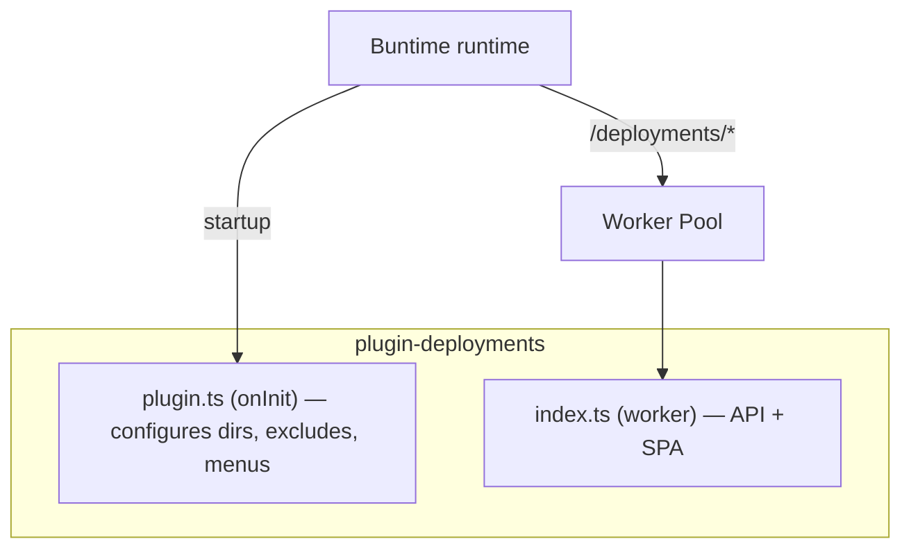
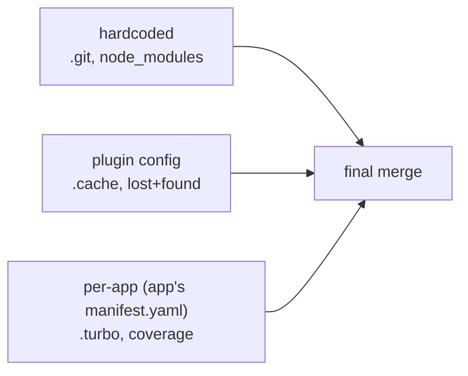
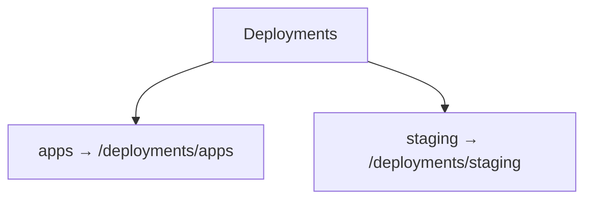

# @buntime/plugin-deployments

> Manages apps deployed in the runtime — list, upload (`.zip` / `.tgz` / `.tar.gz`), download, rename, move, and remove. Exposes a file manager SPA at `/deployments` backed by a Hono API running in serverless mode (worker pool).

## Overview

The plugin is one of the core plugins in Buntime and is the entry point for app operations in the runtime. It scans the directories configured in `RUNTIME_WORKER_DIRS`, builds a navigable tree, and exposes CRUD operations over files and directories.

Main features:

- **File manager SPA** (React + TanStack Router) served at `/deployments/*`.
- **Multi-directory**: each path in `RUNTIME_WORKER_DIRS` becomes a navigable "root"; duplicate basenames get an index suffix (`apps`, `apps-2`).
- **Auto-extracted zip upload** and folder download as a zip stream (streaming, no in-memory buffering).
- **Batch operations**: delete-batch, move-batch, download-batch.
- **Per-app visibility** (`public`, `protected`, `internal`) read from the app's `manifest.yaml`.
- **Excludes in three layers** (hardcoded defaults, plugin config, per-app), merged at listing time.
- **`.dirinfo` cache** with propagated invalidation.

For the core plugin concept and general lifecycle, see [Plugin System](./plugin-system.md).

## Serverless mode

`plugin-deployments` is one of the few core plugins that run in **serverless mode** — the API and SPA execute inside the worker pool instead of living in the persistent runtime. This is reflected in `manifest.yaml` by `entrypoint: dist/index.js` (executable module) alongside `pluginEntry: dist/plugin.js` (lifecycle hooks only).

Behavior:

- `plugin.ts` implements **only `onInit`** — configures `workerDirs`, merges excludes, and generates dynamic menus.
- `index.ts` is the worker entrypoint — serves the API at `/deployments/api/*` and SPA static files at `/deployments/*`.
- **No `onRequest`/`onResponse`/`onShutdown`** — the runtime pays no overhead on routes that do not match `/deployments/*`.

Benefits inherited from this model (general details in [Plugin System](./plugin-system.md)):

1. Process isolation — filesystem operations run in a dedicated worker.
2. Stateless — each request receives a fresh context from the pool.
3. Resilience — an I/O failure does not bring down the main process.
4. Zero latency outside the plugin — activates only when the route matches.



## Configuration

Configuration is resolved in three layers, in order: code (when instantiating the plugin) → `manifest.yaml` → environment variables. Hardcoded `excludes` defaults (`.git`, `node_modules`) are **always** applied.

### manifest.yaml

```yaml
name: "@buntime/plugin-deployments"
base: "/deployments"
enabled: true

injectBase: true
entrypoint: dist/index.js
pluginEntry: dist/plugin.js

menus:
  - icon: lucide:rocket
    path: /deployments
    title: Deployments

excludes:
  - ".cache"
  - "lost+found"

config:
  excludes:
    type: string
    label: Exclude Patterns
    description: "Folder patterns to exclude, comma-separated"
    default: ".cache, lost+found"
    env: DEPLOYMENTS_EXCLUDES
```

### Options

| Option | Type | Default | Source | Description |
|---|---|---|---|---|
| `workerDirs` | `string[]` | `globalConfig.workerDirs` | code / env | Directories served as roots in the file manager |
| `pluginDirs` | `string[]` | `globalConfig.pluginDirs` | code / env | Plugin directories (concatenated to the roots) |
| `excludes` | `string[]` | `[".git", "node_modules"]` | code / manifest / env | Additional patterns (merged with defaults) |
| `base` | `string` | `/deployments` | manifest | Base path; API lives at `{base}/api/*` |
| `injectBase` | `boolean` | `true` | manifest | Injects `<base href>` into the SPA |
| `entrypoint` | `string` | `dist/index.js` | manifest | Worker entry — `.js`, **not** `.html` (executes the module) |
| `pluginEntry` | `string` | `dist/plugin.js` | manifest | Lifecycle hooks module |

### Environment variables

| Variable | Default | Description |
|---|---|---|
| `RUNTIME_WORKER_DIRS` | **required** | Absolute paths separated by `:`. Read by the runtime and the worker. |
| `DEPLOYMENTS_EXCLUDES` | `".cache, lost+found"` | Additional patterns separated by comma (surrounding spaces are trimmed). |

Directories starting with `.` (e.g. `/data/.apps`) are loaded but **hidden** from the UI — useful for built-in apps. They remain accessible via direct path.

### Exclude layers



Per-app excludes come from the `manifest.yaml` inside the app's version folder and only apply when listing that directory.

### Dynamic menus

When there is **more than one** worker dir, `onInit` injects `items` into the main menu. With a single dir, only the root "Deployments" menu entry is shown.



## API Reference

All routes are under `{base}/api/*` (default `/deployments/api/*`). The `path` format is always `{rootName}/{relativePath}`. `path=""` (empty string) means root listing — returns the list of roots.

### File operations

| Method | Endpoint | Body / Query | Description |
|---|---|---|---|
| `GET` | `/api/list` | `?path=` | Lists entries (dirs first, then alphabetical). Filters out `visibility=internal`. |
| `POST` | `/api/mkdir` | `{ path }` | Creates a directory. Cannot create at the root level. |
| `DELETE` | `/api/delete` | `{ path }` | Removes a file or directory. Cannot remove root or top-level dirs. |
| `POST` | `/api/rename` | `{ path, newName }` | Renames. Cannot rename top-level dirs. |
| `POST` | `/api/move` | `{ path, destPath }` | Moves within the same worker dir; `destPath` must exist and be a directory. |
| `POST` | `/api/upload` | multipart | See [Accepted package format](#accepted-package-format). |
| `GET` | `/api/download` | `?path=` | File returns raw; directory returns a zip stream (excludes `.dirinfo`). |
| `GET` `POST` | `/api/refresh` | `?path=` or `{ path }` | Invalidates `.dirinfo`. Without `path`, refreshes all roots. |

### Batch operations

| Method | Endpoint | Body / Query | Description |
|---|---|---|---|
| `POST` | `/api/delete-batch` | `{ paths }` | Continues on failure; returns `errors` array if any. |
| `POST` | `/api/move-batch` | `{ paths, destPath }` | All sources must be in the same worker dir as the destination. |
| `GET` | `/api/download-batch` | `?paths=a,b,c` | Copies to `/tmp/buntime-download-*`, zips, streams, and cleans up tmp. |

### Listing — response format

Directory listing:

```json
{
  "success": true,
  "data": {
    "currentVisibility": "public",
    "entries": [
      {
        "isDirectory": true,
        "name": "1.0.0",
        "path": "apps/my-app/1.0.0",
        "size": 245760,
        "files": 42,
        "updatedAt": "2025-01-15T10:30:00.000Z",
        "visibility": "public",
        "configValidation": { "valid": true, "errors": [] }
      }
    ],
    "path": "apps/my-app"
  }
}
```

Root listing (`path=""`) uses `modifiedAt` instead of `updatedAt` and does not include `files`/`visibility`/`configValidation`.

`FileEntry` type:

```typescript
interface FileEntry {
  isDirectory: boolean;
  name: string;
  path: string;
  size: number;
  updatedAt: string;
  files?: number;
  visibility?: "public" | "protected" | "internal";
  configValidation?: { valid: boolean; errors: string[] };
}
```

The `DeploymentsRoutesType = typeof api` type is exported from `server/api.ts` for inference via Hono RPC.

### Error codes

```json
{ "error": "message", "code": "ERROR_CODE" }
```

| Code | HTTP | Cause |
|---|---|---|
| `PATH_REQUIRED` | 400 | `path` missing |
| `PATHS_REQUIRED` | 400 | `paths` array missing/empty |
| `PATH_AND_NAME_REQUIRED` | 400 | rename without `path`/`newName` |
| `DEST_PATH_REQUIRED` | 400 | move without `destPath` |
| `NO_FILES_PROVIDED` | 400 | empty upload |
| `CANNOT_CREATE_AT_ROOT` | 400 | mkdir at root level |
| `CANNOT_DELETE_ROOT` | 400 | delete on root or top-level |
| `CANNOT_RENAME_ROOT` | 400 | rename on top-level |
| `CANNOT_MOVE_ROOT` | 400 | move of top-level |
| `CANNOT_UPLOAD_TO_ROOT` | 400 | upload to root |
| `CANNOT_DOWNLOAD_ROOT` | 400 | download of root |
| `CROSS_DIR_MOVE_NOT_SUPPORTED` | 400 | move between different worker dirs |
| `APP_NAME_CONFLICT` | 400 | name conflicts with a registered plugin |
| `APP_NAME_RESERVED` | 400 | name reserved by a plugin |
| `DOWNLOAD_FAILED` | 400 | failed to assemble batch download |
| `DIR_NOT_FOUND` | 404 | root name does not exist |
| `FILE_NOT_FOUND` | 404 | file/directory does not exist |
| `NO_VALID_PATHS` | 404 | no valid paths in batch download |

Plugin name conflict validations occur in `mkdir` and `upload` (at the top-level only).

## Accepted package format

Upload is `multipart/form-data` via `POST /api/upload`. Accepts two modes:

### 1. Individual files (with preserved structure)

| Field | Type | Required | Description |
|---|---|---|---|
| `path` | `string` | yes | Destination directory |
| `files` | `File[]` | yes | One or more files |
| `paths` | `string[]` | no | Relative path for each `files[i]`; if absent, uses the filename |

```bash
curl -X POST http://localhost:8000/deployments/api/upload \
  -F "path=apps/my-app/1.0.0" \
  -F "files=@index.ts"        -F "paths=src/index.ts" \
  -F "files=@manifest.yaml"   -F "paths=manifest.yaml"
```

Subdirectories in `paths[]` are created automatically. The `.dirinfo` cache is invalidated after upload.

### 2. Auto-extracted archive

If a single `.zip` file is sent, it is extracted via `unzip -o -q` (overwrite, quiet) at the destination `path`. The `.tgz` / `.tar.gz` formats are also supported by the same route (extracted via `tar`).

```bash
curl -X POST http://localhost:8000/deployments/api/upload \
  -F "path=apps/my-app/1.0.0" \
  -F "files=@app.zip"
```

### Expected app structure

Two versioning conventions are supported (detected in `server/utils/deployment-path.ts`):

**Nested (recommended):**

```
/data/apps/my-app/1.0.0/{manifest.yaml, src/, dist/}
/data/apps/my-app/1.0.1/...
```

**Flat:**

```
/data/apps/my-app@1.0.0/{manifest.yaml, dist/}
/data/apps/my-app@1.0.1/...
```

Each version must contain a `manifest.yaml` (interpreted by the runtime). See [Plugin System](./plugin-system.md) and [Runtime](./runtime.md) for the manifest shape.

## Visibility

Controlled in the version folder's `manifest.yaml`:

| Value | Effect |
|---|---|
| `public` | Default, listed and accessible |
| `protected` | Listed, upload restricted in the UI |
| `internal` | Filtered from the API listing |

Visibility is **inherited**: files inside a `protected` version inherit `protected`. For the nested format, the app folder reflects the **most restrictive** child version.

## Integration

- **Go CLI** (`buntime`): consumes `POST /api/upload` for deploys; manages versions via `delete` and `rename`. Details in [CLI](./cli.md).
- **CPanel**: the file manager SPA is embedded via `@zomme/frame` in the shell. CPanel also uses `/api/list` for the app picker in other plugins. Details in [CPanel](./cpanel.md).
- **plugin-gateway** (optional): can apply rate limiting / CORS to `/deployments/api/*` routes.
- **plugin-authn** / **plugin-authz** (optional): protect the endpoints when enabled.

## Troubleshooting

**`DIR_NOT_FOUND` when listing a known root**
Check `RUNTIME_WORKER_DIRS` in the worker process (setting it only in the main process is not enough). The worker reads the env var directly.

**Hidden folder (`.cache`, `.git`, `node_modules`) showing up in the UI**
These are only hidden in the **listing**. They remain served via direct path. Confirm they are in `excludes` (defaults + plugin + per-app).

**Zip upload was not extracted**
The route only extracts when the upload contains **a single** file with suffix `.zip` / `.tgz` / `.tar.gz`. Multiple files in the same upload are treated as individual files. `unzip` must be available in the worker container.

**Stale listing after an external filesystem change**
Call `GET /api/refresh?path=...` (or without `path` for all roots) to invalidate `.dirinfo`. Changes made through the API itself invalidate automatically.

**`CROSS_DIR_MOVE_NOT_SUPPORTED`**
Move only works within the same worker dir (same root name). To move between roots, download → upload to destination → delete from source.

**"Deployments" menu without submenus even with multiple dirs**
Confirm that non-hidden dirs are >1. Dirs starting with `.` **do not count** toward submenu generation (but remain served).

**`APP_NAME_CONFLICT` when creating a top-level app**
The chosen name conflicts with a plugin's `base` (e.g. `api`, `metrics`). Choose a different name — the check only happens at the top level of the roots, so subfolders are free.

**Large folder download running out of memory**
It should not — the zip is streamed directly from the `zip` binary, not buffered. If it happens, suspect an intermediary proxy (reverse proxy buffering the response) and enable chunked encoding in front.
