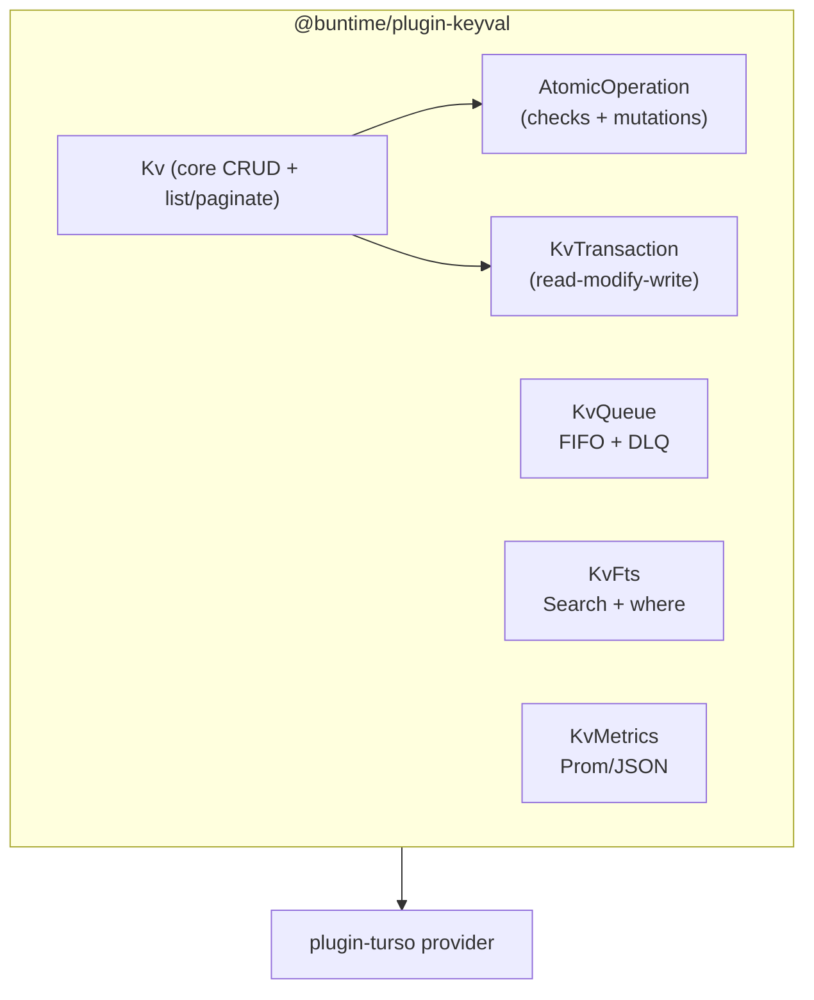
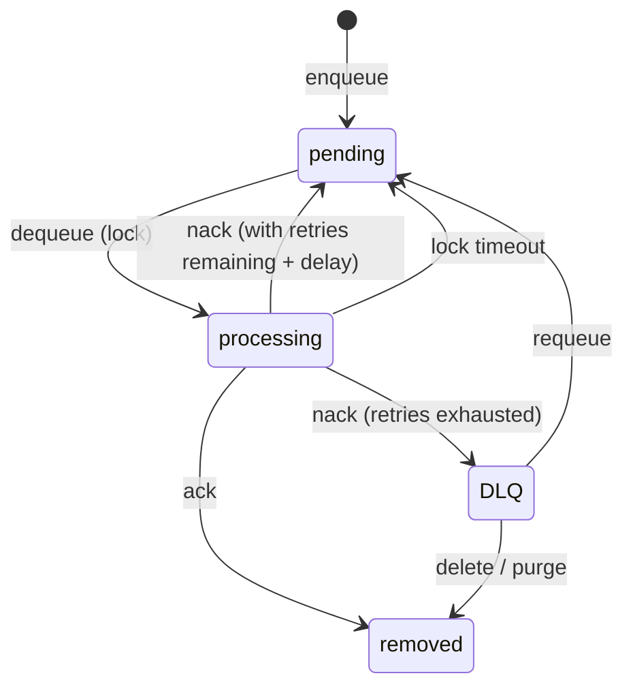

# @buntime/plugin-keyval

> Key-value store inspired by Deno KV, with composite keys, TTL, atomic transactions (OCC), FIFO queues with DLQ, full-text search, and real-time watch via SSE. Current storage persists through the [plugin-turso](./plugin-turso.md) service boundary.

For plugin model details (lifecycle, `provides`, `getPlugin`, `manifest.yaml`), see [Plugin System](./plugin-system.md).

## Overview

The plugin exposes the `Kv` class as a service, plus five subsystems:

| Component | Responsibility |
|-----------|----------------|
| `Kv` | CRUD (`get`/`set`/`delete`), `list`, `count`, `paginate`, factory for `atomic()` and `transaction()` |
| `AtomicOperation` | Builder for checks + mutations with versionstamps (OCC) |
| `KvTransaction` | Read-modify-write with conflict detection (no automatic retry — see [Limitations](#limitations)) |
| `KvQueue` | FIFO queue with delay, retry/backoff, DLQ |
| `KvFts` | Search indexes and full-text-like search with `where` filters |
| `KvMetrics` | In-memory counters and Prometheus-format export |

Key aspects:

- **Persistent mode.** Routes mounted in `plugin.ts` run on the main thread (required for SSE in watch and queue listen).
- **Storage.** Current implementation stores everything in SQL through `@buntime/plugin-turso`; KeyVal owns the `kv_*` schema and uses a local `KeyValSqlAdapter` over `TursoService`.
- **Deno KV compatibility.** Types and semantics mirror `Deno.Kv` (versionstamps, `sum`/`max`/`min`/`append`/`prepend` mutations).



## Configuration

All options live in `manifest.yaml` (or are passed programmatically via `keyvalExtension({...})`).

| Option | Type | Default | Description |
|--------|------|---------|-------------|
| `metrics.persistent` | `boolean` | `false` | Persist counters to the database (survives restarts) |
| `metrics.flushInterval` | `number` (ms) | `30000` | Flush interval when `persistent: true` |
| `queue.cleanupInterval` | `number` (ms) | `60000` | Expired lock cleanup; `0` disables |
| `queue.lockDuration` | `number` (ms) | `30000` | Lock duration between `dequeue` and `ack`/`nack` |

Current minimal example:

```yaml
name: "@buntime/plugin-keyval"
enabled: true
dependencies:
  - "@buntime/plugin-turso"
```

Production configuration:

```yaml
metrics:
  persistent: true
  flushInterval: 30000
queue:
  cleanupInterval: 60000
  lockDuration: 30000
```

The SPA UI lives at `/keyval/` (Overview, Entries, Queue, Search, Watch, Atomic, Metrics) and is registered via `menus` in the manifest.

## Architecture

- The current implementation obtains `ctx.getPlugin<TursoService>("@buntime/plugin-turso")` in `onInit`, wraps it in `TursoKeyValAdapter`, and initializes `kv_*` tables through that adapter.
- `schema.ts` creates `kv_entries`, `kv_queue`, `kv_dlq`, FTS auxiliary tables, and (optionally) the metrics table.
- Keys are binary-encoded with a type prefix, ensuring lexicographic ordering `Uint8Array < string < number < bigint < boolean`.
- `where` filters are translated to SQL via `where-to-sql.ts`, using `json_extract(value, '$.field')` for nested fields.
- `Kv` is exposed via `provides()`. Other plugins can consume it with `ctx.getPlugin<Kv>("@buntime/plugin-keyval")` when they explicitly need a generic KV service. `plugin-gateway` and `plugin-proxy` no longer use KeyVal for their own operational state; they use `plugin-turso` directly.
- `onShutdown` flushes metrics and stops the queue cleanup.

### Key and entry model

Keys are arrays whose elements can be `string`, `number`, `bigint`, `boolean`, or `Uint8Array`. Each entry has a `key`, `value` (JSON), and `versionstamp` (`null` when absent).

```typescript
["users", "123"]
["users", 42, "profile"]
["metrics", "2024-01-01", "cpu"]
```

| Limit | Value |
|-------|-------|
| Key depth | 20 parts |
| Recommended value size | < 1 MB |
| Maximum `expiresIn` (TTL) | 2,147,483,647 ms (~24.8 days) |
| Batch get/delete | 1,000 keys |
| List limit | 1,000 entries (default 100) |
| Prefix watch | 1,000 keys |

In the REST API, keys become paths: `/keyval/api/keys/users/123` ↔ `["users", "123"]`. In `POST` endpoints (`/keys/list`, `/atomic`, `/keys/batch`, etc.), keys are JSON arrays in the request body.

## API Reference

All routes are under `{base}/api/*` (default `/keyval/api/*`). Errors use `{ "error": string }` with status `400` (validation), `404` (not found), or `500`.

### Key-Value

| Method | Endpoint | Description |
|--------|----------|-------------|
| `GET` | `/api/keys/*` | Get by key path |
| `PUT` | `/api/keys/*?expiresIn=` | Set with optional TTL |
| `DELETE` | `/api/keys/*` | Delete (prefix + children by default; see modes) |
| `GET` | `/api/keys?prefix=&start=&end=&limit=&reverse=` | List by prefix |
| `POST` | `/api/keys/list` | List with `where` filters |
| `GET` | `/api/keys/count?prefix=` | Count entries |
| `GET` | `/api/keys/paginate?prefix=&cursor=&limit=` | Cursor-based pagination |
| `POST` | `/api/keys/batch` | Batch get (`{ keys: KvKey[] }`) |
| `POST` | `/api/keys/delete-batch` | Batch delete (`{ keys, exact?, where? }`) |

#### Delete modes

1. **Prefix (default)** — deletes the key and all descendants.
2. **Exact** (`{"exact": true}`) — only the specified key.
3. **Filtered** (`{"where": {...}}`) — key becomes a prefix; deletes only matching entries.

```bash
curl -X PUT /keyval/api/keys/users/123 \
  -H "Content-Type: application/json" \
  -d '{"name":"Alice","age":30}'

curl -X POST /keyval/api/keys/list \
  -H "Content-Type: application/json" \
  -d '{"prefix":["users"],"where":{"status":{"$eq":"active"}}}'

curl -X DELETE /keyval/api/keys/tasks \
  -H "Content-Type: application/json" \
  -d '{"where":{"status":"completed"}}'
```

### Atomic

| Method | Endpoint | Body |
|--------|----------|------|
| `POST` | `/api/atomic` | `{ checks?: KvCheck[], mutations: KvMutation[] }` |

Response: `{ "ok": true, "versionstamp": "..." }` on success, `{ "ok": false }` when any check fails (always HTTP 200).

### Watch (SSE)

| Method | Endpoint | Description |
|--------|----------|-------------|
| `GET` | `/api/watch?keys=&initial=` | SSE for specific keys (CSV of paths) |
| `GET` | `/api/watch/poll?keys=&versionstamps=` | Polling without streaming |
| `GET` | `/api/watch/prefix?prefix=&initial=&limit=` | SSE by prefix |
| `GET` | `/api/watch/prefix/poll?prefix=&versionstamps=&limit=` | Polling by prefix |

SSE events: `change` (data: JSON array of entries — `value`/`versionstamp` `null` indicate deletion) and `ping` (heartbeat).

### Queue

| Method | Endpoint | Description |
|--------|----------|-------------|
| `POST` | `/api/queue/enqueue` | `{ value, options? }` |
| `GET` | `/api/queue/listen` | SSE with auto-dequeue |
| `GET` | `/api/queue/poll` | Dequeue one message |
| `POST` | `/api/queue/ack` | `{ id }` — success |
| `POST` | `/api/queue/nack` | `{ id }` — retry/DLQ |
| `GET` | `/api/queue/stats` | `{ pending, processing, dlq, total }` |
| `GET` | `/api/queue/dlq?limit=&offset=` | List DLQ |
| `GET` | `/api/queue/dlq/:id` | Inspect a DLQ message |
| `POST` | `/api/queue/dlq/:id/requeue` | Requeue to the main queue |
| `DELETE` | `/api/queue/dlq/:id` | Delete one |
| `DELETE` | `/api/queue/dlq` | Purge all |

### Full-Text Search

| Method | Endpoint | Description |
|--------|----------|-------------|
| `POST` | `/api/indexes` | Create index (`{ prefix, options: { fields, tokenize? } }`) |
| `GET` | `/api/indexes` | List indexes |
| `DELETE` | `/api/indexes?prefix=` | Remove index |
| `GET` | `/api/search?prefix=&query=&limit=` | Simple search |
| `POST` | `/api/search` | Search + `where` (`{ prefix, query, options: { limit?, where? } }`) |

### Metrics

| Method | Endpoint | Description |
|--------|----------|-------------|
| `GET` | `/api/metrics` | JSON with `operations`, `queue`, `storage` |
| `GET` | `/api/metrics/prometheus` | Prometheus text format (`text/plain; version=0.0.4`) |

## Atomic operations

Atomic combines **checks** (expected versionstamp per key) and **mutations** in an all-or-nothing commit. If any check fails, nothing is applied and the response is `{ ok: false }` (status `200`, not an error).

| Mutation | Parameters | Behavior |
|----------|------------|----------|
| `set` | `key`, `value`, `expiresIn?` | Sets value (with optional TTL) |
| `delete` | `key` | Removes |
| `sum` | `key`, `value: number\|bigint` | Adds; missing key treated as `0` |
| `max` | `key`, `value: number\|bigint` | `max(current, new)` |
| `min` | `key`, `value: number\|bigint` | `min(current, new)` |
| `append` | `key`, `value: any[]` | Concatenates to array; creates if absent |
| `prepend` | `key`, `value: any[]` | Inserts at the start; creates if absent |

**Read-modify-write** pattern:

```bash
# 1. Read and capture versionstamp
curl /keyval/api/keys/users/123
# {"key":[...],"value":{...},"versionstamp":"00000001"}

# 2. Update atomically
curl -X POST /keyval/api/atomic \
  -H "Content-Type: application/json" \
  -d '{
    "checks":[{"key":["users","123"],"versionstamp":"00000001"}],
    "mutations":[
      {"type":"set","key":["users","123"],"value":{"name":"Alice","age":31}},
      {"type":"sum","key":["counters","updates"],"value":1}
    ]
  }'
```

**Create-if-not-exists** uses `versionstamp: null` in the check. **UUIDv7 placeholders** (`kv.uuidv7()`) resolve to the same value across all mutations in a single commit, useful for creating cross-references and time-ordered indexes in one atomic operation.

`KvTransaction` is a wrapper that caches reads, automatically builds the checks, and returns `{ ok: false, error: "conflict" | "error" }` on failure — but currently **does not retry automatically**, see [Limitations](#limitations).

## Full-text search

Each `prefix` supports at most one index. Recreating replaces the previous one. Synchronization is automatic on `set`/`delete`/atomic.

| Tokenizer | When to use |
|-----------|-------------|
| `unicode61` (default) | Multilingual content / general use |
| `porter` | English text with stemming (run/running/runs → run) |
| `ascii` | ASCII identifiers and codes only |

Fields accept dot-notation for nested properties (`details.manufacturer.name`).

```bash
# Create index
curl -X POST /keyval/api/indexes \
  -H "Content-Type: application/json" \
  -d '{
    "prefix":["products"],
    "options":{"fields":["name","description","category"],"tokenize":"porter"}
  }'

# Search + where (search index narrow -> where filter)
curl -X POST /keyval/api/search \
  -H "Content-Type: application/json" \
  -d '{
    "prefix":["products"],
    "query":"smartphone",
    "options":{"limit":50,"where":{"price":{"$lt":500},"inStock":{"$eq":true}}}
  }'
```

Results come from the KeyVal search table for the prefix; `where` is applied afterward on the full value.

## Queues

FIFO with at-least-once delivery, delay, configurable backoff, and DLQ.



**Enqueue options:**

| Field | Default | Description |
|-------|---------|-------------|
| `delay` | `0` | Delay (ms) before the message becomes available |
| `backoffSchedule` | `[1000, 5000, 10000]` | Per-attempt delays; length = number of retries |
| `keysIfUndelivered` | — | KV keys where the `value` is stored when all retries are exhausted |

```bash
# Job with 3 increasing retries and KV fallback
curl -X POST /keyval/api/queue/enqueue \
  -H "Content-Type: application/json" \
  -d '{
    "value":{"task":"webhook","url":"https://api.example.com/hook"},
    "options":{
      "backoffSchedule":[1000,5000,30000],
      "keysIfUndelivered":[["failed-webhooks","hook-123"]]
    }
  }'

# SSE consumer
curl -N /keyval/api/queue/listen
```

After dequeue, the message is locked for `queue.lockDuration`. If the consumer does not `ack`/`nack` before the lock expires, it returns to `pending` on the next cleanup run (`queue.cleanupInterval`).

## Where filters

`where` is translated to SQL using `json_extract` on the `value` column. Supports dot-notation and logical nesting.

| Category | Operators |
|----------|-----------|
| Comparison | `$eq`, `$ne`, `$gt`, `$gte`, `$lt`, `$lte`, `$between` |
| Array | `$in`, `$nin` |
| Case-sensitive string | `$contains`, `$notContains`, `$startsWith`, `$endsWith` |
| Case-insensitive string | `$containsi`, `$notContainsi`, `$startsWithi`, `$endsWithi` |
| Existence | `$null`, `$empty`, `$notEmpty` |
| Logical | `$and`, `$or`, `$not` |
| Timestamp | `$now` (with `$offset` in ms — positive for future, negative for past) |

Shorthand: `{ "field": "value" }` is equivalent to `{ "field": { "$eq": "value" } }`. Multiple conditions at the same level are implicitly AND.

```json
{
  "$and": [
    { "status": { "$eq": "active" } },
    { "$or": [{ "role": { "$eq": "admin" } }, { "role": { "$eq": "moderator" } }] },
    { "lastLogin": { "$gt": { "$now": true, "$offset": -2592000000 } } },
    { "$not": { "suspended": { "$eq": true } } }
  ]
}
```

`$now` is resolved on the server, avoiding clock skew. `$null: true` matches null/absent; `$empty: true` matches `null`, `""`, or `[]`.

> `where` filters perform a table scan + `json_extract`. For hot fields in large datasets, prefer **composite keys** (e.g., `["users_by_status", "active", userId]`) or FTS for free text.

## Dependencies

- **Hard:** `@buntime/plugin-turso`. KeyVal owns the `kv_*` schema and KV semantics while using `plugin-turso` for durable SQL connection, sync, MVCC setup, and retry helpers.
- **Consumers:** plugins that explicitly need persistent KV storage should use `ctx.getPlugin<Kv>("@buntime/plugin-keyval")`. Gateway and proxy operational state should not use KeyVal as infrastructure; see [plugin-turso](./plugin-turso.md#rejected-alternative-gatewayproxy-through-keyval) and [storage-overview](../data/storage-overview.md#plugin-turso-provider-decision).

## Exported types

```typescript
type KvKeyPart = bigint | boolean | number | string | Uint8Array;
type KvKey = KvKeyPart[];
interface KvEntry<T> { key: KvKey; value: T | null; versionstamp: string | null }

interface KvCheck { key: KvKey; versionstamp: string | null }
type KvMutationType = "append" | "delete" | "max" | "min" | "prepend" | "set" | "sum";
interface KvMutation { key: KvKey; type: KvMutationType; value?: unknown; expiresIn?: number }

interface KvEnqueueOptions {
  delay?: number;
  backoffSchedule?: number[];
  keysIfUndelivered?: KvKey[];
}
interface KvQueueMessage<T> { id: string; value: T; attempts: number }

type KvFtsTokenizer = "ascii" | "porter" | "unicode61";
interface KvCreateIndexOptions { fields: string[]; tokenize?: KvFtsTokenizer }
interface KvSearchOptions { limit?: number; where?: KvWhereFilter }

interface KvPaginateResult<T> { entries: KvEntry<T>[]; cursor: string | null; hasMore: boolean }
```

## Limitations

| Area | Limitation | Mitigation |
|------|------------|------------|
| `sum`/`max`/`min` | BigInt is converted to Number — precision is lost outside `±2^53` | For very large counters, store as string and use `set` with manual OCC |
| `KvTransaction` | Does not retry automatically despite the `maxRetries`/`retryDelay` field names | Implement retry in the caller (loop with exponential backoff) |
| Watch | ~100 ms polling per key; no batching | Keep to < 100 keys; for many keys, use `list` in a loop |
| TTL | Cleanup is blocking on the main thread; effective granularity ~1 s | Distribute TTLs with jitter to avoid expiration spikes |
| Queue | Crash between dequeue and ack leaves the message locked until `lockDuration` | Idempotent handler + `lockDuration` tuned to the actual processing time |
| DLQ | No automatic cleanup | Periodic job that deletes entries with old `failedAt` |
| Where filter | `field` is interpolated into SQL (paths are not escaped) | Validate fields against an allowlist when exposed to external input |
| Scale | Single writer (SQLite/libSQL) — ~1k–5k writes/s; no sharding | Postgres/manual sharding above ~100 GB |

## Tests and troubleshooting

| Symptom | Likely cause | Action |
|---------|--------------|--------|
| `SQLITE_BUSY: database is locked` | Multiple processes writing to the same file | Enable WAL (`PRAGMA journal_mode=WAL`), use libSQL server, increase `busy_timeout` |
| `atomic().commit()` returns `{ ok: false }` | Concurrency: versionstamp changed between read and write | Re-read the entry and implement retry with backoff; for counters, prefer `sum` (no check needed) |
| Messages stuck in `processing` | Worker crashed; cleanup did not run | Force `UPDATE kv_queue SET status='pending' WHERE locked_until < now`; adjust `cleanupInterval` |
| DLQ growing | Handler always failing or poison messages | Inspect `errorMessage` in the DLQ; implement periodic cleanup; use `requeue` for recoverable messages |
| Duplicate messages | Lock expired during long processing | Increase `lockDuration`; make handler idempotent (mark `processed:<id>` with TTL) |
| Watch consuming CPU | Many watched keys (100 ms polling each) | Cancel unused watchers; consolidate into manual `list` poll; keep < 100 watchers |
| Expired entries not removed | Cleanup did not run or large volume | Run `DELETE FROM kv_entries WHERE expires_at <= unixepoch() LIMIT 1000` in batches |
| `no such table: kv_entries` | Different database than configured or schema did not initialize | Verify the selected adapter and `onInit` logs; run `initSchema` manually |

Useful endpoints for diagnostics:

```bash
curl /keyval/api/metrics                  # aggregated counters (JSON)
curl /keyval/api/metrics/prometheus       # same, Prometheus format
curl /keyval/api/queue/stats              # pending/processing/dlq/total
```

For durable SQL provider behavior, see [plugin-turso](./plugin-turso.md). For table layout, see [keyval-tables](../data/keyval-tables.md).
