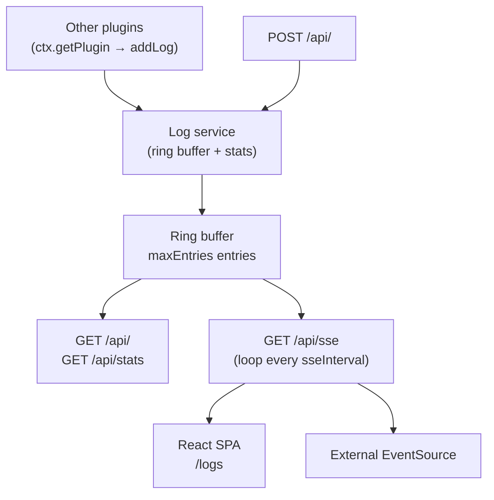
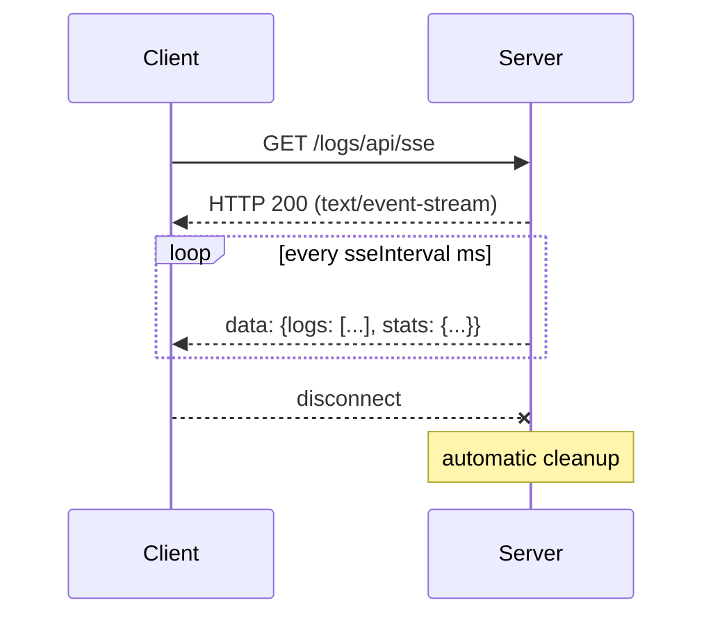

# @buntime/plugin-logs

> In-memory runtime log collection with a fixed ring buffer, real-time SSE streaming, level/text filters, and a built-in UI at `/logs`. It's the visual `tail -f` of Buntime — focused on transient diagnosis, not long-term retention.

This plugin is a consumer of the runtime's logging pipeline. For the general logger system (`@buntime/shared/logger`, console/file transports, child loggers, `ctx.logger`), see [Runtime Logging](../ops/logging.md). For the plugin model (`provides`, `getPlugin`, manifest), see [Plugin System](./plugin-system.md).

## Overview

`plugin-logs` solves a specific problem: **quick inspection of recent events** without having to install Loki/Elasticsearch or open `kubectl logs`. Other plugins push entries via the service registry, the UI consumes the SSE stream, and everything disappears on the next restart — by design.

| Capability | How it works |
|------------|---------------|
| Ring buffer | Fixed-size structure (`maxEntries`); O(1) insertion; automatic eviction of the oldest entry |
| Filters | `level` (debug/info/warn/error) + `search` (free text in the message) + `limit` |
| Statistics | Aggregated counters by level since the last `clearLogs` |
| SSE streaming | Push of the full payload (logs + stats) every `sseInterval` ms |
| Service registry | `addLog`/`getLogs`/`getStats`/`clearLogs` exposed via `provides()` |
| Built-in UI | React SPA at `/logs` — viewer with filters, stats dashboard, and clear action |



> **Persistent API mode.** Routes in `plugin.ts` run on the main thread — SSE requires long-lived connections that transient workers cannot maintain.

## Status and default mode

| Configuration | Default | Notes |
|--------------|---------|-------|
| `enabled` | `false` | Plugin is opt-in; manifest needs `enabled: true` to start |
| `base` | `/logs` | Routing prefix (routes + UI) |
| `injectBase` | `true` | UI receives the base path for reverse proxy |
| `maxEntries` | `1000` | Ring buffer capacity (~500 KB of RAM) |
| `sseInterval` | `1000` | ms between SSE events (1 push per second) |
| Persistence | none | Everything lost on restart — **by design** |

For persistent retention, export to an external aggregator (see [Limitations and troubleshooting](#limitations-and-troubleshooting)).

## Configuration

All configuration lives in `manifest.yaml`. There is no runtime API to change `maxEntries`/`sseInterval` at execution time.

```yaml
name: "@buntime/plugin-logs"
base: "/logs"
enabled: true            # default false
injectBase: true

entrypoint: dist/client/index.html
pluginEntry: dist/plugin.js

menus:
  - icon: lucide:scroll-text
    path: /logs
    title: Logs

maxEntries: 1000
sseInterval: 1000
```

| Option | Type | Default | Useful range | Description |
|-------|------|---------|------------|-----------|
| `maxEntries` | `number` | `1000` | `100`–`10000` | Ring buffer size; when full, evicts the oldest entry in O(1) |
| `sseInterval` | `number` (ms) | `1000` | `250`–`5000` | SSE push frequency; lower values = more CPU/bandwidth |

### Approximate memory per `maxEntries`

| `maxEntries` | Estimated RAM | Scenario |
|--------------|--------------|---------|
| `100` | ~50 KB | Minimal footprint, only the most recent events |
| `1000` | ~500 KB | Default — suitable for most setups |
| `5000` | ~2.5 MB | High-traffic environments |
| `10000` | ~5 MB | Extended retention during active diagnosis |

> Estimates assume ~500 bytes per entry (message + meta). `meta` with large payloads changes the calculation.

### `sseInterval` trade-offs

| Value | Update rate | CPU/network | Typical use |
|-------|-------------|----------|------------|
| `250` | 4/s | High | Real-time dashboard, active debugging |
| `500` | 2/s | Moderate | Incident monitoring |
| `1000` | 1/s | Low (default) | General monitoring |
| `5000` | 0.2/s | Minimal | Background, multiple open tabs |

## REST API

All routes are under `{base}/api/*` (default `/logs/api/*`). No authentication by default — protect via `plugin-authn` if needed.

| Method | Endpoint | Response | Use |
|--------|----------|----------|-----|
| `GET` | `/api/` | `{ logs, stats }` | Listing with filters |
| `GET` | `/api/stats` | `LogStats` | Counters only (lightweight) |
| `GET` | `/api/sse` | `text/event-stream` | Real-time streaming |
| `POST` | `/api/` | `{ added: true }` | Add an entry |
| `POST` | `/api/clear` | `{ cleared: true }` | Empty the ring buffer and stats |

### Query params for `GET /api/`

| Parameter | Type | Default | Description |
|-----------|------|---------|-----------|
| `level` | `string` | — | Filter by `debug`, `info`, `warn`, `error` |
| `search` | `string` | — | Substring in `message` |
| `limit` | `number` | `100` | Maximum entries returned |

```bash
curl "/logs/api/?level=error&limit=50"
curl "/logs/api/?search=timeout"
curl "/logs/api/?level=warn&search=deprecated&limit=20"
```

Response:

```json
{
  "logs": [
    {
      "timestamp": "2024-01-23T10:30:00.000Z",
      "level": "error",
      "message": "Connection timeout after 5000ms",
      "source": "proxy",
      "meta": { "target": "https://api.example.com", "duration": 5000 }
    }
  ],
  "stats": { "total": 1543, "debug": 200, "info": 1100, "warn": 193, "error": 50 }
}
```

> The returned `stats` is always the **complete** aggregate (unfiltered). `total` counts all entries added since the last `clear`, including evicted ones — not just those currently in the buffer.

### Adding an entry via HTTP

```bash
curl -X POST /logs/api/ \
  -H "Content-Type: application/json" \
  -d '{
    "level": "info",
    "message": "Deployment complete",
    "source": "deployer",
    "meta": { "version": "1.2.3", "duration": 4200 }
  }'
```

Fields: `level` (required), `message` (required), `source` (optional), `meta` (optional). Timestamp is generated by the server.

## SSE streaming

The `GET /api/sse` endpoint keeps a `text/event-stream` connection open and pushes the full payload every `sseInterval` ms.



| Behavior | Detail |
|---------------|---------|
| Payload | Full array + stats in each event (non-incremental) |
| Concurrent connections | Supported; each receives the same snapshot |
| Reconnection | EventSource reconnects automatically; no cursor — current buffer is re-sent |
| Cleanup | Connection is dropped when the client disconnects |
| Bandwidth | Grows linearly with `maxEntries` and number of clients |

```javascript
const source = new EventSource("/logs/api/sse");
source.onmessage = (event) => {
  const { logs, stats } = JSON.parse(event.data);
  console.log(`Total ${stats.total}, errors ${stats.error}`);
};
source.onerror = () => source.close();
```

> **Design trade-off:** sending the full payload simplifies the client (always has the current state) at the cost of more bandwidth. For very large `maxEntries`, prefer polling `GET /api/` with `limit`, or use an external aggregator.

## Service registry — using from other plugins

`provides()` exposes four methods. Other plugins consume them via `ctx.getPlugin("@buntime/plugin-logs")`.

| Method | Signature | Description |
|--------|------------|-----------|
| `addLog` | `(entry: Omit<LogEntry, "timestamp">) => void` | Adds an entry; timestamp is generated |
| `getLogs` | `(filters?: { level?, search?, limit? }) => LogEntry[]` | Returns filtered entries (same semantics as `GET /api/`) |
| `getStats` | `() => LogStats` | Snapshot of counters |
| `clearLogs` | `() => void` | Empties buffer + stats |

```typescript
import type { PluginImpl, PluginContext } from "@buntime/shared/types";

export default function myPlugin(): PluginImpl {
  let logs: ReturnType<PluginContext["getPlugin"]> | null = null;
  return {
    onInit(ctx) {
      logs = ctx.getPlugin("@buntime/plugin-logs");
      logs?.addLog({
        level: "info",
        message: "My plugin initialized",
        source: "my-plugin",
      });
    },
  };
}
```

> **`addLog` vs `ctx.logger.info`:** `ctx.logger` (see [Runtime Logging](../ops/logging.md)) writes to configured transports (console/file/JSON). `addLog` only appends to this plugin's in-memory ring buffer. They are **complementary** — in a diagnostic context, it usually makes sense to do both (or one, depending on whether a transport auto-pushes).

## Exported types

```typescript
export type LogLevel = "debug" | "info" | "warn" | "error";

export interface LogEntry {
  timestamp: string;                    // ISO 8601, server-generated
  level: LogLevel;
  message: string;
  source?: string;                      // producer identifier
  meta?: Record<string, unknown>;       // arbitrary structured metadata
}

export interface LogStats {
  total: number;
  debug: number;
  info: number;
  warn: number;
  error: number;
}

export interface LogsConfig {
  maxEntries?: number;
  sseInterval?: number;
}
```

## Lifecycle hooks

| Hook | Action |
|------|------|
| `onInit` | Captures `ctx.logger`, calls `configure({ maxEntries, sseInterval })` on the service layer, and exposes `provides()` |

There is no `onShutdown` — the buffer is GC'd with the process.

## Integration with CPanel

The built-in UI at `/logs` is registered via `menus` in the manifest and appears as a navigation item in the [CPanel](./cpanel.md) shell when the plugin is enabled.

| Aspect | Detail |
|---------|---------|
| Routing | TanStack Router; route `/` consumes `GET /api/sse` for a live feed |
| Filters | UI mirrors the REST query params (`level`, `search`) |
| Auth | Inherits authentication from the shell when `plugin-authn` is enabled |
| Base path | Honors `injectBase: true` for reverse-proxy setups (Helm, NGINX) |

The SPA is served by `index.ts` (worker entrypoint) — `entrypoint: dist/client/index.html`. REST/SSE routes are defined in `plugin.ts` and run on the main thread (the worker entrypoint only serves the UI).

## Limitations and troubleshooting

| Symptom | Likely cause | Mitigation |
|---------|----------------|-----------|
| Logs disappear after restart | Ring buffer is in-memory by design | Configure `FileTransport` on the global logger or push to an external aggregator (Loki/Elastic/Datadog) |
| `maxEntries` appears smaller than expected | UI uses `limit=100` on the initial fetch; actual buffer is larger | Adjust `limit` in the query param or use SSE (sends everything) |
| SSE consumes too much CPU | `sseInterval` too low + many clients | Raise to `1000`+ ms; consolidate tabs; reduce `maxEntries` |
| `stats.total > maxEntries` | Expected behavior: stats count **all** entries added | Use `clearLogs()` to reset; use `getLogs()` if you only want what's in the buffer |
| Memory growing | `meta` with large payloads (e.g. serialized stack traces) | Limit `meta` size at the producer; reduce `maxEntries` |
| Logs do not appear in the UI | Plugin disabled or nothing is calling `addLog` | Check `enabled: true` in manifest; instrument producers; check `GET /api/stats` |
| `404` on `/logs/api/*` | Plugin did not load (invalid manifest, build not run) | Check runtime logs; run `bun run build` in the plugin |

### Quick verification

```bash
# Stats — confirms the plugin is alive
curl /logs/api/stats

# Add a test entry
curl -X POST /logs/api/ -H "Content-Type: application/json" \
  -d '{"level":"info","message":"sanity check"}'

# Stream in terminal
curl -N /logs/api/sse
```

### When NOT to use this plugin

- **Audit/compliance** — logs are transient; use the logger with `FileTransport` + an aggregator.
- **High persistent volume** — in-memory ring buffer does not scale; use Loki/Elastic.
- **Logs from other processes** — scope is the current runtime; does not consume stdout from neighboring containers.

For these cases, keep `@buntime/shared/logger` sending to JSON/file and use the platform aggregator — see [Runtime Logging](../ops/logging.md).

## File structure

```
plugins/plugin-logs/
├── manifest.yaml          # config + menus
├── plugin.ts              # routes, provides(), lifecycle (main thread)
├── index.ts               # worker entrypoint — serves the UI SPA
├── server/
│   ├── api.ts            # Hono routes (SSE, CRUD)
│   └── services.ts       # ring buffer + stats + configure
├── client/               # React + TanStack Router
└── dist/                 # build output
```

## References

- [Runtime Logging](../ops/logging.md) — central logger (`@buntime/shared/logger`), transports, child loggers, `ctx.logger`.
- [Plugin System](./plugin-system.md) — plugin model, `provides`/`getPlugin`, manifest, lifecycle.
- [CPanel](./cpanel.md) — shell that hosts the UI at `/logs`.
- [@buntime/plugin-metrics](./plugin-metrics.md) — companion plugin for pool and worker metrics.
