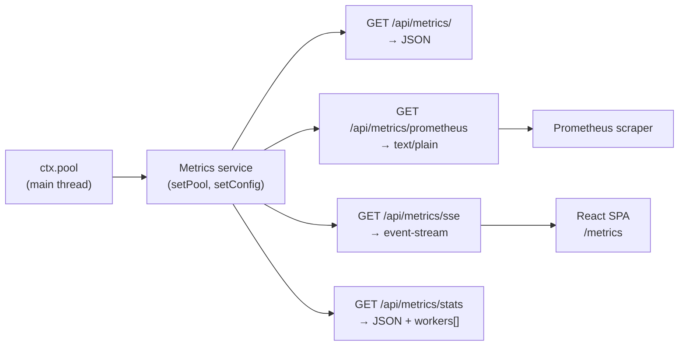
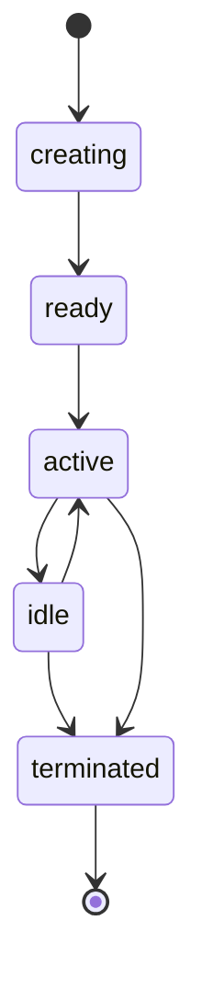

# @buntime/plugin-metrics

> In-process metrics collection for the worker pool and individual workers, with export in **JSON**, **Prometheus text format**, and **SSE**. Includes a built-in UI at `/metrics` (Overview + Workers). Point-in-time snapshots — for historical retention use Prometheus + Grafana.

For the plugin model (lifecycle, `provides`, manifest), see [Plugin System](./plugin-system.md). For the shell that renders the UI, see [CPanel](./cpanel.md). For a plugin focused on logs and diagnostics, see [@buntime/plugin-logs](./plugin-logs.md).

## Overview

The plugin reads `ctx.pool` on the main thread and exposes four endpoints with different formats for the same underlying data. It does not modify the pool or workers — it is strictly read-only.

| Capability | Detail |
|------------|---------|
| JSON | Pool snapshot — for health checks and custom dashboards |
| Prometheus | Text exposition format with `# HELP` / `# TYPE` for scraping |
| SSE | Push the snapshot every `sseInterval` ms — for live UIs |
| Full stats | Pool + array of workers (id, app, state, requests, uptime, memory) |
| Built-in UI | React SPA at `/metrics` with Overview and Workers table |



> **Persistent API mode.** Routes in `plugin.ts` run on the main thread because (1) `ctx.pool` only exists there and (2) SSE requires a long-lived connection. Spawned workers cannot see the pool.

## Status and default mode

| Configuration | Default | Notes |
|--------------|---------|-------|
| `enabled` | `false` | Plugin is opt-in; manifest needs `enabled: true` |
| `base` | `/metrics` | Routing prefix |
| `injectBase` | `true` | UI receives base path for reverse proxy |
| `prometheus` | `true` | Enables the `/api/metrics/prometheus` endpoint; when `false`, returns 404 |
| `sseInterval` | `1000` | ms between SSE events |
| Persistence | none | In-process snapshots — Prometheus/VictoriaMetrics handle the time series |

## Configuration

All config lives in `manifest.yaml`. There is no runtime API to change options at execution time.

```yaml
name: "@buntime/plugin-metrics"
base: "/metrics"
enabled: true            # default false
injectBase: true

entrypoint: dist/client/index.html
pluginEntry: dist/plugin.js

menus:
  - icon: lucide:activity
    path: /metrics
    title: Metrics
    items:
      - icon: lucide:layout-dashboard
        path: /metrics
        title: Overview
      - icon: lucide:cpu
        path: /metrics/workers
        title: Workers

prometheus: true
sseInterval: 1000
```

| Option | Type | Default | Description |
|-------|------|---------|-----------|
| `prometheus` | `boolean` | `true` | When `false`, `/api/metrics/prometheus` returns `404`. JSON/SSE/stats remain available |
| `sseInterval` | `number` (ms) | `1000` | SSE push frequency |

### `sseInterval` trade-offs

| Value | Update rate | CPU/network | Scenario |
|-------|-------------|----------|---------|
| `250` | 4/s | High | Real-time dashboard, load test |
| `500` | 2/s | Moderate | Active debugging |
| `1000` | 1/s | Low (default) | General monitoring |
| `5000` | 0.2/s | Minimal | Background monitoring |
| `10000` | 0.1/s | Very low | Infrequent health checks |

> For historical collection use **Prometheus** with `scrape_interval: 15s`. SSE is optimized for live UIs, not retention.

## REST API

All routes are under `{base}/api/metrics/*` (default `/metrics/api/metrics/*` — note the `metrics/api/metrics/` duplication). No auth by default; protect via `plugin-authn` if needed.

| Method | Endpoint | Content-Type | Use |
|--------|----------|--------------|-----|
| `GET` | `/api/metrics/` | `application/json` | Pool snapshot (lightweight) |
| `GET` | `/api/metrics/prometheus` | `text/plain; charset=utf-8` | Prometheus scraping |
| `GET` | `/api/metrics/sse` | `text/event-stream` | Live stream for UIs |
| `GET` | `/api/metrics/stats` | `application/json` | Pool + full workers array |

### `GET /api/metrics/` — JSON

```json
{
  "pool": {
    "size": 500,
    "active": 12,
    "idle": 3,
    "creating": 0,
    "total": 15,
    "utilization": 0.03
  },
  "uptime": 86400,
  "timestamp": "2024-01-23T10:30:00.000Z"
}
```

### `GET /api/metrics/stats` — pool + workers

```json
{
  "pool": { "size": 500, "active": 12, "idle": 3, "creating": 0, "total": 15, "utilization": 0.03 },
  "workers": [
    {
      "id": "worker-abc-123",
      "app": "my-app@latest",
      "state": "active",
      "requests": 1542,
      "uptime": 3600,
      "memory": { "rss": 52428800, "heapUsed": 31457280 }
    }
  ]
}
```

> The `stats` endpoint is **heavier** than `/api/metrics/`. Use it for on-demand inspection; avoid frequent polling.

### `GET /api/metrics/sse` — streaming

Same payload as `GET /api/metrics/`, pushed every `sseInterval` ms. Automatic reconnection via `EventSource`.

```javascript
const source = new EventSource("/metrics/api/metrics/sse");
source.onmessage = (e) => {
  const { pool, uptime } = JSON.parse(e.data);
  console.log(`util ${(pool.utilization * 100).toFixed(1)}%`);
};
```

## Prometheus format

`GET /api/metrics/prometheus` returns text exposition format compatible with `prometheus` v2.x+.

```
# HELP buntime_pool_size Maximum pool size
# TYPE buntime_pool_size gauge
buntime_pool_size 500

# HELP buntime_pool_active Active workers
# TYPE buntime_pool_active gauge
buntime_pool_active 12

# HELP buntime_pool_idle Idle workers
# TYPE buntime_pool_idle gauge
buntime_pool_idle 3

# HELP buntime_pool_creating Workers being created
# TYPE buntime_pool_creating gauge
buntime_pool_creating 0

# HELP buntime_pool_total Total workers
# TYPE buntime_pool_total gauge
buntime_pool_total 15

# HELP buntime_pool_utilization Pool utilization ratio
# TYPE buntime_pool_utilization gauge
buntime_pool_utilization 0.03

# HELP buntime_uptime_seconds Server uptime in seconds
# TYPE buntime_uptime_seconds counter
buntime_uptime_seconds 86400
```

### Exported metrics

| Metric | Type | Description | Formula / source |
|---------|------|-----------|------------------|
| `buntime_pool_size` | gauge | Maximum pool capacity | Static runtime configuration |
| `buntime_pool_active` | gauge | Workers currently processing requests | `state == "active"` |
| `buntime_pool_idle` | gauge | Live workers with no active request | `state == "idle"` or `"ready"` |
| `buntime_pool_creating` | gauge | Workers being spawned | `state == "creating"` |
| `buntime_pool_total` | gauge | Total workers in the pool | `active + idle + creating` |
| `buntime_pool_utilization` | gauge | Occupied fraction (0.0–1.0) | `active / size` |
| `buntime_uptime_seconds` | counter | Runtime process uptime | `process.uptime()` |

> **Plugin or request metrics are not in this plugin.** Other plugins expose their own metrics at separate endpoints — e.g. `plugin-keyval` at `/keyval/api/metrics/prometheus`, `plugin-gateway` at `/gateway/api/metrics`. Configure multiple `metrics_path` in Prometheus to scrape all of them.

## Pool and worker model

The source of truth is the runtime's `ctx.pool`; this plugin simply serializes the state.

### Worker states



| State | Description |
|-------|-----------|
| `creating` | Worker process is starting up |
| `ready` | Initialized, waiting for the first request |
| `active` | Processing a request |
| `idle` | Alive but idle |
| `terminated` | Shut down (cleanup, scaling, crash) |

### Per-worker metrics (`/api/metrics/stats`)

| Field | Type | Description |
|-------|------|-----------|
| `id` | `string` | Unique identifier |
| `app` | `string` | App name and version (e.g. `"my-app@latest"`) |
| `state` | enum | Current state (see above) |
| `requests` | `number` | Total requests processed since spawn |
| `uptime` | `number` | Seconds since spawn |
| `memory.rss` | `number` (bytes) | Resident Set Size |
| `memory.heapUsed` | `number` (bytes) | V8 heap in use |

> A reported `utilization` (`active / size`) approaching `1.0` indicates imminent saturation — new requests may wait for a slot. Use `BuntimePoolExhausted` (see alerting) to detect this.

## Exported types

```typescript
export interface MetricsConfig {
  prometheus?: boolean;
  sseInterval?: number;
}

interface PoolMetrics {
  size: number;
  active: number;
  idle: number;
  creating: number;
  total: number;
  utilization: number;
}

interface WorkerMetrics {
  id: string;
  app: string;
  state: "creating" | "ready" | "active" | "idle" | "terminated";
  requests: number;
  uptime: number;
  memory: { rss: number; heapUsed: number };
}

interface MetricsResponse {
  pool: PoolMetrics;
  uptime: number;
  timestamp: string;
}

interface StatsResponse {
  pool: PoolMetrics;
  workers: WorkerMetrics[];
}
```

## Lifecycle hooks

| Hook | Action |
|------|------|
| `onInit` | Reads `ctx.pool` and `ctx.config`; calls `setPool(ctx.pool)` and `setConfig({ prometheus, sseInterval })` on the service layer |

There is no `onShutdown` — resources are GC'd with the process. SSE clients are disconnected by the natural close of the HTTP connection.

## Integration with CPanel

The UI is at `/metrics` and registered via `menus` in the manifest with a submenu (Overview + Workers). It is hosted by the [CPanel](./cpanel.md) shell when enabled.

| View | Content |
|------|----------|
| Overview (`/metrics`) | Utilization gauge, active/idle/total/creating counters, uptime, timestamp |
| Workers (`/metrics/workers`) | Table with `id`, `app`, `state`, `requests`, `uptime`, `memory.rss` |

The SPA consumes `GET /api/metrics/sse` for a live feed and `GET /api/metrics/stats` for the workers table.

## Guide: Prometheus + Grafana

### 1. Enable the plugin

```yaml
name: "@buntime/plugin-metrics"
enabled: true
prometheus: true
sseInterval: 1000
```

### 2. Configure scraping

```yaml
# prometheus.yml
scrape_configs:
  - job_name: buntime
    metrics_path: /metrics/api/metrics/prometheus
    scrape_interval: 15s
    scrape_timeout: 10s
    static_configs:
      - targets: ['buntime:8000']
        labels:
          environment: production
          service: buntime
```

Multiple instances:

```yaml
static_configs:
  - targets: ['buntime-1:8000', 'buntime-2:8000', 'buntime-3:8000']
```

For Kubernetes service discovery, use `kubernetes_sd_configs: [{ role: pod }]` with `relabel_configs` filtering by label `app=buntime` and setting `__address__` to `pod_ip:8000` — identical to any standard pod scraping pattern.

### 3. Useful PromQL queries

| Question | Query |
|----------|-------|
| Current utilization (%) | `buntime_pool_utilization * 100` |
| 5-min average utilization (%) | `avg_over_time(buntime_pool_utilization[5m]) * 100` |
| Remaining capacity | `buntime_pool_size - buntime_pool_total` |
| % of slots used | `(buntime_pool_total / buntime_pool_size) * 100` |
| Rate of change (workers/min) | `rate(buntime_pool_active[1m])` |
| Uptime in hours | `buntime_uptime_seconds / 3600` |
| Detect restart | `changes(buntime_uptime_seconds[1h])` |

### 4. Recommended alerts

| Alert | Expression | `for` | Severity |
|--------|-----------|-------|------------|
| `BuntimeHighUtilization` | `buntime_pool_utilization > 0.8` | `5m` | warning |
| `BuntimePoolExhausted` | `buntime_pool_active >= buntime_pool_size` | `1m` | critical |
| `BuntimeNoWorkers` | `buntime_pool_total == 0` | `30s` | critical |
| `BuntimeRestart` | `changes(buntime_uptime_seconds[5m]) > 0` | — | info |

### 5. Grafana panels

| Panel | Type | Query | Notes |
|--------|------|-------|-------|
| Pool Utilization | Gauge | `buntime_pool_utilization * 100` | Thresholds 60/80/100 (green/yellow/red) |
| Workers | Time series | `buntime_pool_active`, `_idle`, `_creating` | Stacked |
| Pool Capacity | Bar gauge | `_active`, `_idle`, `_size - _total` | `max = _size` |
| Utilization 5m avg | Time series | `avg_over_time(... [5m]) * 100` | Smoothed |
| Uptime | Stat | `buntime_uptime_seconds / 3600` | Unit: hours |

The full stack (Buntime + Prometheus + Grafana) is a standard three-service Docker Compose: mount `prometheus.yml`/`alerts.yml` into `prom/prometheus`, expose `9090`/`3000`, persist a Grafana volume. No plugin-specific nuance beyond the scrape config above.

## Troubleshooting

| Symptom | Likely cause | Action |
|---------|----------------|------|
| Prometheus shows target `down` | Plugin disabled, `prometheus: false`, or network issue | `curl http://buntime:8000/metrics/api/metrics/prometheus`; check manifest and logs |
| `404` on `/api/metrics/prometheus` | `prometheus: false` in manifest | Set `prometheus: true` and restart the runtime |
| Metrics stale in Grafana | Short `scrape_timeout` or clock drift | Increase `scrape_timeout`; check time range in Grafana |
| `utilization` always `0` | No requests or very large `ctx.pool.size` | Generate traffic; check pool configuration in the runtime |
| `total > size` | Bookkeeping bug (should not occur) | Report; check runtime version; review logs |
| `buntime_uptime_seconds` resets | Process restart | Expected; use `changes()` to detect restarts |
| SSE consuming too much CPU | Low `sseInterval` + many clients | Raise to `1000`+ ms |
| Plugin memory growing | Only if there is a leak in the service layer (uncommon) | Report; compare `/api/metrics/` vs `/api/metrics/stats` to isolate |

### Quick verification

```bash
curl /metrics/api/metrics/                  # JSON snapshot
curl /metrics/api/metrics/prometheus        # text exposition
curl /metrics/api/metrics/stats | jq .      # pool + workers
curl -N /metrics/api/metrics/sse            # stream
```

## File structure

```
plugins/plugin-metrics/
├── manifest.yaml          # config + menus (Overview + Workers)
├── plugin.ts              # routes + lifecycle (main thread)
├── plugin.test.ts         # tests
├── index.ts               # worker entrypoint — serves the UI SPA
├── server/
│   ├── api.ts            # Hono routes (JSON, prometheus, SSE, stats)
│   └── services.ts       # setPool, setConfig, formatters
├── client/               # React + TanStack Router
└── dist/                 # build output
```

## References

- [Plugin System](./plugin-system.md) — plugin model, lifecycle, manifest.
- [CPanel](./cpanel.md) — shell that hosts the UI at `/metrics`.
- [@buntime/plugin-logs](./plugin-logs.md) — companion plugin for SSE-based diagnostics.
- [Runtime Logging](../ops/logging.md) — for correlating worker IDs in logs.
