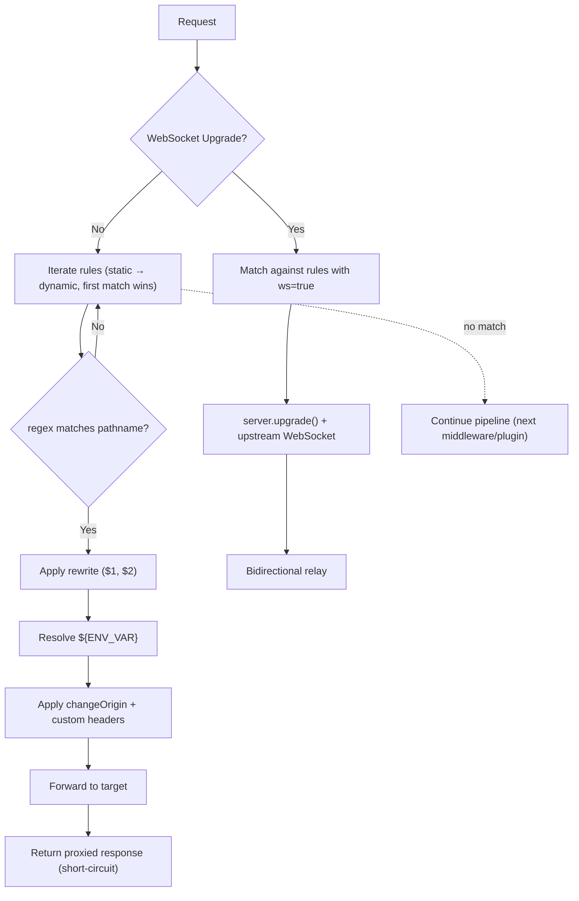
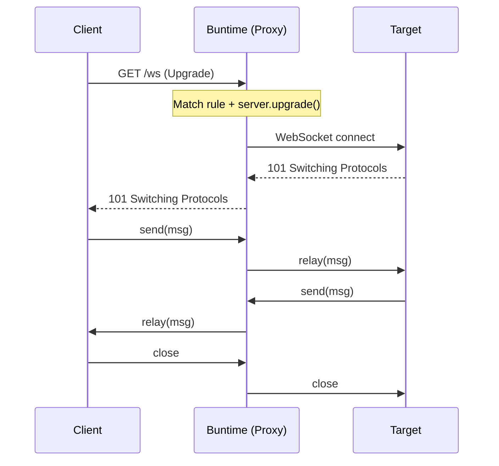

# @buntime/plugin-proxy

> Dynamic HTTP and WebSocket reverse proxy, with static rules in the manifest and dynamic rules persisted in LibSQL via `@buntime/plugin-keyval`. Default mount base: `/redirects`.

## Overview

`@buntime/plugin-proxy` intercepts requests in the `onRequest` hook and attempts to match the URL against an ordered set of proxy rules. On the first match, it rewrites the path, resolves `${ENV_VAR}` in the target, adjusts headers (`changeOrigin`, custom headers), and forwards the request — *short-circuiting* the rest of the pipeline. WebSocket upgrades go through the same matching but use `server.upgrade()` to establish the upstream connection and bidirectional message relay.

**Main features:**

- Pattern matching via JavaScript regex with capture groups (`$1`, `$2`, …)
- Path rewriting referencing capture groups
- Transparent WebSocket proxying (upgrade + relay)
- Dynamic rules via REST API, persisted in `plugin-keyval`
- Static rules in `manifest.yaml` (read-only at runtime)
- Per-rule custom headers
- `publicRoutes` per HTTP method (auth bypass integrated with `plugin-authn`)
- `changeOrigin` for rewriting `Host`/`Origin`
- `secure` to control TLS verification
- `${ENV_VAR}` substitution in targets

**API mode:** persistent — `onRequest` and Hono routes live in `plugin.ts` and run in the main thread (required for `server.upgrade()` in WebSocket).



## Configuration

### manifest.yaml

```yaml
name: "@buntime/plugin-proxy"
base: "/redirects"
enabled: true
injectBase: true

dependencies:
  - "@buntime/plugin-keyval"

entrypoint: dist/client/index.html
pluginEntry: dist/plugin.js

menus:
  - icon: lucide:network
    path: /redirects
    title: Redirects

rules: []          # static rules (optional)
```

### Configuration options

| Option  | Type          | Default | Description                                |
|---------|---------------|---------|--------------------------------------------|
| `rules` | `ProxyRule[]` | `[]`    | Static rules (read-only at runtime)        |

Everything else (base path, dependencies, menu) follows the standard plugin system schema — see [plugin-system](../apps/plugin-system.md) when that page exists.

## Rule model (ProxyRule)

| Field          | Type                          | Required | Default     | Description                                                        |
|----------------|-------------------------------|----------|-------------|--------------------------------------------------------------------|
| `id`           | `string`                      | auto     | generated   | Unique identifier. Static: `static-{index}`. Dynamic: `kv-…`      |
| `name`         | `string`                      | yes      | —           | Human-readable name                                                |
| `pattern`      | `string`                      | yes      | —           | JS regex tested against the request pathname                       |
| `target`       | `string`                      | yes      | —           | Destination URL (supports `${ENV_VAR}` and partial composition)    |
| `rewrite`      | `string`                      | no       | —           | Rewrite template with `$1`, `$2`. Omitted = forwards original pathname |
| `changeOrigin` | `boolean`                     | no       | `false`     | Rewrites `Host` and `Origin` to the target host                    |
| `secure`       | `boolean`                     | no       | `true`      | TLS certificate verification on the target                         |
| `ws`           | `boolean`                     | no       | `true`      | Enables WebSocket proxying for this rule                           |
| `headers`      | `Record<string, string>`      | no       | `{}`        | Extra headers added to the proxied request (overwrite same-name originals) |
| `publicRoutes` | `Record<string, string[]>`    | no       | `{}`        | Paths that bypass authentication, indexed by HTTP method           |

> The `manifest.yaml` also documents `base` (path to strip before forwarding) and `relativePaths` (convert absolute paths to relative in the response) as options supported by the loader. The concept pages cover only the eight fields above — use with care and validate via testing before production.

### Pattern matching

JS regex against the pathname (not the full URL). Capture groups are positional (`$1`, `$2`, …):

| Pattern                | Matches                                   | Use case                     |
|------------------------|-------------------------------------------|------------------------------|
| `^/api(/.*)?$`         | `/api`, `/api/users`, `/api/users/123`    | API gateway                  |
| `^/ws(/.*)?$`          | `/ws`, `/ws/chat`                         | WebSocket endpoint           |
| `^/v(\d+)/(.*)$`       | `/v1/users`, `/v2/data`                   | Versioned API (`$1`=version) |
| `^/(\w+)/api(/.*)?$`   | `/tenant1/api/data`                       | Multi-tenant routing         |
| `^/static/(.*)$`       | `/static/js/app.js`                       | Asset proxy                  |
| `^/(.*)$`              | everything                                | Catch-all                    |

**Evaluation order:** static first, dynamic after. Within each group, declaration order — *first match wins*. Place specific rules before catch-alls.

### Rewrite (capture groups)

| Pattern               | Rewrite       | `/api/users` →                  |
|-----------------------|---------------|---------------------------------|
| `^/api(/.*)?$`        | `/api$1`      | `/api/users` (preserves prefix) |
| `^/backend(/.*)?$`    | `$1`          | `/backend/users` → `/users`     |
| `^/api(/.*)?$`        | `/v2/api$1`   | `/api/users` → `/v2/api/users`  |
| `^/v(\d+)/api(/.*)?$` | `/version/$1$2` | `/v1/api/data` → `/version/1/data` |
| `^/api(/.*)?$`        | (omitted)     | original path forwarded as-is   |

Optional capture groups with an empty match resolve to an empty string: `^/api(/.*)?$` + `rewrite: "/v2$1"` → `/api` produces `/v2`, `/api/users` produces `/v2/users`.

### `${ENV_VAR}` substitution

Targets accept `${ENV_VAR}` resolved at request time. Supports partial composition:

```yaml
target: "${BACKEND_URL}"                       # entire variable
target: "https://${API_HOST}:${API_PORT}"      # composition
```

Missing variables keep the placeholder in the URL — this almost always results in a connection error. Make sure `.env`/deploy secrets are populated before loading rules that depend on them.

### `changeOrigin` and `secure`

- `changeOrigin: true` rewrites `Host` and `Origin` to the target host. Use when the target validates `Host`, does virtual hosting, or has strict CORS requirements on `Origin`.
- `secure: false` disables TLS verification — useful only in dev against self-signed certificates. Do not use in production.

### Custom headers

Added to the proxied request on top of the originals. Override on collision:

```yaml
headers:
  X-Forwarded-By: buntime
  Authorization: "Bearer ${API_TOKEN}"
```

## WebSocket proxying

Enabled by default (`ws: true`). When an upgrade arrives:

1. `onRequest` detects `Upgrade: websocket` and attempts to match against rules with `ws: true`.
2. On match, uses the `server` reference captured in `onServerStart` to call `server.upgrade()`, attaching `{ rule, url }` in `data`.
3. The `websocket.open` handler opens a `WebSocket` to the target and relays messages in both directions.
4. Closing either side closes the other; `onShutdown` tears down all active connections.



**Specific configuration:**

```yaml
rules:
  - name: "Realtime Chat"
    pattern: "^/ws/chat(/.*)?$"
    target: "ws://chat-service:8080"
    rewrite: "/chat$1"
    ws: true
    changeOrigin: true
```

Path rewrite and `changeOrigin` operate on the upgrade the same way as in HTTP. Custom headers are forwarded in the upgrade (not in individual messages). TLS terminates at the Buntime server — clients can use `wss://` even when the target is an internal `ws://`.

**Limitations:**

- No message transformation (pure relay)
- No load balancing (1 target per rule)
- No compression negotiation controlled by the plugin
- Requires main thread (does not run in workers)

## API Reference

All routes are under `/{base}/api/*` — default `/redirects/api/*`. Authentication follows the `plugin-authn` configuration; in deployments with auth enabled, send `Authorization: Bearer <token>` and (for `POST/PUT/DELETE`) `Origin` to pass the CSRF protection.

| Method   | Endpoint              | Description                                         |
|----------|-----------------------|-----------------------------------------------------|
| `GET`    | `/api/rules`          | List all rules (static + dynamic)                   |
| `POST`   | `/api/rules`          | Create dynamic rule (persists in KeyVal)            |
| `PUT`    | `/api/rules/:id`      | Update dynamic rule (static → 400 error)            |
| `DELETE` | `/api/rules/:id`      | Remove dynamic rule (static → 400 error)            |

### `GET /api/rules`

`200 OK` response with array of rules. Static rules appear with `readonly: true`, dynamic with `readonly: false`.

```json
[
  {
    "id": "static-0",
    "name": "API Gateway",
    "pattern": "^/api(/.*)?$",
    "target": "https://api.internal:3000",
    "rewrite": "/api$1",
    "changeOrigin": true,
    "secure": true,
    "ws": true,
    "headers": {},
    "publicRoutes": {},
    "readonly": true
  }
]
```

### `POST /api/rules`

Body is a `ProxyRule` without `id`. `200 OK` response returns the created rule with a generated `id` (`kv-…`). Body parameters follow the [Rule model](#rule-model-proxyrule) table.

```bash
curl -X POST http://localhost:8000/redirects/api/rules \
  -H "Content-Type: application/json" \
  -d '{
    "name": "Backend API",
    "pattern": "^/api(/.*)?$",
    "target": "https://api.example.com",
    "rewrite": "/api$1",
    "changeOrigin": true,
    "publicRoutes": {
      "GET": ["/api/health"],
      "POST": ["/api/webhook"]
    }
  }'
```

### `PUT /api/rules/:id`

Updates a dynamic rule — body with fields to change. Attempting to edit a static rule returns `400 Bad Request` with `{"error":"Cannot modify static rule"}`.

### `DELETE /api/rules/:id`

Removes a dynamic rule. Response `{"deleted": true, "id": "kv-..."}`. Static rules return `400` with `{"error":"Cannot delete static rule"}`.

### TypeScript types

```typescript
export interface ProxyConfig { rules?: ProxyRule[]; }

export interface ProxyRule {
  id?: string;
  name: string;
  pattern: string;
  target: string;
  rewrite?: string;
  changeOrigin?: boolean;
  secure?: boolean;
  ws?: boolean;
  headers?: Record<string, string>;
  publicRoutes?: Record<string, string[]>;
}

export interface ProxyRuleResponse extends ProxyRule {
  id: string;
  readonly: boolean;
}

export type ProxyRoutesType = typeof api;
```

## Public routes

`publicRoutes` declares, per rule, paths that should bypass authentication. The plugin exposes via the service registry the `isPublic(pathname, method)` method; `plugin-authn` consults it before requiring a token.

```json
{
  "publicRoutes": {
    "ALL":  ["/api/health"],
    "GET":  ["/api/config/**"],
    "POST": ["/api/webhook"]
  }
}
```

| Key      | Meaning                              |
|----------|--------------------------------------|
| `ALL`    | Matches any HTTP method              |
| `GET`    | Matches GET only                     |
| `POST`   | Matches POST only                    |
| `PUT`    | Matches PUT only                     |
| `DELETE` | Matches DELETE only                  |

Paths support glob: `*` (one segment) and `**` (multiple segments). Example flow:

```
GET /api/health
  → proxy matches against the rule
  → authn calls proxy.isPublic("/api/health", "GET")
  → publicRoutes.ALL contains "/api/health" → true
  → authn skips authentication and proxy executes the forward
```

Use sparingly — each entry in `publicRoutes` expands the attack surface.

## Service Registry

Via `provides()`, the plugin exposes:

```typescript
{
  isPublic: (pathname: string, method: string) => boolean
}
```

Consumed by `plugin-authn`:

```typescript
const proxy = ctx.getPlugin("@buntime/plugin-proxy");
if (proxy?.isPublic(request.pathname, request.method)) {
  return next();   // auth bypass
}
```

## Lifecycle hooks

| Hook            | Role                                                                  |
|-----------------|-----------------------------------------------------------------------|
| `onInit`        | Gets KeyVal service, loads dynamic rules and merges with static ones  |
| `onServerStart` | Captures Bun server reference (required for `server.upgrade`)         |
| `onRequest`     | Matches request against rules; on match, forwards and short-circuits  |
| `onShutdown`    | Closes WebSocket connections and cleans up                            |
| `websocket`     | `open`/`message`/`close` handlers for bidirectional relay             |

## Dependencies

| Plugin                   | Required | Role                                                   |
|--------------------------|----------|--------------------------------------------------------|
| `@buntime/plugin-keyval` | Yes      | Dynamic rule persistence (LibSQL via KeyVal)           |

Without `plugin-keyval`, only static rules work — API CRUD operations fail. The canonical KeyVal documentation (schema, backends, API) lives on its own wiki page — see [plugin-keyval](./plugin-keyval.md) when consolidated.

Static vs dynamic:

| Aspect          | Static (manifest)           | Dynamic (API)                        |
|-----------------|-----------------------------|--------------------------------------|
| Defined in      | `manifest.yaml`             | REST API                             |
| Persistence     | Always available            | KeyVal (requires `plugin-keyval`)    |
| Modifiable?     | No                          | Yes (CRUD)                           |
| Match order     | First                       | After static rules                   |
| `readonly`      | `true`                      | `false`                              |
| Use case        | Core routing, infra         | Ad-hoc services, A/B, hot reload     |

## File structure

```
plugins/plugin-proxy/
├── manifest.yaml            # Configuration + static rules
├── plugin.ts                # Hooks (onRequest, websocket, provides)
├── index.ts                 # Worker entrypoint (UI SPA)
├── server/
│   ├── api.ts              # Hono routes (CRUD)
│   └── services.ts         # Matching logic and rule management
├── client/                  # React SPA + TanStack Router
│   └── hooks/
│       └── use-proxy-rules.ts
└── dist/                    # Build output
```

## Guides

### Microservices (static rules)

```yaml
name: "@buntime/plugin-proxy"
enabled: true
rules:
  - name: "Auth Service"
    pattern: "^/auth(/.*)?$"
    target: "${AUTH_URL}"
    rewrite: "$1"
    changeOrigin: true
    publicRoutes:
      POST: ["/auth/login", "/auth/register"]

  - name: "Users Service"
    pattern: "^/users(/.*)?$"
    target: "${USERS_URL}"
    rewrite: "$1"
    changeOrigin: true

  - name: "Payments Service"
    pattern: "^/payments(/.*)?$"
    target: "${PAYMENTS_URL}"
    rewrite: "$1"
    changeOrigin: true
    publicRoutes:
      POST: ["/payments/webhook"]
```

### HTTP + WebSocket combined

```yaml
rules:
  - name: "API"
    pattern: "^/api(/.*)?$"
    target: "https://backend:3000"
    rewrite: "/api$1"
    changeOrigin: true
    ws: false                # HTTP only
  - name: "Realtime"
    pattern: "^/ws(/.*)?$"
    target: "ws://realtime:8080"
    rewrite: "$1"
    ws: true
```

### Legacy → new API migration

Place the new rule before the legacy one (first match wins):

```yaml
rules:
  - name: "New API"
    pattern: "^/v2/api(/.*)?$"
    target: "https://new-api:3000"
    rewrite: "$1"
    changeOrigin: true
  - name: "Legacy API"
    pattern: "^/api(/.*)?$"
    target: "https://legacy-api:3000"
    rewrite: "/api$1"
    changeOrigin: true
    headers: { X-Legacy: "true" }
```

### Multi-service setup via REST (K8s/Rancher deploy)

Provision dynamic rules after the pod is ready — useful when the set of services changes without rebuilding the image. In deployments with auth enabled, always send `Authorization` and `Origin` (CSRF):

```bash
TOKEN="your-jwt-token"
BASE_URL="https://buntime.home"
HDRS=(-H "Content-Type: application/json" -H "Authorization: Bearer $TOKEN" -H "Origin: $BASE_URL")

curl -X POST $BASE_URL/redirects/api/rules "${HDRS[@]}" -d '{
  "name": "Front Manager API",
  "pattern": "^/api(/.*)?$",
  "target": "https://backend.example.com",
  "rewrite": "/api$1",
  "changeOrigin": true,
  "publicRoutes": { "GET": ["/api/config/**"] }
}'

curl -X POST $BASE_URL/redirects/api/rules "${HDRS[@]}" -d '{
  "name": "Edge Runtime",
  "pattern": "^/a(/.*)?$",
  "target": "https://edge.example.com",
  "rewrite": "/a$1",
  "changeOrigin": true,
  "publicRoutes": { "GET": ["/a/translate-api/**"] }
}'

curl -s $BASE_URL/redirects/api/rules -H "Authorization: Bearer $TOKEN" \
  | jq '.[] | {name, pattern}'
```

For a reusable TypeScript CRUD SDK, see `plugins/plugin-proxy/docs/api-reference.md` (section "Client SDK Example").

### Quick validation

```bash
# List and filter
curl -s http://localhost:8000/redirects/api/rules | jq '.[] | {name, pattern, target}'

# Check ${ENV_VAR} resolution
curl -s http://localhost:8000/redirects/api/rules | jq '.[].target'

# Test HTTP match
curl -v http://localhost:8000/api/users

# Test WebSocket
wscat -c ws://localhost:8000/ws/chat
```

## Troubleshooting

| Symptom                                    | Investigation                                                                                  |
|--------------------------------------------|-----------------------------------------------------------------------------------------------|
| Rule does not match request                | Validate regex against the pathname; check order (static → dynamic, more specific first); confirm `enabled: true` in manifest |
| Connection to target fails                 | `curl <target>` directly; check resolved `${ENV_VAR}` (`curl /redirects/api/rules \| jq '.[].target'`); for dev HTTPS self-signed use `secure: false` |
| Dynamic rules disappear after restart      | Confirm `plugin-keyval` is active with a persistent backend; check proxy plugin logs          |
| `400 Cannot modify/delete static rule`     | The rule is from `manifest.yaml` — edit the manifest and redeploy                             |
| WebSocket does not upgrade                 | `ws: true` on the rule; pattern matches the upgrade path; deploy must be on the main thread (not a worker) |
| Auth blocks a route that should be public  | Add path to `publicRoutes` under the correct method; remember that glob `**` is multi-segment and `*` is a single segment |
| `POST/PUT/DELETE` rejected in deploy with authn | Send `Authorization: Bearer <token>` and `Origin: <base-url>` (CSRF protection from `plugin-authn`) |
| `${ENV_VAR}` appears literally in target   | Variable not set in the pod environment; populate via Helm values / `.env` before loading the rule |

### Logs in K8s deploy

```bash
kubectl -n zomme logs -f $POD | grep -i proxy
```

## Security considerations

- Proxy only to trusted targets — a catch-all rule (`^/(.*)$`) with an external target is an SSRF vector.
- Minimize `publicRoutes`. Each glob expands the attack surface.
- For internal services, prefer cluster-internal DNS (do not expose external hosts unnecessarily).
- `changeOrigin: true` changes `Host` — some targets check `Host` as a tenancy/security mechanism; align with the target team.
- `secure: false` in dev only. In production, generate valid certificates (cert-manager) or use service mesh mTLS.

## Cross-references

- Original source of the operational guide: `apps/runtime/docs/guides/proxy-rules.md`
- Plugin README: `plugins/plugin-proxy/README.md`
- Concept docs: `plugins/plugin-proxy/docs/concepts/`
- Persistence: see `@buntime/plugin-keyval` (dedicated page)
- Auth bypass: see `@buntime/plugin-authn` (dedicated page — consumes `isPublic`)
