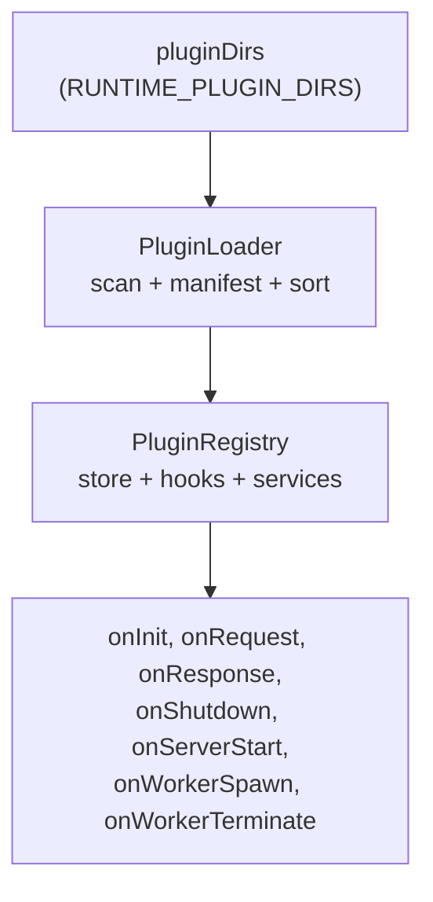

# Plugin System

Modular extensibility mechanism for the runtime. Plugins are isolated units
that can intercept requests, register routes, provide services to other
plugins, and expose UI in the shell. The system supports hot reload,
declarative dependencies, and two execution modes (persistent vs serverless).

For the request pipeline that involves plugins, see
[@buntime/runtime](./runtime.md). For the pool that runs serverless plugins,
see [Worker Pool](./worker-pool.md).

## Architecture



| Component | Role |
|-----------|------|
| `PluginLoader` | Auto-discovery in `pluginDirs`, `manifest.yaml` parsing, topological sort, lazy import |
| `PluginRegistry` | Stores plugins, runs hooks, manages service registry, resolves routes |
| Service Registry | Shares instances between plugins (e.g. DB pool) |

### Plugin Structure

```
plugins/plugin-example/
├── manifest.yaml      # Metadata + config
├── plugin.ts          # Middleware (persistent mode, main process)
├── index.ts           # Worker entrypoint (serverless mode, worker pool)
├── server/api.ts      # Shared API code
├── client/            # SPA (React/Solid/Vue/etc.)
└── dist/              # Build output
    ├── plugin.js
    ├── index.js
    └── client/index.html
```

## API Modes — Persistent vs Serverless

A central decision. **Choose one — do not duplicate API between `plugin.ts` and
`index.ts`.**

| Mode | When to use | `plugin.ts` has `routes`? | `index.ts` has `routes`? | `entrypoint` |
|------|-------------|---------------------------|--------------------------|--------------|
| **Persistent** | DB connections, WebSocket/SSE, in-memory cache, cron, shared state | Yes | No (SPA only) | `dist/client/index.html` |
| **Serverless** | Stateless CRUD, file ops, isolation, horizontal scaling | No | Yes | `dist/index.js` |

### Persistent

```typescript
// plugin.ts — runs in the main process (persistent)
export default function databasePlugin(config): PluginImpl {
  return {
    routes: api,  // API here
    onInit(ctx) {
      db = new DatabasePool(config.url);  // persistent connection
    },
  };
}

// index.ts — SPA only
export default { fetch: createStaticHandler(clientDir) };
```

Current persistent plugins: `database`, `gateway`, `authn`, `keyval`, `logs`,
`metrics`, `proxy`.

### Serverless

```typescript
// plugin.ts — no routes
export default (config): PluginImpl => ({
  onInit(ctx) { /* optional */ },
});

// index.ts — API in the worker pool
export default {
  routes: { "/api/*": api.fetch },
  fetch: createStaticHandler(clientDir),
};
```

Current serverless plugins: `deployments`.

### Entrypoint Modes

| Extension | Mode | Behavior |
|-----------|------|----------|
| `.html` | SPA | `serveStatic` only; `index.ts` is **NOT** executed |
| `.js` / `.ts` | Service | Imports the module; expects `export default { fetch?, routes? }` |

> [!WARNING]
> Common mistake: API in `index.ts` but `entrypoint` pointing to `.html`. The
> API is silently ignored — the wrapper only serves static files.

## Manifest Schema

```yaml
name: "@buntime/plugin-example"  # Unique identifier
base: "/example"                 # /[a-zA-Z0-9_-]+; optional for hook-only plugins
enabled: true                    # default: true

# Worker / plugin entrypoints
entrypoint: dist/index.js        # service mode (or .html for SPA)
pluginEntry: dist/plugin.js      # middleware in the main process

# Dependencies (topological sort)
dependencies:
  - "@buntime/plugin-database"   # required — fails if absent
optionalDependencies:
  - "@buntime/plugin-authn"      # ignored if absent

# Auth bypass via onRequest
publicRoutes:
  ALL: ["/health"]
  GET: ["/api/public/**"]
  POST: ["/api/webhook"]

# Shell menus (cpanel)
menus:
  - icon: lucide:box
    path: /example
    title: Example

# Env vars for workers
env:
  MY_VAR: "value"

# Config for Helm/Rancher UI
config:
  apiKey:
    type: password
    label: API Key
    env: EXAMPLE_API_KEY        # maps to ConfigMap
  endpoint:
    type: string
    default: "https://api.example.com"
    env: EXAMPLE_ENDPOINT
```

### Key Fields

| Field | Type | Description |
|-------|------|-------------|
| `name` | string | Unique identifier, format `@scope/plugin-name` |
| `base` | string | Base path for plugin `routes` |
| `enabled` | boolean | `false` to skip on load |
| `entrypoint` | string | Worker entrypoint (HTML for SPA, JS for service) |
| `pluginEntry` | string | Main process middleware |
| `dependencies` | string[] | Required plugins (error if absent) |
| `optionalDependencies` | string[] | Optional plugins (ignored if absent) |
| `publicRoutes` | array \| object | Bypass `onRequest` hooks |
| `menus` | MenuItem[] | Menu items for the shell |
| `injectBase` | boolean | Controls `<base href>` injection |
| `visibility` | enum | `public` \| `protected` \| `internal` |
| `env` | record | Vars for plugin workers |
| `config` | object | Config schema for Helm generation |

`entrypoint` vs `pluginEntry`:

| Field | Purpose |
|-------|---------|
| `entrypoint` | App entrypoint (static HTML or JS server) |
| `pluginEntry` | Middleware/hooks/routes that run in the main process |

### Auto-Discovery

`PluginLoader` scans `pluginDirs` (PATH style, `:`-separated). Supported
structures:

```
1. Direct:      {pluginDir}/plugin.ts + manifest.yaml
2. Subdirectory:{pluginDir}/{name}/plugin.ts + manifest.yaml
3. Scoped:      {pluginDir}/@scope/{name}/plugin.ts + manifest.yaml
```

Entry file priority: `manifest.pluginEntry` → `plugin.{ts,js}` →
`index.{ts,js}`.

Default for `RUNTIME_PLUGIN_DIRS`: `/data/.plugins:/data/plugins` (built-in
first, external second).

## Topological Sort — Kahn's Algorithm

Plugins are sorted by dependencies before loading. The runtime uses Kahn's
algorithm (1962), O(V + E) complexity:

1. Compute in-degree (number of dependencies) for each plugin.
2. Enqueue plugins with in-degree zero.
3. For each processed plugin, decrement in-degree of its dependents; if it
   reaches zero, enqueue it.
4. Remaining unprocessed plugins → cycle detected, hard error.

Advantages over DFS: iterative (no stack overflow), natural cycle detection at
the end, trivial parallelization (plugins in the queue are independent).
Example: with `keyval` and `authn` both depending on `database`, the resulting
order is always `database → keyval → authn`, regardless of filesystem order.

## Lifecycle Hooks

```typescript
interface PluginImpl {
  routes?: Hono;
  middleware?: MiddlewareHandler;
  server?: { routes?, fetch? };
  websocket?: { open?, message?, close? };

  onInit?(ctx: PluginContext): void | Promise<void>;
  onShutdown?(): void | Promise<void>;
  onServerStart?(server): void;
  onRequest?(req, app?): Request | Response | undefined;
  onResponse?(res, app): Response;
  onWorkerSpawn?(worker, app): void;
  onWorkerTerminate?(worker, app): void;
}
```

| Hook | When | Return | Notes |
|------|------|--------|-------|
| `onInit(ctx)` | On plugin load | `void`/`Promise<void>` | **30s timeout** — hard failure if exceeded |
| `onShutdown()` | On SIGINT | `void`/`Promise<void>` | Reverse order (LIFO) |
| `onServerStart(server)` | After `Bun.serve()` | `void` | Access to instance for WS upgrade |
| `onRequest(req, app?)` | Before each handler | `Request` (modified) \| `Response` (short-circuit) \| `undefined` | Topological order |
| `onResponse(res, app)` | After response generation | `Response` | Topological order |
| `onWorkerSpawn(worker, app)` | Worker created | `void` | — |
| `onWorkerTerminate(worker, app)` | Worker terminated | `void` | — |

### `onInit` — Context

```typescript
interface PluginContext {
  config: Record<string, unknown>;     // From manifest.yaml
  globalConfig: { workerDirs, poolSize };
  logger: PluginLogger;                // Scoped logger
  pool?: WorkerPool;
  registerService<T>(name, service): void;
  getService<T>(name): T | undefined;
}
```

Config reading pattern:

```typescript
// ✅ Bun.env (ConfigMap/Helm) with fallback to pluginConfig (manifest)
const apiKey = Bun.env.MY_API_KEY ?? pluginConfig.apiKey ?? "default";
```

> [!WARNING]
> Never write to `Bun.env`. Workers are isolated — they would not see changes
> even if they persisted.

### `onRequest` — Short-circuit

```typescript
onRequest(req, app) {
  if (rateLimitExceeded) {
    return new Response("Too Many Requests", { status: 429 });  // short-circuit
  }
  return undefined;  // continue pipeline
}
```

Return values:

| Return | Behavior |
|--------|----------|
| `undefined` | Continue with the original request |
| `Request` | Continue with the modified request |
| `Response` | Short-circuit — runtime returns immediately |

Plugin order: topological order. Example: `Metrics → Proxy → AuthN →
Gateway → Worker`.

## Service Registry

Inter-plugin sharing. Provider:

```typescript
onInit(ctx) {
  const service = new DatabaseService(config);
  ctx.registerService("database", service);
}
```

Consumer (must declare dependency in manifest):

```typescript
onInit(ctx) {
  const db = ctx.getService<DatabaseService>("database");
  if (!db) throw new Error("Requires @buntime/plugin-database");
}
```

Rules:

- Names must be unique. Overwriting generates a warning.
- Available **after** the provider's `onInit` — declare `dependencies` to
  ensure order.

## Configuration Flow

| Source | Destination | Path |
|--------|-------------|------|
| Built-in plugin | `Bun.env` | `manifest.config` → `generate-helm-*` → `values.yaml` + `configmap.yaml` → k8s ConfigMap → `Bun.env` |
| Uploaded plugin | `pluginConfig` | `manifest.yaml` → `loader.rescan()` → injected via `PluginContext.config` |
| Worker (any mode) | Worker's `Bun.env` | `manifest.env` → `loadWorkerConfig()` → `instance.ts` injects on spawn |

Plugin always reads `Bun.env.X ?? pluginConfig.x ?? "default"`.

## Full Lifecycle

```
1. DISCOVERY    scan + manifest (lazy import)
2. SORT         filter disabled → topologicalSort → validate deps
3. LOAD         import(path) → resolvePluginImpl → validate base → merge → onInit (30s) → register
4. ROUTES       detect collisions, mounted paths
5. SERVER START Bun.serve → runOnServerStart
6. REQUESTS     runOnRequest → server.fetch → routes → plugin app → workers → runOnResponse
7. SHUTDOWN     runOnShutdown (LIFO) → pool.shutdown → flush
```

## Hot Reload

```bash
# Upload tarball
POST /api/plugins/upload

# Re-scan and reload all
POST /api/plugins/reload
```

`reload` clears the registry, re-scans directories, sorts topologically,
and re-runs `onInit`.

## Public Routes

Bypass `onRequest` hooks (auth). Two formats:

```yaml
# Array — all methods
publicRoutes:
  - "/health"
  - "/api/public/**"

# Object — per method
publicRoutes:
  ALL: ["/health"]
  GET: ["/api/users/**"]
  POST: ["/api/webhook"]
```

Wildcards: `*` (single segment), `**` (multi-segment).

| Type | Path |
|------|------|
| Plugin public routes | Absolute in the manifest |
| Worker public routes | Relative, converted to absolute by the runtime (`/api/health` → `/todos-kv/api/health`) |

## Security

| Layer | Protection |
|-------|-----------|
| Reserved paths | `/api`, `/health`, `/.well-known` blocked for external plugins |
| Base path | Regex `/[a-zA-Z0-9_-]+` |
| CSRF | `Origin` required on POST/PUT/PATCH/DELETE to `/api/*` |
| Sensitive env vars | Patterns blocked before the worker (see [Worker Pool](./worker-pool.md)) |
| Auto-install | `--frozen-lockfile --ignore-scripts` (no postinstall) |
| Path traversal | Entrypoint validated within `APP_DIR` |

## Plugin with UI

Plugins with an HTML `entrypoint` are automatically exposed as
micro-frontends in the shell via `<z-frame>`. Minimal manifest:

```yaml
name: "@buntime/plugin-keyval"
base: "/keyval"
entrypoint: dist/client/index.html
pluginEntry: dist/plugin.js
menus:
  - { title: KeyVal, icon: lucide:database, path: /keyval }
```

Details in [Micro-Frontend Architecture](./micro-frontend.md).

## Middleware vs `onRequest`

Hono middleware is a native alternative to `onRequest`. Differences:

| Aspect | `middleware` | `onRequest` |
|--------|-------------|-------------|
| Context | Hono `Context` | `Request` + `AppInfo` |
| Continuation | `await next()` | return `undefined` or modified |
| Position | Inside the Hono app | Before the Hono app |

## Best Practices

- **Single mode** — do not duplicate API between `plugin.ts` and `index.ts`.
- **`Bun.env.X ?? config.x`** — read with fallback, never write.
- **`:` for multi-values** — PATH style, never commas.
- **Declare dependencies** — required in `dependencies`, optional in
  `optionalDependencies`.
- **Fast init** — 30s timeout in `onInit`. Lazy-load expensive connections.
- **Graceful `onShutdown`** — flush caches, close DB, clear timers.
- **Lightweight hooks** — `onRequest`/`onResponse` run per request.

## Available Plugins

Individual details on their dedicated pages:

| Plugin | Description | Mode |
|--------|-------------|------|
| `@buntime/plugin-authn` | Auth (Keycloak/OIDC/JWT, email-password, API keys) | Persistent |
| `@buntime/plugin-authz` | XACML (PEP/PDP/PAP) | Persistent |
| `@buntime/plugin-database` | libsql/sqlite/postgres/mysql adapters | Persistent |
| `@buntime/plugin-deployments` | Upload, download, file ops | Serverless |
| `@buntime/plugin-gateway` | Rate limiting, CORS, shell routing, monitoring | Persistent |
| `@buntime/plugin-keyval` | KV store, FTS, queues | Persistent |
| `@buntime/plugin-logs` | In-memory logs + SSE | Persistent |
| `@buntime/plugin-metrics` | Prometheus + SSE | Persistent |
| `@buntime/plugin-proxy` | Reverse proxy with dynamic rules | Persistent |
| `@buntime/plugin-vhosts` | Virtual hosts for custom domains | Persistent |

## Related Documentation

- [@buntime/runtime](./runtime.md) — request pipeline, resolution order.
- [Worker Pool](./worker-pool.md) — serverless plugin execution.
- [Micro-Frontend Architecture](./micro-frontend.md) — iframe UIs via z-frame.
- [Runtime API Reference](./runtime-api-reference.md) — `/api/plugins/*` endpoints.
