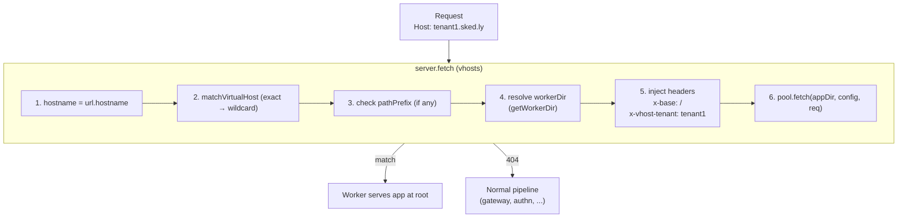
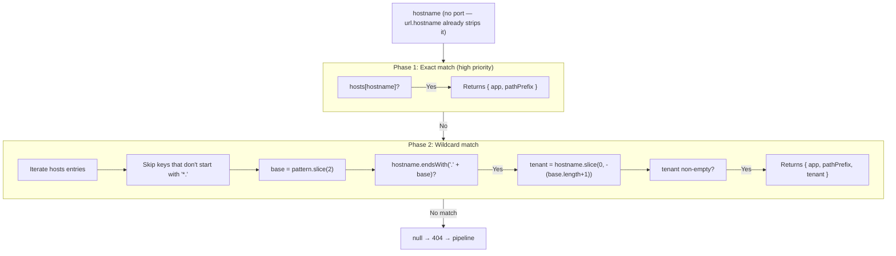

# @buntime/plugin-vhosts

> Maps hostnames to apps. Supports exact match and wildcard (`*.example.com`). `base: ""` (does not mount under a path) and runs in the `server.fetch` hook — before the plugin pipeline. Disabled by default.

## Overview

`@buntime/plugin-vhosts` resolves which worker app handles a request based on the `Host` header. Instead of serving the app at the default `/{app}/` path, it injects `x-base: /` so that the worker and the runtime's `wrapper.ts` serve the app at the root (`/`). For wildcards (`*.example.com`), the captured subdomain is forwarded to the worker via the `x-vhost-tenant` header, enabling multi-tenant isolation without per-tenant DNS changes.

Unlike most plugins (which use `onRequest`), vhosts operates in the `server.fetch` hook — the lowest level of the Bun server, before any pipeline middleware. When a match is found, the request is forwarded directly to the [worker pool](./worker-pool.md) and the response returns without passing through `plugin-gateway`, `plugin-authn`, or `plugin-proxy`.



Because `server.fetch` returns `404` when there is no match, the Buntime runtime treats this as a signal to continue with the normal pipeline — apps matched by vhost **bypass** all plugin middleware. See [./plugin-system.md](./plugin-system.md) for the complete hook cycle.

## Status and operation mode

| Aspect | Value |
|---|---|
| `enabled` (default) | `false` |
| `base` (mount path) | `""` (does not mount under a path — the plugin exposes no HTTP routes) |
| `pluginEntry` | `dist/plugin.js` |
| Primary hook | `server.fetch` (intercepts before the pipeline) |
| Secondary hook | `onInit` (resolves `pool`, `getWorkerDir`, `loadWorkerConfig`) |
| REST API | None — no routes, no UI, no client |
| Runtime configuration | Via `manifest.yaml` only (no hot-reload of hosts) |
| Access to `ctx` | Limited: `ctx.pool`, `ctx.globalConfig.workerDirs`, `ctx.logger` |

> [!IMPORTANT]
> Because `server.fetch` runs **before** the pipeline, requests matched by vhost **do not pass through** authentication, rate limiting, CORS, or any other plugin hook. The worker is responsible for these concerns. See [Pipeline bypass](#pipeline-bypass-implications).

## Configuration

All configuration lives in `plugins/plugin-vhosts/manifest.yaml`. There are no env overrides, no runtime API, and no LibSQL persistence.

```yaml
name: "@buntime/plugin-vhosts"
base: ""
enabled: true
pluginEntry: dist/plugin.js

hosts:
  "sked.ly":
    app: "skedly@latest"
  "*.sked.ly":
    app: "skedly@latest"
  "dashboard.example.com":
    app: "admin-panel"
    pathPrefix: "/admin"
```

### Schema `VHostsPluginConfig.hosts[hostname]`

| Field | Type | Required | Description |
|---|---|---|---|
| `app` | `string` | Yes | App resolved by `getWorkerDir` (e.g. `"skedly@latest"`, `"admin-panel"`). Must be installed in one of the global `workerDirs`. |
| `pathPrefix` | `string` | No | If present, the vhost only handles paths starting with this prefix. Otherwise the request returns 404 from `server.fetch` and falls through to the pipeline. |

The map key is the **hostname pattern** — exact (`sked.ly`) or wildcard (`*.sked.ly`).

### Injected headers

| Header | When | Description |
|---|---|---|
| `x-base` | Always on match | Always `/`. Read by the runtime's `wrapper.ts` for `<base href>` and asset resolution. |
| `x-vhost-tenant` | Wildcard match only | Extracted subdomain (the portion that matched `*`). Not set on exact matches. |

## Hostname matching

Implemented in `plugins/plugin-vhosts/server/matcher.ts` (function `matchVirtualHost`). Two-phase algorithm:



### Priority

Exact match always wins. When `sked.ly`, `*.sked.ly`, and `admin.sked.ly` are all configured:

| Request | Matched rule | `x-vhost-tenant` |
|---|---|---|
| `sked.ly` | `"sked.ly"` (exact) | (not set) |
| `admin.sked.ly` | `"admin.sked.ly"` (exact) | (not set) |
| `tenant1.sked.ly` | `"*.sked.ly"` (wildcard) | `tenant1` |
| `acme.sked.ly` | `"*.sked.ly"` (wildcard) | `acme` |
| `unknown.example.com` | (no match) | — (404 → pipeline) |

### Tenant capture

For wildcard `*.base.com` matching `sub.base.com`, `tenant` receives the portion preceding `.base.com`:

```
hostname = "tenant1.sked.ly"
pattern  = "*.sked.ly"
base     = "sked.ly"
tenant   = "tenant1"   → x-vhost-tenant: tenant1
```

> [!NOTE]
> The current implementation uses `hostname.endsWith('.' + base)`, so **multi-level subdomains also match** (e.g. `a.b.sked.ly` → tenant `a.b`). Historical plugin documentation states "single level only", but the code does not enforce that limit. Treat this as current behavior; validate `x-vhost-tenant` in the worker before using it.

### Path prefix filtering

When `pathPrefix` is configured, `url.pathname.startsWith(pathPrefix)` is required after the hostname match. Otherwise the request returns 404 and falls through to the pipeline.

| `pathPrefix` | Request | Matches? |
|---|---|---|
| `/admin` | `dashboard.example.com/admin` | Yes |
| `/admin` | `dashboard.example.com/admin/users` | Yes |
| `/admin` | `dashboard.example.com/` | No (404 → pipeline) |
| `/admin` | `dashboard.example.com/other` | No (404 → pipeline) |

### Edge cases

- **Port**: `url.hostname` already removes the port — `sked.ly:8000` matches `sked.ly`.
- **Localhost**: keys like `myapp.localhost` work (add to `/etc/hosts`).
- **IP**: IP keys work (`192.168.1.100`), but this is an atypical use.
- **Duplicate keys**: YAML does not support them — the second key overwrites the first. For path-routing on the same hostname, use [./plugin-proxy.md](./plugin-proxy.md).

## API Reference

The plugin **exposes no HTTP routes**. The public interface is the `server.fetch` hook applied by the runtime.

### Internal `server.fetch` sequence

| Step | Action | Failure |
|---|---|---|
| 1 | `hostname = new URL(req.url).hostname` | — |
| 2 | `matchVirtualHost(hostname, hosts)` | returns `null` → 404 (falls through to pipeline) |
| 3 | If `match.pathPrefix` and path does not start with it | 404 (falls through to pipeline) |
| 4 | `appDir = getWorkerDir(match.app)` | `appDir` falsy → 502 `text/plain` `Virtual host app not found: <app>` |
| 5 | `workerConfig = await loadWorkerConfig(appDir)` | propagates load error |
| 6 | Clone request: `headers.set('x-base', '/')` and (if wildcard) `headers.set('x-vhost-tenant', tenant)` | — |
| 7 | `return pool.fetch(appDir, workerConfig, workerReq)` | response returns directly, bypassing the pipeline |

### Exported types

```typescript
export interface VHostsPluginConfig {
  hosts: Record<string, VHostConfig>;
}

export interface VHostConfig {
  app: string;
  pathPrefix?: string;
}

export interface VHostMatch {
  app: string;
  pathPrefix?: string;
  tenant?: string;
}
```

### Lifecycle hooks used

| Hook | Responsibility |
|---|---|
| `onInit` | Receives `ctx.pool`, dynamically imports `apps/runtime/src/utils/get-worker-dir` (creates `getWorkerDir(workerName)`) and `apps/runtime/src/libs/pool/config` (`loadWorkerConfig`). Logs `Virtual hosts configured: <keys>`. |
| `server.fetch` | Routing as described above. |

> [!NOTE]
> The plugin imports runtime internals via string literals to escape TS import tracking — possible because it is a built-in plugin. External plugins should not replicate this pattern.

### Reading the tenant in the worker (Hono)

```typescript
app.get("/api/data", async (c) => {
  const tenant = c.req.header("x-vhost-tenant");
  if (!tenant) return c.json({ error: "no tenant" }, 400);
  const rows = await db.query("SELECT * FROM data WHERE tenant = ?", [tenant]);
  return c.json(rows);
});
```

## Multi-tenant setup

Minimal steps for a SaaS with tenant subdomains:

| Step | Action |
|---|---|
| 1. DNS | A record for `sked.ly` + wildcard A `*.sked.ly` pointing to the same IP/load balancer. |
| 2. TLS | Wildcard certificate covering `sked.ly` and `*.sked.ly` (Let's Encrypt via DNS-01, cert-manager on K8s, or Traefik with `HostRegexp`). |
| 3. Buntime manifest | `enabled: true` + entries for `"sked.ly"` (landing) and `"*.sked.ly"` (tenant subdomains). |
| 4. Worker | Middleware reads `x-vhost-tenant`, validates against DB, scopes queries by `tenant_id`. |
| 5. Provisioning | Only insert a row in `tenants` — wildcard DNS and wildcard cert cover new subdomains without a deploy. |

### Multi-tenant manifest example

```yaml
name: "@buntime/plugin-vhosts"
enabled: true
hosts:
  "sked.ly":
    app: "skedly@latest"
  "*.sked.ly":
    app: "skedly@latest"
```

### Cert-manager (K8s) — wildcard

```yaml
apiVersion: cert-manager.io/v1
kind: Certificate
metadata:
  name: sked-ly-tls
spec:
  secretName: sked-ly-tls-secret
  issuerRef:
    name: letsencrypt-prod
    kind: ClusterIssuer
  dnsNames:
    - sked.ly
    - "*.sked.ly"
```

### Custom domains per tenant

For tenants with their own domain (`scheduling.acme.com`), add an **exact** entry pointing to the same app. The worker maps `host` → tenant via a `custom_domains` lookup:

```yaml
hosts:
  "*.sked.ly":
    app: "skedly@latest"
  "scheduling.acme.com":
    app: "skedly@latest"
```

Each custom domain requires its own cert and DNS — outside the scope of this plugin.

### Pipeline bypass (implications)

| Aspect | On a vhost-matched request |
|---|---|
| `plugin-gateway` (rate limit, CORS, shell) | **Bypassed** |
| `plugin-authn` (authentication) | **Bypassed** |
| `plugin-proxy` (rewrites, WS) | **Bypassed** |
| `onRequest` of any plugin | **Does not run** |
| `<base href>` | Forced to `/` (not `/{app}/`) |

By design, vhosts is for white-label/custom-domain scenarios where the worker takes full responsibility for auth, rate limiting, and CORS. If you need these concerns at the runtime level, serve the app via its default path without vhost.

## Integration with the worker pool

`server.fetch` calls `pool.fetch(appDir, workerConfig, workerReq)` directly — without going through the runtime's standard router. This means:

- The **same pool** handles both vhosted and non-vhosted requests (no separate instance).
- The `appDir` resolved by `getWorkerDir(match.app)` must be in `globalConfig.workerDirs`. If it is not, the plugin returns 502 with a text payload.
- `loadWorkerConfig(appDir)` is called **on every request** — no cache in the plugin. If this becomes a bottleneck, caching should live in `loadWorkerConfig` (runtime layer).
- The forwarded request is a clone (`new Request(req.url, req)`) with extra headers — the original body is preserved.

Pool details, worker lifecycle, and isolation are covered in [./worker-pool.md](./worker-pool.md).

## Troubleshooting

| Symptom | Likely cause | Resolution |
|---|---|---|
| Request falls through to normal pipeline despite `Host: foo.com` being configured | Plugin disabled (`enabled: false`) or hostname does not match exactly | Confirm `enabled: true` and check case-sensitivity of the `Host` header |
| 502 `Virtual host app not found: <app>` | `getWorkerDir(match.app)` returned falsy | Confirm the app is installed in global `workerDirs` and the name (with `@version`) matches |
| `x-vhost-tenant` absent on wildcard request | Hostname matched an **exact** entry with higher priority | Check whether an exact entry is overriding the wildcard |
| Captured tenant is `a.b` instead of `a` | Hostname is multi-level (e.g. `a.b.sked.ly`) — matcher accepts it | Add an exact entry for `b.sked.ly` if different handling is needed |
| Auth is not running for the vhosted domain | Expected behavior: pipeline bypass | Move auth into the worker (Hono middleware etc.) |
| Changes to `hosts` in manifest have no effect | Hosts are read in `onInit` | Restart Buntime (no hot-reload for vhost configuration) |
| Path returns 404 even with the correct hostname | `pathPrefix` configured and path does not start with it | Adjust `pathPrefix` or remove it from the entry |
| Duplicate keys in YAML — second entry "disappeared" | YAML does not allow duplicate keys | Use a single key per hostname; for path-routing use [./plugin-proxy.md](./plugin-proxy.md) |

### Quick validation with curl

```bash
# Exact match
curl -i -H "Host: sked.ly" http://localhost:8000/

# Wildcard match (worker receives x-vhost-tenant: tenant1)
curl -i -H "Host: tenant1.sked.ly" http://localhost:8000/

# Path prefix filtering
curl -i -H "Host: dashboard.example.com" http://localhost:8000/admin/users   # serves
curl -i -H "Host: dashboard.example.com" http://localhost:8000/other         # 404 → pipeline
```

## Cross-references

- [./plugin-system.md](./plugin-system.md) — plugin pipeline and hook ordering (vhosts runs first).
- [./worker-pool.md](./worker-pool.md) — `pool.fetch`, worker lifecycle, `loadWorkerConfig`.
- [./plugin-proxy.md](./plugin-proxy.md) — alternative when path-routing on the same hostname is needed.
- [./plugin-gateway.md](./plugin-gateway.md) and [./plugin-keyval.md](./plugin-keyval.md) — concerns that vhosts **bypasses**.
